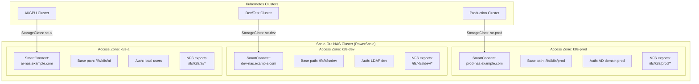
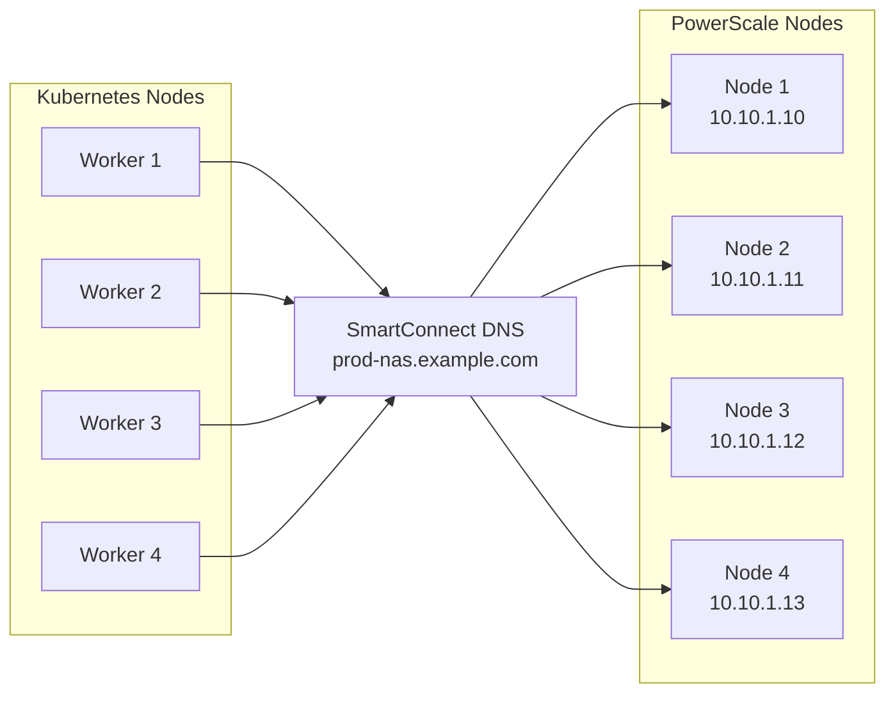

> 💡 **Quick Answer:** **Access zones** on scale-out NAS (Dell PowerScale/Isilon) partition a single cluster into isolated storage domains — each with its own authentication, exports, share permissions, and network identity (SmartConnect zone). For Kubernetes, create one access zone per tenant/environment, configure a dedicated CSI StorageClass per zone, and use SmartConnect DNS for load-balanced NFS access. This gives multi-tenant storage isolation without separate physical clusters.

## The Problem

A single scale-out NAS cluster serves multiple Kubernetes clusters, namespaces, or tenants. Without access zones, all consumers share the same authentication domain, root paths, and network endpoints. This creates security risks (tenant A sees tenant B's exports), performance contention (no QoS separation), and operational complexity (one misconfigured export affects everyone).



## What Are Access Zones?

Access zones are a feature of **scale-out NAS platforms** (primarily Dell PowerScale/Isilon, similar concepts exist in NetApp with SVMs/Vservers) that logically partition a storage cluster:

| Component | Purpose |
|-----------|---------|
| **Base directory** | Root path for the zone (`/ifs/k8s/prod`) — zone can only see below this path |
| **Authentication provider** | AD, LDAP, NIS, or local users — isolated per zone |
| **SmartConnect zone** | DNS name that load-balances across NICs assigned to this zone |
| **Network pool** | Dedicated IP ranges and interfaces for the zone |
| **NFS/SMB exports** | Shares visible only within the zone's scope |
| **Groupnet** | Top-level network container (DNS settings) |

### Access Zone vs Flat Exports

| Approach | Isolation | Security | Ops Complexity |
|----------|-----------|----------|---------------|
| **Flat exports** (no zones) | ❌ None — all exports visible | ❌ Shared auth domain | Low — but risky |
| **Access zones** | ✅ Full — path + auth + network | ✅ Each zone independent | Medium — but scalable |
| **Separate clusters** | ✅ Physical isolation | ✅ Air-gapped | High — expensive |

## Configure Access Zones (PowerScale)

### Step 1: Create Groupnet and Subnet

```bash
# CLI (isi commands on PowerScale)

# Create groupnet (top-level network container)
isi network groupnets create k8s-groupnet \
  --dns-servers 10.0.0.53,10.0.0.54 \
  --dns-search example.com

# Create subnet
isi network subnets create k8s-groupnet.k8s-subnet \
  --addr-family ipv4 \
  --gateway 10.10.0.1 \
  --prefixlen 24 \
  --mtu 9000         # Jumbo frames for NFS performance
```

### Step 2: Create IP Pool per Zone

```bash
# Production zone pool
isi network pools create k8s-groupnet.k8s-subnet.prod-pool \
  --ranges 10.10.1.10-10.10.1.30 \
  --ifaces 1-1:ext-1,2-1:ext-1,3-1:ext-1,4-1:ext-1 \
  --access-zone k8s-prod \
  --sc-dns-zone prod-nas.example.com \
  --sc-connect-policy round_robin \
  --sc-failover-policy round_robin \
  --alloc-method dynamic

# Dev zone pool
isi network pools create k8s-groupnet.k8s-subnet.dev-pool \
  --ranges 10.10.2.10-10.10.2.20 \
  --ifaces 1-1:ext-2,2-1:ext-2 \
  --access-zone k8s-dev \
  --sc-dns-zone dev-nas.example.com \
  --sc-connect-policy round_robin

# AI zone pool (high-bandwidth interfaces)
isi network pools create k8s-groupnet.k8s-subnet.ai-pool \
  --ranges 10.10.3.10-10.10.3.40 \
  --ifaces 1-1:100gbe-1,2-1:100gbe-1,3-1:100gbe-1,4-1:100gbe-1 \
  --access-zone k8s-ai \
  --sc-dns-zone ai-nas.example.com \
  --sc-connect-policy round_robin
```

### Step 3: Create Access Zones

```bash
# Production access zone
isi zone zones create k8s-prod \
  --path /ifs/k8s/prod \
  --groupnet k8s-groupnet \
  --create-path

# Dev access zone
isi zone zones create k8s-dev \
  --path /ifs/k8s/dev \
  --groupnet k8s-groupnet \
  --create-path

# AI access zone
isi zone zones create k8s-ai \
  --path /ifs/k8s/ai \
  --groupnet k8s-groupnet \
  --create-path

# Verify
isi zone zones list
# Name       Path            Groupnet
# System     /ifs            groupnet0
# k8s-prod   /ifs/k8s/prod   k8s-groupnet
# k8s-dev    /ifs/k8s/dev    k8s-groupnet
# k8s-ai     /ifs/k8s/ai     k8s-groupnet
```

### Step 4: Configure Authentication per Zone

```bash
# Production: Active Directory
isi auth ads create PROD.EXAMPLE.COM \
  --user admin \
  --password "***" \
  --zone k8s-prod

# Dev: LDAP
isi auth ldap create dev-ldap \
  --base-dn "dc=dev,dc=example,dc=com" \
  --server-uris ldaps://ldap.example.com \
  --zone k8s-dev

# AI: Local users (simpler, isolated)
isi auth users create k8s-ai-svc \
  --zone k8s-ai \
  --enabled true \
  --password "***"

# Map K8s node UIDs (root squash)
isi zone zones modify k8s-prod \
  --map-untrusted nobody
isi zone zones modify k8s-ai \
  --map-untrusted nobody
```

### Step 5: Create NFS Exports

```bash
# Production exports
isi nfs exports create \
  --path /ifs/k8s/prod \
  --zone k8s-prod \
  --map-root nobody \
  --security-flavors unix,krb5 \
  --clients 10.10.0.0/16 \
  --read-write-clients 10.10.0.0/16

# AI exports (optimized for throughput)
isi nfs exports create \
  --path /ifs/k8s/ai \
  --zone k8s-ai \
  --map-root root \
  --security-flavors unix \
  --clients 10.10.0.0/16 \
  --read-write-clients 10.10.0.0/16 \
  --block-size 1048576 \
  --max-file-size 1099511627776 \
  --commit-asynchronous true      # Async writes for AI model checkpoints
```

## SmartConnect: Load-Balanced NFS Access

SmartConnect provides a single DNS name that round-robins across all IPs in the pool:

```bash
# DNS resolution returns different IPs for each query
$ dig prod-nas.example.com +short
10.10.1.10
10.10.1.11
10.10.1.12
10.10.1.13

# Each K8s node mounts via SmartConnect name
# mount -t nfs prod-nas.example.com:/ifs/k8s/prod /mnt/prod
# → Automatically distributes across NAS nodes
```



## Kubernetes CSI Integration

### Dell CSI PowerScale Driver

```bash
# Install Dell CSI driver via Helm
helm repo add dell https://dell.github.io/helm-charts
helm repo update

helm install isilon dell/csi-isilon \
  --namespace csi-isilon --create-namespace \
  --values values.yaml
```

### Secret per Access Zone

```yaml
# Production zone credentials
apiVersion: v1
kind: Secret
metadata:
  name: isilon-creds-prod
  namespace: csi-isilon
type: Opaque
data:
  # Base64 encoded
  config: |
    isilonClusters:
      - clusterName: "prod-cluster"
        endpoint: "https://mgmt.example.com:8080"
        endpointPort: "8080"
        username: "k8s-csi-prod"
        password: "***"
        isiPath: "/ifs/k8s/prod"
        isiVolumePathPermissions: "0755"
        isDefaultCluster: true
        accessZone: "k8s-prod"
---
# AI zone credentials
apiVersion: v1
kind: Secret
metadata:
  name: isilon-creds-ai
  namespace: csi-isilon
type: Opaque
data:
  config: |
    isilonClusters:
      - clusterName: "ai-cluster"
        endpoint: "https://mgmt.example.com:8080"
        username: "k8s-csi-ai"
        password: "***"
        isiPath: "/ifs/k8s/ai"
        accessZone: "k8s-ai"
```

### StorageClass per Access Zone

```yaml
# Production StorageClass
apiVersion: storage.k8s.io/v1
kind: StorageClass
metadata:
  name: powerscale-prod
provisioner: csi-isilon.dellemc.com
parameters:
  AccessZone: k8s-prod
  IsiPath: /ifs/k8s/prod/volumes
  IsiVolumePathPermissions: "0755"
  AzServiceIP: prod-nas.example.com     # SmartConnect zone
  RootClientEnabled: "false"
  ClusterName: prod-cluster
reclaimPolicy: Retain
allowVolumeExpansion: true
volumeBindingMode: Immediate
mountOptions:
  - hard
  - nfsvers=4.1
  - rsize=1048576
  - wsize=1048576
---
# Dev StorageClass (delete policy — ephemeral)
apiVersion: storage.k8s.io/v1
kind: StorageClass
metadata:
  name: powerscale-dev
provisioner: csi-isilon.dellemc.com
parameters:
  AccessZone: k8s-dev
  IsiPath: /ifs/k8s/dev/volumes
  AzServiceIP: dev-nas.example.com
  RootClientEnabled: "false"
  ClusterName: dev-cluster
reclaimPolicy: Delete
allowVolumeExpansion: true
---
# AI StorageClass (high-throughput)
apiVersion: storage.k8s.io/v1
kind: StorageClass
metadata:
  name: powerscale-ai
provisioner: csi-isilon.dellemc.com
parameters:
  AccessZone: k8s-ai
  IsiPath: /ifs/k8s/ai/volumes
  AzServiceIP: ai-nas.example.com
  RootClientEnabled: "true"             # AI workloads often need root
  ClusterName: ai-cluster
reclaimPolicy: Retain
mountOptions:
  - hard
  - nfsvers=4.1
  - rsize=1048576
  - wsize=1048576
  - async                               # Async for checkpoint throughput
```

### PVC Usage

```yaml
# Production PVC
apiVersion: v1
kind: PersistentVolumeClaim
metadata:
  name: app-data
  namespace: production
spec:
  accessModes:
    - ReadWriteMany          # NFS supports RWX
  storageClassName: powerscale-prod
  resources:
    requests:
      storage: 100Gi
---
# AI model storage
apiVersion: v1
kind: PersistentVolumeClaim
metadata:
  name: model-weights
  namespace: ai-training
spec:
  accessModes:
    - ReadWriteMany
  storageClassName: powerscale-ai
  resources:
    requests:
      storage: 2Ti
```

## Quotas and Performance Tiers

### Directory Quotas per Zone

```bash
# Set quota on production zone (hard limit)
isi quota quotas create /ifs/k8s/prod directory \
  --hard-threshold 10T \
  --advisory-threshold 8T \
  --enforcement true

# AI zone — higher limits, advisory only
isi quota quotas create /ifs/k8s/ai directory \
  --hard-threshold 100T \
  --advisory-threshold 80T

# Per-volume quotas (CSI driver creates these)
isi quota quotas create /ifs/k8s/prod/volumes/pvc-xxx directory \
  --hard-threshold 100G
```

### QoS per Access Zone

```bash
# Limit dev zone IOPS (prevent noisy neighbor)
isi performance rules create \
  --path /ifs/k8s/dev \
  --limit-type iops \
  --limit 5000

# No limits on AI zone (need full throughput)
# Production: moderate limits
isi performance rules create \
  --path /ifs/k8s/prod \
  --limit-type bandwidth \
  --limit 10G
```

## NetApp Equivalent: SVMs (Storage Virtual Machines)

For NetApp ONTAP, the equivalent concept is **SVMs** (formerly Vservers):

```bash
# Create SVM for Kubernetes production
vserver create -vserver k8s-prod -rootvolume k8s_prod_root \
  -aggregate aggr1 -rootvolume-security-style unix

# Create data LIF (network interface — like SmartConnect)
network interface create -vserver k8s-prod -lif k8s-prod-nfs \
  -role data -data-protocol nfs \
  -home-node node1 -home-port e0d \
  -address 10.10.1.10 -netmask 255.255.255.0

# Create NFS export policy
vserver export-policy rule create -vserver k8s-prod \
  -policyname k8s-policy \
  -clientmatch 10.10.0.0/16 \
  -protocol nfs \
  -rorule sys -rwrule sys

# Trident CSI StorageClass
# apiVersion: storage.k8s.io/v1
# kind: StorageClass
# metadata:
#   name: netapp-prod
# provisioner: csi.trident.netapp.io
# parameters:
#   backendType: ontap-nas
#   storagePools: "k8s-prod-backend:aggr1"
```

## Common Issues

| Issue | Cause | Fix |
|-------|-------|-----|
| Mount fails with "access denied" | Wrong access zone or IP not in export clients | Verify export clients include K8s node subnet |
| SmartConnect returns wrong IPs | Pool not associated with access zone | `isi network pools modify` to set `--access-zone` |
| CSI provisioning fails | isiPath doesn't exist in the zone | Create the directory under the zone's base path |
| Permission denied on PV | Root squash mapping | Set `map-root` appropriately, or use `RootClientEnabled` |
| Cross-zone path traversal | Misconfigured base path | Access zone base path prevents escaping — verify zone config |
| NFS performance poor | Not using SmartConnect (single IP) | Always use SmartConnect DNS name, not individual IPs |
| Quota exceeded | Directory quota hit | Increase quota or clean up unused PVs |

## Best Practices

- **One access zone per environment/tenant** — prod, dev, staging, AI each get their own
- **Always use SmartConnect DNS** — never hardcode individual NAS node IPs
- **Jumbo frames (MTU 9000)** — required for NFS performance, configure end-to-end
- **NFS v4.1 or v4.2** — session trunking, better locking, mandatory for production
- **Separate network pools per zone** — dedicated IPs and interfaces for isolation
- **Directory quotas per zone** — prevent one tenant from consuming all capacity
- **QoS rules for dev/test** — prevent non-production from impacting production IO
- **Async exports for AI checkpoints** — model checkpoint writes benefit from async commits
- **Root squash in production** — `map-root nobody`, only enable root for AI if necessary
- **Audit zone access** — enable audit logging per zone for compliance

## Key Takeaways

- Access zones partition a single NAS cluster into isolated storage domains
- Each zone has its own: base path, auth provider, network pool, SmartConnect DNS, exports
- Kubernetes integration: one CSI Secret + StorageClass per access zone
- SmartConnect provides load-balanced NFS access across all NAS nodes in a zone
- Use directory quotas and QoS rules per zone for capacity and performance isolation
- Dell PowerScale = access zones; NetApp ONTAP = SVMs (same concept)
- Multi-tenant K8s storage without buying separate NAS clusters
