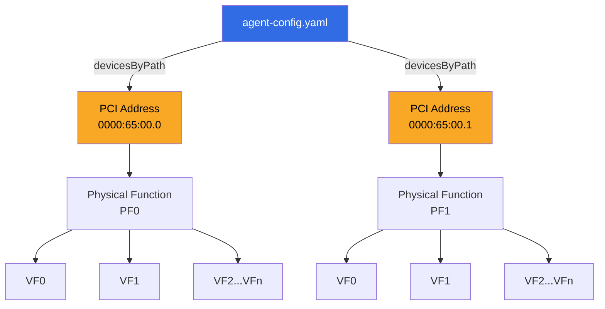

> 💡 **Quick Answer:** Use `agent-config.yaml` with `devicesByPath` to select SR-IOV physical functions by their stable PCI bus address instead of interface name, ensuring consistent VF creation even when interface names change across reboots or OS upgrades.

## The Problem

When deploying SR-IOV on bare-metal OpenShift nodes, interface names like `ens3f0` or `enp65s0f0` can change between reboots, BIOS updates, or OS upgrades. If your `SriovNetworkNodePolicy` targets a device by name and that name shifts, VF creation silently fails — or worse, targets the wrong NIC.

You need a stable, hardware-anchored way to identify which physical function (PF) gets SR-IOV VFs.

## The Solution

The `agent-config.yaml` file used during OpenShift installation supports `devicesByPath` selection, which references the PCI bus address of each NIC. PCI paths are determined by physical slot position and don't change unless you physically move the card.

### Architecture Overview



### Step 1: Discover PCI Paths on Your Nodes

Before writing the config, identify each NIC's PCI address:

```bash
# List all network devices with PCI addresses
lspci | grep -i ethernet
```

Example output:

```text
65:00.0 Ethernet controller: Mellanox Technologies MT2910 Family [ConnectX-7]
65:00.1 Ethernet controller: Mellanox Technologies MT2910 Family [ConnectX-7]
ca:00.0 Ethernet controller: Mellanox Technologies MT2910 Family [ConnectX-7]
ca:00.1 Ethernet controller: Mellanox Technologies MT2910 Family [ConnectX-7]
```

Map PCI addresses to interface names:

```bash
# Show interface-to-PCI mapping
ls -la /sys/class/net/*/device | awk -F'/' '{print $(NF-2), $NF}'
```

Or use a single command per interface:

```bash
# Get PCI address for a specific interface
ethtool -i ens3f0 | grep bus-info
# bus-info: 0000:65:00.0
```

### Step 2: Write agent-config.yaml with devicesByPath

Use the full PCI path in your `agent-config.yaml`:

```yaml
apiVersion: v1alpha1
kind: AgentConfig
metadata:
  name: my-cluster
rendezvousIP: 192.168.10.10
hosts:
  - hostname: worker-0
    role: worker
    interfaces:
      - name: eno1
        macAddress: "aa:bb:cc:dd:ee:01"
      - name: ens3f0
        macAddress: "aa:bb:cc:dd:ee:10"
      - name: ens3f1
        macAddress: "aa:bb:cc:dd:ee:11"
    networkConfig:
      interfaces:
        - name: eno1
          type: ethernet
          state: up
          ipv4:
            enabled: true
            dhcp: true
      sr-iov:
        devices:
          - name: ens3f0
            devicesByPath:
              - /dev/pci/0000:65:00.0
            numVfs: 8
          - name: ens3f1
            devicesByPath:
              - /dev/pci/0000:65:00.1
            numVfs: 8
  - hostname: worker-1
    role: worker
    interfaces:
      - name: eno1
        macAddress: "aa:bb:cc:dd:ee:02"
      - name: ens3f0
        macAddress: "aa:bb:cc:dd:ee:20"
      - name: ens3f1
        macAddress: "aa:bb:cc:dd:ee:21"
    networkConfig:
      interfaces:
        - name: eno1
          type: ethernet
          state: up
          ipv4:
            enabled: true
            dhcp: true
      sr-iov:
        devices:
          - name: ens3f0
            devicesByPath:
              - /dev/pci/0000:65:00.0
            numVfs: 8
          - name: ens3f1
            devicesByPath:
              - /dev/pci/0000:65:00.1
            numVfs: 8
```

### Step 3: Corresponding SriovNetworkNodePolicy

After cluster installation, create a `SriovNetworkNodePolicy` that also uses PCI address selection:

```yaml
apiVersion: sriovnetwork.openshift.io/v1
kind: SriovNetworkNodePolicy
metadata:
  name: gpu-rdma-policy
  namespace: openshift-sriov-network-operator
spec:
  resourceName: rdmavfs
  nodeSelector:
    node-role.kubernetes.io/worker: ""
  numVfs: 8
  nicSelector:
    pfNames:
      - ens3f0#0-3
    deviceID: "101e"
    vendor: "15b3"
    rootDevices:
      - "0000:65:00.0"
  deviceType: netdevice
  isRdma: true
```

The `rootDevices` field in `nicSelector` mirrors the PCI path approach — it anchors the policy to the physical slot.

### Step 4: Verify VF Creation

After the policy applies and nodes reboot:

```bash
# Check VFs were created on the correct PCI device
oc debug node/worker-0 -- chroot /host \
  ls /sys/bus/pci/devices/0000:65:00.0/virtfn*
```

```bash
# Verify SR-IOV node state
oc get sriovnetworknodestates -n openshift-sriov-network-operator worker-0 \
  -o jsonpath='{.status.interfaces}' | jq '.[] | select(.pciAddress=="0000:65:00.0")'
```

Expected output:

```json
{
  "deviceID": "101e",
  "driver": "mlx5_core",
  "linkSpeed": "200 Gb/s",
  "linkType": "ETH",
  "mac": "aa:bb:cc:dd:ee:10",
  "mtu": 9000,
  "name": "ens3f0",
  "numVfs": 8,
  "pciAddress": "0000:65:00.0",
  "totalvfs": 8,
  "vendor": "15b3",
  "vfs": [
    {
      "deviceID": "101f",
      "driver": "mlx5_core",
      "pciAddress": "0000:65:00.2",
      "vendor": "15b3",
      "vfID": 0
    }
  ]
}
```

### Step 5: Validate Across Multiple Nodes

Ensure every node got the same PCI-anchored VFs:

```bash
# Loop through all workers
for node in $(oc get nodes -l node-role.kubernetes.io/worker -o name); do
  echo "=== $node ==="
  oc get sriovnetworknodestates -n openshift-sriov-network-operator \
    $(basename $node) \
    -o jsonpath='{range .status.interfaces[*]}{.pciAddress} {.name} VFs={.numVfs}{"\n"}{end}'
done
```

## Common Issues

**PCI address differs between nodes of the same hardware model**
Even identical servers can have different PCI topologies if BIOS settings differ. Always discover the actual PCI address per node rather than assuming uniformity.

```bash
# Compare PCI topology across nodes
for node in worker-0 worker-1 worker-2; do
  echo "=== $node ==="
  oc debug node/$node -- chroot /host lspci | grep -i mellanox
done
```

**VFs created on wrong NIC when using interface names only**
This is the exact problem `devicesByPath` solves. If you see VFs on an unexpected interface, switch from `pfNames` to `rootDevices` in your `SriovNetworkNodePolicy`.

**agent-config.yaml ignored during assisted installer**
The `sr-iov` section in `networkConfig` is only processed during agent-based installations. For assisted installer deployments, configure SR-IOV post-install via `SriovNetworkNodePolicy`.

**Device path format mismatch**
The path must follow the format `/dev/pci/DDDD:BB:DD.F` (domain:bus:device.function). A common mistake is omitting the domain prefix (`0000:`).

## Best Practices

- **Always use PCI paths for production**: Interface names are convenient for lab setups but unreliable at scale
- **Document the PCI topology**: Maintain a mapping table of node → slot → PCI address → interface for each hardware generation
- **Pin BIOS PCI enumeration order**: Enable "Deterministic PCI Enumeration" in BIOS if available
- **Use `rootDevices` in SriovNetworkNodePolicy**: Even if `agent-config.yaml` used `devicesByPath`, the day-2 policy should also anchor to PCI address
- **Test after BIOS updates**: PCI addresses can shift after firmware upgrades — always verify before and after
- **Separate management and data NICs**: Keep SR-IOV VFs on dedicated data-plane NICs, not the management interface

## Key Takeaways

- `devicesByPath` in `agent-config.yaml` selects NICs by PCI bus address for deterministic VF creation
- PCI paths survive reboots, OS upgrades, and driver changes — interface names may not
- Mirror the PCI-based selection in `SriovNetworkNodePolicy` using `rootDevices` for day-2 consistency
- Always discover actual PCI addresses per node — don't assume identical hardware means identical paths
- Combine with `identify-mellanox-nic-models` and `check-bonding-and-interface-status` recipes for a complete SR-IOV deployment workflow
