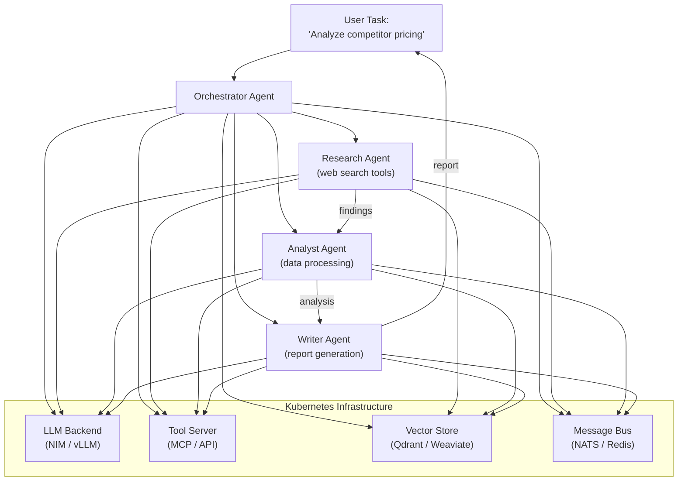

> 💡 **Quick Answer:** Agentic AI systems run autonomous task-executing agents that call tools, make decisions, and coordinate with other agents. On Kubernetes, deploy agents as microservices with inference backends (NIM, vLLM), use NATS or Redis for agent-to-agent messaging, and scale with HPA based on queue depth. Frameworks: LangGraph, CrewAI, AutoGen.

## The Problem

2026's biggest AI shift is from chat-based AI to autonomous agents that execute multi-step workflows — researching, writing code, calling APIs, and delegating subtasks to other agents. Running these on Kubernetes requires: inference backends for LLM reasoning, tool execution environments, inter-agent communication, persistent memory, and orchestration for complex multi-agent workflows.



## The Solution

### Architecture Overview

Each agent runs as a Kubernetes Deployment with access to shared infrastructure:

```yaml
# Agent Deployment
apiVersion: apps/v1
kind: Deployment
metadata:
  name: research-agent
  labels:
    app: research-agent
    agent-role: researcher
spec:
  replicas: 2
  selector:
    matchLabels:
      app: research-agent
  template:
    metadata:
      labels:
        app: research-agent
    spec:
      containers:
        - name: agent
          image: myorg/research-agent:v1.0
          env:
            - name: LLM_BASE_URL
              value: "http://nim-llm:8000/v1"
            - name: NATS_URL
              value: "nats://nats:4222"
            - name: VECTOR_STORE_URL
              value: "http://qdrant:6333"
            - name: AGENT_ID
              valueFrom:
                fieldRef:
                  fieldPath: metadata.name
          resources:
            requests:
              cpu: "500m"
              memory: "1Gi"
            limits:
              cpu: "2"
              memory: "4Gi"
          ports:
            - containerPort: 8080
---
apiVersion: v1
kind: Service
metadata:
  name: research-agent
spec:
  selector:
    app: research-agent
  ports:
    - port: 8080
```

### LangGraph Multi-Agent on Kubernetes

```python
# agent_app.py — deployed as container
from langgraph.graph import StateGraph, MessagesState
from langchain_openai import ChatOpenAI
import os

llm = ChatOpenAI(
    base_url=os.environ["LLM_BASE_URL"],
    api_key="not-needed",  # Local NIM
    model="meta/llama-3.1-70b-instruct",
)

# Define agent nodes
def researcher(state: MessagesState):
    """Research agent with web search tools"""
    response = llm.bind_tools([web_search, url_fetch]).invoke(state["messages"])
    return {"messages": [response]}

def analyst(state: MessagesState):
    """Analysis agent with data tools"""
    response = llm.bind_tools([pandas_query, chart_gen]).invoke(state["messages"])
    return {"messages": [response]}

def writer(state: MessagesState):
    """Report writing agent"""
    response = llm.invoke(state["messages"])
    return {"messages": [response]}

# Build the graph
graph = StateGraph(MessagesState)
graph.add_node("researcher", researcher)
graph.add_node("analyst", analyst)
graph.add_node("writer", writer)
graph.add_edge("researcher", "analyst")
graph.add_edge("analyst", "writer")

app = graph.compile()
```

### CrewAI Deployment

```yaml
# CrewAI agent crew as a Kubernetes Job
apiVersion: batch/v1
kind: Job
metadata:
  name: competitor-analysis-crew
spec:
  template:
    spec:
      containers:
        - name: crew
          image: myorg/crewai-competitor-analysis:v1.0
          env:
            - name: OPENAI_API_BASE
              value: "http://nim-llm:8000/v1"
            - name: OPENAI_API_KEY
              value: "local"
            - name: SERPER_API_KEY
              valueFrom:
                secretKeyRef:
                  name: api-keys
                  key: serper
          resources:
            requests:
              cpu: "1"
              memory: "2Gi"
      restartPolicy: Never
  backoffLimit: 2
```

### Inter-Agent Communication with NATS

```yaml
# NATS message bus for agent-to-agent communication
apiVersion: apps/v1
kind: Deployment
metadata:
  name: nats
spec:
  replicas: 3
  template:
    spec:
      containers:
        - name: nats
          image: nats:2.10
          ports:
            - containerPort: 4222
          args: ["--cluster", "nats://0.0.0.0:6222", "--routes", "nats://nats:6222"]
---
# Agents publish/subscribe to task channels
# research-agent publishes to: agents.research.results
# analyst-agent subscribes to: agents.research.results
# analyst-agent publishes to: agents.analysis.results
```

### Scaling Agents with HPA

```yaml
apiVersion: autoscaling/v2
kind: HorizontalPodAutoscaler
metadata:
  name: research-agent-hpa
spec:
  scaleTargetRef:
    apiVersion: apps/v1
    kind: Deployment
    name: research-agent
  minReplicas: 1
  maxReplicas: 10
  metrics:
    - type: External
      external:
        metric:
          name: nats_pending_messages
          selector:
            matchLabels:
              subject: agents.research.tasks
        target:
          type: AverageValue
          averageValue: "5"     # Scale up when >5 pending tasks per replica
```

### Agent Memory with Vector Store

```yaml
# Qdrant for agent long-term memory
apiVersion: apps/v1
kind: StatefulSet
metadata:
  name: qdrant
spec:
  replicas: 1
  template:
    spec:
      containers:
        - name: qdrant
          image: qdrant/qdrant:v1.12.0
          ports:
            - containerPort: 6333
          volumeMounts:
            - name: data
              mountPath: /qdrant/storage
  volumeClaimTemplates:
    - metadata:
        name: data
      spec:
        accessModes: ["ReadWriteOnce"]
        resources:
          requests:
            storage: 50Gi
```

### Tool Execution Sandbox

Agents need sandboxed environments to execute code and tools safely:

```yaml
apiVersion: apps/v1
kind: Deployment
metadata:
  name: tool-executor
spec:
  template:
    spec:
      containers:
        - name: executor
          image: myorg/tool-executor:v1.0
          securityContext:
            runAsNonRoot: true
            readOnlyRootFilesystem: true
            capabilities:
              drop: ["ALL"]
          resources:
            limits:
              cpu: "2"
              memory: "4Gi"
      # Use gVisor for additional isolation
      runtimeClassName: gvisor
```

### Complete Multi-Agent Stack

```bash
# Deploy the full stack
kubectl apply -f - <<EOF
# 1. LLM Backend (NIM)
# 2. NATS (inter-agent messaging)
# 3. Qdrant (agent memory)
# 4. Tool Server (MCP-compatible)
# 5. Orchestrator Agent
# 6. Worker Agents (research, analyst, writer, coder)
# 7. HPA for each agent role
# 8. NetworkPolicy (agents → LLM, agents → NATS, agents → tools)
EOF
```

## Common Issues

| Issue | Cause | Fix |
|-------|-------|-----|
| Agent loops forever | No max iteration limit | Set \`max_iterations=10\` in agent config |
| LLM timeout on complex tasks | Long chain-of-thought | Increase \`request_timeout\`, use streaming |
| Agent memory growing unbounded | Conversation history too long | Use summarization or sliding window |
| Inter-agent deadlock | Circular dependencies | Design DAG workflows, add timeouts |
| Tool execution OOM | Agent-generated code is resource-hungry | Use gVisor + resource limits on tool executor |
| Cold start latency | Agent pods scaling from 0 | Use KEDA with \`minReplicaCount: 1\` for critical agents |

## Best Practices

- **Separate agents from LLM backends** — agents are stateless, LLMs need GPUs
- **Use NATS/Redis for async communication** — don't couple agents via HTTP
- **Sandbox tool execution** — agents can generate arbitrary code; use gVisor/Kata
- **Set iteration limits** — prevent runaway agent loops from burning tokens
- **Persist agent memory** — vector stores for long-term, Redis for short-term
- **Monitor token usage** — agentic workflows consume 10-100× more tokens than chat
- **Use structured outputs** — JSON mode for agent-to-agent data exchange

## Key Takeaways

- Agentic AI runs autonomous agents that plan, use tools, and coordinate
- Deploy agents as microservices on Kubernetes with shared LLM backends
- NATS or Redis enables async agent-to-agent communication
- Scale agents independently with HPA based on queue depth
- Sandbox tool execution with gVisor or Kata Containers
- 2026's top trend: AI moving from chat to autonomous workflow execution
