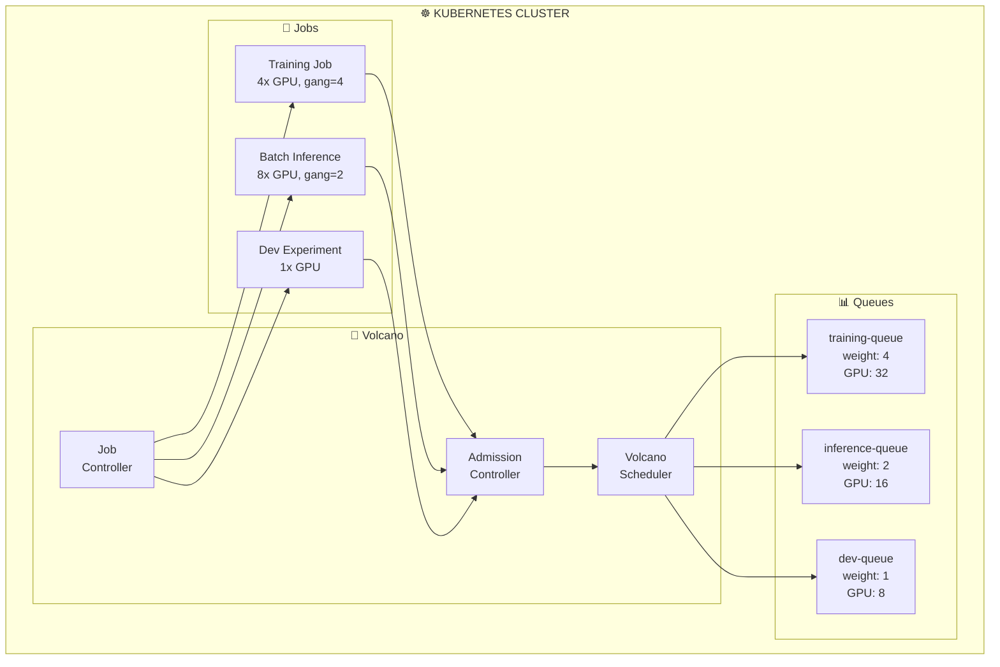

> 💡 **Quick Answer:** Install Volcano: `helm install volcano volcano-sh/volcano -n volcano-system --create-namespace`. Create a `Queue` for your team, then submit a `vcjob` (Volcano Job) with `minAvailable` for gang scheduling. Volcano ensures all pods of a distributed training job start together (or none start), preventing deadlocks and wasted GPU resources.
>
> **Key concept:** Gang scheduling guarantees all N workers of a distributed job start simultaneously. Without it, partial scheduling wastes GPUs waiting for remaining workers.
>
> **Gotcha:** Volcano replaces the default scheduler for its jobs. Ensure `schedulerName: volcano` is set, or jobs fall back to the default scheduler without gang guarantees.

## The Problem

Default Kubernetes scheduling doesn't understand batch AI workloads:

- **Partial scheduling** starts 3 of 4 distributed training workers, wasting GPUs while waiting for the 4th
- **No fair-sharing** between teams—one team can consume all GPUs
- **No gang scheduling**—distributed jobs deadlock when pods can't all be placed
- **No preemption policies**—low-priority dev jobs block production training

## The Solution

Volcano provides batch-aware scheduling with gang scheduling, hierarchical queues, fair-share policies, and job lifecycle management designed for AI/ML workloads.

## Architecture Overview



## Step 1: Install Volcano

```bash
helm repo add volcano-sh https://volcano-sh.github.io/helm-charts
helm repo update

helm install volcano volcano-sh/volcano \
  -n volcano-system \
  --create-namespace \
  --set basic.scheduler.enabled=true \
  --set basic.controller.enabled=true \
  --set basic.admission.enabled=true

kubectl get pods -n volcano-system
```

## Step 2: Create Queues

```yaml
# volcano-queues.yaml
apiVersion: scheduling.volcano.sh/v1beta1
kind: Queue
metadata:
  name: training-queue
spec:
  weight: 4
  reclaimable: true
  capability:
    nvidia.com/gpu: "32"
    cpu: "128"
    memory: "512Gi"
---
apiVersion: scheduling.volcano.sh/v1beta1
kind: Queue
metadata:
  name: inference-queue
spec:
  weight: 2
  reclaimable: true
  capability:
    nvidia.com/gpu: "16"
    cpu: "64"
    memory: "256Gi"
---
apiVersion: scheduling.volcano.sh/v1beta1
kind: Queue
metadata:
  name: dev-queue
spec:
  weight: 1
  reclaimable: true
  capability:
    nvidia.com/gpu: "8"
    cpu: "32"
    memory: "128Gi"
```

## Step 3: Submit a Gang-Scheduled Training Job

```yaml
# volcano-training-job.yaml
apiVersion: batch.volcano.sh/v1alpha1
kind: Job
metadata:
  name: distributed-training
  namespace: ml-training
spec:
  schedulerName: volcano
  queue: training-queue
  minAvailable: 4        # Gang: all 4 pods must be schedulable
  maxRetry: 3
  ttlSecondsAfterFinished: 3600
  plugins:
    env: []
    svc: []              # Creates headless service for pod discovery
    ssh: []              # Sets up SSH between pods for MPI
  policies:
    - event: PodEvicted
      action: RestartJob
    - event: PodFailed
      action: RestartJob
    - event: TaskCompleted
      action: CompleteJob
  tasks:
    - name: master
      replicas: 1
      template:
        spec:
          containers:
            - name: trainer
              image: registry.example.com/distributed-trainer:v1
              command: ["torchrun"]
              args:
                - "--nnodes=4"
                - "--nproc_per_node=4"
                - "--rdzv_backend=c10d"
                - "--rdzv_endpoint=$(VC_MASTER_HOST):29500"
                - "train.py"
              resources:
                limits:
                  nvidia.com/gpu: 4
                  cpu: "16"
                  memory: 128Gi
              volumeMounts:
                - name: shm
                  mountPath: /dev/shm
          volumes:
            - name: shm
              emptyDir:
                medium: Memory
                sizeLimit: 64Gi
          restartPolicy: OnFailure
    - name: worker
      replicas: 3
      template:
        spec:
          containers:
            - name: trainer
              image: registry.example.com/distributed-trainer:v1
              command: ["torchrun"]
              args:
                - "--nnodes=4"
                - "--nproc_per_node=4"
                - "--rdzv_backend=c10d"
                - "--rdzv_endpoint=$(VC_MASTER_HOST):29500"
                - "train.py"
              resources:
                limits:
                  nvidia.com/gpu: 4
                  cpu: "16"
                  memory: 128Gi
              volumeMounts:
                - name: shm
                  mountPath: /dev/shm
          volumes:
            - name: shm
              emptyDir:
                medium: Memory
                sizeLimit: 64Gi
          restartPolicy: OnFailure
```

## Step 4: Priority-Based Preemption

```yaml
# volcano-priority.yaml
apiVersion: scheduling.k8s.io/v1
kind: PriorityClass
metadata:
  name: production-training
value: 1000
globalDefault: false
description: "Production training jobs"
---
apiVersion: scheduling.k8s.io/v1
kind: PriorityClass
metadata:
  name: dev-experiment
value: 100
globalDefault: false
description: "Development experiments"
---
# High-priority job preempts lower-priority ones
apiVersion: batch.volcano.sh/v1alpha1
kind: Job
metadata:
  name: urgent-training
spec:
  schedulerName: volcano
  queue: training-queue
  priorityClassName: production-training
  minAvailable: 2
  tasks:
    - name: worker
      replicas: 2
      template:
        spec:
          priorityClassName: production-training
          containers:
            - name: trainer
              image: registry.example.com/trainer:v1
              resources:
                limits:
                  nvidia.com/gpu: 4
```

## Common Issues

### Issue 1: Gang scheduling deadlock

```bash
# All GPUs consumed by partial jobs, nothing can fully schedule
# Solution: Set queue capacity limits and use preemption
kubectl get queue -o wide
kubectl get vcjob -A

# Force reclaim from lower-priority queues
kubectl annotate queue dev-queue volcano.sh/overuse-tolerance=0
```

### Issue 2: Jobs stuck in Pending

```bash
# Check Volcano scheduler logs
kubectl logs -n volcano-system deploy/volcano-scheduler --tail=100

# Check queue status
kubectl get queue training-queue -o yaml | grep -A5 status

# Verify schedulerName is set
kubectl get pods -n ml-training -o jsonpath='{.items[*].spec.schedulerName}'
```

## Best Practices

1. **Always use minAvailable for distributed jobs** — Prevents partial scheduling deadlocks
2. **Set queue capacity limits** — Prevents one team from monopolizing all GPUs
3. **Use reclaimable queues** — Idle capacity gets borrowed by busy queues automatically
4. **Configure preemption policies** — Production jobs should preempt dev experiments
5. **Use ttlSecondsAfterFinished** — Auto-cleanup completed jobs to free resources
6. **Monitor queue utilization** — Track GPU hours per queue for chargeback

## Key Takeaways

- **Volcano** extends Kubernetes scheduling for batch AI workloads with gang scheduling
- **Gang scheduling** ensures distributed training jobs start all-or-nothing, preventing GPU waste
- **Hierarchical queues** with weights enable fair-share GPU allocation between teams
- **Preemption** lets high-priority production jobs reclaim resources from dev workloads
- **Job lifecycle policies** handle failures, retries, and cleanup automatically
