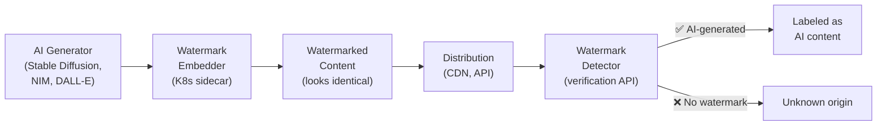

> 💡 **Quick Answer:** AI content watermarking embeds invisible markers in AI-generated images, audio, and text that survive cropping, compression, and editing. On Kubernetes, deploy watermarking as a sidecar or post-processing step in your AI generation pipeline. Google's SynthID and open-source alternatives provide watermark embedding and detection APIs.

## The Problem

WEF highlights AI-generated content watermarking as a top 2026 emerging technology. As AI creates increasingly realistic images, videos, and text, organizations need to mark their AI outputs as machine-generated — for legal compliance, trust/safety, content moderation, and misinformation prevention. Watermarks must be imperceptible to humans but detectable by verification systems, and robust against common transformations.



## The Solution

### Image Watermarking Pipeline

```yaml
# Watermark embedding service
apiVersion: apps/v1
kind: Deployment
metadata:
  name: watermark-embedder
spec:
  replicas: 2
  template:
    spec:
      containers:
        - name: embedder
          image: myorg/ai-watermark:v2.0
          ports:
            - containerPort: 8080
          env:
            - name: WATERMARK_KEY
              valueFrom:
                secretKeyRef:
                  name: watermark-keys
                  key: embedding-key
            - name: WATERMARK_STRENGTH
              value: "0.7"             # Balance: visibility vs robustness
            - name: METADATA_FIELDS
              value: "model,timestamp,org_id"
          resources:
            requests:
              cpu: "2"
              memory: "4Gi"
            limits:
              nvidia.com/gpu: 1        # GPU for neural watermarking
---
apiVersion: v1
kind: Service
metadata:
  name: watermark-embedder
spec:
  selector:
    app: watermark-embedder
  ports:
    - port: 8080
```

### AI Generation Pipeline with Watermarking

```yaml
# Tekton pipeline: Generate → Watermark → Store
apiVersion: tekton.dev/v1
kind: Pipeline
metadata:
  name: ai-image-generation
spec:
  tasks:
    - name: generate-image
      taskRef:
        name: stable-diffusion-generate
      params:
        - name: PROMPT
          value: $(params.prompt)
        - name: MODEL
          value: "sdxl-turbo"
        - name: INFERENCE_ENDPOINT
          value: "http://nim-sdxl:8000"

    - name: embed-watermark
      runAfter: ["generate-image"]
      taskRef:
        name: watermark-embed
      params:
        - name: INPUT_IMAGE
          value: "$(tasks.generate-image.results.image-path)"
        - name: WATERMARK_SERVICE
          value: "http://watermark-embedder:8080"
        - name: METADATA
          value: |
            {
              "model": "sdxl-turbo",
              "generated_at": "$(context.pipeline.start)",
              "org_id": "myorg",
              "prompt_hash": "$(params.prompt-hash)"
            }

    - name: quality-check
      runAfter: ["embed-watermark"]
      taskRef:
        name: watermark-verify
      params:
        - name: IMAGE
          value: "$(tasks.embed-watermark.results.watermarked-path)"
        - name: DETECTOR_URL
          value: "http://watermark-detector:8080"

    - name: store
      runAfter: ["quality-check"]
      taskRef:
        name: upload-to-cdn
```

### Watermark Detection API

```yaml
apiVersion: apps/v1
kind: Deployment
metadata:
  name: watermark-detector
spec:
  replicas: 3
  template:
    spec:
      containers:
        - name: detector
          image: myorg/ai-watermark-detector:v2.0
          ports:
            - containerPort: 8080
          env:
            - name: DETECTION_KEY
              valueFrom:
                secretKeyRef:
                  name: watermark-keys
                  key: detection-key
            - name: CONFIDENCE_THRESHOLD
              value: "0.8"
          resources:
            requests:
              cpu: "2"
              memory: "4Gi"
            limits:
              nvidia.com/gpu: 1
---
apiVersion: v1
kind: Service
metadata:
  name: watermark-detector
spec:
  selector:
    app: watermark-detector
  ports:
    - port: 8080
```

```bash
# Detection API usage
curl -X POST http://watermark-detector:8080/detect \
  -F "image=@photo.jpg"

# Response:
# {
#   "watermark_detected": true,
#   "confidence": 0.94,
#   "metadata": {
#     "model": "sdxl-turbo",
#     "generated_at": "2026-04-12T10:30:00Z",
#     "org_id": "myorg"
#   },
#   "robustness_check": {
#     "survived_jpeg_compression": true,
#     "survived_crop_50pct": true,
#     "survived_resize": true,
#     "survived_screenshot": true
#   }
# }
```

### Text Watermarking for LLMs

```yaml
# Watermark LLM outputs at token level
apiVersion: apps/v1
kind: Deployment
metadata:
  name: llm-text-watermark
spec:
  template:
    spec:
      containers:
        - name: watermark-proxy
          image: myorg/text-watermark-proxy:v1.0
          ports:
            - containerPort: 8080
          env:
            - name: LLM_BACKEND
              value: "http://nim-llm:8000/v1"
            - name: WATERMARK_ENABLED
              value: "true"
            - name: WATERMARK_KEY
              valueFrom:
                secretKeyRef:
                  name: watermark-keys
                  key: text-watermark-key
            # Token-level watermarking:
            # Biases token selection to encode hidden signal
            # Detectable statistically but invisible to readers
            - name: WATERMARK_STRENGTH
              value: "2.0"             # logit bias strength
            - name: WATERMARK_WINDOW
              value: "4"               # context window size
```

### Watermark Types Comparison

| Type | Medium | Robustness | Capacity | Method |
|------|--------|:----------:|:--------:|--------|
| **Neural image** | Images | High (survives crop/compress/screenshot) | Low (~64 bits) | Trained encoder-decoder network |
| **Frequency domain** | Images | Medium | Medium (~256 bits) | DCT/DWT coefficient modification |
| **Token-level** | Text | Medium (survives paraphrasing varies) | Low | Logit bias during generation |
| **Audio spectral** | Audio | High | Low | Spectral band modification |
| **Video frame** | Video | High | Low | Per-frame neural embedding |

### Batch Watermarking Job

```yaml
# Retroactively watermark existing AI-generated content
apiVersion: batch/v1
kind: Job
metadata:
  name: batch-watermark
spec:
  completions: 100
  parallelism: 10
  completionMode: Indexed
  template:
    spec:
      containers:
        - name: batch
          image: myorg/batch-watermark:v1.0
          command: ["python", "batch_embed.py"]
          args:
            - "--bucket=s3://ai-generated-images"
            - "--shard-index=$(JOB_COMPLETION_INDEX)"
            - "--total-shards=100"
            - "--watermark-service=http://watermark-embedder:8080"
          resources:
            requests:
              cpu: "2"
              memory: "4Gi"
      restartPolicy: Never
```

## Common Issues

| Issue | Cause | Fix |
|-------|-------|-----|
| Watermark not surviving compression | Embedding strength too low | Increase watermark strength (trade-off with quality) |
| Visible artifacts | Strength too high | Reduce strength, use neural watermarking |
| False positives on detection | Threshold too low | Increase confidence threshold to 0.9+ |
| Text watermark detected by users | Token bias too strong | Reduce strength; accept lower detectability |
| Latency overhead | GPU watermarking in hot path | Use async watermarking, process after generation |

## Best Practices

- **Watermark at generation time** — embed during inference, not after
- **Use neural watermarking for images** — most robust against transformations
- **Keep watermark keys secret** — keys enable both embedding and detection
- **Test against attacks** — verify survival after JPEG, crop, resize, screenshot
- **Combine with C2PA provenance** — watermarks survive edits; C2PA tracks history
- **Monitor detection rates** — track what percentage of your content is verifiable

## Key Takeaways

- AI content watermarking embeds invisible, verifiable markers in generated content
- Image watermarks survive cropping, compression, screenshots, and social media
- Text watermarking biases token selection — statistically detectable, invisible to readers
- Deploy as sidecar or pipeline step — minimal latency overhead
- Combine with C2PA for defense in depth (watermark = content-level, C2PA = metadata-level)
- 2026 trend: watermarking becoming mandatory for AI-generated media
