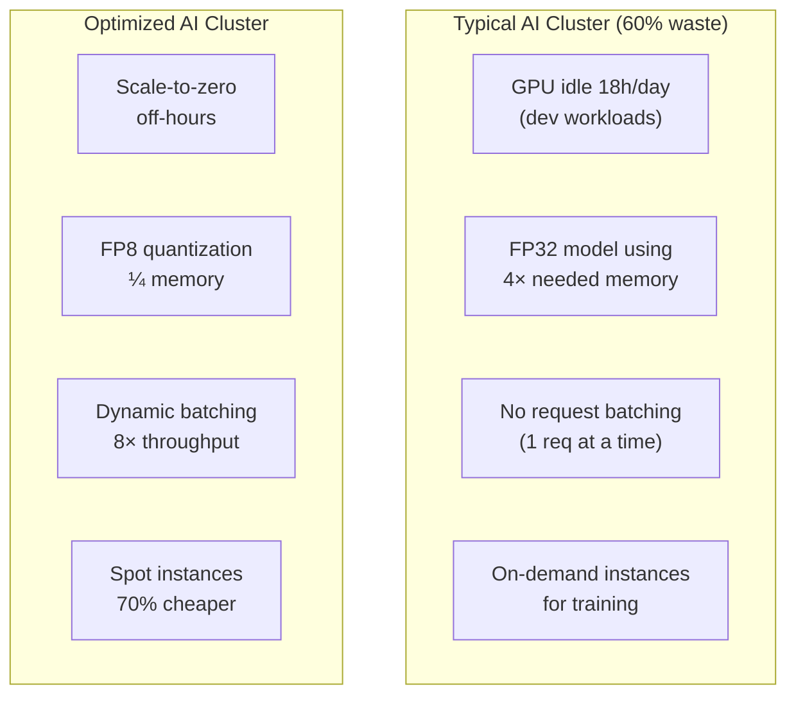

> 💡 **Quick Answer:** AI infrastructure costs are dominated by GPU compute. Optimize by: (1) right-sizing GPU allocation (MIG/time-slicing), (2) using quantized models (FP8/INT4 = 2-4× less GPU memory), (3) batching inference requests, (4) spot/preemptible instances for training, and (5) scaling to zero during off-hours. Most orgs waste 40-60% of their GPU budget.

## The Problem

Deloitte's 2026 report calls it an "AI infrastructure reckoning" — organizations are spending massively on GPUs but not optimizing utilization. A single H100 costs $30K+ and draws 700W. Running inference at 10% GPU utilization means 90% waste. Kubernetes provides the tools to maximize every GPU dollar, but most teams don't use them.



## The Solution

### 1. Model Quantization (Biggest Single Win)

```yaml
# FP16 model: 140GB VRAM → needs 2× A100 80GB
# FP8 model:   70GB VRAM → fits 1× A100 80GB (50% GPU savings!)
# INT4 model:  35GB VRAM → fits 1× A100 40GB (75% GPU savings!)

# NIM with FP8 quantized model
apiVersion: apps/v1
kind: Deployment
metadata:
  name: llama-70b-fp8
spec:
  template:
    spec:
      containers:
        - name: nim
          image: nvcr.io/nim/meta/llama-3.1-70b-instruct:1.7.3
          env:
            - name: NIM_MODEL_PROFILE
              value: "tensorrt_llm-h100-fp8-tp1-latency"  # FP8 on single GPU!
          resources:
            limits:
              nvidia.com/gpu: 1    # vs 2 GPUs for FP16
```

| Precision | VRAM (70B) | GPUs Needed | Quality Loss | Cost |
|-----------|:----------:|:-----------:|:------------:|:----:|
| FP32 | 280 GB | 4× A100 | None | $$$$ |
| FP16/BF16 | 140 GB | 2× A100 | None | $$$ |
| FP8 | 70 GB | 1× A100 | ~1% | $$ |
| INT4 (GPTQ) | 35 GB | 1× A100 40GB | ~3-5% | $ |

### 2. GPU Sharing (MIG + Time-Slicing)

```yaml
# MIG: Hardware-isolated GPU partitions
# One A100 80GB → 7× independent 10GB instances
resources:
  limits:
    nvidia.com/mig-1g.10gb: 1   # 1/7th of an A100
    # Perfect for small models (7B INT4), embedding services, or dev

# Time-slicing: Share GPU across pods (no isolation)
# In GPU Operator config:
apiVersion: v1
kind: ConfigMap
metadata:
  name: time-slicing-config
  namespace: gpu-operator
data:
  any: |
    version: v1
    sharing:
      timeSlicing:
        resources:
          - name: nvidia.com/gpu
            replicas: 4    # 4 pods share each GPU
```

### 3. Inference Request Batching

```yaml
# vLLM with continuous batching (automatic)
containers:
  - name: vllm
    image: vllm/vllm-openai:latest
    args:
      - "--model=meta-llama/Meta-Llama-3.1-70B-Instruct"
      - "--max-num-batched-tokens=32768"
      - "--max-num-seqs=256"         # Batch up to 256 concurrent requests
      - "--enable-chunked-prefill"
    # Continuous batching: 3-8× throughput vs no batching
```

### 4. Scale to Zero (Off-Hours)

```yaml
# KEDA: Scale inference deployment to zero when idle
apiVersion: keda.sh/v1alpha1
kind: ScaledObject
metadata:
  name: llm-scaler
spec:
  scaleTargetRef:
    name: llama-70b-fp8
  minReplicaCount: 0               # Scale to ZERO
  maxReplicaCount: 5
  cooldownPeriod: 300              # 5 min idle → scale down
  triggers:
    - type: prometheus
      metadata:
        serverAddress: http://prometheus:9090
        query: sum(rate(http_requests_total{service="llama-70b"}[5m]))
        threshold: "1"             # Scale up on any traffic
  advanced:
    restoreToOriginalReplicaCount: false
    horizontalPodAutoscalerConfig:
      behavior:
        scaleDown:
          stabilizationWindowSeconds: 300
```

### 5. Spot Instances for Training

```yaml
# Karpenter: Use spot instances for training workloads
apiVersion: karpenter.sh/v1
kind: NodePool
metadata:
  name: gpu-training-spot
spec:
  template:
    spec:
      requirements:
        - key: karpenter.sh/capacity-type
          operator: In
          values: ["spot"]               # 60-70% cheaper than on-demand
        - key: node.kubernetes.io/instance-type
          operator: In
          values: ["p4d.24xlarge", "p5.48xlarge"]
      taints:
        - key: nvidia.com/gpu
          value: "true"
          effect: NoSchedule
  limits:
    nvidia.com/gpu: 64
  disruption:
    consolidationPolicy: WhenEmpty
    expireAfter: 24h
---
# Training job with spot tolerance
apiVersion: batch/v1
kind: Job
metadata:
  name: training-job
spec:
  template:
    spec:
      tolerations:
        - key: nvidia.com/gpu
          operator: Exists
      nodeSelector:
        karpenter.sh/capacity-type: spot
      containers:
        - name: trainer
          image: training:v1
          # Must checkpoint regularly for spot interruption
          command: ["python", "train.py", "--checkpoint-interval=500"]
```

### 6. Right-Size GPU Allocation

```bash
# Monitor actual GPU utilization
kubectl exec -it dcgm-exporter -- dcgm-exporter | grep DCGM_FI_DEV_GPU_UTIL
# GPU0: 15%   ← massively over-provisioned!

# PromQL: Find underutilized GPU pods
avg_over_time(DCGM_FI_DEV_GPU_UTIL{pod=~".*inference.*"}[1h]) < 30

# Action: Switch from full GPU to MIG or smaller instance
```

### Cost Comparison

| Strategy | Savings | Effort | Risk |
|----------|:-------:|:------:|:----:|
| FP8 quantization | 50% GPU | Low | ~1% quality loss |
| MIG partitioning | 3-7× density | Medium | Hardware isolation |
| Scale-to-zero | 70-90% off-hours | Low | Cold start latency |
| Spot instances | 60-70% training | Medium | Interruption handling |
| Request batching | 3-8× throughput | Low | Latency increase |
| Right-sizing | 30-50% | Low | None |

## Common Issues

| Issue | Cause | Fix |
|-------|-------|-----|
| Cold start too slow | Scale-to-zero + large model | Keep min 1 replica, or use model caching |
| Spot instance interrupted mid-training | No checkpointing | Checkpoint every N steps, use elastic training |
| Quantized model quality too low | Aggressive INT4 quantization | Use FP8 instead, benchmark quality |
| MIG not supported | GPU doesn't support MIG (below A100) | Use time-slicing instead |
| Batching increases latency | Large batch windows | Tune \`max-num-seqs\` and batch timeout |

## Best Practices

- **Quantize first** — biggest ROI with minimal effort
- **Monitor GPU utilization** — you can't optimize what you don't measure
- **Scale to zero for dev/staging** — no traffic = no cost
- **Use spot for training, on-demand for inference** — training can checkpoint; inference can't
- **Batch inference requests** — continuous batching (vLLM/NIM) is nearly free throughput
- **Review monthly** — AI workloads change fast; re-evaluate GPU allocation quarterly

## Key Takeaways

- Most AI clusters waste 40-60% of GPU budget due to over-provisioning
- FP8 quantization halves GPU requirements with ~1% quality loss
- MIG splits one GPU into up to 7 isolated instances for small workloads
- Scale-to-zero with KEDA saves 70-90% on off-hours inference costs
- Spot instances save 60-70% on training (must checkpoint regularly)
- 2026 trend: "AI infrastructure reckoning" — optimize token/$ not just raw compute
