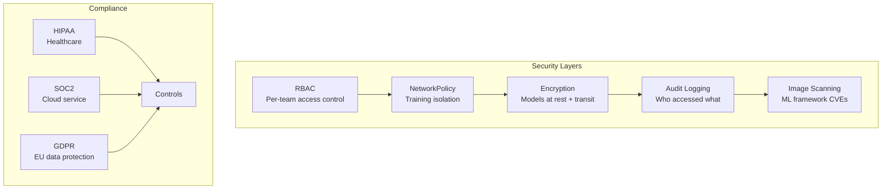

> 💡 **Quick Answer:** Secure AI workloads with: (1) network isolation for training jobs (no egress except storage), (2) RBAC per ML team with GPU quotas, (3) model encryption at rest and in transit, (4) audit logging of model access and data downloads, (5) image scanning for ML framework CVEs.

## The Problem

AI/ML workloads handle sensitive data (medical records, financial models, PII) and create valuable IP (trained models). In regulated industries (healthcare, finance, defense), you must demonstrate compliance with data governance, access control, and audit requirements — all while running on shared Kubernetes infrastructure.

## The Solution

### Network Isolation for Training Jobs

```yaml
apiVersion: networking.k8s.io/v1
kind: NetworkPolicy
metadata:
  name: training-isolation
  namespace: ml-training
spec:
  podSelector:
    matchLabels:
      workload: training
  policyTypes:
    - Ingress
    - Egress
  ingress:
    - from:
        - podSelector:
            matchLabels:
              workload: training
      ports:
        - port: 29500
          protocol: TCP
  egress:
    - to:
        - podSelector:
            matchLabels:
              workload: training
      ports:
        - port: 29500
    - to:
        - namespaceSelector:
            matchLabels:
              kubernetes.io/metadata.name: kube-system
      ports:
        - port: 53
          protocol: UDP
    - to:
        - ipBlock:
            cidr: 10.0.0.0/8
      ports:
        - port: 9000
          protocol: TCP
```

Training pods can only talk to each other (NCCL port 29500), DNS, and the model storage endpoint.

### RBAC for ML Teams

```yaml
apiVersion: rbac.authorization.k8s.io/v1
kind: Role
metadata:
  name: ml-engineer
  namespace: team-alpha
rules:
  - apiGroups: ["kubeflow.org"]
    resources: ["pytorchjobs", "tfjobs", "notebooks"]
    verbs: ["create", "get", "list", "delete"]
  - apiGroups: ["serving.kserve.io"]
    resources: ["inferenceservices"]
    verbs: ["create", "get", "list", "update"]
  - apiGroups: [""]
    resources: ["pods", "pods/log"]
    verbs: ["get", "list"]
---
apiVersion: v1
kind: ResourceQuota
metadata:
  name: gpu-quota
  namespace: team-alpha
spec:
  hard:
    requests.nvidia.com/gpu: "16"
    persistentvolumeclaims: "20"
```

### Model Encryption at Rest

```yaml
apiVersion: v1
kind: Pod
metadata:
  name: model-server
spec:
  containers:
    - name: inference
      volumeMounts:
        - name: encrypted-models
          mountPath: /models
          readOnly: true
  volumes:
    - name: encrypted-models
      csi:
        driver: secrets-store.csi.k8s.io
        readOnly: true
        volumeAttributes:
          secretProviderClass: model-vault
---
apiVersion: secrets-store.csi.x-k8s.io/v1
kind: SecretProviderClass
metadata:
  name: model-vault
spec:
  provider: vault
  parameters:
    vaultAddress: "https://vault.example.com"
    roleName: "model-reader"
    objects: |
      - objectName: "model-encryption-key"
        secretPath: "secret/data/ml/encryption"
```

### Audit Logging for Model Access

```yaml
apiVersion: audit.k8s.io/v1
kind: Policy
rules:
  - level: RequestResponse
    resources:
      - group: "serving.kserve.io"
        resources: ["inferenceservices"]
      - group: "kubeflow.org"
        resources: ["pytorchjobs", "notebooks"]
    namespaces: ["ml-*"]
  - level: Metadata
    resources:
      - group: ""
        resources: ["secrets", "configmaps"]
    namespaces: ["ml-*"]
```



## Common Issues

**Training pods can't communicate after NetworkPolicy**

Ensure NCCL ports (29500 default) are allowed between training pods. Also allow RDMA ports if using InfiniBand.

**Audit logs too verbose — storage filling up**

Use `level: Metadata` instead of `RequestResponse` for most resources. Only use `RequestResponse` for sensitive operations (model access, secret reads).

## Best Practices

- **Network isolation for every training namespace** — prevent data exfiltration
- **RBAC + ResourceQuota per team** — limit GPU access and prevent resource monopolization
- **Encrypt models at rest** — models are IP, treat them like secrets
- **Audit all model access** — who deployed, who queried, when
- **Scan ML images for CVEs** — PyTorch, TensorFlow have frequent security patches

## Key Takeaways

- AI/ML workloads need network isolation — training jobs should only reach storage and each other
- RBAC per ML team with GPU quotas prevents resource monopolization
- Model encryption at rest and in transit — models are valuable IP
- Audit logging of model access is mandatory for regulated industries
- Image scanning for ML framework CVEs — PyTorch and TensorFlow release frequent patches
