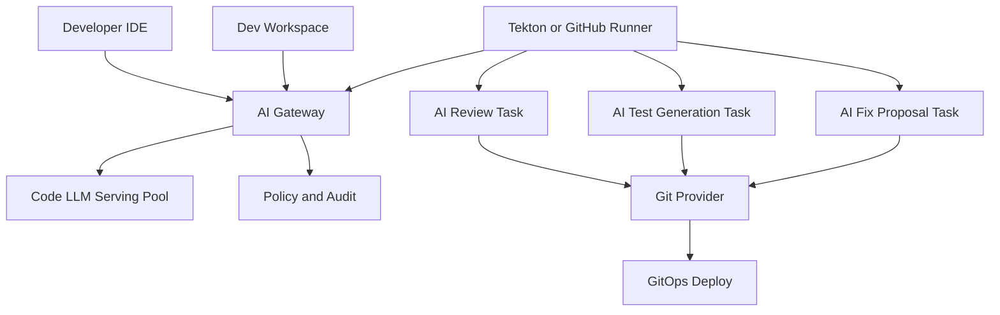

> **Quick Answer:** An AI-native development platform runs coding assistants, code review agents, test generators, and CI/CD repair loops as Kubernetes workloads. The core pattern is a private model endpoint, policy-controlled access to source code, short-lived workspaces, and pipeline tasks that can propose patches without silently changing production.

## The Problem

AI coding tools are useful, but unmanaged adoption creates operational and security problems:

- Proprietary code can leave the organization through SaaS assistants.
- Developers use different models, prompts, and data handling rules.
- CI bots generate patches without clear audit trails.
- Long-running agent work consumes shared GPUs unpredictably.
- Build credentials are exposed to broad automation contexts.

Kubernetes is a good control plane for these workloads because it already gives you namespaces, RBAC, network policy, quotas, secrets, admission control, and workload isolation.

## Platform Architecture



The platform has four layers:

| Layer | Kubernetes workload | Purpose |
| --- | --- | --- |
| Model serving | vLLM, NIM, Tabby, Tabnine, or an internal OpenAI-compatible endpoint | Completion, chat, review, and refactoring |
| AI gateway | Deployment with policy and audit | Central routing, rate limits, model selection, logging |
| Developer workspaces | Ephemeral namespaces, dev containers, code-server | Reproducible environments with AI tools |
| CI/CD agents | Tekton Tasks, Argo Workflows, or runners | Review diffs, generate tests, propose fixes |

## Step 1: Serve a Private Code Model

This example exposes an OpenAI-compatible endpoint for IDE tools and CI tasks.

```yaml
apiVersion: apps/v1
kind: Deployment
metadata:
  name: code-llm
  namespace: ai-dev
spec:
  replicas: 2
  selector:
    matchLabels:
      app: code-llm
  template:
    metadata:
      labels:
        app: code-llm
    spec:
      nodeSelector:
        accelerator: h100
      containers:
        - name: vllm
          image: vllm/vllm-openai:v0.6.6
          args:
            - "--model=/models/code-model"
            - "--served-model-name=code-assistant"
            - "--max-model-len=32768"
            - "--gpu-memory-utilization=0.88"
            - "--enable-prefix-caching"
          ports:
            - containerPort: 8000
              name: http
          resources:
            requests:
              cpu: "8"
              memory: 48Gi
              nvidia.com/gpu: "1"
            limits:
              memory: 64Gi
              nvidia.com/gpu: "1"
          volumeMounts:
            - name: models
              mountPath: /models
              readOnly: true
      volumes:
        - name: models
          persistentVolumeClaim:
            claimName: code-model-cache
---
apiVersion: v1
kind: Service
metadata:
  name: code-llm
  namespace: ai-dev
spec:
  selector:
    app: code-llm
  ports:
    - name: http
      port: 8000
      targetPort: 8000
```

## Step 2: Put an AI Gateway in Front

Do not point every IDE and bot directly at the model server. Put a gateway in front so you can enforce policy.

```yaml
apiVersion: apps/v1
kind: Deployment
metadata:
  name: ai-dev-gateway
  namespace: ai-dev
spec:
  replicas: 3
  selector:
    matchLabels:
      app: ai-dev-gateway
  template:
    metadata:
      labels:
        app: ai-dev-gateway
    spec:
      containers:
        - name: gateway
          image: registry.example.com/dev/ai-gateway:2026.07
          ports:
            - containerPort: 8080
          env:
            - name: UPSTREAM_OPENAI_BASE_URL
              value: http://code-llm.ai-dev.svc:8000/v1
            - name: AUDIT_LOG_TOPIC
              value: ai-dev-audit
            - name: MAX_CONTEXT_TOKENS
              value: "32768"
            - name: BLOCK_SECRET_PATTERNS
              value: "true"
            - name: REQUIRE_USER_IDENTITY
              value: "true"
          resources:
            requests:
              cpu: "1"
              memory: 1Gi
            limits:
              cpu: "4"
              memory: 4Gi
```

Recommended gateway controls:

- Authenticate every user and bot.
- Redact secrets before prompts are sent.
- Block repository paths that contain regulated data.
- Log model, user, repository, token count, and action type.
- Apply different quotas to IDE completion, chat, review, and agent tasks.
- Require human approval before generated patches are merged.

## Step 3: Run AI-Enabled Developer Workspaces

Ephemeral workspaces give developers a consistent environment without exposing broad cluster access.

```yaml
apiVersion: v1
kind: Namespace
metadata:
  name: dev-luca-feature-123
  labels:
    owner: luca
    workload: dev-workspace
---
apiVersion: apps/v1
kind: Deployment
metadata:
  name: workspace
  namespace: dev-luca-feature-123
spec:
  replicas: 1
  selector:
    matchLabels:
      app: workspace
  template:
    metadata:
      labels:
        app: workspace
    spec:
      serviceAccountName: workspace
      containers:
        - name: code-server
          image: registry.example.com/dev/workspace-node:22
          env:
            - name: OPENAI_BASE_URL
              value: http://ai-dev-gateway.ai-dev.svc:8080/v1
            - name: OPENAI_MODEL
              value: code-assistant
            - name: REPOSITORY_URL
              value: https://github.com/example/app.git
          ports:
            - containerPort: 8443
          resources:
            requests:
              cpu: "2"
              memory: 4Gi
            limits:
              cpu: "6"
              memory: 12Gi
          volumeMounts:
            - name: home
              mountPath: /home/developer
      volumes:
        - name: home
          persistentVolumeClaim:
            claimName: workspace-home
```

## Step 4: Add AI Review to CI/CD

The review task should produce comments or a patch artifact. It should not silently push to the protected branch.

```yaml
apiVersion: tekton.dev/v1
kind: Task
metadata:
  name: ai-code-review
  namespace: ci
spec:
  workspaces:
    - name: source
  params:
    - name: git_diff
      type: string
    - name: repository
      type: string
  results:
    - name: review
      description: AI review summary
  steps:
    - name: review
      image: registry.example.com/ci/ai-reviewer:2026.07
      env:
        - name: OPENAI_BASE_URL
          value: http://ai-dev-gateway.ai-dev.svc:8080/v1
        - name: OPENAI_MODEL
          value: code-assistant
        - name: REPOSITORY
          value: $(params.repository)
      script: |
        #!/usr/bin/env sh
        set -eu
        ai-review \
          --repo "$(params.repository)" \
          --diff "$(params.git_diff)" \
          --source "$(workspaces.source.path)" \
          --output "$(results.review.path)"
```

## Step 5: Generate Tests as a Separate Gate

Generated tests are useful only when they run and fail for the right reason. Keep them in a separate task so reviewers can inspect the delta.

```yaml
apiVersion: tekton.dev/v1
kind: Pipeline
metadata:
  name: ai-assisted-pr
  namespace: ci
spec:
  workspaces:
    - name: source
  params:
    - name: image
      type: string
    - name: git_diff
      type: string
    - name: repository
      type: string
  tasks:
    - name: unit-tests
      taskRef:
        name: run-unit-tests
      workspaces:
        - name: source
          workspace: source
    - name: ai-review
      runAfter:
        - unit-tests
      taskRef:
        name: ai-code-review
      params:
        - name: git_diff
          value: $(params.git_diff)
        - name: repository
          value: $(params.repository)
      workspaces:
        - name: source
          workspace: source
    - name: ai-generate-tests
      runAfter:
        - ai-review
      taskRef:
        name: ai-test-generator
      workspaces:
        - name: source
          workspace: source
```

## Step 6: Let AI Propose Fixes, Not Deploy Them

An AI repair loop should create a patch, branch, or pull request. Production deployment should still flow through normal review and GitOps.

```yaml
apiVersion: tekton.dev/v1
kind: Task
metadata:
  name: ai-fix-proposal
  namespace: ci
spec:
  workspaces:
    - name: source
  params:
    - name: failing_command
      type: string
    - name: test_log_path
      type: string
  results:
    - name: patch
      description: Generated patch file
  steps:
    - name: propose
      image: registry.example.com/ci/ai-fixer:2026.07
      env:
        - name: OPENAI_BASE_URL
          value: http://ai-dev-gateway.ai-dev.svc:8080/v1
        - name: OPENAI_MODEL
          value: code-assistant
      script: |
        #!/usr/bin/env sh
        set -eu
        ai-fix \
          --source "$(workspaces.source.path)" \
          --command "$(params.failing_command)" \
          --logs "$(params.test_log_path)" \
          --patch "$(results.patch.path)"
```

## Step 7: Isolate Credentials

AI tasks should not inherit broad deployment credentials. Split identities by job type.

```yaml
apiVersion: v1
kind: ServiceAccount
metadata:
  name: ai-reviewer
  namespace: ci
---
apiVersion: rbac.authorization.k8s.io/v1
kind: Role
metadata:
  name: ai-reviewer-read-only
  namespace: ci
rules:
  - apiGroups: [""]
    resources: ["configmaps", "pods/log"]
    verbs: ["get", "list"]
---
apiVersion: rbac.authorization.k8s.io/v1
kind: RoleBinding
metadata:
  name: ai-reviewer-read-only
  namespace: ci
subjects:
  - kind: ServiceAccount
    name: ai-reviewer
roleRef:
  apiGroup: rbac.authorization.k8s.io
  kind: Role
  name: ai-reviewer-read-only
```

## Policy Checklist

Before allowing AI workloads to touch source code, define:

- Which repositories may be sent to which model.
- Whether prompts and completions are retained.
- Which secrets and file patterns are blocked.
- Which tasks may create branches or pull requests.
- Which tasks are allowed to access package registries.
- Which users can run long-running agent jobs.
- Token budgets by user, team, and workload class.
- Audit retention and incident response procedures.

## Common Issues

**Letting every tool choose its own model**

Centralize model routing. Otherwise cost, quality, and data policy become impossible to reason about.

**Giving CI agents deployment credentials**

Review, test generation, and fix proposal tasks should not deploy. Keep deployment in the existing GitOps path.

**No quota for agent jobs**

Agent loops can run for a long time. Put them in a namespace with GPU, CPU, memory, and token budgets.

**Logging sensitive prompts**

Audit metadata is useful. Full prompt logging can create a second copy of proprietary code and secrets. Redact or sample carefully.

## Best Practices

- Put a policy gateway between tools and models.
- Treat AI-generated code as an untrusted patch until reviewed.
- Keep AI CI tasks read-only unless they explicitly create a branch or patch artifact.
- Separate IDE completion, chat, review, and agent workloads by quota.
- Use short-lived workspaces for risky experiments.
- Keep production deployment behind the same approvals as human-authored code.
- Monitor token usage, queue depth, model latency, and generated patch acceptance rate.

## Key Takeaways

- AI-native development is a platform concern, not just an IDE setting.
- Kubernetes gives the isolation and control plane needed for private coding assistants and CI agents.
- The model endpoint should be behind policy, audit, and quotas.
- CI/CD agents should propose changes, while humans and GitOps decide what ships.
- The best platforms make AI assistance available without weakening source code, credential, or deployment controls.
