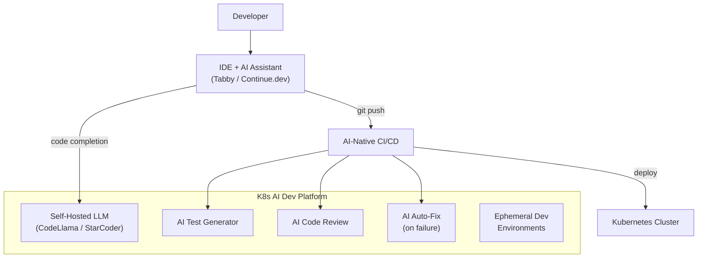

> 💡 **Quick Answer:** AI-native development platforms run AI coding assistants, test generators, and review bots as first-class Kubernetes workloads. Deploy self-hosted Copilot alternatives (Tabby, Continue.dev + local LLM), AI-powered CI/CD pipelines that auto-fix failures, and ephemeral dev environments with integrated AI tooling — all orchestrated by Kubernetes.

## The Problem

In 2026, AI isn't just assisting developers — it's becoming the primary driver of code generation, testing, and deployment. Organizations need infrastructure to run AI coding assistants privately (IP protection), integrate AI into CI/CD pipelines, and provide developers with AI-native environments. Kubernetes is the natural platform for this.



## The Solution

### Self-Hosted AI Coding Assistant (Tabby)

```yaml
apiVersion: apps/v1
kind: Deployment
metadata:
  name: tabby-server
spec:
  replicas: 1
  template:
    spec:
      containers:
        - name: tabby
          image: tabbyml/tabby:latest
          args:
            - serve
            - --model
            - StarCoder-3B
            - --device
            - cuda
          ports:
            - containerPort: 8080
          resources:
            limits:
              nvidia.com/gpu: 1
          volumeMounts:
            - name: models
              mountPath: /data
      volumes:
        - name: models
          persistentVolumeClaim:
            claimName: tabby-models
---
apiVersion: v1
kind: Service
metadata:
  name: tabby-server
spec:
  selector:
    app: tabby-server
  ports:
    - port: 8080
```

### Continue.dev with Local LLM Backend

```yaml
# NIM serving code models for IDE completion
apiVersion: apps/v1
kind: Deployment
metadata:
  name: code-llm
spec:
  template:
    spec:
      containers:
        - name: nim
          image: nvcr.io/nim/meta/codellama-70b-instruct:1.7.3
          env:
            - name: NIM_MAX_MODEL_LEN
              value: "16384"
          ports:
            - containerPort: 8000
          resources:
            limits:
              nvidia.com/gpu: 4
---
# Developers configure Continue.dev to point to:
# http://code-llm.dev-tools.svc.cluster.local:8000/v1
```

### AI-Powered CI/CD Pipeline

```yaml
# Tekton pipeline with AI stages
apiVersion: tekton.dev/v1
kind: Pipeline
metadata:
  name: ai-native-pipeline
spec:
  tasks:
    # Standard build
    - name: build
      taskRef:
        name: buildah
      params:
        - name: IMAGE
          value: $(params.image)

    # AI-generated tests
    - name: ai-generate-tests
      runAfter: ["build"]
      taskRef:
        name: ai-test-generator
      params:
        - name: LLM_ENDPOINT
          value: "http://code-llm:8000/v1"
        - name: SOURCE_PATH
          value: $(workspaces.source.path)

    # AI code review
    - name: ai-review
      runAfter: ["build"]
      taskRef:
        name: ai-code-review
      params:
        - name: LLM_ENDPOINT
          value: "http://code-llm:8000/v1"
        - name: DIFF
          value: $(params.git-diff)

    # Standard tests + AI-generated tests
    - name: test
      runAfter: ["ai-generate-tests"]
      taskRef:
        name: run-tests

    # AI auto-fix on failure
    - name: ai-fix
      runAfter: ["test"]
      when:
        - input: $(tasks.test.results.status)
          operator: in
          values: ["failed"]
      taskRef:
        name: ai-auto-fix
```

### Ephemeral Dev Environments

```yaml
# Dev environment per branch with AI tools pre-installed
apiVersion: apps/v1
kind: Deployment
metadata:
  name: dev-env-feature-123
  labels:
    branch: feature-123
    developer: luca
spec:
  template:
    spec:
      containers:
        - name: workspace
          image: myorg/dev-workspace:v2.0
          # Includes: VS Code Server, Continue.dev, copilot-cli
          env:
            - name: AI_COMPLETION_URL
              value: "http://tabby-server:8080"
            - name: AI_CHAT_URL
              value: "http://code-llm:8000/v1"
          ports:
            - containerPort: 8443  # VS Code Server
          resources:
            requests:
              cpu: "2"
              memory: "4Gi"
            limits:
              cpu: "4"
              memory: "8Gi"
          volumeMounts:
            - name: workspace
              mountPath: /home/developer
      volumes:
        - name: workspace
          persistentVolumeClaim:
            claimName: dev-env-feature-123
```

### AI Test Generation Task

```yaml
apiVersion: tekton.dev/v1
kind: Task
metadata:
  name: ai-test-generator
spec:
  params:
    - name: LLM_ENDPOINT
    - name: SOURCE_PATH
  steps:
    - name: generate-tests
      image: myorg/ai-test-gen:v1.0
      script: |
        #!/bin/bash
        # Find changed files
        CHANGED=$(git diff --name-only HEAD~1 -- '*.py' '*.go' '*.js')
        
        for file in $CHANGED; do
          echo "Generating tests for $file..."
          python /tools/generate_tests.py \
            --llm-endpoint=$(params.LLM_ENDPOINT) \
            --source="$file" \
            --output="tests/ai_generated/test_$(basename $file)"
        done
        
        echo "Generated $(ls tests/ai_generated/ | wc -l) test files"
```

## Common Issues

| Issue | Cause | Fix |
|-------|-------|-----|
| Code completion slow | LLM too large for available GPU | Use smaller model (StarCoder-3B) or quantized |
| AI-generated tests flaky | Non-deterministic LLM output | Set \`temperature: 0\`, add validation step |
| High GPU cost for dev tools | Each developer wants dedicated GPU | Share LLM backend, use request queuing |
| IP leakage concern | Code sent to external API | Self-host all LLMs on-cluster |
| IDE timeout | Network latency to LLM service | Deploy LLM in same zone, use streaming |
| Auto-fix creates bad code | LLM hallucination | Always require human review before merge |

## Best Practices

- **Self-host code LLMs** for IP protection — never send proprietary code to external APIs
- **Share LLM backends** across developers — one NIM deployment serves many IDEs
- **Use smaller models for completion** — 3B-7B models are fast enough for autocomplete
- **Use larger models for review/testing** — 70B+ models for complex reasoning tasks
- **Always human-review AI changes** — AI auto-fix should create PRs, not merge directly
- **Monitor token usage per team** — AI-native workflows consume significant compute

## Key Takeaways

- AI-native development platforms integrate AI into every stage of the SDLC
- Self-hosted alternatives (Tabby, Continue.dev + NIM) keep code private
- AI-powered CI/CD: auto-generate tests, review code, fix failures
- Kubernetes provides the multi-tenant, GPU-sharing infrastructure needed
- Ephemeral dev environments with pre-configured AI tools per branch
- 2026 trend: AI leading development, humans reviewing — not the other way around
