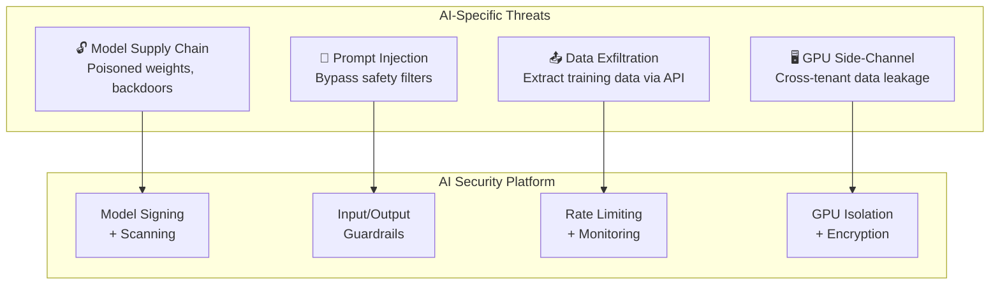

> 💡 **Quick Answer:** AI security on Kubernetes covers four layers: (1) model supply chain — scan and sign model artifacts like container images, (2) runtime protection — prompt injection filters, output guardrails, and rate limiting, (3) infrastructure — GPU isolation, network policies, encrypted inference, and (4) data security — prevent training data leakage and PII exposure through inference APIs.

## The Problem

AI workloads introduce attack surfaces that traditional Kubernetes security doesn't cover: malicious model weights (supply chain attacks), prompt injection exploiting LLM reasoning, training data extraction through inference APIs, GPU side-channel attacks, and unauthorized model access. In 2026, AI security platforms are becoming a dedicated category because the threats are unique.



## The Solution

### Model Supply Chain Security

```yaml
# Scan model artifacts before deployment
apiVersion: batch/v1
kind: Job
metadata:
  name: model-security-scan
spec:
  template:
    spec:
      containers:
        - name: scanner
          image: myorg/model-scanner:v1.0
          command: ["python", "scan_model.py"]
          args:
            - "--model-path=/models/llama-3.1-8b"
            - "--check-signatures"         # Verify model provenance
            - "--scan-weights"             # Detect poisoned tensors
            - "--check-license"            # Verify model license
            - "--output=/reports/scan.json"
          volumeMounts:
            - name: models
              mountPath: /models
              readOnly: true
      restartPolicy: Never
---
# Kyverno policy: only signed models allowed
apiVersion: kyverno.io/v1
kind: ClusterPolicy
metadata:
  name: require-model-signature
spec:
  rules:
    - name: check-model-annotation
      match:
        resources:
          kinds: ["Deployment", "StatefulSet"]
          selector:
            matchLabels:
              workload-type: ai-inference
      validate:
        message: "AI workloads must reference signed models"
        pattern:
          metadata:
            annotations:
              model-signature: "?*"
```

### Prompt Injection Defense (Guardrails)

```yaml
# NVIDIA NeMo Guardrails as sidecar
apiVersion: apps/v1
kind: Deployment
metadata:
  name: secure-llm
spec:
  template:
    spec:
      containers:
        # LLM inference
        - name: nim
          image: nvcr.io/nim/meta/llama-3.1-8b-instruct:1.7.3
          ports:
            - containerPort: 8000
          resources:
            limits:
              nvidia.com/gpu: 1
        
        # Guardrails proxy
        - name: guardrails
          image: myorg/llm-guardrails:v1.0
          ports:
            - containerPort: 8080
          env:
            - name: LLM_BACKEND
              value: "http://localhost:8000/v1"
            - name: BLOCK_PROMPT_INJECTION
              value: "true"
            - name: BLOCK_PII_OUTPUT
              value: "true"
            - name: BLOCK_CODE_EXECUTION
              value: "true"
            - name: MAX_OUTPUT_TOKENS
              value: "4096"
---
# Service exposes guardrails port, NOT raw LLM
apiVersion: v1
kind: Service
metadata:
  name: secure-llm
spec:
  selector:
    app: secure-llm
  ports:
    - port: 8080
      targetPort: 8080     # Guardrails proxy
```

### Network Isolation for AI Workloads

```yaml
apiVersion: networking.k8s.io/v1
kind: NetworkPolicy
metadata:
  name: ai-inference-isolation
  namespace: ai-production
spec:
  podSelector:
    matchLabels:
      workload-type: ai-inference
  policyTypes:
    - Ingress
    - Egress
  ingress:
    # Only API gateway can reach inference
    - from:
        - namespaceSelector:
            matchLabels:
              name: api-gateway
      ports:
        - port: 8080
  egress:
    # Model storage only
    - to:
        - namespaceSelector:
            matchLabels:
              name: model-storage
      ports:
        - port: 443
    # DNS
    - to:
        - namespaceSelector:
            matchLabels:
              name: kube-system
      ports:
        - port: 53
          protocol: UDP
    # BLOCK: No internet access for inference pods
```

### Rate Limiting and API Protection

```yaml
# Istio/Gateway API rate limiting for inference endpoints
apiVersion: gateway.networking.k8s.io/v1
kind: HTTPRoute
metadata:
  name: llm-api-route
spec:
  parentRefs:
    - name: ai-gateway
  rules:
    - matches:
        - path:
            type: PathPrefix
            value: /v1/chat/completions
      filters:
        - type: ExtensionRef
          extensionRef:
            group: gateway.envoyproxy.io
            kind: BackendTrafficPolicy
            name: llm-rate-limit
      backendRefs:
        - name: secure-llm
          port: 8080
---
# Rate limit: 100 requests/min per user
apiVersion: gateway.envoyproxy.io/v1alpha1
kind: BackendTrafficPolicy
metadata:
  name: llm-rate-limit
spec:
  rateLimit:
    global:
      rules:
        - clientSelectors:
            - headers:
                - name: X-User-ID
                  type: Distinct
          limit:
            requests: 100
            unit: Minute
```

### GPU Isolation and MIG

```yaml
# Use MIG for GPU tenant isolation
apiVersion: v1
kind: Pod
metadata:
  name: tenant-a-inference
spec:
  containers:
    - name: llm
      image: nim-llm:latest
      resources:
        limits:
          nvidia.com/mig-3g.24gb: 1    # Isolated MIG partition
          # Each tenant gets hardware-isolated GPU slice
          # No side-channel attacks between MIG instances
```

### Audit Logging for AI Access

```yaml
# OPA/Gatekeeper policy: log all inference requests
apiVersion: config.gatekeeper.sh/v1alpha1
kind: Config
metadata:
  name: audit-ai-access
spec:
  match:
    - apiGroups: [""]
      kinds: ["Pod"]
      namespaces: ["ai-production"]
  audit:
    auditInterval: 60
---
# Falco rule: detect unusual model access patterns
- rule: Unusual Model File Access
  desc: Detect unauthorized access to model weight files
  condition: >
    open_read and
    container and
    fd.name startswith "/models/" and
    not proc.name in (python3, python, nim_server, tritonserver)
  output: "Unexpected process accessing model files (user=%user.name process=%proc.name file=%fd.name)"
  priority: WARNING
```

## Common Issues

| Issue | Cause | Fix |
|-------|-------|-----|
| Prompt injection bypassing guardrails | Simple keyword filtering | Use classifier-based detection, not regex |
| Model weights exposed via volume mount | PVC accessible to other pods | Use ReadOnlyMany + NetworkPolicy isolation |
| PII in model outputs | Training data contained PII | Add output filter + PII detection |
| GPU memory leaking between tenants | Time-slicing shares GPU memory | Use MIG for hardware isolation |
| Unauthorized model download | No image pull policy | Use \`imagePullPolicy: Always\` + registry auth |

## Best Practices

- **Sign and scan models** like container images — treat model artifacts as supply chain
- **Use guardrails proxy** — never expose raw LLM endpoints to users
- **Network-isolate AI workloads** — inference pods should not have internet access
- **Rate limit per user** — prevent training data extraction via high-volume queries
- **Use MIG for multi-tenant GPU** — time-slicing has side-channel risks
- **Audit all inference API access** — log who queried what, when
- **Encrypt model artifacts at rest** — use encrypted PVCs for model storage

## Key Takeaways

- AI security is a new platform category — traditional K8s security isn't enough
- Four layers: model supply chain, runtime guardrails, infrastructure isolation, data protection
- Guardrails proxy sits between users and LLM — blocks prompt injection and PII leakage
- Network policies must isolate inference pods from internet and other namespaces
- MIG provides hardware-level GPU isolation between tenants
- 2026 trend: AI security platforms becoming mandatory for enterprise AI deployments
