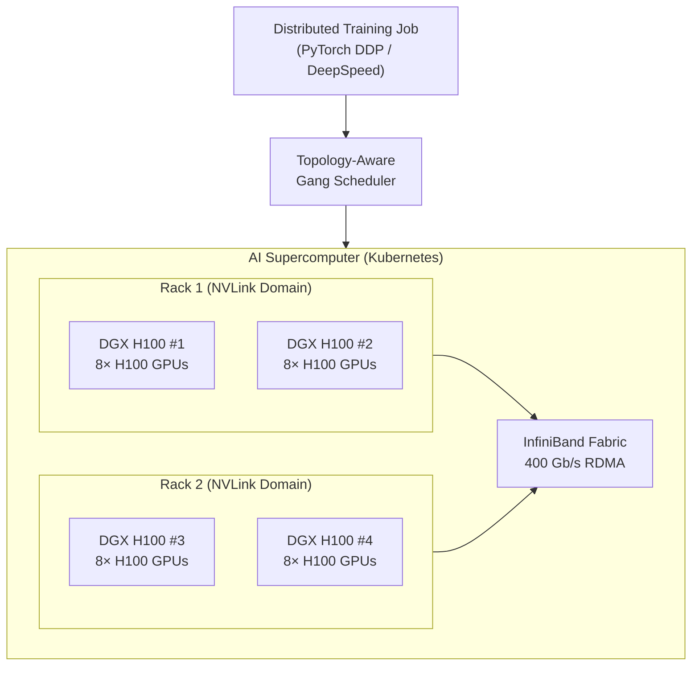

> 💡 **Quick Answer:** AI supercomputing on Kubernetes combines GPU Operator, Network Operator (for InfiniBand/RDMA), and topology-aware scheduling to run distributed training across hundreds of GPUs. Key components: LeaderWorkerSet for multi-node jobs, NCCL for GPU communication, GPUDirect RDMA for bypassing CPU, and Run:ai or Volcano for fair scheduling.

## The Problem

Training frontier AI models requires thousands of GPUs working in concert — NVIDIA's DGX SuperPOD, Blackwell GB200 NVL72 racks, and custom HPC clusters. Kubernetes is becoming the orchestration layer for these supercomputers, but it requires specialized networking (InfiniBand), topology-aware placement (NVLink domains), and HPC-grade job scheduling that vanilla Kubernetes doesn't provide.



## The Solution

### GPU Cluster Stack

```bash
# Install order matters — dependencies chain
# 1. Node Feature Discovery
helm install nfd nvidia/node-feature-discovery \
  --namespace gpu-operator --create-namespace

# 2. GPU Operator
helm install gpu-operator nvidia/gpu-operator \
  --namespace gpu-operator \
  --set driver.enabled=true \
  --set driver.useOpenKernelModules=true \
  --set toolkit.enabled=true \
  --set mig.strategy=mixed

# 3. Network Operator (InfiniBand / RDMA)
helm install network-operator nvidia/network-operator \
  --namespace nvidia-network-operator --create-namespace \
  --set deployCR=true \
  --set sriovDevicePlugin.deploy=true \
  --set rdmaSharedDevicePlugin.deploy=true

# 4. Topology-aware scheduler (Run:ai or Volcano)
helm install runai runai/runai-cluster \
  --namespace runai --create-namespace \
  --set scheduler.topology.enabled=true
```

### Multi-Node Training Job (LeaderWorkerSet)

```yaml
apiVersion: leaderworkerset.x-k8s.io/v1
kind: LeaderWorkerSet
metadata:
  name: llama-training
spec:
  replicas: 1
  leaderWorkerTemplate:
    size: 4                          # 4 nodes × 8 GPUs = 32 GPUs
    restartPolicy: RecreateGroupOnPodRestart
    leaderTemplate:
      metadata:
        labels:
          role: leader
      spec:
        containers:
          - name: trainer
            image: nvcr.io/nvidia/pytorch:24.04-py3
            command: ["torchrun"]
            args:
              - "--nnodes=4"
              - "--nproc_per_node=8"
              - "--rdzv_backend=c10d"
              - "--rdzv_endpoint=$(LWS_LEADER_ADDRESS):29500"
              - "train.py"
              - "--model=llama-3.1-70b"
              - "--batch-size=32"
              - "--gradient-accumulation=4"
            env:
              - name: NCCL_IB_HCA
                value: "mlx5"
              - name: NCCL_SOCKET_IFNAME
                value: "eth0"
              - name: NCCL_DEBUG
                value: "INFO"
            resources:
              limits:
                nvidia.com/gpu: 8
                rdma/rdma_shared_device_a: 1
            volumeMounts:
              - name: shm
                mountPath: /dev/shm
        volumes:
          - name: shm
            emptyDir:
              medium: Memory
              sizeLimit: 64Gi
    workerTemplate:
      spec:
        containers:
          - name: trainer
            image: nvcr.io/nvidia/pytorch:24.04-py3
            command: ["torchrun"]
            args:
              - "--nnodes=4"
              - "--nproc_per_node=8"
              - "--rdzv_backend=c10d"
              - "--rdzv_endpoint=$(LWS_LEADER_ADDRESS):29500"
              - "train.py"
            env:
              - name: NCCL_IB_HCA
                value: "mlx5"
            resources:
              limits:
                nvidia.com/gpu: 8
                rdma/rdma_shared_device_a: 1
```

### NCCL Performance Tuning

```yaml
env:
  # InfiniBand configuration
  - name: NCCL_IB_HCA
    value: "mlx5"                    # Use Mellanox HCAs
  - name: NCCL_IB_GID_INDEX
    value: "3"                       # RoCEv2 GID index
  - name: NCCL_NET_GDR_LEVEL
    value: "5"                       # GPUDirect RDMA level
  
  # Performance tuning
  - name: NCCL_ALGO
    value: "Ring,Tree"               # AllReduce algorithms
  - name: NCCL_PROTO
    value: "Simple,LL,LL128"         # Protocols
  - name: NCCL_MIN_NCHANNELS
    value: "4"
  - name: NCCL_MAX_NCHANNELS
    value: "32"
  
  # Debugging
  - name: NCCL_DEBUG
    value: "WARN"                    # INFO for troubleshooting
  - name: NCCL_DEBUG_SUBSYS
    value: "INIT,NET"
```

### Topology-Aware Scheduling

```yaml
# Ensure all training pods land in the same NVLink domain
metadata:
  annotations:
    kai.scheduler/topology: "nvidia.com/gpu.product"
    kai.scheduler/topology-preferred-placement: "rack"
spec:
  topologySpreadConstraints:
    - maxSkew: 1
      topologyKey: topology.kubernetes.io/zone
      whenUnsatisfiable: DoNotSchedule
      labelSelector:
        matchLabels:
          job: llama-training
```

### GPU Health Monitoring

```yaml
# DCGM Exporter for GPU metrics
apiVersion: apps/v1
kind: DaemonSet
metadata:
  name: dcgm-exporter
spec:
  template:
    spec:
      containers:
        - name: dcgm-exporter
          image: nvcr.io/nvidia/k8s/dcgm-exporter:3.3.5-3.4.1-ubuntu22.04
          env:
            - name: DCGM_EXPORTER_COLLECTORS
              value: "/etc/dcgm-exporter/dcp-metrics-included.csv"
          ports:
            - containerPort: 9400
          securityContext:
            capabilities:
              add: ["SYS_ADMIN"]
          resources:
            limits:
              nvidia.com/gpu: 0      # Monitor only, don't consume GPUs
```

### Storage for Training Data

```yaml
# High-performance shared storage for datasets
apiVersion: v1
kind: PersistentVolumeClaim
metadata:
  name: training-data
spec:
  accessModes:
    - ReadWriteMany                  # Shared across all training nodes
  resources:
    requests:
      storage: 10Ti
  storageClassName: lustre-fast      # Lustre, GPFS, or WekaFS
```

## Common Issues

| Issue | Cause | Fix |
|-------|-------|-----|
| NCCL timeout | Network misconfiguration | Check \`NCCL_IB_HCA\`, \`NCCL_SOCKET_IFNAME\` |
| GPUDirect RDMA not working | Missing open kernel modules | Set \`useOpenKernelModules: true\` |
| Training hangs at barrier | One node slower/failed | Enable NCCL watchdog timeout |
| Uneven GPU utilization | Poor topology placement | Use topology-aware scheduler |
| OOM on /dev/shm | Shared memory too small | Set \`sizeLimit: 64Gi\` on emptyDir |
| Slow data loading | Storage bandwidth bottleneck | Use Lustre/WekaFS, increase \`num_workers\` |

## Best Practices

- **Use InfiniBand/RDMA** for multi-node training — Ethernet adds 2-5× latency
- **Enable GPUDirect RDMA** — bypasses CPU for GPU-to-GPU communication
- **Topology-aware scheduling** — keep training pods in the same NVLink domain
- **Shared memory must be large** — PyTorch DataLoader needs /dev/shm
- **Monitor with DCGM** — detect GPU errors before they stall training
- **Use gang scheduling** — all-or-nothing: either all N nodes start, or none do

## Key Takeaways

- AI supercomputing on K8s: GPU Operator + Network Operator + topology-aware scheduler
- LeaderWorkerSet manages multi-node training jobs (leader + workers)
- NCCL environment variables are critical for communication performance
- GPUDirect RDMA requires open kernel modules (\`useOpenKernelModules: true\`)
- Topology-aware placement keeps pods near each other (same rack, same NVLink domain)
- 2026 trend: Kubernetes replacing SLURM as the AI supercomputing orchestrator
