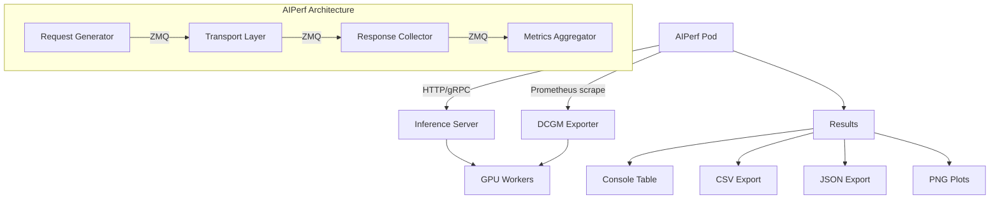

> 💡 **Quick Answer:** Run `aiperf profile --model <model> --streaming --endpoint-type chat --url http://<server>:8000` to benchmark any OpenAI-compatible LLM endpoint. AIPerf is NVIDIA's next-gen benchmarking tool replacing GenAI-Perf, with a real-time TUI dashboard, plugin architecture, and multiprocess scalability.

## The Problem

Benchmarking LLM inference in production Kubernetes clusters requires:

- **Realistic load generation** — concurrency sweeps, request rate control, trace replay
- **Real-time visibility** — watching metrics live during the benchmark, not just at the end
- **GPU telemetry** — correlating inference latency with GPU utilization and memory pressure
- **Reproducibility** — deterministic datasets and configurable random seeds
- **Flexibility** — testing across Triton, vLLM, TGI, Ollama, and OpenAI-compatible endpoints

GenAI-Perf handled some of these but is now deprecated. **AIPerf** is its successor — built on a scalable multiprocess architecture with 9 ZMQ-connected services, extensible plugins, and three UI modes.

## The Solution

### Step 1: Deploy AIPerf as a Kubernetes Job

```yaml
apiVersion: batch/v1
kind: Job
metadata:
  name: aiperf-benchmark
  namespace: ai-inference
spec:
  backoffLimit: 0
  template:
    spec:
      restartPolicy: Never
      containers:
        - name: aiperf
          image: python:3.11-slim
          command:
            - /bin/bash
            - -c
            - |
              pip install aiperf

              # Benchmark vLLM deployment
              aiperf profile \
                --model llama3-8b \
                --streaming \
                --endpoint-type chat \
                --url http://vllm-server.ai-inference:8000 \
                --concurrency 16 \
                --request-count 200 \
                --tokenizer meta-llama/Llama-3-8B-Instruct \
                --ui simple \
                --artifact-dir /results/llama3-c16

              echo "=== Benchmark Complete ==="
              cat /results/llama3-c16/*_aiperf.csv
          resources:
            limits:
              cpu: "4"
              memory: 8Gi
          volumeMounts:
            - name: results
              mountPath: /results
      volumes:
        - name: results
          persistentVolumeClaim:
            claimName: benchmark-results
```

### Step 2: Quick Benchmarks from a Debug Pod

```bash
# Install AIPerf
pip install aiperf

# Benchmark OpenAI-compatible endpoint (vLLM, TGI, etc.)
aiperf profile \
  --model llama3-8b \
  --streaming \
  --endpoint-type chat \
  --url http://vllm-server:8000 \
  --concurrency 10 \
  --request-count 100

# Benchmark Triton with TensorRT-LLM backend
aiperf profile \
  --model llama3-8b \
  --streaming \
  --endpoint-type chat \
  --url http://triton-server:8000 \
  --concurrency 32

# Benchmark with dashboard UI (requires TTY)
aiperf profile \
  --model llama3-8b \
  --streaming \
  --endpoint-type chat \
  --url http://vllm-server:8000 \
  --ui dashboard
```

### Step 3: Understanding the Output

```text
                    NVIDIA AIPerf | LLM Metrics
┏━━━━━━━━━━━━━━━━━━━━━━━━━━━━━━━━━━━━━━┳━━━━━━━━┳━━━━━━━━┳━━━━━━━━┳━━━━━━━━┓
┃ Metric                               ┃    avg ┃    min ┃    p99 ┃    p50 ┃
┡━━━━━━━━━━━━━━━━━━━━━━━━━━━━━━━━━━━━━━╇━━━━━━━━╇━━━━━━━━╇━━━━━━━━╇━━━━━━━━┩
│ Time to First Token (ms)             │  45.20 │  32.10 │  98.50 │  42.30 │
│ Time to Second Token (ms)            │  12.50 │   8.20 │  28.90 │  11.80 │
│ Inter Token Latency (ms)             │  11.30 │   8.50 │  25.60 │  10.90 │
│ Request Latency (ms)                 │ 892.40 │ 456.20 │1845.30 │ 812.50 │
│ Output Token Throughput (tokens/sec) │ 1420.5 │    N/A │    N/A │    N/A │
│ Request Throughput (requests/sec)    │   11.2 │    N/A │    N/A │    N/A │
└──────────────────────────────────────┴────────┴────────┴────────┴────────┘
```

**Key metrics:**
- **TTFT** — time to first token, determines perceived responsiveness
- **TTST** — time to second token (new in AIPerf), captures KV cache allocation overhead
- **ITL** — inter-token latency, affects streaming UX quality
- **Output token throughput** — total tokens/sec across all concurrent requests

### Step 4: GPU Telemetry with DCGM

```bash
# Collect GPU metrics during benchmark
aiperf profile \
  --model llama3-8b \
  --streaming \
  --endpoint-type chat \
  --url http://vllm-server:8000 \
  --concurrency 32 \
  --server-metrics-urls http://dcgm-exporter.gpu-operator:9400/metrics \
  --verbose

# GPU metrics collected:
# - GPU utilization, SM utilization
# - Memory used/free, power usage
# - PCIe throughput, NVLink errors
# - Temperature, clock speeds
```



## Common Issues

### Dashboard UI not rendering in Kubernetes Job

```bash
# Jobs don't have a TTY — use simple or none UI mode
aiperf profile --ui simple  # progress bars
aiperf profile --ui none    # headless, logs only

# For interactive debugging, use kubectl exec with TTY
kubectl exec -it debug-pod -- aiperf profile --ui dashboard
```

### Tokenizer download fails in air-gapped clusters

```bash
# Pre-download tokenizer and mount as volume
# Or use --tokenizer with a local path
aiperf profile \
  --tokenizer /models/tokenizers/llama3 \
  --model llama3-8b
```

### High concurrency causes port exhaustion

```bash
# AIPerf note: >15,000 concurrency may exhaust ports
# Adjust system limits if needed:
sysctl -w net.ipv4.ip_local_port_range="1024 65535"
# Or reduce concurrency to realistic levels
```

## Best Practices

- **Use `--ui simple` for Kubernetes Jobs** — dashboard requires TTY, simple mode shows progress bars
- **Set `--random-seed`** for reproducible benchmarks across runs
- **Match `--tokenizer` to your model** — token counts affect all per-token metrics
- **Start with `--warmup-request-count 10`** to eliminate cold-start effects
- **Export results to PVC** — use `--artifact-dir` mounted to a PersistentVolumeClaim for post-analysis
- **Migrate from GenAI-Perf** — AIPerf is the successor with the same CLI patterns plus new features

## Key Takeaways

- AIPerf replaces GenAI-Perf as NVIDIA's official LLM benchmarking tool
- Built on a **9-service multiprocess architecture** with ZMQ for scalability
- Three UI modes: **dashboard** (real-time TUI), **simple** (progress bars), **none** (headless)
- Measures **TTFT, TTST, ITL, output token throughput, and request throughput**
- Works with any **OpenAI-compatible endpoint** — vLLM, Triton, TGI, Ollama, OpenAI
- **Plugin system** for custom endpoints, datasets, transports, and metrics
- Collects **GPU telemetry** from DCGM Exporter during benchmarks
