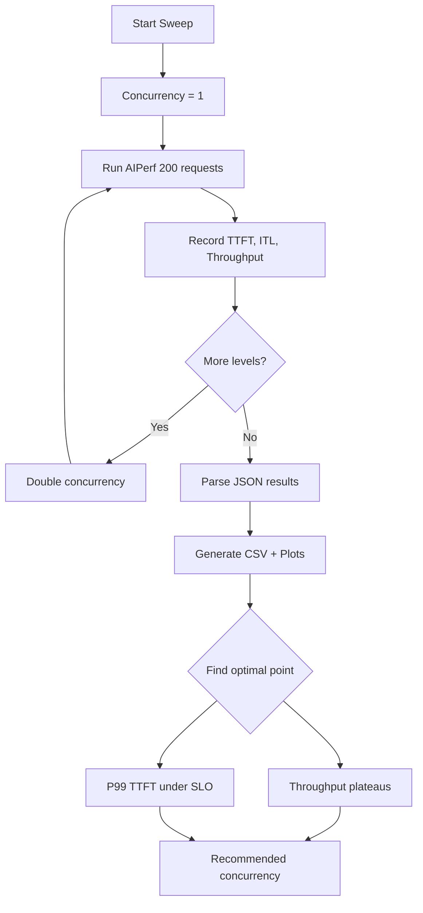

> 💡 **Quick Answer:** Run AIPerf at concurrency levels 1, 2, 4, 8, 16, 32, 64, 128 to find where throughput plateaus and latency spikes. The optimal operating point is where token throughput is near maximum while P99 TTFT stays under your SLO.

## The Problem

Every LLM deployment has a capacity ceiling — the concurrency level where:

- **Throughput stops increasing** — GPU compute is saturated
- **Latency degrades** — KV cache pressure causes queuing
- **Quality drops** — time to first token exceeds user tolerance

Finding this sweet spot requires systematic testing. Manual one-off benchmarks miss the picture. You need an automated sweep across concurrency levels with consistent parameters.

## The Solution

### Step 1: Concurrency Sweep Job

```yaml
apiVersion: batch/v1
kind: Job
metadata:
  name: aiperf-concurrency-sweep
  namespace: ai-inference
spec:
  backoffLimit: 0
  template:
    spec:
      restartPolicy: Never
      containers:
        - name: sweep
          image: python:3.11-slim
          command:
            - /bin/bash
            - -c
            - |
              pip install aiperf pandas

              MODEL="llama3-8b"
              SERVER="http://vllm-server.ai-inference:8000"
              TOKENIZER="meta-llama/Llama-3-8B-Instruct"

              echo "concurrency,ttft_avg,ttft_p99,itl_avg,itl_p99,throughput_tok,throughput_req" > /results/sweep.csv

              for C in 1 2 4 8 16 32 64 128; do
                echo "=== Concurrency: $C ==="
                aiperf profile \
                  --model $MODEL \
                  --streaming \
                  --endpoint-type chat \
                  --url $SERVER \
                  --tokenizer $TOKENIZER \
                  --concurrency $C \
                  --request-count 200 \
                  --warmup-request-count 10 \
                  --random-seed 42 \
                  --synthetic-input-tokens-mean 550 \
                  --output-tokens-mean 256 \
                  --ui none \
                  --artifact-dir /results/c-$C

                # Parse JSON results
                python3 << EOF
              import json, glob
              files = glob.glob(f"/results/c-$C/*_aiperf.json")
              if files:
                  data = json.load(open(files[0]))
                  metrics = data.get("metrics", {})
                  ttft = metrics.get("time_to_first_token", {})
                  itl = metrics.get("inter_token_latency", {})
                  tok = metrics.get("output_token_throughput", {})
                  req = metrics.get("request_throughput", {})
                  print(f"$C,{ttft.get('avg',0):.1f},{ttft.get('p99',0):.1f},{itl.get('avg',0):.1f},{itl.get('p99',0):.1f},{tok.get('avg',0):.1f},{req.get('avg',0):.2f}")
              EOF
              done | grep "^[0-9]" >> /results/sweep.csv

              echo "=== Sweep Complete ==="
              cat /results/sweep.csv
          resources:
            limits:
              cpu: "4"
              memory: 8Gi
          volumeMounts:
            - name: results
              mountPath: /results
      volumes:
        - name: results
          persistentVolumeClaim:
            claimName: benchmark-results
```

### Step 2: Request Rate Sweep with Max Concurrency

AIPerf supports dual load control — set a request rate with a concurrency cap:

```bash
# Request rate sweep with concurrency ceiling
for RATE in 1 5 10 20 50 100; do
  aiperf profile \
    --model llama3-8b \
    --streaming \
    --endpoint-type chat \
    --url http://vllm-server:8000 \
    --request-rate $RATE \
    --concurrency 64 \
    --request-count 300 \
    --random-seed 42 \
    --ui none \
    --artifact-dir /results/rate-${RATE}
done
```

### Step 3: Gradual Ramping

Avoid cold-start artifacts with smooth ramp-up:

```bash
# Ramp concurrency from 1 to 64 over 60 seconds
aiperf profile \
  --model llama3-8b \
  --streaming \
  --endpoint-type chat \
  --url http://vllm-server:8000 \
  --concurrency 64 \
  --ramp-up-duration 60 \
  --request-count 500 \
  --ui simple \
  --artifact-dir /results/ramped

# This gradually increases load, showing how the server
# degrades under increasing pressure
```

### Step 4: Arrival Pattern Testing

Test with realistic traffic patterns instead of constant load:

```bash
# Poisson arrival pattern (realistic)
aiperf profile \
  --model llama3-8b \
  --streaming \
  --endpoint-type chat \
  --url http://vllm-server:8000 \
  --request-rate 20 \
  --arrival-pattern poisson \
  --request-count 500 \
  --ui simple

# Gamma distribution (bursty traffic)
aiperf profile \
  --model llama3-8b \
  --streaming \
  --endpoint-type chat \
  --url http://vllm-server:8000 \
  --request-rate 20 \
  --arrival-pattern gamma \
  --request-count 500 \
  --ui simple
```

### Step 5: Analyze Results

```yaml
apiVersion: batch/v1
kind: Job
metadata:
  name: aiperf-analyze
  namespace: ai-inference
spec:
  backoffLimit: 0
  template:
    spec:
      restartPolicy: Never
      containers:
        - name: analyze
          image: python:3.11-slim
          command:
            - /bin/bash
            - -c
            - |
              pip install pandas matplotlib

              python3 << 'EOF'
              import pandas as pd
              import matplotlib.pyplot as plt

              df = pd.read_csv("/results/sweep.csv")
              fig, axes = plt.subplots(1, 3, figsize=(15, 5))

              # Throughput vs Concurrency
              axes[0].plot(df["concurrency"], df["throughput_tok"], "b-o")
              axes[0].set_xlabel("Concurrency")
              axes[0].set_ylabel("Token Throughput (tok/s)")
              axes[0].set_title("Throughput Curve")
              axes[0].set_xscale("log", base=2)

              # TTFT vs Concurrency
              axes[1].plot(df["concurrency"], df["ttft_avg"], "g-o", label="avg")
              axes[1].plot(df["concurrency"], df["ttft_p99"], "r-o", label="p99")
              axes[1].set_xlabel("Concurrency")
              axes[1].set_ylabel("TTFT (ms)")
              axes[1].set_title("Time to First Token")
              axes[1].set_xscale("log", base=2)
              axes[1].legend()

              # ITL vs Concurrency
              axes[2].plot(df["concurrency"], df["itl_avg"], "g-o", label="avg")
              axes[2].plot(df["concurrency"], df["itl_p99"], "r-o", label="p99")
              axes[2].set_xlabel("Concurrency")
              axes[2].set_ylabel("ITL (ms)")
              axes[2].set_title("Inter Token Latency")
              axes[2].set_xscale("log", base=2)
              axes[2].legend()

              plt.tight_layout()
              plt.savefig("/results/sweep-analysis.png", dpi=150)
              print("Plot saved to /results/sweep-analysis.png")
              EOF
          volumeMounts:
            - name: results
              mountPath: /results
      volumes:
        - name: results
          persistentVolumeClaim:
            claimName: benchmark-results
```



## Common Issues

### Sweep takes too long

```bash
# Reduce request count for faster sweeps
--request-count 50  # instead of 200

# Skip extreme concurrency levels
for C in 1 4 16 64; do ...  # skip 2, 8, 32, 128

# Use time-based instead of count-based
--benchmark-duration 60  # 60 seconds per level
```

### Results inconsistent between runs

```bash
# Always set random seed for reproducibility
--random-seed 42

# Use warmup to stabilize
--warmup-request-count 20

# Run multi-run confidence analysis
aiperf profile --multi-run-count 3 --concurrency 32
```

### Server OOM at high concurrency

```bash
# Monitor GPU memory during sweep
kubectl exec -it dcgm-pod -- dcgmi dmon -e 150,155

# Reduce max output tokens to lower KV cache pressure
--output-tokens-mean 128

# Or cap concurrency at a safe level
# If OOM at 128, your ceiling is between 64-128
```

## Best Practices

- **Use consistent parameters** across all concurrency levels — same seed, ISL, OSL, request count
- **Warmup at each level** — KV cache and CUDA graphs need re-initialization
- **Watch P99 not average** — tail latency matters more for user experience
- **Test arrival patterns** — Poisson is more realistic than constant concurrency
- **Export to PVC** — store all artifacts for post-hoc analysis and comparison
- **Find two numbers**: max throughput concurrency and max acceptable-latency concurrency — your operating range is between them

## Key Takeaways

- **Concurrency sweeps reveal capacity limits** — throughput plateaus while latency keeps climbing
- Use AIPerf's **request rate + max concurrency** mode for production-realistic load patterns
- **Poisson and gamma** arrival patterns are more realistic than constant concurrency
- **Gradual ramping** shows how the server degrades under increasing pressure
- The optimal operating point: **near-max throughput with P99 TTFT under your SLO**
- Store sweep results on a **PVC** and generate comparison plots for capacity planning
