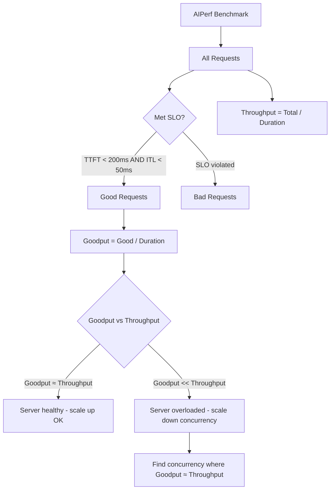

> 💡 **Quick Answer:** Use `aiperf profile --goodput "time_to_first_token:200 inter_token_latency:50"` to measure goodput — the throughput of requests that meet your SLO. A server doing 100 req/s is useless if 40% of requests exceed your latency budget.

## The Problem

Raw throughput numbers are misleading. Consider:

- Server A: 100 req/s, P99 TTFT = 2000ms
- Server B: 70 req/s, P99 TTFT = 150ms

Server B is **better** for a chat application with a 200ms TTFT SLO. **Goodput** measures only the requests that meet your quality bar.

Without goodput:
- You overprovision based on raw throughput
- Users experience latency spikes you didn't plan for
- Capacity planning is based on fiction

## The Solution

### Step 1: Define SLOs and Measure Goodput

```bash
# Define your SLOs and measure goodput
aiperf profile \
  --model llama3-8b \
  --streaming \
  --endpoint-type chat \
  --url http://vllm-server:8000 \
  --concurrency 32 \
  --request-count 500 \
  --random-seed 42 \
  --goodput "time_to_first_token:200" \
  --goodput "inter_token_latency:50" \
  --ui simple

# Output includes:
# Request Throughput: 45.2 req/s
# Goodput: 38.7 req/s (85.6% of requests met all SLOs)
```

### Step 2: Goodput Sweep — Find Sustainable Capacity

```yaml
apiVersion: batch/v1
kind: Job
metadata:
  name: aiperf-goodput-sweep
  namespace: ai-inference
spec:
  backoffLimit: 0
  template:
    spec:
      restartPolicy: Never
      containers:
        - name: sweep
          image: python:3.11-slim
          command:
            - /bin/bash
            - -c
            - |
              pip install aiperf

              echo "=== Goodput Sweep ==="
              echo "concurrency,throughput,goodput,goodput_pct"

              for C in 1 4 8 16 32 64 128; do
                aiperf profile \
                  --model llama3-8b \
                  --streaming \
                  --endpoint-type chat \
                  --url http://vllm-server.ai-inference:8000 \
                  --tokenizer meta-llama/Llama-3-8B-Instruct \
                  --concurrency $C \
                  --request-count 200 \
                  --warmup-request-count 10 \
                  --random-seed 42 \
                  --synthetic-input-tokens-mean 550 \
                  --output-tokens-mean 256 \
                  --goodput "time_to_first_token:200" \
                  --goodput "inter_token_latency:50" \
                  --goodput "request_latency:5000" \
                  --ui none \
                  --artifact-dir /results/goodput-c$C
              done
          resources:
            limits:
              cpu: "4"
              memory: 8Gi
          volumeMounts:
            - name: results
              mountPath: /results
      volumes:
        - name: results
          persistentVolumeClaim:
            claimName: benchmark-results
```

### Step 3: Timeslice Analysis

Track how performance changes over time during a benchmark:

```bash
# Enable timeslice metrics — see per-interval performance
aiperf profile \
  --model llama3-8b \
  --streaming \
  --endpoint-type chat \
  --url http://vllm-server:8000 \
  --concurrency 32 \
  --request-count 1000 \
  --timeslice-duration 10 \
  --ui simple \
  --artifact-dir /results/timeslice

# Generates per-10-second metrics:
# Interval 0-10s:  TTFT=42ms, ITL=11ms, 45 req/s
# Interval 10-20s: TTFT=48ms, ITL=12ms, 43 req/s
# Interval 20-30s: TTFT=95ms, ITL=18ms, 38 req/s  ← degradation!
```

### Step 4: SLO Tiers for Different Use Cases

```yaml
apiVersion: v1
kind: ConfigMap
metadata:
  name: slo-profiles
  namespace: ai-inference
data:
  chat-interactive.sh: |
    # Real-time chat — strictest SLOs
    aiperf profile \
      --model llama3-8b \
      --streaming --endpoint-type chat \
      --url http://vllm-server:8000 \
      --concurrency 32 --request-count 500 \
      --goodput "time_to_first_token:100" \
      --goodput "inter_token_latency:30" \
      --goodput "request_latency:3000" \
      --ui none --artifact-dir /results/slo-chat

  batch-processing.sh: |
    # Batch processing — relaxed SLOs, maximize throughput
    aiperf profile \
      --model llama3-8b \
      --streaming --endpoint-type chat \
      --url http://vllm-server:8000 \
      --concurrency 128 --request-count 1000 \
      --goodput "request_latency:30000" \
      --ui none --artifact-dir /results/slo-batch

  code-generation.sh: |
    # Code generation — long outputs, moderate latency
    aiperf profile \
      --model llama3-8b \
      --streaming --endpoint-type chat \
      --url http://vllm-server:8000 \
      --concurrency 16 --request-count 300 \
      --output-tokens-mean 1024 \
      --goodput "time_to_first_token:200" \
      --goodput "inter_token_latency:50" \
      --goodput "output_token_throughput_per_user:20" \
      --ui none --artifact-dir /results/slo-code
```

### Step 5: HTTP Trace Metrics for Network Analysis

```bash
# Measure network overhead separately
aiperf profile \
  --model llama3-8b \
  --streaming \
  --endpoint-type chat \
  --url http://vllm-server:8000 \
  --concurrency 16 \
  --request-count 200 \
  --http-trace-metrics \
  --verbose

# HTTP trace includes:
# - DNS resolution time
# - TCP connection time
# - TLS handshake time
# - Time to first byte (TTFB)
# Helps distinguish network latency from inference latency
```

### Goodput vs Throughput Visualization



## Common Issues

### Goodput is 0 at all concurrency levels

```bash
# SLOs may be too strict for your hardware
# Start with relaxed SLOs and tighten:
--goodput "time_to_first_token:1000"  # start at 1s
--goodput "time_to_first_token:500"   # tighten
--goodput "time_to_first_token:200"   # target

# Check baseline TTFT at concurrency=1
aiperf profile --concurrency 1 --request-count 20
# If TTFT > SLO at c=1, the SLO is unreachable
```

### Timeslice shows performance degradation over time

```bash
# Likely causes:
# 1. GPU thermal throttling — check temperatures
# 2. Memory fragmentation — KV cache not reclaiming
# 3. Garbage collection pauses (Python-based servers)

# Monitor GPU temp during benchmark:
kubectl exec dcgm-pod -- nvidia-smi --query-gpu=temperature.gpu --format=csv -l 5
```

### Goodput different for same server on repeat runs

```bash
# Use multi-run for confidence intervals
--multi-run-count 3

# And fix the random seed
--random-seed 42

# Background processes on the GPU (monitoring, other pods)
# can cause variability — isolate the GPU for benchmarking
```

## Best Practices

- **Define SLOs before benchmarking** — TTFT < 200ms for chat, < 500ms for batch, adjust per use case
- **Goodput sweep > throughput sweep** — find the concurrency where goodput starts dropping
- **Timeslice analysis** catches thermal throttling and memory degradation over time
- **HTTP trace metrics** separate network latency from inference latency — critical in multi-zone clusters
- **Report goodput, not throughput** — stakeholders care about requests that meet quality bars
- **Test multiple SLO tiers** — same server has different capacity for chat vs batch workloads

## Key Takeaways

- **Goodput** is throughput filtered by SLO compliance — the metric that actually matters
- Use `--goodput "metric:value"` to define latency and throughput constraints
- **Timeslice analysis** reveals performance degradation patterns invisible in aggregate metrics
- The optimal concurrency is where **goodput ≈ throughput** — beyond that, you're wasting GPU on SLO-violating requests
- Different use cases (chat, batch, code gen) have **different SLO profiles** on the same hardware
- **HTTP trace metrics** isolate network overhead from inference latency in Kubernetes clusters
