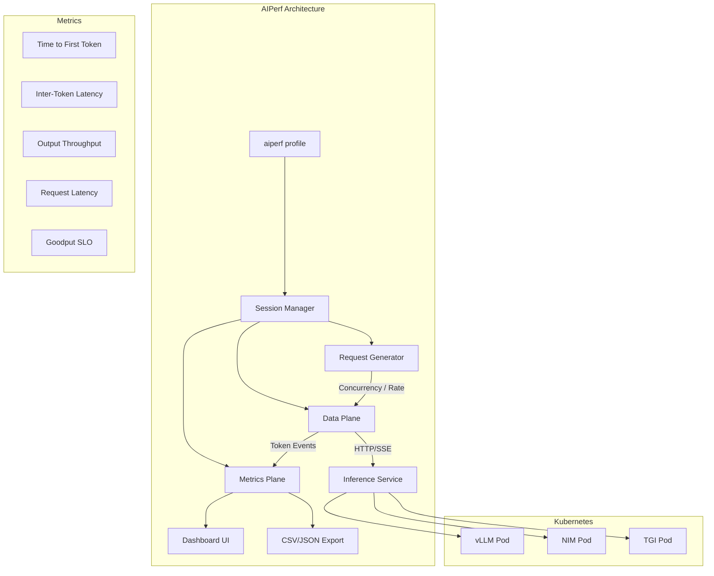

> 💡 **Quick Answer:** AIPerf (`aiperf profile`) is NVIDIA's comprehensive LLM benchmarking tool that measures TTFT, ITL, output throughput, and request latency against any OpenAI-compatible endpoint. Deploy it as a Kubernetes Job targeting your inference service, with configurable concurrency, request rates, arrival patterns, and dataset workloads.

## The Problem

Before deploying LLM inference to production, you need answers to:
- What's the Time to First Token (TTFT) under load?
- How does Inter-Token Latency (ITL) degrade at concurrency 50 vs 200?
- What's the maximum throughput (tokens/sec) before SLA violations?
- How does your inference engine (vLLM, NIM, TGI) perform with realistic traffic patterns?
- Is your GPU utilization optimal or are you over-provisioned?

Generic HTTP benchmarking tools (wrk, hey) don't understand streaming tokens, can't measure TTFT/ITL, and don't generate realistic LLM workloads.

## The Solution

### Install AIPerf

```bash
# In a Python virtual environment
pip install aiperf

# Or use the container image
# nvcr.io/nvidia/aiperf:0.7.0
```

### Quick Benchmark Against a K8s Inference Service

```bash
# Profile a vLLM deployment exposed via Service
aiperf profile \
  --model "meta-llama/Llama-3.1-8B-Instruct" \
  --streaming \
  --endpoint-type chat \
  --tokenizer meta-llama/Llama-3.1-8B-Instruct \
  --url http://vllm-service.ai-inference:8000 \
  --concurrency 10 \
  --request-count 100
```

### Kubernetes Benchmark Job

```yaml
apiVersion: batch/v1
kind: Job
metadata:
  name: aiperf-benchmark
  namespace: ai-inference
spec:
  template:
    spec:
      restartPolicy: Never
      containers:
        - name: aiperf
          image: python:3.12-slim
          command:
            - bash
            - -c
            - |
              pip install aiperf -q
              
              # Warmup run
              aiperf profile \
                --model "meta-llama/Llama-3.1-8B-Instruct" \
                --streaming \
                --endpoint-type chat \
                --tokenizer meta-llama/Llama-3.1-8B-Instruct \
                --url http://vllm-service:8000 \
                --concurrency 1 \
                --request-count 5 \
                --ui none
              
              # Actual benchmark
              aiperf profile \
                --model "meta-llama/Llama-3.1-8B-Instruct" \
                --streaming \
                --endpoint-type chat \
                --tokenizer meta-llama/Llama-3.1-8B-Instruct \
                --url http://vllm-service:8000 \
                --concurrency 50 \
                --request-count 500 \
                --ui none
              
              echo "Results:"
              cat artifacts/*/profile_export_aiperf.json
          volumeMounts:
            - name: results
              mountPath: /artifacts
          resources:
            requests:
              cpu: "4"
              memory: 4Gi
      volumes:
        - name: results
          emptyDir: {}
```

### Concurrency Sweep Job

```yaml
apiVersion: batch/v1
kind: Job
metadata:
  name: aiperf-sweep
  namespace: ai-inference
spec:
  template:
    spec:
      restartPolicy: Never
      containers:
        - name: aiperf
          image: python:3.12-slim
          command:
            - bash
            - -c
            - |
              pip install aiperf -q
              MODEL="meta-llama/Llama-3.1-8B-Instruct"
              URL="http://vllm-service:8000"
              
              for CONC in 1 5 10 25 50 100; do
                echo "=== Concurrency: $CONC ==="
                aiperf profile \
                  --model "$MODEL" \
                  --streaming \
                  --endpoint-type chat \
                  --tokenizer "$MODEL" \
                  --url "$URL" \
                  --concurrency $CONC \
                  --request-count 200 \
                  --ui none
              done
          resources:
            requests:
              cpu: "4"
              memory: 4Gi
```

### Benchmark NIM Deployment

```bash
# Profile NVIDIA NIM
aiperf profile \
  --model "meta-llama/Llama-3.1-8B-Instruct" \
  --streaming \
  --endpoint-type chat \
  --tokenizer meta-llama/Llama-3.1-8B-Instruct \
  --url http://nim-service.ai-inference:8000 \
  --concurrency 20 \
  --request-count 300
```

### Request Rate Control

```bash
# Fixed request rate (requests per second)
aiperf profile \
  --model "meta-llama/Llama-3.1-8B-Instruct" \
  --streaming \
  --endpoint-type chat \
  --tokenizer meta-llama/Llama-3.1-8B-Instruct \
  --url http://vllm-service:8000 \
  --request-rate 10.0 \
  --request-count 500

# Request rate with max concurrency cap
aiperf profile \
  --model "meta-llama/Llama-3.1-8B-Instruct" \
  --streaming \
  --endpoint-type chat \
  --tokenizer meta-llama/Llama-3.1-8B-Instruct \
  --url http://vllm-service:8000 \
  --request-rate 10.0 \
  --concurrency 50 \
  --request-count 500
```

### Arrival Patterns

```bash
# Poisson arrivals (realistic)
aiperf profile \
  --model "meta-llama/Llama-3.1-8B-Instruct" \
  --streaming \
  --endpoint-type chat \
  --tokenizer meta-llama/Llama-3.1-8B-Instruct \
  --url http://vllm-service:8000 \
  --request-rate 10.0 \
  --arrival-pattern poisson \
  --request-count 500

# Gradual ramp-up
aiperf profile \
  --model "meta-llama/Llama-3.1-8B-Instruct" \
  --streaming \
  --endpoint-type chat \
  --tokenizer meta-llama/Llama-3.1-8B-Instruct \
  --url http://vllm-service:8000 \
  --concurrency 100 \
  --ramp-up-duration 60 \
  --request-count 1000
```

### Custom Dataset / ShareGPT

```bash
# Use ShareGPT dataset for realistic prompts
aiperf profile \
  --model "meta-llama/Llama-3.1-8B-Instruct" \
  --streaming \
  --endpoint-type chat \
  --tokenizer meta-llama/Llama-3.1-8B-Instruct \
  --url http://vllm-service:8000 \
  --dataset sharegpt \
  --concurrency 20 \
  --request-count 500

# Synthetic dataset with controlled ISL/OSL
aiperf profile \
  --model "meta-llama/Llama-3.1-8B-Instruct" \
  --streaming \
  --endpoint-type chat \
  --tokenizer meta-llama/Llama-3.1-8B-Instruct \
  --url http://vllm-service:8000 \
  --input-tokens-mean 512 \
  --output-tokens-mean 256 \
  --concurrency 20 \
  --request-count 500
```

### Benchmark Embeddings / Rankings

```bash
# Embedding model
aiperf profile \
  --model "nvidia/nv-embedqa-e5-v5" \
  --endpoint-type embeddings \
  --url http://embedding-service:8000 \
  --concurrency 50 \
  --request-count 1000

# Ranking model
aiperf profile \
  --model "nvidia/nv-rerankqa-mistral-4b-v3" \
  --endpoint-type rankings \
  --url http://ranking-service:8000 \
  --concurrency 20 \
  --request-count 500
```

### Multi-URL Load Balancing

```bash
# Distribute across multiple inference replicas
aiperf profile \
  --model "meta-llama/Llama-3.1-8B-Instruct" \
  --streaming \
  --endpoint-type chat \
  --tokenizer meta-llama/Llama-3.1-8B-Instruct \
  --url http://vllm-0.vllm-headless:8000 \
  --url http://vllm-1.vllm-headless:8000 \
  --url http://vllm-2.vllm-headless:8000 \
  --concurrency 60 \
  --request-count 1000
```

### Goodput (SLO-Based Throughput)

```bash
# Measure requests meeting SLA targets
aiperf profile \
  --model "meta-llama/Llama-3.1-8B-Instruct" \
  --streaming \
  --endpoint-type chat \
  --tokenizer meta-llama/Llama-3.1-8B-Instruct \
  --url http://vllm-service:8000 \
  --concurrency 50 \
  --request-count 500 \
  --goodput ttft:500 itl:100
  # Only count requests with TTFT < 500ms AND ITL < 100ms
```

### UI Modes

```bash
# Real-time TUI dashboard (interactive)
aiperf profile ... --ui dashboard

# Simple progress bars (CI-friendly)
aiperf profile ... --ui simple

# Headless (no output, just results files)
aiperf profile ... --ui none
```



### Key Metrics Explained

| Metric | Description | What Good Looks Like |
|--------|-------------|---------------------|
| **TTFT** (Time to First Token) | Latency until first generated token | < 200ms at target concurrency |
| **TTST** (Time to Second Token) | Latency from first to second token | Close to ITL (no startup spike) |
| **ITL** (Inter-Token Latency) | Average time between consecutive tokens | < 50ms for interactive use |
| **Output Throughput** (tokens/sec) | Total tokens generated per second | Model/GPU dependent |
| **Per-User Throughput** (tok/sec/user) | Throughput experienced per user | Decreases with concurrency |
| **Request Latency** | End-to-end time per request | TTFT + (output_tokens × ITL) |
| **Goodput** | Requests meeting SLA thresholds | > 95% of requests within SLA |

### Supported Endpoint Types

| Type | Flag | APIs |
|------|------|------|
| Chat completions | `--endpoint-type chat` | OpenAI `/v1/chat/completions` |
| Text completions | `--endpoint-type completions` | OpenAI `/v1/completions` |
| Embeddings | `--endpoint-type embeddings` | OpenAI + NIM embeddings |
| Rankings | `--endpoint-type rankings` | NIM ranking/reranking |
| Audio | `--endpoint-type audio` | OpenAI audio |
| Vision | `--endpoint-type vision` | Vision LLMs (LLaVA, etc.) |
| Image generation | `--endpoint-type image` | OpenAI images |

## Common Issues

**TTFT spikes at concurrency > 1**

First request triggers model loading or KV cache warmup. Use `--warmup-requests` or run a warmup phase first:
```bash
# 5 warmup requests before measurement
aiperf profile ... --warmup-requests 5
```

**Token counts don't match expected output**

AIPerf needs the correct tokenizer to count tokens. Always specify `--tokenizer`:
```bash
--tokenizer meta-llama/Llama-3.1-8B-Instruct
# Or local path
--tokenizer /models/tokenizer
```

**Connection refused to inference service**

From the AIPerf pod, verify the service is reachable:
```bash
kubectl exec -it aiperf-pod -- curl -s http://vllm-service:8000/v1/models
```

**Output tokens truncated — OSL lower than expected**

Inference servers may apply `max_tokens` defaults. Use `--extra-inputs` to control:
```bash
aiperf profile ... --extra-inputs max_tokens:512
```

**Very high concurrency causes port exhaustion**

System limit on ephemeral ports (typically 28K). For concurrency > 15K, increase system limits:
```bash
sysctl -w net.ipv4.ip_local_port_range="1024 65535"
```

**Dashboard mode not rendering in pod**

Use `--ui none` or `--ui simple` for non-interactive environments (Jobs, CI pipelines).

## Best Practices

- **Warmup before measuring** — run 5-10 warmup requests to fill KV caches and JIT-compile kernels
- **Use realistic workloads** — ShareGPT or custom datasets over synthetic random tokens
- **Sweep concurrency** — test 1, 5, 10, 25, 50, 100 to find the throughput-latency curve
- **Set SLOs with goodput** — `--goodput ttft:200 itl:50` measures real production fitness
- **Use Poisson arrivals** — `--arrival-pattern poisson` models real traffic better than constant rate
- **Pin tokenizer** — always specify `--tokenizer` to get accurate token counts
- **Compare engines fairly** — same model, same dataset, same concurrency, same hardware
- **Export results** — JSON/CSV artifacts in `artifacts/` directory for post-analysis
- **Run from within the cluster** — deploy AIPerf as a Job to avoid network latency from external clients
- **Multi-URL for distributed** — pass multiple `--url` flags to benchmark across inference replicas
- **Combine with GPU telemetry** — use DCGM metrics to correlate throughput with GPU utilization

## Key Takeaways

- AIPerf replaces generic HTTP benchmark tools with LLM-aware metrics (TTFT, ITL, per-user throughput)
- Supports all major inference APIs: OpenAI chat/completions, embeddings, rankings, vision, audio
- Scalable multiprocess architecture with 9 ZMQ-connected services
- Three benchmark modes: concurrency-based, request-rate, and trace replay
- Arrival patterns: constant, Poisson, gamma — model realistic traffic
- Goodput measures SLO compliance (% of requests meeting latency targets)
- Extensive dataset support: ShareGPT, AIMO, MMStar, synthetic, custom, and multi-turn
- Plugin system for custom endpoints, datasets, transports, and metrics
- Export to CSV/JSON + visualization/plotting for multi-run comparison
- Deploy as K8s Job for in-cluster benchmarking — `--ui none` for headless mode
- Always benchmark before production: find the concurrency cliff where latency degrades
