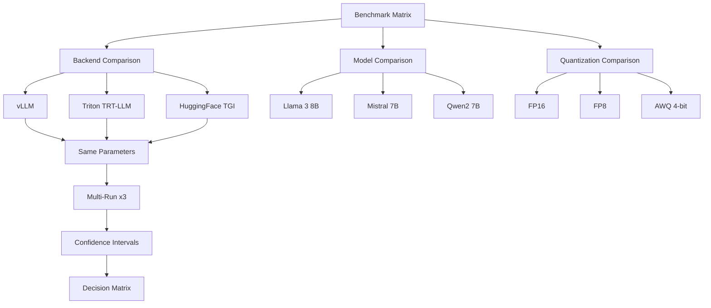

> 💡 **Quick Answer:** Run AIPerf against each backend with identical parameters (`--random-seed 42`, same ISL/OSL, same concurrency), then compare CSV exports. Use `--multi-run-count 3` for confidence intervals and AIPerf's built-in plot comparison for visual analysis.

## The Problem

Choosing an inference backend means comparing apples to apples across:

- **Frameworks** — vLLM vs Triton (TensorRT-LLM) vs HuggingFace TGI vs Ollama
- **Models** — Llama 3 70B vs Mistral 8x7B vs Qwen 72B for your use case
- **Quantization** — FP16 vs FP8 vs AWQ vs GPTQ — quality vs speed trade-off
- **GPU hardware** — A100 vs H100 vs L40S cost/performance ratio

You need controlled, reproducible benchmarks with statistical confidence — not single-run numbers.

## The Solution

### Step 1: Multi-Backend Comparison Job

```yaml
apiVersion: batch/v1
kind: Job
metadata:
  name: aiperf-multi-backend
  namespace: ai-inference
spec:
  backoffLimit: 0
  template:
    spec:
      restartPolicy: Never
      containers:
        - name: benchmark
          image: python:3.11-slim
          command:
            - /bin/bash
            - -c
            - |
              pip install aiperf pandas

              SEED=42
              ISL=550
              OSL=256
              CONCURRENCY=32
              REQUESTS=200
              WARMUP=10

              # Benchmark vLLM
              echo "=== vLLM ==="
              aiperf profile \
                --model llama3-8b \
                --streaming \
                --endpoint-type chat \
                --url http://vllm-server.ai-inference:8000 \
                --tokenizer meta-llama/Llama-3-8B-Instruct \
                --concurrency $CONCURRENCY \
                --request-count $REQUESTS \
                --warmup-request-count $WARMUP \
                --random-seed $SEED \
                --synthetic-input-tokens-mean $ISL \
                --output-tokens-mean $OSL \
                --ui none \
                --artifact-dir /results/vllm

              # Benchmark Triton + TensorRT-LLM
              echo "=== Triton TensorRT-LLM ==="
              aiperf profile \
                --model llama3-8b \
                --streaming \
                --endpoint-type chat \
                --url http://triton-trtllm.ai-inference:8000 \
                --tokenizer meta-llama/Llama-3-8B-Instruct \
                --concurrency $CONCURRENCY \
                --request-count $REQUESTS \
                --warmup-request-count $WARMUP \
                --random-seed $SEED \
                --synthetic-input-tokens-mean $ISL \
                --output-tokens-mean $OSL \
                --ui none \
                --artifact-dir /results/trtllm

              # Benchmark HuggingFace TGI
              echo "=== TGI ==="
              aiperf profile \
                --model llama3-8b \
                --streaming \
                --endpoint-type chat \
                --url http://tgi-server.ai-inference:8000 \
                --tokenizer meta-llama/Llama-3-8B-Instruct \
                --concurrency $CONCURRENCY \
                --request-count $REQUESTS \
                --warmup-request-count $WARMUP \
                --random-seed $SEED \
                --synthetic-input-tokens-mean $ISL \
                --output-tokens-mean $OSL \
                --ui none \
                --artifact-dir /results/tgi

              # Generate comparison
              python3 << 'PYEOF'
              import json, glob, os

              header = f"{'Backend':<20} {'TTFT avg':>10} {'TTFT p99':>10} {'ITL avg':>8} {'Tok/s':>10} {'Req/s':>8}"
              print("\n" + "=" * 70)
              print(header)
              print("=" * 70)

              for backend in ["vllm", "trtllm", "tgi"]:
                  files = glob.glob(f"/results/{backend}/*_aiperf.json")
                  if not files:
                      continue
                  data = json.load(open(files[0]))
                  m = data.get("metrics", {})
                  ttft = m.get("time_to_first_token", {})
                  itl = m.get("inter_token_latency", {})
                  tok = m.get("output_token_throughput", {})
                  req = m.get("request_throughput", {})
                  print(f"{backend:<20} {ttft.get('avg',0):>10.1f} {ttft.get('p99',0):>10.1f} {itl.get('avg',0):>8.1f} {tok.get('avg',0):>10.1f} {req.get('avg',0):>8.2f}")

              print("=" * 70)
              PYEOF
          resources:
            limits:
              cpu: "4"
              memory: 8Gi
          volumeMounts:
            - name: results
              mountPath: /results
      volumes:
        - name: results
          persistentVolumeClaim:
            claimName: benchmark-results
```

### Step 2: Multi-Run Confidence Intervals

```bash
# Run 3 times for statistical confidence
aiperf profile \
  --model llama3-8b \
  --streaming \
  --endpoint-type chat \
  --url http://vllm-server:8000 \
  --concurrency 32 \
  --request-count 200 \
  --random-seed 42 \
  --multi-run-count 3 \
  --ui simple \
  --artifact-dir /results/vllm-3runs

# Output includes confidence intervals:
# TTFT avg: 45.2ms ± 2.1ms (95% CI)
```

### Step 3: Multi-URL Load Balancing

Test a deployment behind a load balancer:

```bash
# Distribute requests across multiple replicas
aiperf profile \
  --model llama3-8b \
  --streaming \
  --endpoint-type chat \
  --url http://vllm-0.ai-inference:8000 \
  --url http://vllm-1.ai-inference:8000 \
  --url http://vllm-2.ai-inference:8000 \
  --concurrency 96 \
  --request-count 600 \
  --ui simple

# Compare against Kubernetes Service (kube-proxy load balancing)
aiperf profile \
  --model llama3-8b \
  --streaming \
  --endpoint-type chat \
  --url http://vllm-server.ai-inference:8000 \
  --concurrency 96 \
  --request-count 600 \
  --ui simple
```

### Step 4: Model Comparison Matrix

```yaml
apiVersion: batch/v1
kind: Job
metadata:
  name: model-comparison
  namespace: ai-inference
spec:
  backoffLimit: 0
  template:
    spec:
      restartPolicy: Never
      containers:
        - name: compare
          image: python:3.11-slim
          command:
            - /bin/bash
            - -c
            - |
              pip install aiperf

              # Compare models on same hardware
              declare -A MODELS
              MODELS[llama3-8b]="meta-llama/Llama-3-8B-Instruct"
              MODELS[mistral-7b]="mistralai/Mistral-7B-Instruct-v0.3"
              MODELS[qwen2-7b]="Qwen/Qwen2-7B-Instruct"

              for MODEL in "${!MODELS[@]}"; do
                echo "=== Benchmarking $MODEL ==="
                aiperf profile \
                  --model $MODEL \
                  --streaming \
                  --endpoint-type chat \
                  --url http://vllm-server:8000 \
                  --tokenizer ${MODELS[$MODEL]} \
                  --concurrency 16 \
                  --request-count 100 \
                  --random-seed 42 \
                  --synthetic-input-tokens-mean 550 \
                  --output-tokens-mean 256 \
                  --ui none \
                  --artifact-dir /results/$MODEL
              done
          resources:
            limits:
              cpu: "4"
              memory: 8Gi
```

### Step 5: Quantization Comparison

```bash
# FP16 baseline
aiperf profile \
  --model llama3-8b-fp16 \
  --streaming --endpoint-type chat \
  --url http://vllm-fp16:8000 \
  --concurrency 32 --request-count 200 \
  --random-seed 42 \
  --artifact-dir /results/fp16

# AWQ 4-bit
aiperf profile \
  --model llama3-8b-awq \
  --streaming --endpoint-type chat \
  --url http://vllm-awq:8000 \
  --concurrency 32 --request-count 200 \
  --random-seed 42 \
  --artifact-dir /results/awq

# FP8 (H100 only, TensorRT-LLM)
aiperf profile \
  --model llama3-8b-fp8 \
  --streaming --endpoint-type chat \
  --url http://triton-fp8:8000 \
  --concurrency 32 --request-count 200 \
  --random-seed 42 \
  --artifact-dir /results/fp8
```



## Common Issues

### Different tokenizers skew comparison

```bash
# Always specify tokenizer explicitly per model
--tokenizer meta-llama/Llama-3-8B-Instruct

# Different models have different tokenizer efficiency
# 550 tokens in Llama tokenizer ≠ 550 tokens in Mistral tokenizer
# For fairest comparison, use character-count-based inputs
```

### Server not ready between benchmark runs

```bash
# Add health check between backends
curl -sf http://vllm-server:8000/health || sleep 10

# Or add warmup requests
--warmup-request-count 20
```

### Results differ when benchmarking same server sequentially

```bash
# KV cache from previous run affects next run
# Restart the inference server between tests
kubectl rollout restart deployment/vllm-server
kubectl rollout status deployment/vllm-server
sleep 30  # wait for model load
```

## Best Practices

- **Identical parameters** — same seed, ISL, OSL, concurrency, request count across all tests
- **Multi-run** (`--multi-run-count 3`) — single runs are noisy, confidence intervals tell the real story
- **Restart servers between tests** — residual KV cache state affects results
- **Control for GPU thermals** — long benchmarks cause thermal throttling; watch GPU temperature
- **Document hardware** — results are meaningless without GPU model, count, and driver version
- **Test at production concurrency** — comparing at concurrency=1 hides the real differences

## Key Takeaways

- Use **identical parameters** (seed, ISL, OSL, concurrency) for fair comparisons
- **Multi-run confidence intervals** (`--multi-run-count 3`) replace gut feeling with statistics
- **Multi-URL benchmarking** tests load balancing efficiency across replicas
- Compare **backends** (vLLM vs TRT-LLM vs TGI), **models** (Llama vs Mistral), and **quantization** (FP16 vs FP8 vs AWQ) systematically
- Restart inference servers between tests to **eliminate KV cache carryover**
- The best backend depends on your workload — **there is no universal winner**
