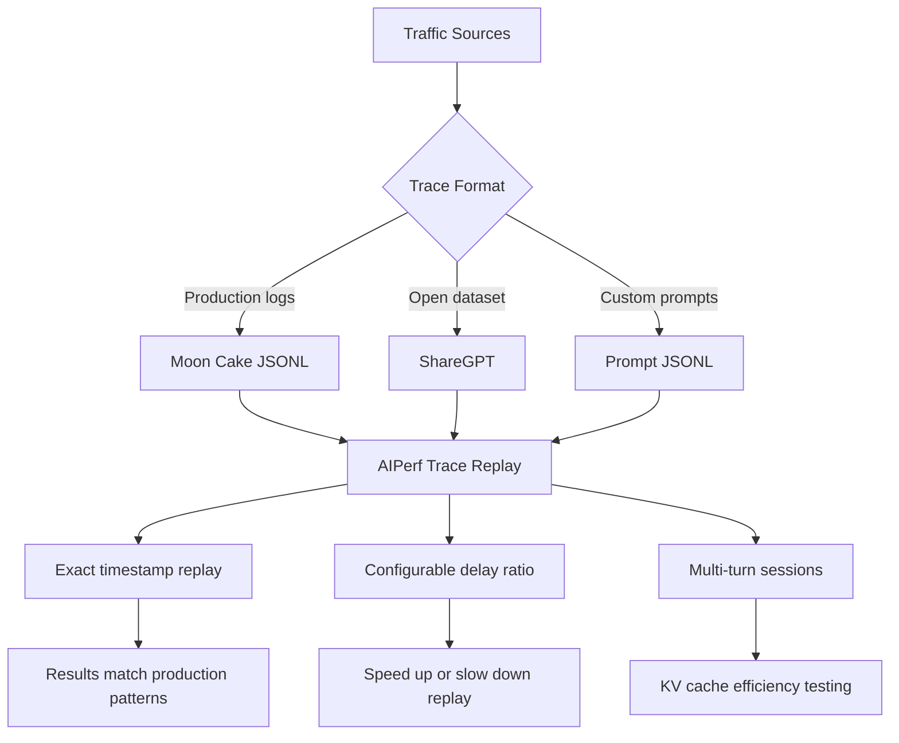

> 💡 **Quick Answer:** Use `aiperf profile --input-file payload:trace.jsonl` to replay production traffic patterns with exact timestamps. For quick realistic benchmarks, use `--input-file sharegpt` to load ShareGPT conversation data with real input/output length distributions.

## The Problem

Synthetic benchmarks with uniform input/output lengths don't represent real production traffic:

- **Input lengths vary wildly** — from 10 tokens ("summarize this") to 8000+ (RAG context)
- **Output lengths are unpredictable** — short answers vs long code generation
- **Traffic is bursty** — spikes after product launches, quiet at night
- **Multi-turn conversations** have session state and KV cache implications

Trace replay benchmarks use actual traffic patterns to answer: "Can my deployment handle yesterday's peak?"

## The Solution

### Step 1: Replay Production Traces (Moon Cake Format)

```yaml
apiVersion: v1
kind: ConfigMap
metadata:
  name: production-trace
  namespace: ai-inference
data:
  trace.jsonl: |
    {"timestamp": 0, "input_length": 6955, "output_length": 52}
    {"timestamp": 1053, "input_length": 6472, "output_length": 26}
    {"timestamp": 2748, "input_length": 1024, "output_length": 256}
    {"timestamp": 3500, "input_length": 512, "output_length": 128}
    {"timestamp": 3520, "input_length": 4096, "output_length": 64}
    {"timestamp": 3580, "input_length": 2048, "output_length": 512}
    {"timestamp": 5000, "input_length": 256, "output_length": 1024}
    {"timestamp": 8200, "input_length": 8192, "output_length": 32}
    {"timestamp": 10500, "input_length": 550, "output_length": 256}
    {"timestamp": 12000, "input_length": 1500, "output_length": 100}
---
apiVersion: batch/v1
kind: Job
metadata:
  name: aiperf-trace-replay
  namespace: ai-inference
spec:
  backoffLimit: 0
  template:
    spec:
      restartPolicy: Never
      containers:
        - name: aiperf
          image: python:3.11-slim
          command:
            - /bin/bash
            - -c
            - |
              pip install aiperf

              aiperf profile \
                --model llama3-8b \
                --streaming \
                --endpoint-type chat \
                --url http://vllm-server.ai-inference:8000 \
                --tokenizer meta-llama/Llama-3-8B-Instruct \
                --input-file payload:/trace/trace.jsonl \
                --ui simple \
                --artifact-dir /results/trace-replay
          volumeMounts:
            - name: trace
              mountPath: /trace
            - name: results
              mountPath: /results
      volumes:
        - name: trace
          configMap:
            name: production-trace
        - name: results
          persistentVolumeClaim:
            claimName: benchmark-results
```

### Step 2: ShareGPT Dataset Benchmarks

```bash
# Use ShareGPT for realistic conversation distributions
aiperf profile \
  --model llama3-8b \
  --streaming \
  --endpoint-type chat \
  --url http://vllm-server:8000 \
  --input-file sharegpt \
  --concurrency 16 \
  --request-count 200 \
  --ui simple

# ShareGPT provides real conversation data with:
# - Varied input lengths (short questions to long contexts)
# - Realistic output length distributions
# - Multi-turn conversation structures
```

### Step 3: Custom Prompt Benchmarks

```bash
# Send exact prompts from a file (no tokenization/synthesis)
cat > /tmp/prompts.jsonl << 'EOF'
{"text": "Explain the difference between a Pod and a Deployment in Kubernetes"}
{"text": "Write a Python script that monitors Kubernetes pod health and sends Slack alerts when pods crash"}
{"text": "What is the best practice for managing secrets in Kubernetes? Include examples with External Secrets Operator"}
EOF

aiperf profile \
  --model llama3-8b \
  --streaming \
  --endpoint-type chat \
  --url http://vllm-server:8000 \
  --input-file /tmp/prompts.jsonl \
  --concurrency 4 \
  --ui simple
```

### Step 4: Multi-Turn Session Benchmarks

```bash
# Simulate multi-turn conversations
aiperf profile \
  --model llama3-8b \
  --streaming \
  --endpoint-type chat \
  --url http://vllm-server:8000 \
  --num-sessions 10 \
  --session-concurrency 5 \
  --session-turns-mean 4 \
  --session-turns-stddev 2 \
  --session-turn-delay-mean 2000 \
  --session-turn-delay-stddev 500 \
  --ui simple

# This simulates 10 users having multi-turn conversations
# Average 4 turns per session with 2s think time between turns
# Tests KV cache efficiency and session management
```

### Step 5: Mixed Input/Output Length Distributions

```bash
# Simulate bimodal workload (short Q&A + long generation)
aiperf profile \
  --model llama3-8b \
  --streaming \
  --endpoint-type chat \
  --url http://vllm-server:8000 \
  --synthetic-input-tokens-mean 550 \
  --synthetic-input-tokens-stddev 200 \
  --output-tokens-mean 256 \
  --output-tokens-stddev 128 \
  --concurrency 16 \
  --request-count 500 \
  --random-seed 42
```

### Step 6: Capture and Replay Your Own Traffic

```python
# traffic_collector.py — capture real requests for replay
import json
import time
from datetime import datetime

class TrafficCollector:
    """Capture inference requests in moon_cake format."""

    def __init__(self, output_file="traffic.jsonl"):
        self.output_file = output_file
        self.start_time = time.time()

    def log_request(self, input_tokens, output_tokens):
        timestamp_ms = int((time.time() - self.start_time) * 1000)
        entry = {
            "timestamp": timestamp_ms,
            "input_length": input_tokens,
            "output_length": output_tokens,
        }
        with open(self.output_file, "a") as f:
            f.write(json.dumps(entry) + "\n")
```

```yaml
# Mount collected traces into AIPerf job
apiVersion: batch/v1
kind: Job
metadata:
  name: replay-yesterday
  namespace: ai-inference
spec:
  template:
    spec:
      restartPolicy: Never
      containers:
        - name: aiperf
          image: python:3.11-slim
          command:
            - /bin/bash
            - -c
            - |
              pip install aiperf
              aiperf profile \
                --model llama3-8b \
                --streaming \
                --endpoint-type chat \
                --url http://vllm-server:8000 \
                --input-file payload:/traces/yesterday.jsonl \
                --session-delay-ratio 0.5 \
                --ui simple
          volumeMounts:
            - name: traces
              mountPath: /traces
      volumes:
        - name: traces
          persistentVolumeClaim:
            claimName: traffic-traces
```



## Common Issues

### Trace timestamps too spread out

```bash
# Speed up replay with delay ratio
# 0.5 = replay at 2x speed, 0.1 = 10x speed
aiperf profile \
  --input-file payload:trace.jsonl \
  --session-delay-ratio 0.1
```

### ShareGPT outputs longer than model supports

```bash
# Cap output length
--output-tokens-mean 512 \
--extra-inputs max_tokens:512
```

### Multi-turn sessions overwhelm server

```bash
# Reduce session concurrency
--session-concurrency 2 \
--num-sessions 5

# Or increase turn delay
--session-turn-delay-mean 5000
```

## Best Practices

- **Capture production traffic** in moon_cake format — synthetic benchmarks miss real-world distributions
- **Use `--session-delay-ratio`** to speed up or slow down replays without altering relative timing
- **ShareGPT for quick realistic tests** — better than uniform synthetic data with zero setup
- **Multi-turn sessions** test KV cache reuse — critical for chat applications
- **Store traces on PVCs** — build a library of traffic patterns (peak, normal, bursty) for regression testing
- **Compare trace replay results** before and after changes (model swap, quantization, backend migration)

## Key Takeaways

- **Trace replay** uses real traffic patterns with exact timestamps for production-realistic benchmarks
- **Moon cake format** captures timestamp, input_length, output_length per request as JSONL
- **ShareGPT** provides instant access to realistic conversation data with varied distributions
- **Multi-turn sessions** test KV cache efficiency with configurable think time between turns
- **Delay ratio** lets you speed up or slow down replay without altering relative request patterns
- Combine trace replay with **concurrency sweeps** to find how much headroom your deployment has
