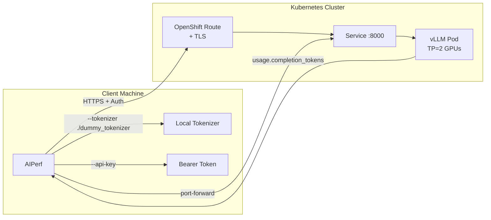

> 💡 **Quick Answer:** In air-gapped clusters, use `--tokenizer ./dummy_tokenizer` with `--use-server-token-count` to benchmark vLLM without HuggingFace access. Combine `--isl` and `--output-tokens-mean` for controlled input/output sequence lengths.

## The Problem

You're benchmarking a vLLM inference endpoint in an air-gapped (offline) environment where:
- HuggingFace tokenizers can't be downloaded
- Custom CA certificates may be required
- The model is served behind an authenticated route (Run:ai, OpenShift Route)
- You need precise control over ISL (Input Sequence Length) and OSL (Output Sequence Length)
- Token counting must use server-reported values, not local tokenizer estimates

## The Solution

### Create a Dummy Tokenizer

When HuggingFace is inaccessible, create a minimal local tokenizer:

```bash
python3 -c "
from transformers import AutoTokenizer
tok = AutoTokenizer.from_pretrained('gpt2')
tok.save_pretrained('./dummy_tokenizer')
"
```

Or on a machine with network access, save the actual model's tokenizer:
```bash
python3 -c "
from transformers import AutoTokenizer
tok = AutoTokenizer.from_pretrained('mistralai/Mistral-Small-4-119B-2603')
tok.save_pretrained('./dummy_tokenizer')
"
```

### Benchmark Script

```bash
#!/usr/bin/env bash
set -euo pipefail

# Activate virtual environment
source .venv/bin/activate

# Offline mode: no HuggingFace calls
export HF_HUB_OFFLINE=1
export TRANSFORMERS_OFFLINE=1

# Optional: custom CA bundle for internal PKI
# export SSL_CERT_FILE=/path/to/ca-chain-bundle.pem
# export REQUESTS_CA_BUNDLE=/path/to/ca-chain-bundle.pem

ENDPOINT="https://my-model-route.apps.example.com"
TOKEN="${TOKEN:-}"
MODEL="my-model"

# Controlled benchmark: 200 input tokens, 200 output tokens
aiperf profile \
  --model "$MODEL" \
  --endpoint-type completions \
  --url "$ENDPOINT" \
  --custom-endpoint "/v1/completions" \
  --api-key "$TOKEN" \
  --tokenizer "./dummy_tokenizer" \
  --use-server-token-count \
  --use-legacy-max-tokens \
  --extra-inputs '{"temperature":0,"ignore_eos":true}' \
  --concurrency 1 \
  --request-count 100 \
  --isl 200 \
  --output-tokens-mean 200
```

### Flag Reference for Offline Benchmarking

| Flag | Purpose |
|------|---------|
| `--tokenizer ./dummy_tokenizer` | Local tokenizer directory (no HF download) |
| `--use-server-token-count` | Trust server's `usage.completion_tokens` over local counting |
| `--use-legacy-max-tokens` | Use `max_tokens` instead of `max_completion_tokens` (vLLM compat) |
| `--custom-endpoint /v1/completions` | Override default endpoint path |
| `--extra-inputs '{"temperature":0,"ignore_eos":true}'` | Force exact OSL (ignore EOS token) |
| `--isl 200` | Input Sequence Length (synthetic prompt of 200 tokens) |
| `--output-tokens-mean 200` | Target Output Sequence Length |
| `--api-key $TOKEN` | Bearer token for authenticated endpoints |
| `--endpoint-type completions` | Use completions API (not chat) |

### Chat vs Completions Endpoint

```bash
# Completions API — better for controlled benchmarks
aiperf profile \
  --model "my-model" \
  --endpoint-type completions \
  --url "$ENDPOINT" \
  --custom-endpoint "/v1/completions" \
  --isl 200 --output-tokens-mean 200

# Chat API — realistic workload simulation
aiperf profile \
  --model "my-model" \
  --endpoint-type chat \
  --streaming \
  --url "$ENDPOINT" \
  --isl 200 --output-tokens-mean 200
```

Use **completions** for precise ISL/OSL control (with `ignore_eos`). Use **chat** for realistic streaming latency measurements.

### Concurrency Sweep

```bash
for CONC in 1 2 4 8 16 32; do
  echo "=== Concurrency: $CONC ==="
  aiperf profile \
    --model "$MODEL" \
    --endpoint-type completions \
    --url "$ENDPOINT" \
    --custom-endpoint "/v1/completions" \
    --api-key "$TOKEN" \
    --tokenizer "./dummy_tokenizer" \
    --use-server-token-count \
    --use-legacy-max-tokens \
    --extra-inputs '{"temperature":0,"ignore_eos":true}' \
    --concurrency $CONC \
    --request-count 100 \
    --isl 200 \
    --output-tokens-mean 200 \
    --ui none
done
```

### Port-Forward for Local Testing

```bash
# Forward to the inference pod directly (bypasses route/ingress)
kubectl -n ai-inference port-forward pod/my-model-0 18000:8000

# Benchmark against localhost (no auth needed)
aiperf profile \
  --model "my-model" \
  --endpoint-type completions \
  --url "http://127.0.0.1:18000" \
  --tokenizer "./dummy_tokenizer" \
  --use-server-token-count \
  --concurrency 1 \
  --request-count 10 \
  --isl 200 \
  --output-tokens-mean 200
```

### Authenticated Route Access

For Run:ai or OAuth-protected endpoints:

```bash
# 1. Get API token
TOKEN=$(curl -sS -X POST 'https://runai.example.com/api/v1/token' \
  -H 'Content-Type: application/json' \
  -d '{
    "grantType": "client_credentials",
    "clientId": "<your-client-id>",
    "clientSecret": "<your-client-secret>"
  }' | jq -r '.access_token')

# 2. Run benchmark with token
aiperf profile \
  --model "my-model" \
  --endpoint-type completions \
  --url "https://my-model-route.apps.example.com" \
  --api-key "$TOKEN" \
  --tokenizer "./dummy_tokenizer" \
  --use-server-token-count \
  --concurrency 4 \
  --request-count 100
```



### Podman: Run the Official Container Image (No Python Setup)

Instead of a `.venv` with `pip install aiperf`, run NVIDIA's official AIPerf container directly with `podman` — useful from a bastion host or CI runner where you don't want to manage a Python environment:

```bash
#!/bin/bash
RUN_DATE="$(date +%Y%m%d_%H%M%S)"
ARTIFACT_DIR="$PWD/artifacts/$RUN_DATE"
mkdir -p "$ARTIFACT_DIR/logs"
chmod -R 777 "$ARTIFACT_DIR"   # container UID rarely matches your host UID

export MODEL="my-model"
export URL="https://my-model-route.apps.example.com"
export ENDPOINT="/v1/chat/completions"
export API_KEY="${TOKEN:-}"
export CONCURRENCY=1
export WARMUP_REQUEST_COUNT=5
export REQUEST_COUNT=3000

podman run --rm -it \
    --entrypoint aiperf \
    -v "$PWD/dummy_tokenizer:/tokenizer:ro,Z" \
    -v "$ARTIFACT_DIR:/artifacts:Z" \
    -e AIPERF_HTTP_SSL_VERIFY=False \
    nvcr.io/nvidia/ai-dynamo/aiperf:0.7.0 \
    profile \
    --tokenizer /tokenizer \
    --model "$MODEL" --url "$URL" \
    --endpoint "$ENDPOINT" \
    --api-key "$API_KEY" \
    --endpoint-type chat \
    --num-prompts 50 \
    --random-seed 123 \
    --synthetic-input-tokens-mean 200 \
    --synthetic-input-tokens-stddev 200 \
    --output-tokens-mean 200 \
    --output-tokens-stddev 200 \
    --streaming \
    --artifact-dir "/artifacts" \
    --concurrency "$CONCURRENCY" \
    --warmup-request-count "$WARMUP_REQUEST_COUNT" \
    --request-count "$REQUEST_COUNT"
```

Three gotchas specific to the containerized/podman path that don't come up with a local `pip install`:

- **`:Z` SELinux label on every volume mount** — on RHEL/Fedora hosts with SELinux enforcing, `podman run -v host:container` fails to read/write without `:Z` (or `:z` for shared mounts) relabeling the host path for container access.
- **`chmod -R 777` on the artifact directory** — the container's AIPerf process runs as a UID that rarely matches your host user; without opening permissions first, AIPerf fails partway through with a permission-denied error writing results, *after* the benchmark has already run.
- **`AIPERF_HTTP_SSL_VERIFY=False`** — for internal Routes signed by a private/self-signed CA that you don't want to inject as a trust bundle into the container, this environment variable skips TLS verification entirely. It's a coarser hammer than mounting `SSL_CERT_FILE`/`REQUESTS_CA_BUNDLE` (see below) — prefer the CA bundle approach outside of quick ad-hoc runs, since disabling verification also blinds you to a genuinely wrong or expired certificate.

## Common Issues

**`tokenizer not found` error in air-gapped environment**

AIPerf tries to download the tokenizer from HuggingFace. Fix:
```bash
export HF_HUB_OFFLINE=1
export TRANSFORMERS_OFFLINE=1
aiperf profile --tokenizer ./dummy_tokenizer ...
```

**Token counts don't match expected OSL**

Without `ignore_eos`, the model may stop generating at an EOS token before reaching `output-tokens-mean`:
```bash
--extra-inputs '{"temperature":0,"ignore_eos":true}'
```

**SSL certificate verification fails on internal PKI**

```bash
export SSL_CERT_FILE=/path/to/ca-chain-bundle.pem
export REQUESTS_CA_BUNDLE=/path/to/ca-chain-bundle.pem
```

**`max_completion_tokens` not supported error**

Older vLLM versions use `max_tokens` instead:
```bash
--use-legacy-max-tokens
```

**Results show 0 tokens/sec**

Check that `--use-server-token-count` is set. Without it, AIPerf relies on the local tokenizer for counting — a dummy tokenizer will produce incorrect counts.

## Best Practices

- **Save the real tokenizer** on a machine with network access and copy it to the air-gapped environment
- **Use `--use-server-token-count`** to get accurate token metrics from vLLM's `usage` response field
- **Set `ignore_eos: true`** for benchmarks that need exact output lengths
- **Use completions API** for controlled benchmarks (exact ISL/OSL), chat API for latency profiling
- **Port-forward for baseline** measurements before testing through routes/ingress
- **Sweep concurrency** systematically: 1, 2, 4, 8, 16, 32 to find the throughput-latency curve
- **Export results** — AIPerf saves CSV/JSON to `artifacts/` automatically
- **Run from within the cluster** when possible to eliminate network latency from measurements

## Key Takeaways

- Air-gapped AIPerf requires: local tokenizer + `HF_HUB_OFFLINE=1` + `TRANSFORMERS_OFFLINE=1`
- `--use-server-token-count` is mandatory when using a dummy tokenizer — otherwise metrics are wrong
- `--use-legacy-max-tokens` needed for vLLM compatibility (`max_tokens` vs `max_completion_tokens`)
- `--extra-inputs '{"ignore_eos":true}'` forces exact output length for reproducible benchmarks
- Custom CA bundles via `SSL_CERT_FILE` / `REQUESTS_CA_BUNDLE` environment variables
- Port-forward bypasses auth and network overhead — ideal for baseline measurements
- For Run:ai authenticated routes: get token via `/api/v1/token` → pass as `--api-key`
