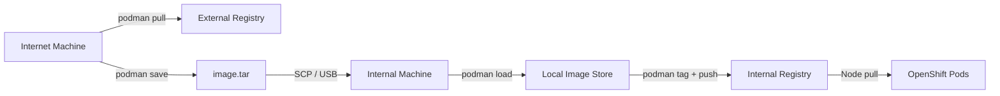

> 💡 **Quick Answer:** When your OpenShift cluster can't reach external registries (DNS blocked, TLS intercepted, air-gapped), use `podman save` on an internet-connected machine to create a tarball, transfer it to the internal network, `podman load` it, then `podman push` to your internal registry. Nodes pull from there.
>
> **Key insight:** A `502 Bad Gateway` from your internal registry usually means the image was never pushed — not that the registry is broken.
>
> **Gotcha:** You need to `podman login` to your internal registry before pushing, even if pulls are anonymous.

## The Problem

Your OpenShift cluster operates in a restricted network where nodes cannot reach external registries:

```bash
# DNS blocked
$ podman pull registry.redhat.io/rhel9/support-tools:latest
Error: lookup registry.redhat.io on 10.0.0.53:53: no such host

# Or TLS intercepted
$ podman pull registry.redhat.io/rhel9/support-tools:latest
Error: x509: certificate signed by unknown authority

# Internal registry returns 502 because image isn't there
$ podman pull registry.example.com/util/support-tools:latest
Error: received unexpected HTTP status: 502 Bad Gateway
```

## The Solution

### Complete Offline Import Workflow



### Step 1: Pull on an Internet-Connected Machine

```bash
# Login to Red Hat registry
podman login registry.redhat.io
# Username: your-rh-account
# Password: your-rh-password

# Pull the needed images
podman pull registry.redhat.io/rhel9/support-tools:latest
podman pull registry.redhat.io/ubi9/ubi-minimal:latest
podman pull registry.redhat.io/openshift4/ose-cli:latest
```

### Step 2: Save to Tarballs

```bash
# Save individual images
podman save registry.redhat.io/rhel9/support-tools:latest \
  -o support-tools.tar

# Or save multiple images into one archive
podman save \
  registry.redhat.io/rhel9/support-tools:latest \
  registry.redhat.io/ubi9/ubi-minimal:latest \
  -o rhel-images.tar

# Check sizes
ls -lh *.tar
```

### Step 3: Transfer to Internal Network

```bash
# Via SCP
scp support-tools.tar devops@jumphost.example.com:/tmp/

# Or via rsync for large files
rsync -avP support-tools.tar devops@jumphost.example.com:/tmp/

# Or via USB/removable media for fully air-gapped environments
```

### Step 4: Load and Push to Internal Registry

```bash
# Load the image into local podman store
podman load -i /tmp/support-tools.tar

# Verify it loaded
podman images | grep support-tools

# Tag for your internal registry
podman tag registry.redhat.io/rhel9/support-tools:latest \
  registry.example.com/util/support-tools:latest

# Login to internal registry
podman login registry.example.com

# Push
podman push registry.example.com/util/support-tools:latest

# Verify it exists in the registry
curl -u user:pass \
  https://registry.example.com/v2/util/support-tools/tags/list
# {"name":"util/support-tools","tags":["latest"]}
```

### Step 5: Use from OpenShift

```yaml
apiVersion: v1
kind: Pod
metadata:
  name: support-tools
spec:
  containers:
    - name: tools
      image: registry.example.com/util/support-tools:latest
      command: ["sleep", "infinity"]
```

### Batch Import Script

For importing many images at once:

```bash
#!/bin/bash
# import-images.sh — Run on the internal machine
# Usage: ./import-images.sh /path/to/images-dir

REGISTRY="registry.example.com"
IMAGE_DIR="${1:-.}"

# Login once
podman login "$REGISTRY"

# Process all tarballs
for tar in "$IMAGE_DIR"/*.tar; do
  echo "=== Loading $tar ==="
  # Load and capture the image name
  IMAGE=$(podman load -i "$tar" 2>&1 | grep "Loaded image" | awk '{print $NF}')
  
  if [ -z "$IMAGE" ]; then
    echo "WARN: Could not determine image name from $tar"
    continue
  fi
  
  # Extract repo/tag parts
  REPO=$(echo "$IMAGE" | sed 's|.*/||')
  
  # Tag for internal registry
  podman tag "$IMAGE" "$REGISTRY/imported/$REPO"
  
  # Push
  podman push "$REGISTRY/imported/$REPO"
  echo "OK: $IMAGE → $REGISTRY/imported/$REPO"
done

echo "=== Import complete ==="
podman images | grep "$REGISTRY"
```

### Using oc-mirror for Large-Scale Mirroring

For mirroring entire OpenShift releases and operator catalogs:

```bash
# Create ImageSetConfiguration
cat > imageset-config.yaml << 'EOF'
kind: ImageSetConfiguration
apiVersion: mirror.openshift.io/v1alpha2
storageConfig:
  local:
    path: /tmp/mirror-data
mirror:
  platform:
    channels:
      - name: stable-4.14
        minVersion: 4.14.10
        maxVersion: 4.14.10
  operators:
    - catalog: registry.redhat.io/redhat/redhat-operator-index:v4.14
      packages:
        - name: gpu-operator-certified
        - name: sriov-network-operator
  additionalImages:
    - name: registry.redhat.io/rhel9/support-tools:latest
    - name: registry.redhat.io/ubi9/ubi-minimal:latest
EOF

# Mirror to disk (on internet machine)
oc mirror --config=imageset-config.yaml \
  file:///tmp/mirror-output

# Transfer mirror-output directory to internal network
# Then mirror from disk to internal registry
oc mirror --from=/tmp/mirror-output \
  docker://registry.example.com
```

## Common Issues

### 502 Bad Gateway from internal registry
The image doesn't exist in the repository. Push it first. This is NOT a registry outage — it's a missing image.

### Image loads but podman images shows wrong name
Some tarballs lose the original tag. Manually tag after loading:
```bash
podman tag <image-id> registry.example.com/namespace/image:tag
```

### OpenShift nodes can't pull from internal registry
Ensure the pull secret includes credentials for your internal registry:
```bash
oc set data secret/pull-secret -n openshift-config \
  --from-file=.dockerconfigjson=merged-pull-secret.json
```

### Large images timeout during push
Use `--tls-verify=false` for internal registries if they use self-signed certs:
```bash
podman push --tls-verify=false registry.example.com/util/image:tag
```

## Best Practices

- **Maintain an image manifest** listing all images your cluster needs — update it before each upgrade
- **Automate with `oc-mirror`** for OpenShift releases and operator catalogs
- **Use `skopeo sync`** for mirroring entire repositories without pulling locally
- **Version your tarballs** — include dates or release versions in filenames
- **Test pulls from a node** before deploying workloads: `oc debug node/worker-1 -- crictl pull registry.example.com/image:tag`
- **Set up IDMS/ITMS** to transparently redirect image pulls from external to internal registry

## Key Takeaways

- Air-gapped clusters require manual image import via `podman save`/`podman load`
- A `502` from your internal registry means the image isn't there — push it first
- `oc-mirror` handles large-scale mirroring of OpenShift releases and operators
- Always verify images exist in the internal registry before deploying workloads
- DNS and TLS errors are separate problems — offline import bypasses both
