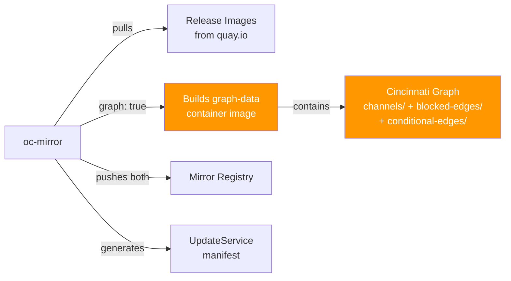

> 💡 **Quick Answer:** In an air-gapped OpenShift cluster, the cluster only "knows" about a target version (e.g., 4.20.12) after you mirror both the release payload AND the Cincinnati update graph. Use `oc mirror` with `graph: true` and `shortestPath: true` on a connected bastion — this pulls release images from Red Hat/Quay AND builds/pushes the graph-data image required by OSUS. Transfer the archive to the disconnected site, push to the local registry, apply the generated `cluster-resources/` manifests (mirror rules + UpdateService), and `oc adm upgrade --to=4.20.12` drives the upgrade.

## The Problem

Air-gapped OpenShift clusters cannot:

- Reach `quay.io` to pull release images
- Query `api.openshift.com` for the upgrade graph (Cincinnati)
- Discover which versions exist or which paths are safe
- See conditional or blocked upgrade advisories

Without both the release payload AND the graph data mirrored locally, `oc adm upgrade` shows "No updates available" even if images exist in the mirror registry.

## The Solution

### End-to-End Workflow

```mermaid
graph TD
    subgraph Connected Bastion
        ISC[ImageSetConfiguration<br/>stable-4.20, graph: true<br/>shortestPath: true] --> MIRROR[oc mirror -c config<br/>file:///data/oc-mirror-4.20 --v2]
    end
    
    subgraph Transfer
        MIRROR --> |sneakernet / diode| ARCHIVE[/data/oc-mirror-4.20<br/>on removable media]
    end
    
    subgraph Disconnected Site
        ARCHIVE --> PUSH[oc mirror --from file://<br/>docker://registry:5000 --v2]
        PUSH --> MANIFESTS[Apply cluster-resources/<br/>mirror rules + UpdateService]
        MANIFESTS --> CVO[Patch CVO<br/>spec.upstream → OSUS]
        CVO --> UPGRADE[oc adm upgrade<br/>--to=4.20.12]
    end
    
    style MIRROR fill:#EE0000,color:white
    style PUSH fill:#EE0000,color:white
    style UPGRADE fill:#4CAF50,color:white
```

### Step 1: Create ImageSetConfiguration

On the internet-connected bastion:

```yaml
# imageset-config.yaml
apiVersion: mirror.openshift.io/v2alpha1
kind: ImageSetConfiguration
mirror:
  platform:
    architectures:
    - amd64
    channels:
    - name: stable-4.20
      type: ocp
      minVersion: 4.20.8
      maxVersion: 4.20.12
      shortestPath: true      # Only mirror the shortest upgrade path
    graph: true                # Builds and pushes the graph-data image for OSUS
```

Key settings:

| Field | Purpose |
|-------|---------|
| `architectures: [amd64]` | Target architecture (also `arm64`, `multi`) |
| `minVersion: 4.20.8` | Start from current cluster version |
| `maxVersion: 4.20.12` | Target upgrade version |
| `shortestPath: true` | Only mirror versions on the shortest upgrade path (saves space) |
| `graph: true` | **Critical** — builds and pushes the Cincinnati graph-data image for OSUS |

Without `graph: true`, oc-mirror only mirrors release images — OSUS has nothing to serve and CVO sees no upgrade path.

### Step 2: Mirror to Archive (Connected Side)

```bash
# Mirror to a portable archive
oc mirror -c imageset-config.yaml \
  file:///data/oc-mirror-4.20 \
  --v2

# Output structure:
# /data/oc-mirror-4.20/
# ├── mirror_seq1_000000.tar           ← Release image layers
# ├── working-dir/
# │   └── cluster-resources/
# │       ├── itms-oc-mirror.yaml      ← ImageTagMirrorSet
# │       ├── idms-oc-mirror.yaml      ← ImageDigestMirrorSet
# │       ├── updateService.yaml       ← Generated OSUS UpdateService
# │       └── release-signatures/
# └── publish/

# Check archive size
du -sh /data/oc-mirror-4.20/
# ~8-15 GB with shortestPath: true (vs 25+ GB without)
```

`graph: true` tells oc-mirror to build the Cincinnati graph-data container image containing the upgrade graph for the mirrored version range and push it alongside the release images.

### Step 3: Transfer to Disconnected Site

```bash
# Copy archive to removable media
cp -r /data/oc-mirror-4.20 /media/usb-drive/

# Or use data diode / secure file transfer
# The archive contains only container image layers — no secrets
```

### Step 4: Push to Local Registry (Disconnected Side)

```bash
# Push from archive to the internal mirror registry
oc mirror \
  -c imageset-config.yaml \
  --from file:///data/oc-mirror-4.20 \
  docker://registry.example.com:5000 \
  --v2

# This pushes:
# - OCP release payload images → registry.example.com:5000/openshift/release-images
# - Graph-data image → registry.example.com:5000/openshift-update-service/graph-data
# - Generates cluster-resources/ with IDMS, ITMS, and UpdateService manifests
```

### Step 5: Apply Generated Manifests

```bash
# Apply ALL generated cluster-resources manifests
# These include mirror rules AND the OSUS UpdateService
oc apply -f /data/oc-mirror-4.20/working-dir/cluster-resources/

# This applies:
# - ImageDigestMirrorSet — rewrites release image pullspecs to mirror
# - ImageTagMirrorSet — tag-based mirror rules
# - UpdateService — OSUS configuration pointing to mirrored graph-data

# Verify
oc get imagedigestmirrorset
oc get imagetagmirrorset
oc get updateservice -n openshift-update-service
```

The generated `UpdateService` manifest already has `spec.releases` and `spec.graphDataImage` pointing to your mirror registry — oc-mirror builds this for you.

### Step 6: Configure Registry CA Trust + Pull Secret

```bash
# Add mirror registry CA to cluster trust
oc create configmap registry-ca \
  --from-file=registry.example.com..5000=/path/to/ca-bundle.crt \
  -n openshift-config

oc patch image.config.openshift.io/cluster \
  --type merge \
  --patch '{"spec":{"additionalTrustedCA":{"name":"registry-ca"}}}'

# OSUS also needs CA trust
oc create configmap update-service-trusted-ca \
  --from-file=updateservice-registry=/path/to/ca-bundle.crt \
  -n openshift-update-service
# Key MUST be "updateservice-registry" (or "registry.example.com..5000")

# Update pull secret with mirror registry credentials
oc get secret/pull-secret -n openshift-config \
  -o jsonpath='{.data.\.dockerconfigjson}' | base64 -d > pull-secret.json

MIRROR_AUTH=$(echo -n "user:password" | base64)
jq --arg auth "$MIRROR_AUTH" \
  '.auths["registry.example.com:5000"] = {"auth": $auth}' \
  pull-secret.json > pull-secret-updated.json

oc set data secret/pull-secret -n openshift-config \
  --from-file=.dockerconfigjson=pull-secret-updated.json

# Wait for MCP rolling reboot
oc get mcp -w
```

### Step 7: Patch CVO to Use OSUS

```bash
# Get the OSUS policy engine URI
OSUS_URL=$(oc get updateservice update-service -n openshift-update-service \
  -o jsonpath='{.status.policyEngineURI}')

# Patch CVO to read upgrade graph from local OSUS
oc patch clusterversion version \
  --type merge \
  --patch "{\"spec\":{\"upstream\":\"${OSUS_URL}/api/upgrades_info/v1/graph\"}}"

# Verify
oc get clusterversion version -o jsonpath='{.spec.upstream}'
```

### Step 8: Verify and Upgrade

```bash
# Check available upgrades — should list mirrored versions
oc adm upgrade
# Cluster version is 4.20.8
#
# Upgradeable=True
#
# Recommended updates:
#   VERSION    IMAGE
#   4.20.10    registry.example.com:5000/openshift/release-images@sha256:...
#   4.20.12    registry.example.com:5000/openshift/release-images@sha256:...

# Start the upgrade
oc adm upgrade --to=4.20.12

# Monitor CVO-driven upgrade
watch 'oc get clusterversion; echo; oc get co | grep -v "True.*False.*False"; echo; oc get mcp'
```

### What `graph: true` Actually Does



The graph-data image contains the Cincinnati upgrade graph database:
- **channels/** — which versions are in `stable-4.20`, `fast-4.20`, `eus-4.20`
- **blocked-edges/** — versions Red Hat has blocked (CVEs, regressions)
- **conditional-edges/** — "update with caution" advisories

Without this image, OSUS serves an empty graph → CVO sees no upgrades.

### `shortestPath` vs Full Mirror

| Mode | Versions Mirrored | Size | Use Case |
|------|------------------|------|----------|
| `shortestPath: true` | Only versions on shortest path (e.g., 4.20.8 → 4.20.12 directly, or 4.20.8 → 4.20.10 → 4.20.12) | 8-15 GB | Production upgrades with known target |
| `shortestPath: false` | ALL versions between min and max | 25-50+ GB | When you need flexibility to stop at intermediate versions |

### Verification Script

```bash
#!/bin/bash
# verify-airgap-upgrade-readiness.sh
set -euo pipefail

TARGET="${1:-4.20.12}"
REGISTRY="${2:-registry.example.com:5000}"

echo "=== Air-Gap Upgrade Readiness Check ==="

echo "[1/7] Mirror registry reachable..."
curl -sk "https://${REGISTRY}/v2/" > /dev/null 2>&1 && echo "✅ OK" || echo "❌ Unreachable"

echo "[2/7] Release image mirrored..."
oc image info "${REGISTRY}/openshift/release-images:${TARGET}-x86_64" > /dev/null 2>&1 \
  && echo "✅ ${TARGET} found" || echo "❌ ${TARGET} NOT found"

echo "[3/7] IDMS/ITMS applied..."
echo "   $(oc get imagedigestmirrorset -o name 2>/dev/null | wc -l) IDMS"
echo "   $(oc get imagetagmirrorset -o name 2>/dev/null | wc -l) ITMS"

echo "[4/7] MCPs ready..."
DEGRADED=$(oc get mcp -o json | jq '[.items[] | select(.status.conditions[] | select(.type=="Degraded" and .status=="True"))] | length')
[ "$DEGRADED" -eq 0 ] && echo "✅ All MCPs healthy" || echo "❌ ${DEGRADED} degraded MCPs"

echo "[5/7] OSUS running..."
OSUS_READY=$(oc get pods -n openshift-update-service -l app=update-service \
  --field-selector=status.phase=Running -o name 2>/dev/null | wc -l)
echo "   ${OSUS_READY} OSUS pod(s) running"

echo "[6/7] CVO upstream..."
echo "   $(oc get clusterversion version -o jsonpath='{.spec.upstream}')"

echo "[7/7] Available upgrades..."
oc adm upgrade 2>&1 | head -15

echo "=== Check complete ==="
```

## Common Issues

**"No updates available" after mirroring everything**

Three things must align: release images mirrored, graph-data image mirrored (`graph: true`), CVO `spec.upstream` pointing to OSUS. Missing any one = no updates. Also check OSUS pods are Running and serving the graph.

**Graph shows version but "Unable to apply update"**

Release image is in the graph but not mirrored to the registry. If you used `shortestPath: true`, intermediate versions may be skipped. Re-mirror with the specific version included.

**OSUS "failed to pull graph-data image"**

CA trust not configured for OSUS namespace. Create ConfigMap with key `updateservice-registry` in `openshift-update-service`.

**oc-mirror v2 vs v1 archive incompatible**

Use `--v2` on both connected and disconnected sides. Don't mix versions.

**MCPs stuck after IDMS/pull-secret apply**

Both IDMS and pull-secret changes trigger rolling node reboots. Wait for all MCPs to reach `UPDATED=True` before proceeding. This can take 30-60 minutes for large clusters.

## Best Practices

- **Always `graph: true`** — without it, oc-mirror only mirrors images, not the upgrade graph
- **`shortestPath: true` for targeted upgrades** — saves 50-70% mirror size
- **Set `minVersion` to current cluster version** — don't mirror old releases
- **Apply ALL `cluster-resources/` manifests** — oc-mirror generates IDMS, ITMS, and UpdateService together
- **Test OSUS graph with curl first** — `curl -s "${OSUS_URL}/api/upgrades_info/v1/graph?channel=stable-4.20" | jq '.nodes | length'`
- **Keep oc-mirror binary version consistent** — same binary on both sides
- **Run verification script before upgrading** — confirm all 7 prerequisites pass

## Key Takeaways

- `oc mirror` with `graph: true` pulls release images AND builds/pushes the graph-data image in one operation
- `shortestPath: true` mirrors only versions on the shortest upgrade path — significantly smaller archives
- The generated `cluster-resources/` directory contains everything: mirror rules (IDMS/ITMS) and the OSUS UpdateService manifest
- OSUS serves the Cincinnati graph locally so CVO can discover available upgrades
- CA trust and pull secrets are the #1 and #2 failure points in air-gapped setups
- The workflow: mirror → transfer → push → apply manifests → CA/secrets → patch CVO → upgrade
