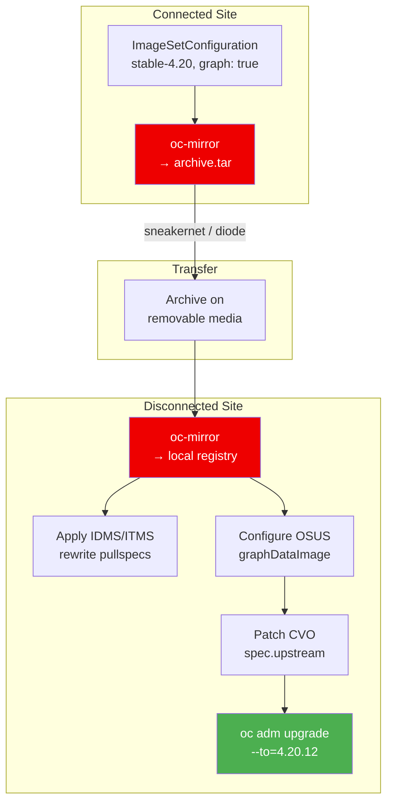

> 💡 **Quick Answer:** In an air-gapped OpenShift cluster, the cluster only "knows" about a target version (e.g., 4.20.12) after you mirror both the release payload AND the Cincinnati update graph from an internet-connected environment. Use `oc-mirror` with `graph: true`, transfer the archive to the disconnected site, push to the local registry, apply IDMS/ITMS resources, configure OSUS with the mirrored graph-data image, and patch CVO to use the local OSUS graph URL. Then `oc adm upgrade --to=4.20.12` drives the upgrade.

## The Problem

Air-gapped OpenShift clusters cannot:

- Reach `quay.io` to pull release images
- Query `api.openshift.com` for the upgrade graph (Cincinnati)
- Discover which versions exist or which paths are safe
- See conditional or blocked upgrade advisories

Without both the release payload AND the graph data mirrored locally, `oc adm upgrade` shows "No updates available" even if images exist in the mirror registry.

## The Solution

### End-to-End Workflow



### Step 1: Create ImageSetConfiguration

On the internet-connected bastion:

```yaml
# imageset-config.yaml
apiVersion: mirror.openshift.io/v2alpha1
kind: ImageSetConfiguration
mirror:
  platform:
    channels:
    - name: stable-4.20
      minVersion: 4.20.8
      maxVersion: 4.20.12
      type: ocp
    graph: true              # ← Critical: mirrors Cincinnati graph-data image
  additionalImages:
  - name: registry.redhat.io/openshift-update-service/graph-data:latest
```

Key settings:

| Field | Purpose |
|-------|---------|
| `minVersion: 4.20.8` | Only mirror from current version onward (saves space) |
| `maxVersion: 4.20.12` | Target upgrade version |
| `graph: true` | Mirror the Cincinnati graph-data container image |
| `additionalImages` | Explicitly include graph-data as backup |

### Step 2: Mirror to Archive (Connected Side)

```bash
# Mirror to a portable archive (not directly to registry)
oc mirror --config imageset-config.yaml \
  file:///mnt/mirror-archive \
  --v2

# Output structure:
# /mnt/mirror-archive/
# ├── mirror_seq1_000000.tar      ← Release images
# ├── oc-mirror-workspace/
# │   ├── results-*
# │   │   ├── imageDigestMirrorSet-*.yaml
# │   │   ├── imageTagMirrorSet-*.yaml
# │   │   ├── catalogSource-*.yaml
# │   │   └── release-signatures/
# │   └── mapping.txt
# └── publish/

# Check what was mirrored
ls -lh /mnt/mirror-archive/mirror_seq1_*.tar
# ~15-25 GB for a 4-version range
```

### Step 3: Transfer to Disconnected Site

```bash
# Copy archive to removable media
cp -r /mnt/mirror-archive /media/usb-drive/

# Or use data diode / secure file transfer
# The archive contains only container image layers — no secrets
```

### Step 4: Push to Local Registry (Disconnected Side)

```bash
# Push from archive to the internal mirror registry
oc mirror --from /media/usb-drive/mirror-archive \
  docker://registry.example.com:8443 \
  --v2

# This pushes:
# - OCP release images → registry.example.com:8443/openshift/release-images
# - Graph-data image   → registry.example.com:8443/openshift-update-service/graph-data
# - Generates IDMS/ITMS YAML in results directory
```

### Step 5: Apply ImageDigestMirrorSet / ImageTagMirrorSet

```bash
# Apply the generated mirror set resources
oc apply -f oc-mirror-workspace/results-*/imageDigestMirrorSet-*.yaml
oc apply -f oc-mirror-workspace/results-*/imageTagMirrorSet-*.yaml
```

Example generated IDMS:

```yaml
apiVersion: config.openshift.io/v1
kind: ImageDigestMirrorSet
metadata:
  name: release-mirror-0
spec:
  imageDigestMirrors:
  - mirrors:
    - registry.example.com:8443/openshift/release-images
    source: quay.io/openshift-release-dev/ocp-release
    mirrorSourcePolicy: AllowContactingSource  # or NeverContactSource for strict air-gap
  - mirrors:
    - registry.example.com:8443/openshift/release
    source: quay.io/openshift-release-dev/ocp-v4.0-art-dev
    mirrorSourcePolicy: NeverContactSource
```

```bash
# Verify mirror sets applied
oc get imagedigestmirrorset
oc get imagetagmirrorset

# Nodes will start rolling out MachineConfig for mirror configuration
# Wait for MCP to finish
oc get mcp -w
```

### Step 6: Configure Registry CA Trust

```bash
# Add mirror registry CA to cluster trust
oc create configmap registry-ca \
  --from-file=registry.example.com..8443=/path/to/ca-bundle.crt \
  -n openshift-config

# Patch image config
oc patch image.config.openshift.io/cluster \
  --type merge \
  --patch '{"spec":{"additionalTrustedCA":{"name":"registry-ca"}}}'

# Verify nodes can pull from mirror
oc debug node/master-0 -- chroot /host \
  podman pull registry.example.com:8443/openshift/release-images:4.20.12-x86_64
```

### Step 7: Configure Pull Secret

```bash
# Extract current pull secret
oc get secret/pull-secret -n openshift-config \
  -o jsonpath='{.data.\.dockerconfigjson}' | base64 -d > pull-secret.json

# Add mirror registry credentials
# Using oc-mirror credential helper or manual jq edit:
MIRROR_AUTH=$(echo -n "user:password" | base64)
jq --arg auth "$MIRROR_AUTH" \
  '.auths["registry.example.com:8443"] = {"auth": $auth}' \
  pull-secret.json > pull-secret-updated.json

# Apply updated pull secret
oc set data secret/pull-secret -n openshift-config \
  --from-file=.dockerconfigjson=pull-secret-updated.json

# This triggers a rolling reboot of all nodes — wait for MCPs
oc get mcp -w
```

### Step 8: Deploy/Update OSUS

```yaml
# UpdateService pointing to mirrored graph-data and release images
apiVersion: updateservice.operator.openshift.io/v1
kind: UpdateService
metadata:
  name: update-service
  namespace: openshift-update-service
spec:
  replicas: 2
  releases: registry.example.com:8443/openshift/release-images
  graphDataImage: registry.example.com:8443/openshift-update-service/graph-data:latest
```

```bash
oc apply -f updateservice.yaml

# Wait for OSUS pods to be ready
oc get pods -n openshift-update-service -w

# Get the policy engine URI
oc get updateservice update-service -n openshift-update-service \
  -o jsonpath='{.status.policyEngineURI}'
```

Create CA trust ConfigMap for OSUS:

```bash
# OSUS needs to trust the mirror registry CA separately
oc create configmap update-service-trusted-ca \
  --from-file=updateservice-registry=/path/to/ca-bundle.crt \
  -n openshift-update-service

# Key MUST be "updateservice-registry"
# If registry URL has port, use ".." separator:
#   --from-file=registry.example.com..8443=/path/to/ca-bundle.crt
```

### Step 9: Patch CVO to Use OSUS

```bash
# Get OSUS graph URL
OSUS_URL=$(oc get updateservice update-service -n openshift-update-service \
  -o jsonpath='{.status.policyEngineURI}')

# Patch CVO
oc patch clusterversion version \
  --type merge \
  --patch "{\"spec\":{\"upstream\":\"${OSUS_URL}/api/upgrades_info/v1/graph\"}}"

# Verify CVO is using local OSUS
oc get clusterversion version -o jsonpath='{.spec.upstream}'
```

### Step 10: Verify and Upgrade

```bash
# Check available upgrades
oc adm upgrade
# Cluster version is 4.20.8
#
# Upgradeable=True
#
# Recommended updates:
#   VERSION    IMAGE
#   4.20.9     registry.example.com:8443/openshift/release-images@sha256:...
#   4.20.10    registry.example.com:8443/openshift/release-images@sha256:...
#   4.20.11    registry.example.com:8443/openshift/release-images@sha256:...
#   4.20.12    registry.example.com:8443/openshift/release-images@sha256:...

# Start the upgrade
oc adm upgrade --to=4.20.12

# Monitor
oc get clusterversion -w
oc get co    # Check all cluster operators
oc get mcp   # Watch node rollout
oc get nodes
```

### Verification Script

```bash
#!/bin/bash
# verify-airgap-upgrade-readiness.sh
set -euo pipefail

TARGET="${1:-4.20.12}"
REGISTRY="${2:-registry.example.com:8443}"

echo "=== Air-Gap Upgrade Readiness Check ==="

echo "[1/7] Mirror registry reachable..."
curl -sk "https://${REGISTRY}/v2/" > /dev/null && echo "✅ Registry OK" || echo "❌ Registry unreachable"

echo "[2/7] Release image exists..."
oc image info "${REGISTRY}/openshift/release-images:${TARGET}-x86_64" > /dev/null 2>&1 \
  && echo "✅ Release ${TARGET} mirrored" || echo "❌ Release ${TARGET} NOT found"

echo "[3/7] IDMS/ITMS applied..."
IDMS=$(oc get imagedigestmirrorset -o name 2>/dev/null | wc -l)
echo "   ${IDMS} ImageDigestMirrorSet(s) applied"

echo "[4/7] MCPs ready..."
DEGRADED=$(oc get mcp -o json | jq '[.items[] | select(.status.conditions[] | select(.type=="Degraded" and .status=="True"))] | length')
echo "   Degraded MCPs: ${DEGRADED}"

echo "[5/7] OSUS running..."
OSUS_READY=$(oc get pods -n openshift-update-service -l app=update-service --field-selector=status.phase=Running -o name 2>/dev/null | wc -l)
echo "   OSUS pods running: ${OSUS_READY}"

echo "[6/7] CVO upstream..."
UPSTREAM=$(oc get clusterversion version -o jsonpath='{.spec.upstream}' 2>/dev/null)
echo "   CVO upstream: ${UPSTREAM}"

echo "[7/7] Available upgrades..."
oc adm upgrade 2>&1 | head -15

echo ""
echo "=== Readiness check complete ==="
```

## Common Issues

**"No updates available" after mirroring**

Three things must align: release images mirrored, graph-data image mirrored, CVO `spec.upstream` pointing to OSUS. Missing any one = no updates visible. Run the verification script above.

**Graph shows version but "Unable to apply update"**

Release image is in the graph but not mirrored. The graph-data image lists all versions; only mirrored ones are installable. Re-run oc-mirror with the correct `maxVersion`.

**MCPs stuck updating after IDMS apply**

IDMS changes trigger MachineConfig updates on all nodes (mirror config in `/etc/containers/registries.conf`). Wait for rolling reboot to complete before proceeding.

**OSUS "failed to pull graph-data image"**

CA trust not configured for OSUS namespace. Create the ConfigMap with key `updateservice-registry` in `openshift-update-service` namespace.

**oc-mirror v2 vs v1 archive format incompatible**

Don't mix oc-mirror versions between connected and disconnected sides. Use `--v2` on both sides or neither.

**Upgrade stuck at 60-80% — operators degraded**

Some operators need to pull images from Red Hat registries not in the mirror set. Check `oc get co` for degraded operators, then mirror their images. Common: marketplace, samples, insights.

## Best Practices

- **Always `graph: true`** in ImageSetConfiguration — without graph data, OSUS has nothing to serve
- **Set `minVersion` to current cluster version** — don't mirror hundreds of old releases
- **`NeverContactSource` for strict air-gap** — prevents accidental internet pull attempts
- **Mirror before maintenance window** — oc-mirror + transfer can take hours
- **Test OSUS graph with curl first** — verify versions appear before patching CVO
- **Keep oc-mirror versions consistent** — same binary on connected and disconnected sides
- **Update graph-data image with each mirror run** — stale graph = missing safe paths and blocks
- **Run verification script before `oc adm upgrade`** — confirm all 7 prerequisites

## Key Takeaways

- Air-gapped upgrades require BOTH release images AND graph-data mirrored
- `oc-mirror` with `graph: true` handles both in one archive
- IDMS/ITMS resources rewrite Red Hat pullspecs to your mirror registry
- OSUS `spec.graphDataImage` must point to the mirrored graph-data image (replicated mode)
- CVO `spec.upstream` must point to the OSUS `policyEngineURI` graph URL
- CA trust and pull secrets are the #1 and #2 failure points
- Always verify all 7 prerequisites before starting the upgrade
- The workflow is: mirror → transfer → push → IDMS → CA/secrets → OSUS → CVO → upgrade
