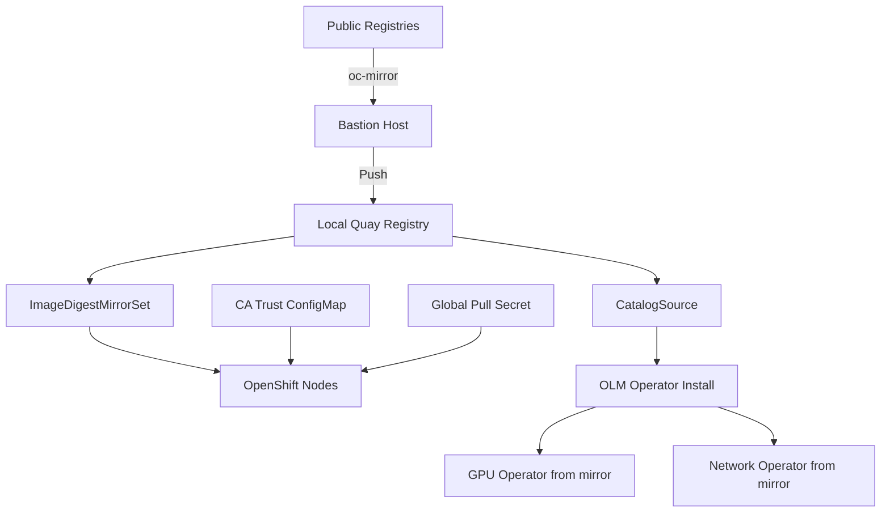

> 💡 **Quick Answer:** Mirror all required images (GPU Operator, Network Operator, base images) to local Quay using `oc-mirror`. Configure ImageDigestMirrorSet for automatic redirection, custom CatalogSources for OLM operators, and Quay CA trust for HTTPS.

## The Problem

Air-gapped GPU clusters can't pull images from public registries (nvcr.io, registry.k8s.io, quay.io). GPU Operator, Network Operator, driver containers, and CUDA images all need to be available locally. Without proper mirroring, operator installations fail and GPU workloads can't start.

## The Solution

### Mirror Images with oc-mirror

```bash
# ImageSetConfiguration for GPU workloads
cat > imageset-config.yaml << 'EOF'
apiVersion: mirror.openshift.io/v1alpha2
kind: ImageSetConfiguration
mirror:
  operators:
    - catalog: registry.redhat.io/redhat/redhat-operator-index:v4.16
      packages:
        - name: gpu-operator-certified
        - name: sriov-network-operator
    - catalog: registry.redhat.io/redhat/certified-operator-index:v4.16
      packages:
        - name: nvidia-network-operator
  additionalImages:
    - name: nvcr.io/nvidia/driver:560.35.03-rhel9.4
    - name: nvcr.io/nvidia/cuda:12.6.0-base-ubi9
    - name: nvcr.io/nvidia/k8s-device-plugin:v0.16.2
    - name: nvcr.io/nvidia/gpu-operator:v24.9.0
    - name: nvcr.io/nvidia/dcgm-exporter:3.3.8-3.6.0
    - name: nvcr.io/nvidia/k8s/container-toolkit:v1.16.2
EOF

# Run mirror to local Quay
oc mirror --config=imageset-config.yaml \
  docker://quay.internal.example.com/mirror \
  --dest-skip-tls
```

### ImageDigestMirrorSet

```yaml
apiVersion: config.openshift.io/v1
kind: ImageDigestMirrorSet
metadata:
  name: nvidia-mirrors
spec:
  imageDigestMirrors:
    - source: nvcr.io/nvidia
      mirrors:
        - quay.internal.example.com/mirror/nvidia
    - source: nvcr.io/nim
      mirrors:
        - quay.internal.example.com/mirror/nim
    - source: registry.k8s.io
      mirrors:
        - quay.internal.example.com/mirror/k8s
    - source: docker.io
      mirrors:
        - quay.internal.example.com/mirror/docker
```

### Local CatalogSources

```yaml
apiVersion: operators.coreos.com/v1alpha1
kind: CatalogSource
metadata:
  name: nvidia-gpu-catalog
  namespace: openshift-marketplace
spec:
  sourceType: grpc
  image: quay.internal.example.com/mirror/redhat/redhat-operator-index:v4.16
  displayName: "NVIDIA GPU Operator (Mirrored)"
  publisher: NVIDIA
  updateStrategy:
    registryPoll:
      interval: 30m
---
apiVersion: operators.coreos.com/v1alpha1
kind: CatalogSource
metadata:
  name: certified-operators-mirror
  namespace: openshift-marketplace
spec:
  sourceType: grpc
  image: quay.internal.example.com/mirror/redhat/certified-operator-index:v4.16
  displayName: "Certified Operators (Mirrored)"
  publisher: Red Hat
```

### Quay CA Trust

```yaml
apiVersion: v1
kind: ConfigMap
metadata:
  name: quay-ca
  namespace: openshift-config
data:
  ca-bundle.crt: |
    -----BEGIN CERTIFICATE-----
    ... Quay internal CA certificate ...
    -----END CERTIFICATE-----
---
apiVersion: config.openshift.io/v1
kind: Image
metadata:
  name: cluster
spec:
  additionalTrustedCA:
    name: quay-ca
```

### Global Pull Secret

```bash
# Add Quay credentials to global pull secret
oc set data secret/pull-secret -n openshift-config \
  --from-file=.dockerconfigjson=<(
    oc get secret pull-secret -n openshift-config \
      -o jsonpath='{.data.\.dockerconfigjson}' | base64 -d | \
    jq '.auths["quay.internal.example.com"] = {
      "auth": "'$(echo -n "robot+mirror:TOKEN" | base64)'",
      "email": "mirror@example.com"
    }'
  )
```



## Common Issues

- **Operator install fails: ImagePullBackOff** — IDMS not yet applied or MCO still rolling out; wait for all nodes to update
- **CatalogSource stuck** — mirrored index image may be incomplete; verify with `oc get catalogsource -n openshift-marketplace`
- **CA trust not propagated** — MCO must roll out to all nodes; check `oc get mcp` for progress
- **oc-mirror fails on large images** — GPU driver images are 2-3GB; ensure bastion has enough disk and bandwidth

## Best Practices

- Mirror all images before cluster installation — don't discover missing images in production
- Use `oc-mirror` for reproducible mirror operations — saves ImageSetConfiguration as manifest
- Test operator installation from mirror on a staging cluster first
- Keep mirror in sync with a scheduled `oc-mirror` cron job on bastion
- Document the mirror contents in Git alongside ImageDigestMirrorSet configs

## Key Takeaways

- Air-gapped GPU clusters need local mirrors for all NVIDIA container images
- `oc-mirror` handles bulk mirroring with ImageSetConfiguration
- ImageDigestMirrorSet redirects image pulls to local Quay transparently
- Custom CatalogSources point OLM to mirrored operator indexes
- CA trust and pull secrets must be configured cluster-wide before operator installation
