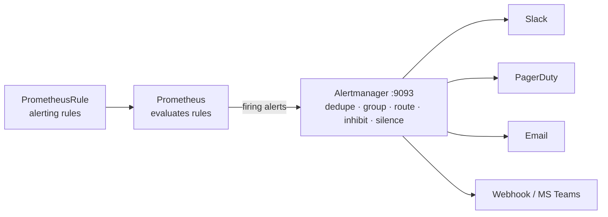

> 💡 **Quick Answer:** Install Alertmanager with the **kube-prometheus-stack** Helm chart (`helm install prometheus prometheus-community/kube-prometheus-stack -n monitoring --create-namespace`) — it deploys Alertmanager, wires Prometheus to it, and exposes it on port **9093**. Configure it through the chart's `alertmanager.config` values (or an `AlertmanagerConfig` CR per namespace): a **route** tree with `matchers` picks the **receiver** (Slack, PagerDuty, email, webhook), **inhibit_rules** suppress symptoms of a bigger outage, and **silences** mute alerts during maintenance.
>
> **Key command:** `amtool check-config alertmanager.yaml` before every change — a broken config is rejected and the old one keeps running (or, on first install, Alertmanager doesn't start).
>
> **Gotcha:** `match`, `match_re`, `source_match` and `target_match` are deprecated — use `matchers` / `source_matchers` / `target_matchers`. The v1 HTTP API (`/api/v1/alerts`) was removed; use `/api/v2`.

## How It Fits Together



Prometheus decides **what** is wrong (rules); Alertmanager decides **who** hears about it, **how often**, and **what to suppress**.

## Step 1: Install Alertmanager

```bash
helm repo add prometheus-community https://prometheus-community.github.io/helm-charts
helm repo update

# Full stack (Prometheus + Alertmanager + Grafana + exporters), config from values
helm install prometheus prometheus-community/kube-prometheus-stack \
  -n monitoring --create-namespace -f values.yaml

# Or standalone Alertmanager (you point your own Prometheus at it)
helm install alertmanager prometheus-community/alertmanager -n monitoring

kubectl -n monitoring get pods -l app.kubernetes.io/name=alertmanager
kubectl -n monitoring port-forward svc/prometheus-kube-prometheus-alertmanager 9093:9093
# UI: http://localhost:9093
```

The operator renders your config into the Secret `alertmanager-<name>-generated`; don't edit that directly. To manage the raw config yourself, create a Secret with an `alertmanager.yaml` key and set `alertmanager.alertmanagerSpec.configSecret: <secret-name>`. The standalone chart takes the same YAML under `config:`.

With a self-managed Prometheus, point it at Alertmanager in `prometheus.yml` (there is no `--alertmanager-url` flag in Prometheus 2.x/3.x):

```yaml
alerting:
  alertmanagers:
    - static_configs:
        - targets: ["alertmanager.monitoring.svc:9093"]
```

## Step 2: Alerting Rules

```yaml
apiVersion: monitoring.coreos.com/v1
kind: PrometheusRule
metadata:
  name: kubernetes-alerts
  namespace: monitoring
  labels:
    release: prometheus          # must match the Prometheus ruleSelector
spec:
  groups:
    - name: kubernetes
      rules:
        - alert: PodCrashLooping
          expr: increase(kube_pod_container_status_restarts_total[15m]) > 3
          for: 5m
          labels:
            severity: warning
          annotations:
            summary: "Pod {{ $labels.namespace }}/{{ $labels.pod }} is crash looping"
            description: "{{ $value | humanize }} restarts in 15 minutes."
            runbook_url: "https://runbooks.example.com/pod-crashloop"
        - alert: PodNotReady
          expr: kube_pod_status_ready{condition="true"} == 0
          for: 15m
          labels:
            severity: warning
          annotations:
            summary: "Pod {{ $labels.namespace }}/{{ $labels.pod }} not ready for 15m"
        - alert: ContainerMemoryNearLimit
          expr: |
            container_memory_working_set_bytes{container!=""}
              / on (namespace, pod, container) kube_pod_container_resource_limits{resource="memory"} > 0.9
          for: 10m
          labels:
            severity: warning
          annotations:
            summary: "{{ $labels.namespace }}/{{ $labels.pod }} {{ $labels.container }} >90% of memory limit"
        - alert: NodeNotReady
          expr: kube_node_status_condition{condition="Ready",status="true"} == 0
          for: 5m
          labels:
            severity: critical
          annotations:
            summary: "Node {{ $labels.node }} is not ready"
```

Use `for:` to avoid flapping and `keep_firing_for:` (Prometheus 2.42+) to keep an alert firing briefly after the condition clears. kube-prometheus-stack already ships ~100 rules (KubePodCrashLooping, KubeNodeNotReady, …) — add your own for application SLOs.

## Step 3: Alertmanager Config (Helm values)

```yaml
# values.yaml
alertmanager:
  alertmanagerSpec:
    externalUrl: https://alertmanager.example.com   # used in notification links
    replicas: 3                                     # HA cluster, alerts deduplicated
  config:
    global:
      resolve_timeout: 5m
      slack_api_url_file: /etc/alertmanager/secrets/alertmanager-secrets/slack-url
      smtp_smarthost: smtp.example.com:587
      smtp_from: alertmanager@example.com
      smtp_auth_username: alertmanager@example.com
      smtp_auth_password_file: /etc/alertmanager/secrets/alertmanager-secrets/smtp-password
    route:
      receiver: slack-default
      group_by: [alertname, namespace]
      group_wait: 30s          # wait to batch the first notification
      group_interval: 5m       # wait before notifying about new alerts in a group
      repeat_interval: 4h      # re-notify while still firing
      routes:
        - receiver: "null"
          matchers: ['alertname = "Watchdog"']
        - receiver: pagerduty-critical
          matchers: ['severity = "critical"']
          group_wait: 10s
          repeat_interval: 1h
          continue: true       # also evaluate the next routes
        - receiver: slack-critical
          matchers: ['severity = "critical"']
        - receiver: dba-slack
          matchers: ['alertname =~ "^(Postgres|MySQL|Redis).*"']
        - receiver: slack-warnings
          matchers: ['severity = "warning"']
          active_time_intervals: [business-hours]
    time_intervals:
      - name: business-hours
        time_intervals:
          - weekdays: ["monday:friday"]
            times:
              - start_time: "09:00"
                end_time: "17:00"
            location: Europe/Paris
    inhibit_rules:
      - source_matchers: ['severity = "critical"']
        target_matchers: ['severity = "warning"']
        equal: [alertname, namespace]
      - source_matchers: ['alertname = "KubeNodeNotReady"']
        target_matchers: ['alertname =~ "KubePod.*"']
        equal: [node]
    receivers:
      - name: "null"
      - name: slack-default
        slack_configs:
          - channel: "#alerts"
            send_resolved: true
      - name: slack-critical
        slack_configs:
          - channel: "#alerts-critical"
            send_resolved: true
            color: '{{ if eq .Status "firing" }}danger{{ else }}good{{ end }}'
            title: '[{{ .Status | toUpper }}] {{ .CommonLabels.alertname }}'
            text: >-
              {{ range .Alerts }}*{{ .Annotations.summary }}*
              {{ .Annotations.description }}
              {{ end }}
            actions:
              - type: button
                text: "Runbook :book:"
                url: '{{ (index .Alerts 0).Annotations.runbook_url }}'
      - name: slack-warnings
        slack_configs:
          - channel: "#alerts-warning"
            send_resolved: true
      - name: dba-slack
        slack_configs:
          - channel: "#dba-alerts"
      - name: pagerduty-critical
        pagerduty_configs:
          - routing_key_file: /etc/alertmanager/secrets/alertmanager-secrets/pagerduty-key   # Events API v2
            send_resolved: true
            severity: '{{ .CommonLabels.severity }}'
            description: '{{ .CommonAnnotations.summary }}'
      - name: email-oncall
        email_configs:
          - to: oncall@example.com
            send_resolved: true
            headers:
              Subject: '[{{ .Status | toUpper }}] {{ .CommonLabels.alertname }}'
```

```bash
# Secrets referenced by *_file keys, mounted at /etc/alertmanager/secrets/<name>/
kubectl -n monitoring create secret generic alertmanager-secrets \
  --from-literal=slack-url='https://hooks.slack.com/services/T000/B000/XXX' \
  --from-literal=smtp-password='app-password' \
  --from-literal=pagerduty-key='<integration-key>'
# values.yaml: alertmanager.alertmanagerSpec.secrets: [alertmanager-secrets]
```

Routing rules: the first matching child route wins unless `continue: true`; alerts that match no child go to the parent's receiver. `routing_key` is PagerDuty Events API v2; `service_key` is the legacy v1 integration.

Other receivers work the same way: `opsgenie_configs`, `webhook_configs`, `msteamsv2_configs` (Alertmanager 0.28+), `telegram_configs`, `sns_configs`.

## Step 4: Per-Team Config with AlertmanagerConfig

```yaml
apiVersion: monitoring.coreos.com/v1alpha1
kind: AlertmanagerConfig
metadata:
  name: team-payments
  namespace: payments
  labels:
    alertmanagerConfig: enabled     # must match alertmanagerSpec.alertmanagerConfigSelector
spec:
  route:
    receiver: payments-slack
    groupBy: [alertname]
    matchers:
      - name: severity
        matchType: "=~"
        value: "warning|critical"
  receivers:
    - name: payments-slack
      slackConfigs:
        - channel: "#payments-alerts"
          sendResolved: true
          apiURL:
            name: payments-slack-webhook   # Secret in the same namespace
            key: url
```

The operator adds a `namespace="payments"` matcher automatically, so a team's config only receives alerts from its own namespace. Enable selection with `alertmanager.alertmanagerSpec.alertmanagerConfigSelector` (and `alertmanagerConfigNamespaceSelector`).

## Step 5: Silences

```bash
kubectl -n monitoring port-forward svc/prometheus-kube-prometheus-alertmanager 9093:9093 &
export AM=http://localhost:9093

amtool --alertmanager.url=$AM silence add alertname=PodNotReady namespace=staging \
  --duration=2h --comment="Maintenance window" --author="$USER"
amtool --alertmanager.url=$AM silence query
amtool --alertmanager.url=$AM silence expire <silence-id>
amtool --alertmanager.url=$AM alert query severity=critical
```

For recurring maintenance, prefer `mute_time_intervals` on a route over ad-hoc silences.

## Step 6: Test the Pipeline

```bash
# Validate config and routing offline
amtool check-config alertmanager.yaml
amtool config routes test --config.file=alertmanager.yaml severity=critical alertname=Test
# -> pagerduty-critical

# Fire a synthetic alert (v2 API)
curl -s -XPOST $AM/api/v2/alerts -H 'Content-Type: application/json' -d '[{
  "labels":      {"alertname":"TestAlert","severity":"warning","namespace":"default"},
  "annotations": {"summary":"Test alert","description":"Testing Alertmanager routing"}
}]'
```

The always-firing `Watchdog` alert from kube-prometheus-stack proves the whole path works — route it to a dead-man's-switch service (Healthchecks, PagerDuty heartbeat) instead of `"null"` in production.

## Common Issues

**Config ignored after `helm upgrade`** — the new config failed validation; the operator logs `invalid configuration` and keeps the old one. `kubectl -n monitoring logs deploy/prometheus-kube-prometheus-operator | grep -i alertmanager`.

**No notifications at all** — Prometheus isn't sending (check *Status → Runtime & Build Information → Alertmanagers* in the Prometheus UI), or the alert matches a route to `"null"`.

**AlertmanagerConfig has no effect** — not selected by `alertmanagerConfigSelector`, or alerts lack the namespace label that the injected matcher expects.

**Duplicate notifications with replicas** — replicas can't gossip (port 9094 blocked by NetworkPolicy); the operator's `alertmanager-operated` headless Service must resolve.

**Links in Slack point to `localhost`** — set `externalUrl`.

**Unauthenticated UI** — Alertmanager has no user auth by default; put it behind an OAuth proxy/Ingress auth or configure basic auth via `--web.config.file`.

## Best Practices

- **Alert on symptoms**, page only on `critical`, send `warning` to chat
- **Group by** `alertname` + `namespace` (or `cluster`, `service`) to avoid storms
- **Inhibit** downstream alerts when a node, cluster or dependency is down
- **Every alert has a `runbook_url`** and a clear `summary`
- **Secrets via `*_file`** keys, never inline in values committed to Git
- **3 replicas** for HA and a dead-man's-switch on `Watchdog`
- **`amtool check-config` in CI** for every change

## Frequently Asked Questions

### What port does Alertmanager use?

9093 for the HTTP API and UI, 9094 (TCP/UDP) for cluster gossip between replicas.

### How do I configure Alertmanager with the Helm chart?

Put the full Alertmanager config under `alertmanager.config` in kube-prometheus-stack values (or `config:` in the standalone `prometheus-community/alertmanager` chart) and `helm upgrade`. For per-namespace team routing use `AlertmanagerConfig` CRs; to bring your own Secret set `alertmanagerSpec.configSecret`.

### What is the difference between group_wait, group_interval and repeat_interval?

`group_wait` delays the first notification for a new group so related alerts are batched; `group_interval` is the minimum time before sending an update when new alerts join an existing group; `repeat_interval` is how often an unchanged, still-firing group is re-sent.

### How do I send an email from Alertmanager?

Set `smtp_smarthost`, `smtp_from` and credentials in `global` (or per `email_configs` entry), then add a receiver with `email_configs: [{to: team@example.com}]`. Gmail/M365 need an app password or relay.

### Silence vs inhibition?

A silence is a manual, time-bound mute created by a human (UI or `amtool`). An inhibition rule is permanent config that automatically mutes target alerts while a matching source alert fires.

## Key Takeaways

- kube-prometheus-stack installs Alertmanager and wires Prometheus to it; configure via Helm values or AlertmanagerConfig
- Route trees with `matchers` send alerts to the right receiver; `continue` fans out
- Inhibition and grouping prevent alert storms; silences cover maintenance
- Validate with `amtool check-config` / `config routes test` and test with the v2 API
