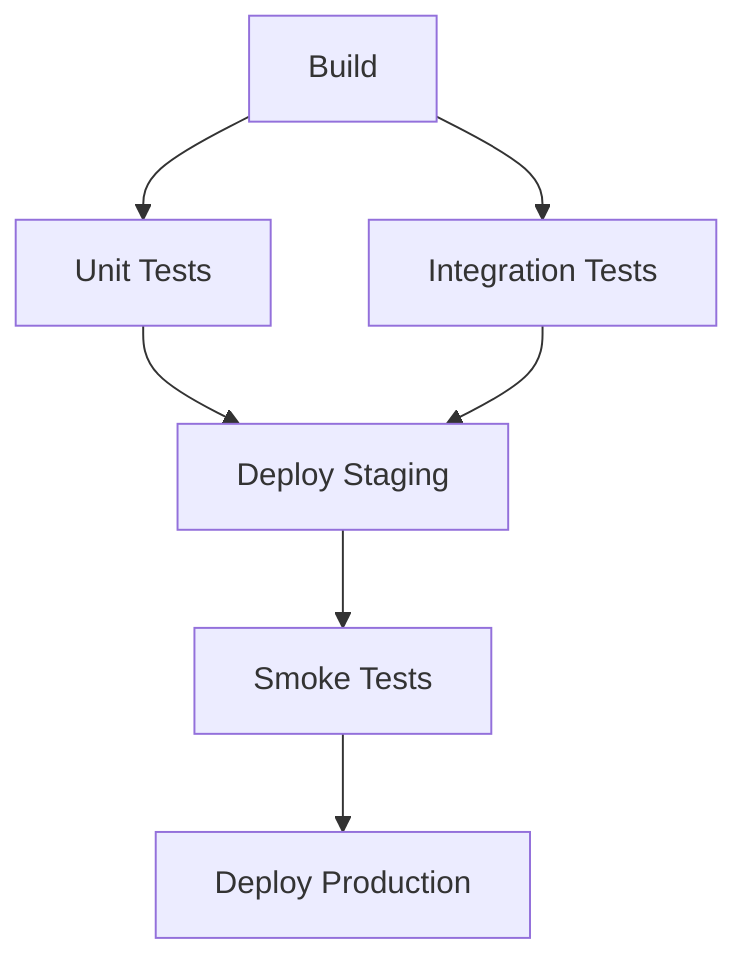

> 💡 **Quick Answer:** deployments

## The Problem

Engineers need production-ready guides for these essential Kubernetes ecosystem tools. Incomplete documentation leads to misconfiguration and security gaps.

## The Solution

### Install Argo Workflows

```bash
kubectl create namespace argo
kubectl apply -n argo -f https://github.com/argoproj/argo-workflows/releases/latest/download/install.yaml

# Access UI
kubectl port-forward -n argo svc/argo-server 2746:2746
# Open https://localhost:2746
```

### Simple Workflow

```yaml
apiVersion: argoproj.io/v1alpha1
kind: Workflow
metadata:
  generateName: hello-world-
spec:
  entrypoint: main
  templates:
    - name: main
      steps:
        - - name: build
            template: build-step
        - - name: test        # Sequential after build
            template: test-step
        - - name: deploy-staging    # Parallel
            template: deploy
            arguments:
              parameters: [{name: env, value: staging}]
          - name: deploy-prod
            template: deploy
            arguments:
              parameters: [{name: env, value: production}]

    - name: build-step
      container:
        image: golang:1.22
        command: [go, build, -o, /output/app, .]
      outputs:
        artifacts:
          - name: binary
            path: /output/app

    - name: test-step
      container:
        image: golang:1.22
        command: [go, test, ./...]

    - name: deploy
      inputs:
        parameters:
          - name: env
      container:
        image: kubectl:latest
        command: [kubectl, apply, -f, "deploy-{{inputs.parameters.env}}.yaml"]
```

### DAG Workflow

```yaml
spec:
  entrypoint: pipeline
  templates:
    - name: pipeline
      dag:
        tasks:
          - name: build
            template: build-step
          - name: unit-tests
            template: test
            dependencies: [build]
          - name: integration-tests
            template: test
            dependencies: [build]
          - name: deploy
            template: deploy
            dependencies: [unit-tests, integration-tests]
```

### Cron Workflow

```yaml
apiVersion: argoproj.io/v1alpha1
kind: CronWorkflow
metadata:
  name: nightly-pipeline
spec:
  schedule: "0 2 * * *"
  timezone: "Europe/Rome"
  concurrencyPolicy: Replace
  workflowSpec:
    entrypoint: main
    templates:
      - name: main
        container:
          image: my-pipeline:v1
          command: ["/run.sh"]
```



## Frequently Asked Questions

### Argo Workflows vs Tekton?

**Argo Workflows** has a better UI, DAG support, and artifact management. **Tekton** is more Kubernetes-native with reusable Tasks. Argo is better for complex data pipelines; Tekton for simpler CI/CD.

### Argo Workflows vs Argo CD?

Different tools! **Workflows** runs jobs/pipelines (CI). **Argo CD** does GitOps deployment (CD). They work well together.

## Best Practices

- Start with default configurations and customize as needed
- Test in a non-production cluster first
- Monitor resource usage after deployment
- Keep components updated for security patches

## Key Takeaways

- This tool fills a critical gap in the Kubernetes ecosystem
- Follow the principle of least privilege for all configurations
- Automate where possible to reduce manual errors
- Monitor and alert on operational metrics
