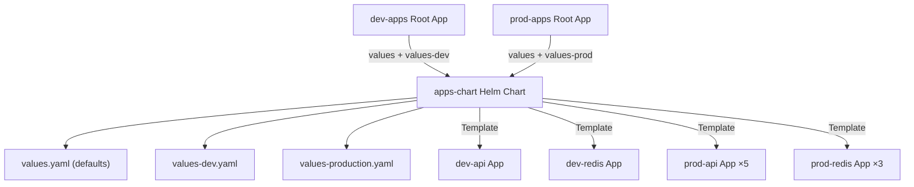

> 💡 **Quick Answer:** Create a Helm chart where the templates are ArgoCD Application manifests. Pass environment-specific `values.yaml` to generate per-environment Applications with different replicas, resources, and image tags.

## The Problem

With plain App of Apps, you duplicate Application YAML for each environment — same structure, slightly different values (replicas, image tags, resources). This leads to:

- **Copy-paste drift** — forgetting to update one environment when adding a new app
- **Boilerplate** — 90% of each Application file is identical
- **Hard to maintain** — changes require editing multiple files

## The Solution

### Step 1: Create the Apps Helm Chart

```
gitops-repo/
├── apps-chart/
│   ├── Chart.yaml
│   ├── templates/
│   │   ├── api.yaml
│   │   ├── redis.yaml
│   │   ├── monitoring.yaml
│   │   └── ingress.yaml
│   ├── values.yaml            # Base defaults
│   ├── values-dev.yaml        # Dev overrides
│   ├── values-staging.yaml    # Staging overrides
│   └── values-production.yaml # Production overrides
```

```yaml
# apps-chart/Chart.yaml
apiVersion: v2
name: cluster-apps
description: ArgoCD App of Apps Helm chart
version: 1.0.0
```

### Step 2: Base Values

```yaml
# apps-chart/values.yaml
global:
  project: default
  targetRevision: main
  repoURL: https://github.com/myorg/gitops-repo.git
  server: https://kubernetes.default.svc

api:
  enabled: true
  replicas: 1
  image:
    tag: latest
  resources:
    requests:
      memory: 256Mi
      cpu: 100m
    limits:
      memory: 512Mi
      cpu: 500m

redis:
  enabled: true
  chart:
    version: "20.0.0"
  architecture: standalone
  replicas: 1

monitoring:
  enabled: true
  retention: 7d
  replicas: 1

ingress:
  enabled: true
  replicas: 1
```

### Step 3: Environment Overrides

```yaml
# apps-chart/values-production.yaml
global:
  targetRevision: v1.2.0  # Pin to release tag
  server: https://k8s-prod.example.com

api:
  replicas: 5
  image:
    tag: v1.2.0
  resources:
    requests:
      memory: 1Gi
      cpu: 500m
    limits:
      memory: 2Gi
      cpu: "2"

redis:
  architecture: replication
  replicas: 3

monitoring:
  retention: 30d
  replicas: 2

ingress:
  replicas: 3
```

```yaml
# apps-chart/values-dev.yaml
global:
  targetRevision: develop

monitoring:
  enabled: false  # Skip monitoring in dev

redis:
  architecture: standalone
```

### Step 4: Templated Application Manifests

```yaml
# apps-chart/templates/api.yaml
{{- if .Values.api.enabled }}
apiVersion: argoproj.io/v1alpha1
kind: Application
metadata:
  name: {{ .Release.Name }}-api
  namespace: argocd
  annotations:
    argocd.argoproj.io/sync-wave: "1"
  finalizers:
    - resources-finalizer.argocd.argoproj.io
spec:
  project: {{ .Values.global.project }}
  source:
    repoURL: {{ .Values.global.repoURL }}
    targetRevision: {{ .Values.global.targetRevision }}
    path: workloads/api
    helm:
      values: |
        replicaCount: {{ .Values.api.replicas }}
        image:
          tag: {{ .Values.api.image.tag }}
        resources:
          requests:
            memory: {{ .Values.api.resources.requests.memory }}
            cpu: {{ .Values.api.resources.requests.cpu }}
          limits:
            memory: {{ .Values.api.resources.limits.memory }}
            cpu: {{ .Values.api.resources.limits.cpu }}
  destination:
    server: {{ .Values.global.server }}
    namespace: myapp
  syncPolicy:
    automated:
      prune: true
      selfHeal: true
    syncOptions:
      - CreateNamespace=true
{{- end }}
```

```yaml
# apps-chart/templates/redis.yaml
{{- if .Values.redis.enabled }}
apiVersion: argoproj.io/v1alpha1
kind: Application
metadata:
  name: {{ .Release.Name }}-redis
  namespace: argocd
  annotations:
    argocd.argoproj.io/sync-wave: "0"
  finalizers:
    - resources-finalizer.argocd.argoproj.io
spec:
  project: {{ .Values.global.project }}
  source:
    repoURL: https://charts.bitnami.com/bitnami
    chart: redis
    targetRevision: {{ .Values.redis.chart.version }}
    helm:
      values: |
        architecture: {{ .Values.redis.architecture }}
        replica:
          replicaCount: {{ .Values.redis.replicas }}
  destination:
    server: {{ .Values.global.server }}
    namespace: redis
  syncPolicy:
    automated:
      prune: true
      selfHeal: true
    syncOptions:
      - CreateNamespace=true
{{- end }}
```

### Step 5: Create Root Applications Per Environment

```yaml
# root-dev.yaml
apiVersion: argoproj.io/v1alpha1
kind: Application
metadata:
  name: dev-apps
  namespace: argocd
spec:
  project: default
  source:
    repoURL: https://github.com/myorg/gitops-repo.git
    targetRevision: main
    path: apps-chart
    helm:
      releaseName: dev
      valueFiles:
        - values.yaml
        - values-dev.yaml
  destination:
    server: https://kubernetes.default.svc
    namespace: argocd
  syncPolicy:
    automated:
      prune: true
      selfHeal: true
```

```yaml
# root-production.yaml
apiVersion: argoproj.io/v1alpha1
kind: Application
metadata:
  name: production-apps
  namespace: argocd
spec:
  project: default
  source:
    repoURL: https://github.com/myorg/gitops-repo.git
    targetRevision: main
    path: apps-chart
    helm:
      releaseName: production
      valueFiles:
        - values.yaml
        - values-production.yaml
  destination:
    server: https://kubernetes.default.svc
    namespace: argocd
  syncPolicy:
    automated:
      prune: true
      selfHeal: true
```

### Architecture



## Common Issues

### Template Rendering Errors

Test templates locally before pushing:

```bash
helm template dev apps-chart/ -f apps-chart/values-dev.yaml
helm template prod apps-chart/ -f apps-chart/values-production.yaml
```

### Nested Helm Values

Passing Helm values through templated Applications requires careful escaping:

```yaml
# Use block scalar for nested values
helm:
  values: |
    key: {{ .Values.someValue | quote }}
```

## Best Practices

- **DRY with defaults** — put common config in `values.yaml`, only override what differs
- **Use `enabled` flags** — toggle apps per environment (no monitoring in dev)
- **Test locally with `helm template`** — catch errors before pushing to Git
- **Pin chart versions in values** — not in templates
- **Use `releaseName`** — ensures unique Application names across environments
- **Keep templates simple** — complex logic in templates is hard to debug

## Key Takeaways

- Helm-templated App of Apps eliminates duplication across environments
- Base values + per-environment overrides = DRY multi-environment GitOps
- Each root Application uses different `valueFiles` to customize the same templates
- Test with `helm template` locally before pushing to Git
