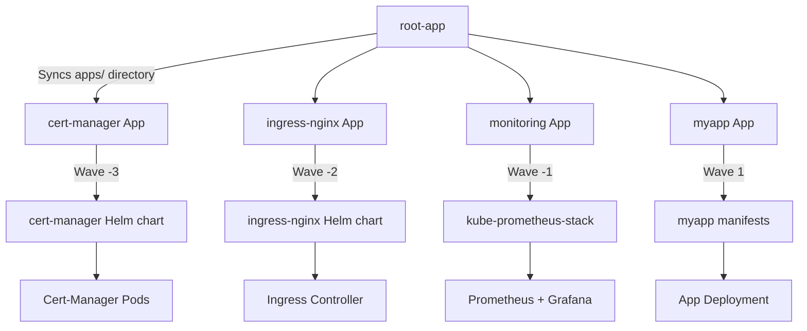

> 💡 **Quick Answer:** Create a parent ArgoCD Application that points to a Git directory containing child Application manifests. ArgoCD recursively syncs the parent, which creates children, which deploy actual workloads — all declaratively managed via Git.

## The Problem

As your cluster grows, you end up with dozens of ArgoCD Applications: monitoring, logging, ingress controllers, cert-manager, application workloads, and more. Managing them individually is painful:

- **No single source of truth** — apps are created manually via CLI or UI
- **No dependency ordering** — infrastructure apps must deploy before workloads
- **No cluster bootstrapping** — new clusters require manual app creation
- **No drift detection** — manually created apps aren't tracked in Git

## The Solution

### Repository Structure

```
gitops-repo/
├── apps/                    # Parent App of Apps points here
│   ├── cert-manager.yaml    # Child Application: cert-manager
│   ├── ingress-nginx.yaml   # Child Application: ingress controller
│   ├── monitoring.yaml      # Child Application: Prometheus stack
│   ├── logging.yaml         # Child Application: Loki stack
│   └── myapp.yaml           # Child Application: your workload
├── infrastructure/
│   ├── cert-manager/        # Actual cert-manager manifests
│   ├── ingress-nginx/       # Actual ingress manifests
│   └── monitoring/          # Actual monitoring manifests
└── workloads/
    └── myapp/               # Actual app manifests
```

### Step 1: Create Child Application Manifests

```yaml
# apps/cert-manager.yaml
apiVersion: argoproj.io/v1alpha1
kind: Application
metadata:
  name: cert-manager
  namespace: argocd
  annotations:
    argocd.argoproj.io/sync-wave: "-3"
  finalizers:
    - resources-finalizer.argocd.argoproj.io
spec:
  project: default
  source:
    repoURL: https://charts.jetstack.io
    chart: cert-manager
    targetRevision: v1.16.0
    helm:
      values: |
        installCRDs: true
        prometheus:
          enabled: true
  destination:
    server: https://kubernetes.default.svc
    namespace: cert-manager
  syncPolicy:
    automated:
      prune: true
      selfHeal: true
    syncOptions:
      - CreateNamespace=true
```

```yaml
# apps/ingress-nginx.yaml
apiVersion: argoproj.io/v1alpha1
kind: Application
metadata:
  name: ingress-nginx
  namespace: argocd
  annotations:
    argocd.argoproj.io/sync-wave: "-2"
  finalizers:
    - resources-finalizer.argocd.argoproj.io
spec:
  project: default
  source:
    repoURL: https://kubernetes.github.io/ingress-nginx
    chart: ingress-nginx
    targetRevision: 4.11.0
    helm:
      values: |
        controller:
          replicaCount: 2
          metrics:
            enabled: true
  destination:
    server: https://kubernetes.default.svc
    namespace: ingress-nginx
  syncPolicy:
    automated:
      prune: true
      selfHeal: true
    syncOptions:
      - CreateNamespace=true
```

```yaml
# apps/monitoring.yaml
apiVersion: argoproj.io/v1alpha1
kind: Application
metadata:
  name: monitoring
  namespace: argocd
  annotations:
    argocd.argoproj.io/sync-wave: "-1"
  finalizers:
    - resources-finalizer.argocd.argoproj.io
spec:
  project: default
  source:
    repoURL: https://prometheus-community.github.io/helm-charts
    chart: kube-prometheus-stack
    targetRevision: 65.0.0
    helm:
      values: |
        grafana:
          enabled: true
        prometheus:
          prometheusSpec:
            retention: 30d
  destination:
    server: https://kubernetes.default.svc
    namespace: monitoring
  syncPolicy:
    automated:
      prune: true
      selfHeal: true
    syncOptions:
      - CreateNamespace=true
      - ServerSideApply=true
```

```yaml
# apps/myapp.yaml
apiVersion: argoproj.io/v1alpha1
kind: Application
metadata:
  name: myapp
  namespace: argocd
  annotations:
    argocd.argoproj.io/sync-wave: "1"
  finalizers:
    - resources-finalizer.argocd.argoproj.io
spec:
  project: default
  source:
    repoURL: https://github.com/myorg/gitops-repo.git
    targetRevision: main
    path: workloads/myapp
  destination:
    server: https://kubernetes.default.svc
    namespace: myapp
  syncPolicy:
    automated:
      prune: true
      selfHeal: true
    syncOptions:
      - CreateNamespace=true
```

### Step 2: Create the Parent Application

```yaml
# root-app.yaml — The App of Apps
apiVersion: argoproj.io/v1alpha1
kind: Application
metadata:
  name: root-app
  namespace: argocd
  finalizers:
    - resources-finalizer.argocd.argoproj.io
spec:
  project: default
  source:
    repoURL: https://github.com/myorg/gitops-repo.git
    targetRevision: main
    path: apps
  destination:
    server: https://kubernetes.default.svc
    namespace: argocd
  syncPolicy:
    automated:
      prune: true
      selfHeal: true
```

```bash
# Bootstrap the entire cluster with one command
kubectl apply -f root-app.yaml -n argocd
```

### Step 3: How It Works



### Step 4: Adding a New Application

To add a new app to the cluster, simply add a new YAML file in `apps/`:

```yaml
# apps/redis.yaml
apiVersion: argoproj.io/v1alpha1
kind: Application
metadata:
  name: redis
  namespace: argocd
  annotations:
    argocd.argoproj.io/sync-wave: "0"
  finalizers:
    - resources-finalizer.argocd.argoproj.io
spec:
  project: default
  source:
    repoURL: https://charts.bitnami.com/bitnami
    chart: redis
    targetRevision: 20.0.0
    helm:
      values: |
        architecture: standalone
        auth:
          enabled: true
  destination:
    server: https://kubernetes.default.svc
    namespace: redis
  syncPolicy:
    automated:
      prune: true
      selfHeal: true
    syncOptions:
      - CreateNamespace=true
```

```bash
git add apps/redis.yaml
git commit -m "Add Redis to cluster"
git push
# ArgoCD auto-syncs and deploys Redis!
```

## Common Issues

### Child Apps Not Syncing

The parent app must have `prune: true` and `selfHeal: true` for automatic child management:

```yaml
syncPolicy:
  automated:
    prune: true    # Removes deleted child apps
    selfHeal: true # Re-creates modified child apps
```

### Cascading Delete

With `resources-finalizer.argocd.argoproj.io`, deleting the root app deletes all children and their resources. Remove the finalizer if you want to keep child resources when deleting the parent.

### Sync Wave Ordering for Child Apps

Sync waves on child Application manifests control the order in which ArgoCD creates them. The child apps' own sync waves then control internal resource ordering.

## Best Practices

- **Use sync waves on child apps** — infrastructure at negative waves, workloads at positive
- **One repo for app definitions** — keep the `apps/` directory in a dedicated GitOps repo
- **Add finalizers** — ensures cascading deletes work correctly
- **Use ArgoCD Projects** for RBAC — separate infrastructure apps from team workloads
- **Enable automated sync** — the whole point is hands-off deployment
- **Version pin Helm charts** — use `targetRevision` to pin chart versions

## Key Takeaways

- App of Apps lets you bootstrap an entire cluster with a single `kubectl apply`
- The parent Application syncs a directory of child Application manifests
- Combine with sync waves for dependency ordering across the entire stack
- Adding or removing apps is just a Git commit — true GitOps
