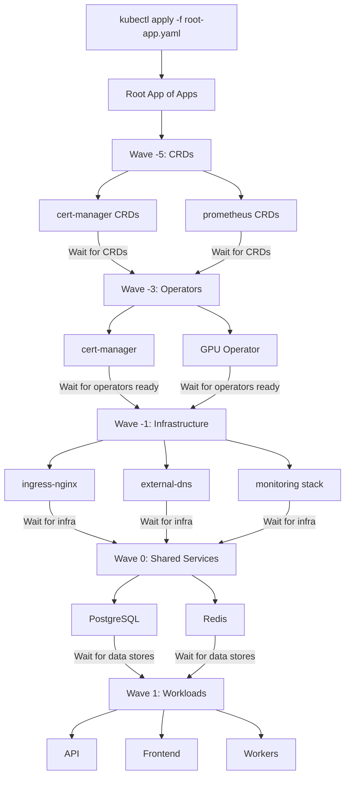

> 💡 **Quick Answer:** Assign sync wave annotations to child Application manifests in the App of Apps directory. Wave `-5` for CRDs, wave `-3` for operators, wave `-1` for infrastructure services, and wave `1+` for application workloads.

## The Problem

The App of Apps pattern creates all child applications at once by default. But in a real cluster bootstrap:

- **CRDs must exist** before any custom resources can be created
- **Operators must be running** before their operands
- **Infrastructure** (cert-manager, ingress) must be ready before apps that depend on them
- **Databases** must be healthy before application workloads connect

You need ordered deployment across the entire App of Apps tree.

## The Solution

### Repository Structure

```
gitops-repo/
├── root-app.yaml           # The root App of Apps
├── apps/
│   ├── wave-n5/            # Wave -5: CRDs
│   │   ├── cert-manager-crds.yaml
│   │   └── prometheus-crds.yaml
│   ├── wave-n3/            # Wave -3: Operators
│   │   ├── cert-manager.yaml
│   │   └── gpu-operator.yaml
│   ├── wave-n1/            # Wave -1: Infrastructure
│   │   ├── ingress-nginx.yaml
│   │   ├── external-dns.yaml
│   │   └── monitoring.yaml
│   ├── wave-0/             # Wave 0: Shared services
│   │   ├── postgres.yaml
│   │   └── redis.yaml
│   └── wave-1/             # Wave 1+: Workloads
│       ├── api.yaml
│       ├── frontend.yaml
│       └── workers.yaml
```

### Step 1: Root Application

```yaml
apiVersion: argoproj.io/v1alpha1
kind: Application
metadata:
  name: cluster-bootstrap
  namespace: argocd
  finalizers:
    - resources-finalizer.argocd.argoproj.io
spec:
  project: default
  source:
    repoURL: https://github.com/myorg/gitops-repo.git
    targetRevision: main
    path: apps
    directory:
      recurse: true  # Scan all subdirectories
  destination:
    server: https://kubernetes.default.svc
    namespace: argocd
  syncPolicy:
    automated:
      prune: true
      selfHeal: true
```

### Step 2: Wave -5 — CRDs First

```yaml
# apps/wave-n5/cert-manager-crds.yaml
apiVersion: argoproj.io/v1alpha1
kind: Application
metadata:
  name: cert-manager-crds
  namespace: argocd
  annotations:
    argocd.argoproj.io/sync-wave: "-5"
  finalizers:
    - resources-finalizer.argocd.argoproj.io
spec:
  project: default
  source:
    repoURL: https://github.com/cert-manager/cert-manager.git
    targetRevision: v1.16.0
    path: deploy/crds
  destination:
    server: https://kubernetes.default.svc
  syncPolicy:
    automated:
      prune: false  # Never prune CRDs automatically
    syncOptions:
      - Replace=true  # CRDs can be large, use Replace
      - ServerSideApply=true
```

### Step 3: Wave -3 — Operators

```yaml
# apps/wave-n3/cert-manager.yaml
apiVersion: argoproj.io/v1alpha1
kind: Application
metadata:
  name: cert-manager
  namespace: argocd
  annotations:
    argocd.argoproj.io/sync-wave: "-3"
  finalizers:
    - resources-finalizer.argocd.argoproj.io
spec:
  project: default
  source:
    repoURL: https://charts.jetstack.io
    chart: cert-manager
    targetRevision: v1.16.0
    helm:
      values: |
        installCRDs: false  # Already installed in wave -5
        prometheus:
          enabled: true
  destination:
    server: https://kubernetes.default.svc
    namespace: cert-manager
  syncPolicy:
    automated:
      prune: true
      selfHeal: true
    syncOptions:
      - CreateNamespace=true
```

```yaml
# apps/wave-n3/gpu-operator.yaml
apiVersion: argoproj.io/v1alpha1
kind: Application
metadata:
  name: gpu-operator
  namespace: argocd
  annotations:
    argocd.argoproj.io/sync-wave: "-3"
  finalizers:
    - resources-finalizer.argocd.argoproj.io
spec:
  project: default
  source:
    repoURL: https://helm.ngc.nvidia.com/nvidia
    chart: gpu-operator
    targetRevision: v24.9.0
    helm:
      values: |
        driver:
          rdma:
            enabled: true
        mofed:
          enabled: true
  destination:
    server: https://kubernetes.default.svc
    namespace: gpu-operator
  syncPolicy:
    automated:
      prune: true
      selfHeal: true
    syncOptions:
      - CreateNamespace=true
```

### Step 4: Wave -1 — Infrastructure Services

```yaml
# apps/wave-n1/ingress-nginx.yaml
apiVersion: argoproj.io/v1alpha1
kind: Application
metadata:
  name: ingress-nginx
  namespace: argocd
  annotations:
    argocd.argoproj.io/sync-wave: "-1"
  finalizers:
    - resources-finalizer.argocd.argoproj.io
spec:
  project: default
  source:
    repoURL: https://kubernetes.github.io/ingress-nginx
    chart: ingress-nginx
    targetRevision: 4.11.0
    helm:
      values: |
        controller:
          replicaCount: 2
          metrics:
            enabled: true
  destination:
    server: https://kubernetes.default.svc
    namespace: ingress-nginx
  syncPolicy:
    automated:
      prune: true
      selfHeal: true
    syncOptions:
      - CreateNamespace=true
```

### Step 5: Wave 1 — Application Workloads

```yaml
# apps/wave-1/api.yaml
apiVersion: argoproj.io/v1alpha1
kind: Application
metadata:
  name: myapp-api
  namespace: argocd
  annotations:
    argocd.argoproj.io/sync-wave: "1"
  finalizers:
    - resources-finalizer.argocd.argoproj.io
spec:
  project: default
  source:
    repoURL: https://github.com/myorg/gitops-repo.git
    targetRevision: main
    path: workloads/api
  destination:
    server: https://kubernetes.default.svc
    namespace: myapp
  syncPolicy:
    automated:
      prune: true
      selfHeal: true
    syncOptions:
      - CreateNamespace=true
```

### Bootstrap Flow



## Common Issues

### CRD Race Condition

If the operator and CRDs are in the same wave, the operator may try to create CRs before CRDs exist. Always separate CRDs into an earlier wave.

### Recursive Directory Scanning

With `directory.recurse: true`, ArgoCD scans all subdirectories. Ensure only Application YAML files exist in `apps/`.

### Health Check Timeout

Large operators (GPU Operator, monitoring) may take time to become healthy:

```yaml
# Increase sync timeout
syncPolicy:
  syncOptions:
    - Timeout=600  # 10 minutes
```

## Best Practices

- **CRDs always first** — wave `-5` or lower, never in the same wave as operators
- **Don't prune CRDs** — set `prune: false` to prevent accidental CRD deletion
- **Use `ServerSideApply`** for CRDs — avoids annotation size limits
- **Group by dependency tier** — not by team or functional area
- **Use subdirectories** per wave — clearer than mixing waves in one directory
- **One root app per cluster** — the root app is the single bootstrap entry point

## Key Takeaways

- Sync waves on child Applications control the cluster bootstrap order
- Separate CRDs, operators, infrastructure, and workloads into distinct waves
- Use `directory.recurse: true` to scan wave subdirectories automatically
- One `kubectl apply` bootstraps the entire cluster stack in dependency order
