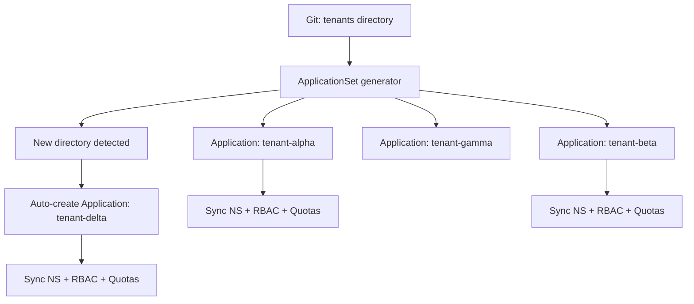

> 💡 **Quick Answer:** Use an ApplicationSet with a `git` generator targeting `cluster-config/overlays/prod/tenants/*/` — ArgoCD auto-discovers tenant directories and creates an Application per tenant. Adding a tenant = adding a directory to Git.

## The Problem

With 10+ GPU tenants, manually creating ArgoCD Applications is tedious and error-prone. When a new tenant overlay is added to Git, someone must also create the corresponding ArgoCD Application. This manual step breaks the GitOps promise.

## The Solution

### ApplicationSet with Git Generator

```yaml
apiVersion: argoproj.io/v1alpha1
kind: ApplicationSet
metadata:
  name: gpu-tenants
  namespace: openshift-gitops
spec:
  generators:
    - git:
        repoURL: https://git.internal.example.com/platform/gpu-gitops.git
        revision: main
        directories:
          - path: cluster-config/overlays/prod/tenants/*
  template:
    metadata:
      name: 'tenant-{{path.basename}}'
      namespace: openshift-gitops
      labels:
        app.kubernetes.io/part-of: gpu-platform
        tenant: '{{path.basename}}'
    spec:
      project: gpu-tenants
      source:
        repoURL: https://git.internal.example.com/platform/gpu-gitops.git
        targetRevision: main
        path: '{{path}}'
      destination:
        server: https://kubernetes.default.svc
      syncPolicy:
        automated:
          prune: true
          selfHeal: true
        syncOptions:
          - CreateNamespace=true
          - ServerSideApply=true
        retry:
          limit: 3
          backoff:
            duration: 5s
            factor: 2
            maxDuration: 1m
```

### ArgoCD Project for Tenants

```yaml
apiVersion: argoproj.io/v1alpha1
kind: AppProject
metadata:
  name: gpu-tenants
  namespace: openshift-gitops
spec:
  description: GPU tenant configurations
  sourceRepos:
    - https://git.internal.example.com/platform/gpu-gitops.git
  destinations:
    - namespace: 'tenant-*'
      server: https://kubernetes.default.svc
  clusterResourceWhitelist:
    - group: ''
      kind: Namespace
  namespaceResourceWhitelist:
    - group: ''
      kind: '*'
    - group: 'networking.k8s.io'
      kind: NetworkPolicy
    - group: 'rbac.authorization.k8s.io'
      kind: Role
    - group: 'rbac.authorization.k8s.io'
      kind: RoleBinding
```

### Add Tenant Workflow

```bash
# 1. Create tenant overlay
mkdir -p cluster-config/overlays/prod/tenants/delta

# 2. Add kustomization.yaml with tenant patches
cat > cluster-config/overlays/prod/tenants/delta/kustomization.yaml << 'EOF'
apiVersion: kustomize.config.k8s.io/v1beta1
kind: Kustomization
resources:
  - ../../../../base/tenant-template
patches:
  - target:
      kind: Namespace
      name: tenant-PLACEHOLDER
    patch: |
      - op: replace
        path: /metadata/name
        value: tenant-delta
      - op: replace
        path: /metadata/labels/tenant
        value: delta
EOF

# 3. Git commit and push
git add cluster-config/overlays/prod/tenants/delta/
git commit -m "Add GPU tenant: delta"
git push origin main

# 4. ArgoCD auto-discovers and syncs
# No manual Application creation needed!
oc get applications -n openshift-gitops | grep tenant-delta
```



## Common Issues

- **ApplicationSet not detecting new directory** — check Git generator poll interval; verify repo URL and credentials
- **Sync fails on new tenant** — ensure tenant template base exists and kustomization.yaml is valid
- **Tenant removal doesn't delete resources** — set `prune: true` in syncPolicy; remove directory from Git to deprovision

## Best Practices

- One ApplicationSet for all tenants — auto-discovery eliminates manual Application management
- Use AppProject to restrict tenant Applications to tenant-* namespaces only
- Enable prune + selfHeal for automatic cleanup and drift correction
- Adding a tenant = adding a Git directory; removing = deleting the directory
- Retry policy handles transient sync failures gracefully

## Key Takeaways

- ApplicationSet with git generator auto-discovers tenant overlay directories
- No manual ArgoCD Application creation — truly GitOps-driven provisioning
- AppProject restricts tenant applications to authorized namespaces and resource types
- Adding a tenant is a git commit; removing is deleting the directory
- Auto-prune ensures removed tenants are fully cleaned up
