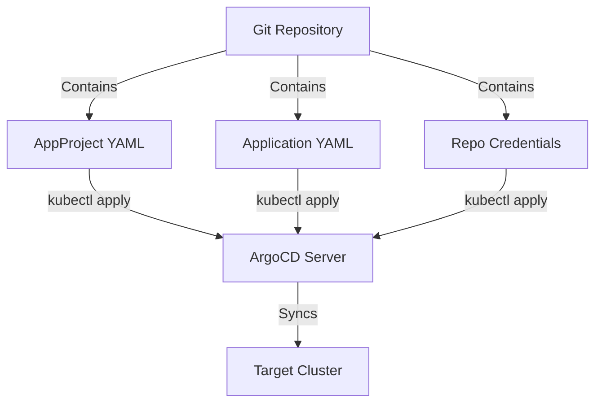

> 💡 **Quick Answer:** Define ArgoCD Applications and Projects as Kubernetes YAML manifests and apply them with `kubectl apply -n argocd`. This replaces imperative `argocd app create` commands with version-controlled, reproducible configuration.

## The Problem

Creating ArgoCD applications through the CLI or UI is quick for prototyping but problematic at scale:

- **Not reproducible** — settings exist only in ArgoCD's internal state
- **Not auditable** — no Git history of who changed what
- **Not portable** — hard to replicate across clusters
- **Manual** — every new app requires CLI commands or UI clicks

## The Solution

### Step 1: Define an AppProject

```yaml
apiVersion: argoproj.io/v1alpha1
kind: AppProject
metadata:
  name: production
  namespace: argocd
  finalizers:
    - resources-finalizer.argocd.argoproj.io
spec:
  description: "Production workloads"
  sourceRepos:
    - "https://github.com/myorg/*"
    - "https://charts.bitnami.com/bitnami"
  destinations:
    - namespace: "*"
      server: https://kubernetes.default.svc
  clusterResourceWhitelist:
    - group: ""
      kind: Namespace
  namespaceResourceBlacklist:
    - group: ""
      kind: ResourceQuota
    - group: ""
      kind: LimitRange
  roles:
    - name: developer
      description: "Developer access"
      policies:
        - p, proj:production:developer, applications, get, production/*, allow
        - p, proj:production:developer, applications, sync, production/*, allow
      groups:
        - dev-team
```

### Step 2: Define an Application from Git

```yaml
apiVersion: argoproj.io/v1alpha1
kind: Application
metadata:
  name: webapp
  namespace: argocd
  labels:
    team: frontend
    env: production
  finalizers:
    - resources-finalizer.argocd.argoproj.io
spec:
  project: production
  source:
    repoURL: https://github.com/myorg/webapp.git
    targetRevision: main
    path: k8s/overlays/production
  destination:
    server: https://kubernetes.default.svc
    namespace: webapp
  syncPolicy:
    automated:
      prune: true
      selfHeal: true
    syncOptions:
      - CreateNamespace=true
      - PrunePropagationPolicy=foreground
      - PruneLast=true
    retry:
      limit: 5
      backoff:
        duration: 5s
        factor: 2
        maxDuration: 3m
  ignoreDifferences:
    - group: apps
      kind: Deployment
      jsonPointers:
        - /spec/replicas
```

### Step 3: Define an Application from Helm

```yaml
apiVersion: argoproj.io/v1alpha1
kind: Application
metadata:
  name: redis
  namespace: argocd
spec:
  project: production
  source:
    repoURL: https://charts.bitnami.com/bitnami
    chart: redis
    targetRevision: 20.0.0
    helm:
      releaseName: redis
      values: |
        architecture: replication
        auth:
          enabled: true
          existingSecret: redis-secret
        replica:
          replicaCount: 3
        metrics:
          enabled: true
          serviceMonitor:
            enabled: true
      parameters:
        - name: master.resources.requests.memory
          value: "256Mi"
        - name: master.resources.requests.cpu
          value: "100m"
  destination:
    server: https://kubernetes.default.svc
    namespace: redis
  syncPolicy:
    automated:
      prune: true
      selfHeal: true
    syncOptions:
      - CreateNamespace=true
```

### Step 4: Configure Repository Credentials

```yaml
apiVersion: v1
kind: Secret
metadata:
  name: private-repo-creds
  namespace: argocd
  labels:
    argocd.argoproj.io/secret-type: repository
type: Opaque
stringData:
  type: git
  url: https://github.com/myorg/private-repo.git
  username: argocd-bot
  password: ghp_xxxxxxxxxxxxxxxxxxxx
---
# Credential template (matches all repos under a prefix)
apiVersion: v1
kind: Secret
metadata:
  name: github-org-creds
  namespace: argocd
  labels:
    argocd.argoproj.io/secret-type: repo-creds
type: Opaque
stringData:
  type: git
  url: https://github.com/myorg
  username: argocd-bot
  password: ghp_xxxxxxxxxxxxxxxxxxxx
```

### Step 5: Apply Everything

```bash
# Apply all declarative config
kubectl apply -n argocd -f argocd/projects/
kubectl apply -n argocd -f argocd/credentials/
kubectl apply -n argocd -f argocd/applications/

# Or use kustomize
kubectl apply -k argocd/
```



## Common Issues

### Application Must Be in argocd Namespace

All Application and AppProject resources must be created in the ArgoCD namespace (default: `argocd`).

### Finalizer Prevents Deletion

Remove the finalizer to delete an Application without cascading:

```bash
kubectl patch app webapp -n argocd --type json -p '[{"op":"remove","path":"/metadata/finalizers"}]'
kubectl delete app webapp -n argocd
```

## Best Practices

- **Use Projects for RBAC** — scope teams to specific repos and namespaces
- **Add finalizers** — ensures resources are cleaned up on Application deletion
- **Use `ignoreDifferences`** — for fields managed by HPA or other controllers
- **Pin chart versions** — never use `latest` or `HEAD` for Helm charts in production
- **Use credential templates** — one Secret covers all repos under an org prefix
- **Label Applications** — enables filtering by team, environment, or tier

## Key Takeaways

- Everything in ArgoCD can be defined as Kubernetes YAML — Applications, Projects, and credentials
- Declarative setup enables version control, auditability, and reproducibility
- Use AppProjects to scope access per team with fine-grained RBAC
- Credential templates avoid duplicating secrets for every repository
