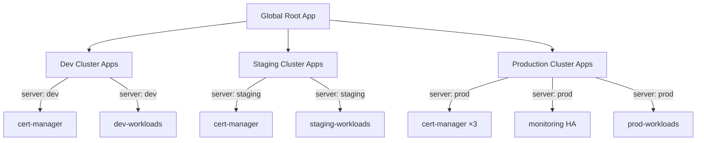

> 💡 **Quick Answer:** Create a parent App of Apps per cluster, each pointing to a cluster-specific directory in Git. Use a shared `base/` for common infrastructure and `clusters/<name>/` for cluster-specific overrides.

## The Problem

Managing multiple Kubernetes clusters (dev, staging, production, multi-region) requires:

- **Shared infrastructure** deployed consistently across all clusters
- **Cluster-specific configuration** — different replicas, resources, feature flags
- **Centralized management** from a single ArgoCD instance
- **Drift prevention** — all clusters match their Git-defined state

## The Solution

### Repository Structure

```
gitops-repo/
├── apps/
│   ├── base/                       # Shared across all clusters
│   │   ├── cert-manager.yaml
│   │   ├── ingress-nginx.yaml
│   │   └── monitoring.yaml
│   ├── clusters/
│   │   ├── dev/                    # Dev cluster apps
│   │   │   ├── _cluster.yaml       # Cluster-specific root app
│   │   │   ├── base-apps.yaml      # References base/ apps
│   │   │   └── dev-workloads.yaml
│   │   ├── staging/
│   │   │   ├── _cluster.yaml
│   │   │   ├── base-apps.yaml
│   │   │   └── staging-workloads.yaml
│   │   └── production/
│   │       ├── _cluster.yaml
│   │       ├── base-apps.yaml
│   │       └── prod-workloads.yaml
├── workloads/
│   ├── base/                       # Shared workload manifests
│   │   └── api/
│   └── overlays/
│       ├── dev/
│       ├── staging/
│       └── production/
```

### Step 1: Register Target Clusters

```bash
# Add clusters to ArgoCD
argocd cluster add dev-cluster --name dev
argocd cluster add staging-cluster --name staging
argocd cluster add prod-us-east --name production-us-east
argocd cluster add prod-eu-west --name production-eu-west

# Verify clusters
argocd cluster list
```

Or declaratively:

```yaml
apiVersion: v1
kind: Secret
metadata:
  name: prod-us-east-cluster
  namespace: argocd
  labels:
    argocd.argoproj.io/secret-type: cluster
type: Opaque
stringData:
  name: production-us-east
  server: https://k8s-prod-us-east.example.com
  config: |
    {
      "bearerToken": "<service-account-token>",
      "tlsClientConfig": {
        "insecure": false,
        "caData": "<base64-ca-cert>"
      }
    }
```

### Step 2: Global Root App of Apps

```yaml
# root-app.yaml — Creates one App of Apps per cluster
apiVersion: argoproj.io/v1alpha1
kind: Application
metadata:
  name: global-root
  namespace: argocd
spec:
  project: default
  source:
    repoURL: https://github.com/myorg/gitops-repo.git
    targetRevision: main
    path: apps/clusters
    directory:
      recurse: false  # Only scan cluster directories
  destination:
    server: https://kubernetes.default.svc
    namespace: argocd
  syncPolicy:
    automated:
      prune: true
      selfHeal: true
```

### Step 3: Per-Cluster App of Apps

```yaml
# apps/clusters/production/_cluster.yaml
apiVersion: argoproj.io/v1alpha1
kind: Application
metadata:
  name: production-cluster
  namespace: argocd
  annotations:
    argocd.argoproj.io/sync-wave: "0"
  finalizers:
    - resources-finalizer.argocd.argoproj.io
spec:
  project: default
  source:
    repoURL: https://github.com/myorg/gitops-repo.git
    targetRevision: main
    path: apps/clusters/production
    directory:
      exclude: "_cluster.yaml"  # Don't recurse into self
  destination:
    server: https://kubernetes.default.svc
    namespace: argocd
  syncPolicy:
    automated:
      prune: true
      selfHeal: true
```

### Step 4: Shared Infrastructure Per Cluster

```yaml
# apps/clusters/production/base-apps.yaml
apiVersion: argoproj.io/v1alpha1
kind: Application
metadata:
  name: prod-cert-manager
  namespace: argocd
  annotations:
    argocd.argoproj.io/sync-wave: "-3"
spec:
  project: default
  source:
    repoURL: https://charts.jetstack.io
    chart: cert-manager
    targetRevision: v1.16.0
    helm:
      values: |
        installCRDs: true
        replicaCount: 3  # Production: higher replicas
  destination:
    server: https://k8s-prod-us-east.example.com  # Target cluster!
    namespace: cert-manager
  syncPolicy:
    automated:
      prune: true
      selfHeal: true
    syncOptions:
      - CreateNamespace=true
```

```yaml
# apps/clusters/dev/base-apps.yaml
apiVersion: argoproj.io/v1alpha1
kind: Application
metadata:
  name: dev-cert-manager
  namespace: argocd
  annotations:
    argocd.argoproj.io/sync-wave: "-3"
spec:
  project: default
  source:
    repoURL: https://charts.jetstack.io
    chart: cert-manager
    targetRevision: v1.16.0
    helm:
      values: |
        installCRDs: true
        replicaCount: 1  # Dev: single replica
  destination:
    server: https://k8s-dev.example.com  # Dev cluster
    namespace: cert-manager
  syncPolicy:
    automated:
      prune: true
      selfHeal: true
    syncOptions:
      - CreateNamespace=true
```

### Step 5: Cluster-Specific Workloads

```yaml
# apps/clusters/production/prod-workloads.yaml
apiVersion: argoproj.io/v1alpha1
kind: Application
metadata:
  name: prod-api
  namespace: argocd
  annotations:
    argocd.argoproj.io/sync-wave: "1"
spec:
  project: default
  source:
    repoURL: https://github.com/myorg/gitops-repo.git
    targetRevision: main
    path: workloads/overlays/production
  destination:
    server: https://k8s-prod-us-east.example.com
    namespace: myapp
  syncPolicy:
    automated:
      prune: true
      selfHeal: true
    syncOptions:
      - CreateNamespace=true
```

### Architecture



## Common Issues

### Cluster Credentials Expired

```bash
# Check cluster connectivity
argocd cluster list
# Refresh credentials
argocd cluster add prod-cluster --name production --upsert
```

### Application Name Conflicts

Each child Application needs a unique name across all clusters:

```yaml
# Prefix with cluster name
name: prod-cert-manager   # Not just "cert-manager"
name: dev-cert-manager
```

## Best Practices

- **Prefix app names with cluster** — `prod-redis`, `dev-redis` to avoid conflicts
- **Use Kustomize overlays** for cluster-specific configs — same base manifests, different parameters
- **Separate Projects per environment** — RBAC isolation between dev/staging/prod
- **Use cluster labels** — `environment: production`, `region: us-east` for filtering
- **Pin chart versions per environment** — staging gets new versions before production
- **Monitor from management cluster** — centralized ArgoCD dashboard shows all clusters

## Key Takeaways

- App of Apps scales to multi-cluster by creating per-cluster root applications
- Each child Application targets a specific cluster via `destination.server`
- Share infrastructure definitions but customize replicas, resources per environment
- One Git repo, one ArgoCD instance, all clusters managed declaratively
