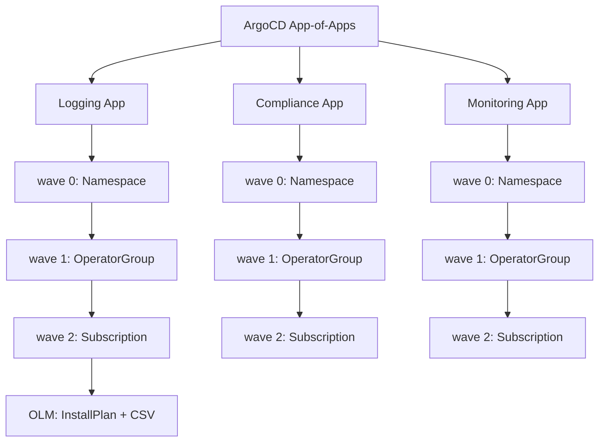

> 💡 **Quick Answer:** Create OperatorGroup → Subscription → wait for CSV in ArgoCD using sync waves. OperatorGroup must exist in the namespace BEFORE the Subscription, or OLM will refuse to install the operator.

## The Problem

Deploying OLM operators via ArgoCD requires careful ordering:

1. **Namespace** must exist first
2. **OperatorGroup** must be created in the namespace
3. **Subscription** triggers the operator install
4. **CSV (ClusterServiceVersion)** is created by OLM automatically

Without proper sync wave ordering, ArgoCD creates resources simultaneously and OLM rejects Subscriptions that lack an OperatorGroup. ArgoCD also fights OLM over resource ownership, causing sync loops.

## The Solution

### Basic OperatorGroup + Subscription via ArgoCD

```yaml
# 01-namespace.yaml
apiVersion: v1
kind: Namespace
metadata:
  name: openshift-logging
  annotations:
    argocd.argoproj.io/sync-wave: "0"
---
# 02-operatorgroup.yaml
apiVersion: operators.coreos.com/v1
kind: OperatorGroup
metadata:
  name: openshift-logging
  namespace: openshift-logging
  annotations:
    argocd.argoproj.io/sync-wave: "1"
spec:
  targetNamespaces:
    - openshift-logging
---
# 03-subscription.yaml
apiVersion: operators.coreos.com/v1alpha1
kind: Subscription
metadata:
  name: cluster-logging
  namespace: openshift-logging
  annotations:
    argocd.argoproj.io/sync-wave: "2"
spec:
  channel: stable-6.0
  name: cluster-logging
  source: redhat-operators
  sourceNamespace: openshift-marketplace
  installPlanApproval: Automatic
```

### Handle ArgoCD Sync Loops with OLM

OLM modifies Subscription and CSV resources after creation, causing ArgoCD to detect drift. Fix with resource customizations:

```yaml
# ArgoCD ConfigMap — argocd-cm
apiVersion: v1
kind: ConfigMap
metadata:
  name: argocd-cm
  namespace: openshift-gitops
data:
  resource.customizations.ignoreDifferences.operators.coreos.com_Subscription: |
    jsonPointers:
      - /spec/startingCSV
      - /status
  resource.customizations.ignoreDifferences.operators.coreos.com_ClusterServiceVersion: |
    jsonPointers:
      - /metadata/annotations
      - /metadata/labels
      - /spec/install
      - /status
  resource.customizations.ignoreDifferences.operators.coreos.com_OperatorGroup: |
    jsonPointers:
      - /metadata/annotations/olm.providedAPIs
      - /status
```

Or in the Application resource:

```yaml
apiVersion: argoproj.io/v1alpha1
kind: Application
metadata:
  name: logging-operator
  namespace: openshift-gitops
spec:
  project: platform
  source:
    repoURL: https://git.example.com/platform/operators.git
    path: logging
    targetRevision: main
  destination:
    server: https://kubernetes.default.svc
  syncPolicy:
    automated:
      prune: true
      selfHeal: true
  ignoreDifferences:
    - group: operators.coreos.com
      kind: Subscription
      jsonPointers:
        - /status
        - /spec/startingCSV
    - group: operators.coreos.com
      kind: OperatorGroup
      jsonPointers:
        - /metadata/annotations/olm.providedAPIs
```

### AllNamespaces OperatorGroup (Cluster-Wide Operators)

```yaml
apiVersion: operators.coreos.com/v1
kind: OperatorGroup
metadata:
  name: global-operators
  namespace: openshift-operators
  annotations:
    argocd.argoproj.io/sync-wave: "1"
spec: {}
  # Empty spec = AllNamespaces mode
  # OLM watches all namespaces for this operator
```

> ⚠️ **Note:** `openshift-operators` namespace already has a global OperatorGroup by default. Don't create a second one — OLM allows only one OperatorGroup per namespace.

### Multi-Operator Namespace Pattern

```yaml
# Single OperatorGroup for multiple operators in same namespace
apiVersion: operators.coreos.com/v1
kind: OperatorGroup
metadata:
  name: monitoring-operators
  namespace: monitoring
  annotations:
    argocd.argoproj.io/sync-wave: "1"
spec:
  targetNamespaces:
    - monitoring
---
# Multiple Subscriptions share the same OperatorGroup
apiVersion: operators.coreos.com/v1alpha1
kind: Subscription
metadata:
  name: prometheus-operator
  namespace: monitoring
  annotations:
    argocd.argoproj.io/sync-wave: "2"
spec:
  channel: stable
  name: prometheus-operator
  source: community-operators
  sourceNamespace: openshift-marketplace
---
apiVersion: operators.coreos.com/v1alpha1
kind: Subscription
metadata:
  name: grafana-operator
  namespace: monitoring
  annotations:
    argocd.argoproj.io/sync-wave: "2"
spec:
  channel: v5
  name: grafana-operator
  source: community-operators
  sourceNamespace: openshift-marketplace
```

### Wait for Operator Ready with Health Checks

```yaml
# ArgoCD custom health check for Subscriptions
apiVersion: v1
kind: ConfigMap
metadata:
  name: argocd-cm
  namespace: openshift-gitops
data:
  resource.customizations.health.operators.coreos.com_Subscription: |
    hs = {}
    if obj.status ~= nil then
      if obj.status.currentCSV ~= nil and obj.status.state == "AtLatestKnown" then
        hs.status = "Healthy"
        hs.message = obj.status.currentCSV
      elseif obj.status.state == "UpgradePending" then
        hs.status = "Progressing"
        hs.message = "Upgrade pending"
      else
        hs.status = "Progressing"
        hs.message = "Waiting for operator install"
      end
    else
      hs.status = "Progressing"
      hs.message = "Waiting for status"
    end
    return hs
```

### App-of-Apps Pattern for Operators

```yaml
# parent-app.yaml
apiVersion: argoproj.io/v1alpha1
kind: Application
metadata:
  name: platform-operators
  namespace: openshift-gitops
  annotations:
    argocd.argoproj.io/sync-wave: "0"
spec:
  project: platform
  source:
    repoURL: https://git.example.com/platform/operators.git
    path: apps
    targetRevision: main
  destination:
    server: https://kubernetes.default.svc
  syncPolicy:
    automated:
      prune: true
      selfHeal: true
```

```
operators/
├── apps/
│   ├── logging-app.yaml      # ArgoCD Application
│   ├── compliance-app.yaml
│   └── monitoring-app.yaml
├── logging/
│   ├── namespace.yaml         # wave 0
│   ├── operatorgroup.yaml     # wave 1
│   └── subscription.yaml     # wave 2
├── compliance/
│   ├── namespace.yaml
│   ├── operatorgroup.yaml
│   └── subscription.yaml
└── monitoring/
    ├── namespace.yaml
    ├── operatorgroup.yaml
    └── subscription.yaml
```



## Common Issues

### "Multiple OperatorGroups Found" Error

```bash
# OLM only allows ONE OperatorGroup per namespace
oc get operatorgroup -n <namespace>

# If you see multiple, delete the extra one
oc delete operatorgroup <extra-og> -n <namespace>

# In ArgoCD: ensure only one OperatorGroup per namespace in your git repo
```

### ArgoCD Shows "OutOfSync" Constantly

```bash
# OLM adds annotations like olm.providedAPIs — add to ignoreDifferences
# Check what's drifting:
argocd app diff <app-name> --local /path/to/manifests

# Most common drifts:
# - metadata.annotations.olm.providedAPIs (added by OLM)
# - spec.startingCSV (set by OLM after install)
# - status fields (managed by OLM)
```

### Operator Installs in Wrong Namespace

```bash
# OperatorGroup targetNamespaces controls where the operator watches
# AllNamespaces (empty spec) vs OwnNamespace vs MultiNamespace

# Check current scope
oc get operatorgroup -n <namespace> -o jsonpath='{.items[0].status.namespaces}'

# For OwnNamespace: targetNamespaces must list only the OG's namespace
# For specific namespaces: list all target namespaces explicitly
```

## Best Practices

- **Always use sync waves**: Namespace (0) → OperatorGroup (1) → Subscription (2)
- **One OperatorGroup per namespace** — OLM enforces this; violating it blocks all installs
- **Configure ignoreDifferences** for all OLM resources to prevent sync loops
- **Add health checks** for Subscriptions so ArgoCD waits for operator readiness
- **Use App-of-Apps** for managing multiple operators across namespaces
- **Pin operator channels** (`stable-6.0` not `stable`) for predictable upgrades
- **Don't manage CSVs in Git** — they're created by OLM, not by you

## Key Takeaways

- OperatorGroup is required before Subscription — sync waves enforce ordering
- ArgoCD and OLM both want to manage operator resources — `ignoreDifferences` prevents fights
- One OperatorGroup per namespace is an OLM hard rule
- Custom health checks let ArgoCD wait for operator readiness before deploying dependent resources
- The App-of-Apps pattern scales operator management across dozens of namespaces
