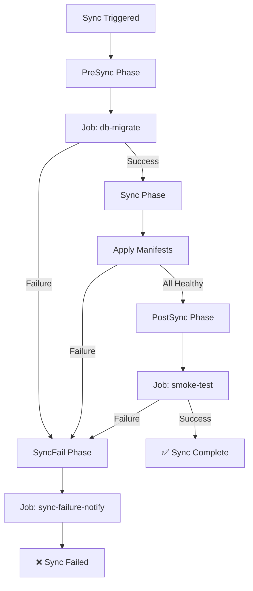

> 💡 **Quick Answer:** Annotate Jobs with `argocd.argoproj.io/hook: PreSync` to run database migrations before deployment, `PostSync` for smoke tests after deployment, and `SyncFail` for cleanup when a sync fails.

## The Problem

Application deployments often need pre-flight and post-flight actions:

- **Before deployment** — run database migrations, validate configs, check prerequisites
- **After deployment** — run smoke tests, send notifications, warm caches
- **On failure** — clean up partial deployments, send alerts, trigger rollback

Kubernetes has no native concept of deployment hooks with these semantics. ArgoCD fills the gap.

## The Solution

### Step 1: PreSync Hook — Database Migration

```yaml
apiVersion: batch/v1
kind: Job
metadata:
  name: db-migrate
  namespace: myapp
  annotations:
    argocd.argoproj.io/hook: PreSync
    argocd.argoproj.io/hook-delete-policy: BeforeHookCreation
    argocd.argoproj.io/sync-wave: "-1"
spec:
  backoffLimit: 3
  template:
    spec:
      restartPolicy: Never
      containers:
        - name: migrate
          image: myapp/api:v1.2.0
          command: ["python", "manage.py", "migrate", "--noinput"]
          env:
            - name: DATABASE_URL
              valueFrom:
                secretKeyRef:
                  name: myapp-db-credentials
                  key: url
```

### Step 2: PostSync Hook — Smoke Tests

```yaml
apiVersion: batch/v1
kind: Job
metadata:
  name: smoke-test
  namespace: myapp
  annotations:
    argocd.argoproj.io/hook: PostSync
    argocd.argoproj.io/hook-delete-policy: HookSucceeded
spec:
  backoffLimit: 1
  template:
    spec:
      restartPolicy: Never
      containers:
        - name: smoke
          image: curlimages/curl:8.10.0
          command:
            - /bin/sh
            - -c
            - |
              echo "Running smoke tests..."
              # Test health endpoint
              HTTP_CODE=$(curl -s -o /dev/null -w "%{http_code}" http://myapp-api.myapp.svc:8080/health)
              if [ "$HTTP_CODE" != "200" ]; then
                echo "FAIL: health endpoint returned $HTTP_CODE"
                exit 1
              fi
              echo "PASS: health endpoint OK"

              # Test API endpoint
              HTTP_CODE=$(curl -s -o /dev/null -w "%{http_code}" http://myapp-api.myapp.svc:8080/api/v1/status)
              if [ "$HTTP_CODE" != "200" ]; then
                echo "FAIL: API status returned $HTTP_CODE"
                exit 1
              fi
              echo "PASS: API status OK"
              echo "All smoke tests passed!"
```

### Step 3: SyncFail Hook — Failure Notification

```yaml
apiVersion: batch/v1
kind: Job
metadata:
  name: sync-failure-notify
  namespace: myapp
  annotations:
    argocd.argoproj.io/hook: SyncFail
    argocd.argoproj.io/hook-delete-policy: BeforeHookCreation
spec:
  backoffLimit: 1
  template:
    spec:
      restartPolicy: Never
      containers:
        - name: notify
          image: curlimages/curl:8.10.0
          command:
            - /bin/sh
            - -c
            - |
              curl -X POST "$SLACK_WEBHOOK" \
                -H 'Content-Type: application/json' \
                -d '{
                  "text": "🚨 ArgoCD sync FAILED for myapp! Check the ArgoCD dashboard.",
                  "channel": "#deployments"
                }'
          env:
            - name: SLACK_WEBHOOK
              valueFrom:
                secretKeyRef:
                  name: slack-webhook
                  key: url
```

### Sync Lifecycle



### Hook Delete Policies

| Policy | Behavior |
|---|---|
| `BeforeHookCreation` | Delete previous hook before creating new one (default) |
| `HookSucceeded` | Delete hook after it succeeds |
| `HookFailed` | Delete hook after it fails |

```yaml
# Keep failed hooks for debugging, clean up successful ones
annotations:
  argocd.argoproj.io/hook-delete-policy: HookSucceeded
```

### Step 4: Combining Hooks with Sync Waves

```yaml
# Wave -2: PreSync config validation
apiVersion: batch/v1
kind: Job
metadata:
  name: validate-config
  annotations:
    argocd.argoproj.io/hook: PreSync
    argocd.argoproj.io/sync-wave: "-2"
    argocd.argoproj.io/hook-delete-policy: BeforeHookCreation
spec:
  template:
    spec:
      restartPolicy: Never
      containers:
        - name: validate
          image: myapp/config-validator:latest
          command: ["validate", "--strict"]
---
# Wave -1: PreSync database migration
apiVersion: batch/v1
kind: Job
metadata:
  name: db-migrate
  annotations:
    argocd.argoproj.io/hook: PreSync
    argocd.argoproj.io/sync-wave: "-1"
    argocd.argoproj.io/hook-delete-policy: BeforeHookCreation
spec:
  template:
    spec:
      restartPolicy: Never
      containers:
        - name: migrate
          image: myapp/api:v1.2.0
          command: ["python", "manage.py", "migrate"]
```

## Common Issues

### Hook Job Never Completes

Hooks must reach a terminal state (Complete or Failed). Ensure:
- `restartPolicy: Never` (not `Always`)
- `backoffLimit` is set to prevent infinite retries
- Container command actually exits

### Hook Runs on Every Sync

This is expected. Use `BeforeHookCreation` to clean up old hook resources.

### PreSync Hook Blocks Deployment

If a PreSync hook fails, the sync stops. Use `backoffLimit` and check Job logs:

```bash
argocd app get myapp --show-operation
kubectl logs job/db-migrate -n myapp
```

## Best Practices

- **Use PreSync for migrations** — never deploy code that needs a schema change without migrating first
- **Use PostSync for validation** — smoke tests catch issues before users hit them
- **Use SyncFail for alerts** — automated notification prevents silent failures
- **Set `backoffLimit`** — prevent infinite retry loops
- **Use `BeforeHookCreation`** as default delete policy — prevents old Job conflicts
- **Keep hooks idempotent** — they may run multiple times

## Key Takeaways

- ArgoCD hooks run at specific sync lifecycle phases: PreSync, Sync, PostSync, SyncFail
- Hooks are typically Jobs but can be any Kubernetes resource
- Combine hooks with sync waves for fine-grained ordering within each phase
- Delete policies control hook cleanup — `BeforeHookCreation` is the safest default
