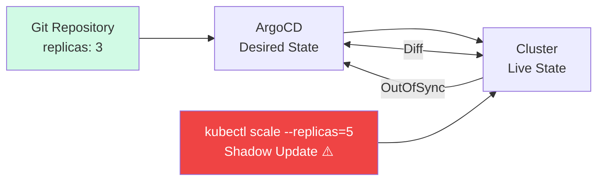

> 💡 **Quick Answer:** Shadow updates are out-of-band changes made directly to the cluster (via `kubectl edit`, `kubectl scale`, Helm manual overrides) that bypass Git. ArgoCD detects them as "OutOfSync" drift. Enable `spec.syncPolicy.automated.selfHeal: true` to auto-revert shadow changes, or use `argocd app diff` to inspect them before deciding.

## The Problem

Someone ran `kubectl scale deploy myapp --replicas=5` directly on the cluster. ArgoCD's Git repo still says `replicas: 3`. Now the live state doesn't match the desired state — a "shadow update." Without detection and enforcement, these drift silently, Git becomes unreliable as the source of truth, and deployments become unpredictable.

## The Solution

### Understanding Shadow Updates



**Shadow update sources:**
- `kubectl edit` / `kubectl patch` / `kubectl scale`
- Helm manual `helm upgrade` outside ArgoCD
- Operators modifying resources ArgoCD manages
- CI/CD pipelines applying directly to cluster
- Emergency hotfixes applied under pressure

### Step 1: Detect Drift — argocd app diff

```bash
# See exactly what changed vs Git
argocd app diff myapp

# Output:
# ===== apps/Deployment myapp/myapp ======
#   spec:
#     replicas:
# -      3
# +      5
#   metadata:
#     annotations:
# +      kubectl.kubernetes.io/last-applied-configuration: ...

# Detailed diff with live manifest
argocd app diff myapp --local ./manifests/
```

**In the ArgoCD UI:**
- App shows yellow "OutOfSync" badge
- Click the app → "Diff" tab shows exact field-level changes
- Resources with drift show a yellow warning icon

### Step 2: Configure Self-Heal (Auto-Revert Shadow Updates)

```yaml
apiVersion: argoproj.io/v1alpha1
kind: Application
metadata:
  name: myapp
  namespace: argocd
spec:
  project: default
  source:
    repoURL: https://github.com/myorg/k8s-manifests.git
    targetRevision: main
    path: apps/myapp
  destination:
    server: https://kubernetes.default.svc
    namespace: production
  syncPolicy:
    automated:
      prune: true                 # Delete resources removed from Git
      selfHeal: true              # ← Auto-revert shadow updates
      allowEmpty: false
    syncOptions:
      - CreateNamespace=true
      - PrunePropagationPolicy=foreground
      - PruneLast=true
    retry:
      limit: 5
      backoff:
        duration: 5s
        factor: 2
        maxDuration: 3m
```

**With `selfHeal: true`:**
1. Someone runs `kubectl scale deploy myapp --replicas=5`
2. ArgoCD detects drift within ~3 minutes (default refresh interval)
3. ArgoCD automatically syncs, reverting replicas back to 3
4. The shadow update is undone

### Step 3: Configure Refresh and Drift Detection Timing

```yaml
# argocd-cm ConfigMap
apiVersion: v1
kind: ConfigMap
metadata:
  name: argocd-cm
  namespace: argocd
data:
  # How often ArgoCD checks live state vs desired (default: 180s)
  timeout.reconciliation: "120"    # Check every 2 minutes

  # Resource tracking method
  application.resourceTrackingMethod: annotation
```

**Per-application refresh override:**

```yaml
metadata:
  annotations:
    # Force more frequent reconciliation for critical apps
    argocd.argoproj.io/refresh: "60"    # Every 60 seconds
```

### Step 4: Ignore Expected Drift (Managed Fields)

Some fields are legitimately modified by controllers (HPA changes replicas, cert-manager updates secrets). Tell ArgoCD to ignore these:

```yaml
apiVersion: argoproj.io/v1alpha1
kind: Application
metadata:
  name: myapp
spec:
  ignoreDifferences:
    # Ignore replicas — HPA manages this
    - group: apps
      kind: Deployment
      jsonPointers:
        - /spec/replicas

    # Ignore caBundle — injected by webhooks
    - group: admissionregistration.k8s.io
      kind: MutatingWebhookConfiguration
      jqPathExpressions:
        - .webhooks[]?.clientConfig.caBundle

    # Ignore annotations added by other controllers
    - group: ""
      kind: Service
      managedFieldsManagers:
        - metallb-controller
      jsonPointers:
        - /metadata/annotations

    # Ignore all status fields (common pattern)
    - group: "*"
      kind: "*"
      jsonPointers:
        - /status
```

**Cluster-wide ignore rules** (apply to all Applications):

```yaml
# argocd-cm ConfigMap
data:
  resource.customizations.ignoreDifferences.all: |
    jsonPointers:
      - /metadata/resourceVersion
      - /metadata/generation
      - /metadata/managedFields
  
  resource.customizations.ignoreDifferences.admissionregistration.k8s.io_MutatingWebhookConfiguration: |
    jqPathExpressions:
      - .webhooks[]?.clientConfig.caBundle
```

### Step 5: Sync Windows — Allow Emergency Shadow Updates

Sometimes shadow updates are intentional (incident response). Use sync windows to control when self-heal is active:

```yaml
apiVersion: argoproj.io/v1alpha1
kind: AppProject
metadata:
  name: production
  namespace: argocd
spec:
  syncWindows:
    # Allow sync only during business hours
    - kind: allow
      schedule: "0 8 * * 1-5"     # Mon-Fri 8:00
      duration: 10h                # Until 18:00
      applications: ["*"]
      
    # Deny auto-sync during change freeze
    - kind: deny
      schedule: "0 0 20 12 *"     # Dec 20
      duration: 336h              # 2 weeks
      applications: ["*"]
      manualSync: true            # Still allow manual sync

    # Emergency override: always allow manual sync for critical apps
    - kind: allow
      schedule: "* * * * *"
      duration: 24h
      applications: ["infra-*"]
      manualSync: true
```

### Step 6: Notifications on Drift Detection

```yaml
# argocd-notifications-cm ConfigMap
apiVersion: v1
kind: ConfigMap
metadata:
  name: argocd-notifications-cm
  namespace: argocd
data:
  trigger.on-out-of-sync: |
    - when: app.status.sync.status == 'OutOfSync'
      send: [slack-drift-alert]
      oncePer: app.status.sync.revision

  template.slack-drift-alert: |
    message: |
      ⚠️ *Drift Detected* — {{ .app.metadata.name }}
      
      Live state differs from Git ({{ .app.spec.source.repoURL }})
      
      {{range .app.status.resources}}
      {{if eq .status "OutOfSync"}}• {{ .kind }}/{{ .name }} ({{ .namespace }})
      {{end}}{{end}}
      
      {{if .app.spec.syncPolicy.automated.selfHeal}}
      🔄 Self-heal is ON — auto-reverting...
      {{else}}
      ⚡ Manual action required: `argocd app sync {{ .app.metadata.name }}`
      {{end}}
    
  service.slack: |
    token: $slack-token
```

**Annotate the Application to enable notifications:**

```yaml
metadata:
  annotations:
    notifications.argoproj.io/subscribe.on-out-of-sync.slack: "#gitops-alerts"
```

### Step 7: Audit Who Made the Shadow Update

```bash
# Check Kubernetes audit logs for the change
# API server audit log shows who ran the kubectl command:
kubectl logs -n kube-system -l component=kube-apiserver --since=1h | \
  grep "scale\|patch\|update" | grep "myapp"

# ArgoCD event history
argocd app history myapp

# Check the resource annotations
kubectl get deploy myapp -n production -o json | jq '.metadata.annotations'
# Look for:
# "kubectl.kubernetes.io/last-applied-configuration"
# "kubernetes.io/change-cause"

# On OpenShift — check audit via API
oc adm node-logs --role=master --path=kube-apiserver/ | grep myapp
```

### Strategy Decision Matrix

```
                    selfHeal: true          selfHeal: false
                  ┌──────────────────────┬──────────────────────┐
 prune: true      │ STRICT GitOps        │ GitOps with manual   │
                  │ Auto-revert drift    │ drift review         │
                  │ Auto-delete removed  │ Auto-delete removed  │
                  │ Best for: prod       │ Best for: staging    │
                  ├──────────────────────┼──────────────────────┤
 prune: false     │ Heal but keep extras │ LAX GitOps           │
                  │ Auto-revert drift    │ Manual everything    │
                  │ Keep orphan resources│ Keep orphan resources│
                  │ Best for: migration  │ Best for: dev        │
                  └──────────────────────┴──────────────────────┘
```

### Complete Anti-Shadow-Update Setup

```yaml
apiVersion: argoproj.io/v1alpha1
kind: Application
metadata:
  name: myapp-production
  namespace: argocd
  annotations:
    notifications.argoproj.io/subscribe.on-out-of-sync.slack: "#gitops-alerts"
    notifications.argoproj.io/subscribe.on-sync-succeeded.slack: "#gitops-alerts"
  finalizers:
    - resources-finalizer.argocd.argoproj.io
spec:
  project: production
  source:
    repoURL: https://github.com/myorg/k8s-manifests.git
    targetRevision: main
    path: apps/myapp/overlays/production
  destination:
    server: https://kubernetes.default.svc
    namespace: production
  syncPolicy:
    automated:
      prune: true
      selfHeal: true
    syncOptions:
      - CreateNamespace=true
      - PrunePropagationPolicy=foreground
      - RespectIgnoreDifferences=true
      - ServerSideApply=true          # Better conflict detection
    retry:
      limit: 5
      backoff:
        duration: 5s
        factor: 2
        maxDuration: 3m
  ignoreDifferences:
    - group: apps
      kind: Deployment
      jsonPointers:
        - /spec/replicas              # HPA-managed
    - group: autoscaling
      kind: HorizontalPodAutoscaler
      jsonPointers:
        - /status
```

## Common Issues

### Self-Heal Fights with HPA

HPA changes replicas, ArgoCD reverts them, HPA changes again — infinite loop. Fix: add `/spec/replicas` to `ignoreDifferences`.

### Self-Heal Reverts Emergency Hotfix

During an incident you patched a container image directly. Self-heal reverts it within minutes. **Options:**
1. Disable self-heal temporarily: `argocd app set myapp --self-heal=false`
2. Push the fix to Git first (preferred — even during incidents)
3. Use sync windows to block auto-sync during incidents

### Drift Detection Delayed

Default reconciliation is 3 minutes. For critical apps, set the refresh annotation to `60` seconds. For cluster-wide, reduce `timeout.reconciliation` in argocd-cm.

### Server-Side Apply Conflicts

With `ServerSideApply=true`, ArgoCD uses field ownership. If another controller owns a field, ArgoCD won't overwrite it — and shows it as "SharedFieldManager" instead of OutOfSync. This is usually the correct behavior.

## Best Practices

- **Enable `selfHeal: true` for production** — Git is the single source of truth, enforce it
- **Use `ignoreDifferences` for controller-managed fields** — HPA replicas, webhook caBundle, cert-manager
- **Set up drift notifications** — know when someone bypasses GitOps
- **Audit shadow updates** — API server audit logs reveal who made the change
- **Push to Git even during incidents** — `git commit -m "HOTFIX: ..."` is faster than you think
- **Use sync windows for change freezes** — don't disable self-heal, use deny windows
- **Enable `ServerSideApply`** — better field ownership tracking and conflict detection
- **Train the team** — "kubectl edit in production" should feel wrong

## Key Takeaways

- Shadow updates = any change to the cluster that didn't come through Git
- `selfHeal: true` auto-reverts shadow updates — Git always wins
- `ignoreDifferences` prevents false positives from controllers (HPA, cert-manager, webhooks)
- Notifications + audit logs tell you WHO made the shadow update and WHEN
- Sync windows allow controlled periods where manual changes are tolerated
- The goal: make `kubectl edit` unnecessary, not just detected
