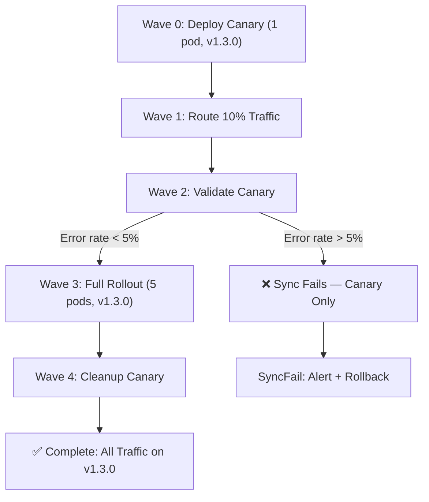

> 💡 **Quick Answer:** Deploy the canary Deployment at sync wave `0`, the canary traffic split Ingress at wave `1`, a validation Job at wave `2`, and the full production rollout at wave `3`. If validation fails, the sync stops before full rollout.

## The Problem

Rolling updates in Kubernetes replace pods gradually, but they don't validate whether the new version actually works before completing. Canary deployments solve this by:

1. Deploying a small number of new-version pods
2. Routing a fraction of traffic to them
3. Validating metrics and behavior
4. Either proceeding with full rollout or rolling back

Implementing this with GitOps requires careful sync ordering.

## The Solution

### Step 1: Canary with Sync Waves

```yaml
# Wave 0: Deploy canary pods (new version, 1 replica)
apiVersion: apps/v1
kind: Deployment
metadata:
  name: myapp-canary
  namespace: myapp
  annotations:
    argocd.argoproj.io/sync-wave: "0"
spec:
  replicas: 1
  selector:
    matchLabels:
      app: myapp
      track: canary
  template:
    metadata:
      labels:
        app: myapp
        track: canary
    spec:
      containers:
        - name: api
          image: myapp/api:v1.3.0  # New version
          ports:
            - containerPort: 8080
          readinessProbe:
            httpGet:
              path: /health
              port: 8080
            initialDelaySeconds: 5
            periodSeconds: 10
          resources:
            requests:
              memory: 256Mi
              cpu: 100m
---
apiVersion: v1
kind: Service
metadata:
  name: myapp-canary
  namespace: myapp
  annotations:
    argocd.argoproj.io/sync-wave: "0"
spec:
  selector:
    app: myapp
    track: canary
  ports:
    - port: 8080
```

### Step 2: Traffic Split (Wave 1)

```yaml
# Wave 1: Route 10% traffic to canary
apiVersion: networking.k8s.io/v1
kind: Ingress
metadata:
  name: myapp-canary-ingress
  namespace: myapp
  annotations:
    argocd.argoproj.io/sync-wave: "1"
    nginx.ingress.kubernetes.io/canary: "true"
    nginx.ingress.kubernetes.io/canary-weight: "10"
spec:
  ingressClassName: nginx
  rules:
    - host: myapp.example.com
      http:
        paths:
          - path: /
            pathType: Prefix
            backend:
              service:
                name: myapp-canary
                port:
                  number: 8080
```

### Step 3: Canary Validation (Wave 2)

```yaml
# Wave 2: Validate canary health before full rollout
apiVersion: batch/v1
kind: Job
metadata:
  name: canary-validation
  namespace: myapp
  annotations:
    argocd.argoproj.io/hook: Sync
    argocd.argoproj.io/sync-wave: "2"
    argocd.argoproj.io/hook-delete-policy: BeforeHookCreation
spec:
  backoffLimit: 1
  activeDeadlineSeconds: 300
  template:
    spec:
      restartPolicy: Never
      containers:
        - name: validate
          image: curlimages/curl:8.10.0
          command:
            - /bin/sh
            - -c
            - |
              echo "Waiting 60s for canary traffic to accumulate..."
              sleep 60

              echo "Checking canary health..."
              FAILURES=0
              TOTAL=100

              for i in $(seq 1 $TOTAL); do
                HTTP_CODE=$(curl -s -o /dev/null -w "%{http_code}" \
                  -H "Host: myapp.example.com" \
                  http://myapp-canary.myapp.svc:8080/health)
                if [ "$HTTP_CODE" != "200" ]; then
                  FAILURES=$((FAILURES + 1))
                fi
              done

              ERROR_RATE=$((FAILURES * 100 / TOTAL))
              echo "Error rate: ${ERROR_RATE}% ($FAILURES/$TOTAL)"

              if [ "$ERROR_RATE" -gt 5 ]; then
                echo "FAIL: Error rate ${ERROR_RATE}% exceeds 5% threshold"
                exit 1
              fi

              echo "PASS: Canary validation succeeded"
```

### Step 4: Full Rollout (Wave 3)

```yaml
# Wave 3: Update production deployment to new version
apiVersion: apps/v1
kind: Deployment
metadata:
  name: myapp-production
  namespace: myapp
  annotations:
    argocd.argoproj.io/sync-wave: "3"
spec:
  replicas: 5
  strategy:
    type: RollingUpdate
    rollingUpdate:
      maxSurge: 1
      maxUnavailable: 0
  selector:
    matchLabels:
      app: myapp
      track: stable
  template:
    metadata:
      labels:
        app: myapp
        track: stable
    spec:
      containers:
        - name: api
          image: myapp/api:v1.3.0  # Same new version
          ports:
            - containerPort: 8080
```

### Step 5: Cleanup Canary (Wave 4)

```yaml
# Wave 4: Remove canary after full rollout
apiVersion: batch/v1
kind: Job
metadata:
  name: cleanup-canary
  namespace: myapp
  annotations:
    argocd.argoproj.io/hook: PostSync
    argocd.argoproj.io/sync-wave: "4"
    argocd.argoproj.io/hook-delete-policy: HookSucceeded
spec:
  template:
    spec:
      restartPolicy: Never
      serviceAccountName: canary-cleanup
      containers:
        - name: cleanup
          image: bitnami/kubectl:1.31
          command:
            - /bin/sh
            - -c
            - |
              echo "Scaling down canary..."
              kubectl scale deployment myapp-canary -n myapp --replicas=0
              echo "Removing canary ingress..."
              kubectl delete ingress myapp-canary-ingress -n myapp --ignore-not-found
              echo "Canary cleanup complete"
```

### Canary Flow



## Common Issues

### Canary Validation Timing

Too short a validation window gives unreliable results:

```yaml
# Wait at least 60s before checking
sleep 60
# Run at least 100 requests for statistical significance
```

### Traffic Not Reaching Canary

Verify NGINX canary annotations are correct and the canary Ingress hostname matches the primary.

### Cleanup Race Condition

Ensure cleanup runs only after full rollout is healthy — use PostSync, not Sync.

## Best Practices

- **Start with 5-10% canary traffic** — enough to catch issues without major impact
- **Validate for at least 60 seconds** — shorter windows miss intermittent errors
- **Check error rate, not just availability** — a 200 response could still have wrong data
- **Use SyncFail hooks for alerts** — team should know immediately if canary fails
- **Automate cleanup** — don't leave canary pods running after full rollout
- **Consider Argo Rollouts** for more sophisticated canary strategies with metric analysis

## Key Takeaways

- Sync waves enable manual canary patterns without additional tools
- Validation at wave 2 gates the full rollout at wave 3
- If validation fails, the sync stops — only canary pods are affected
- For production-grade canary with metric-based analysis, consider Argo Rollouts
