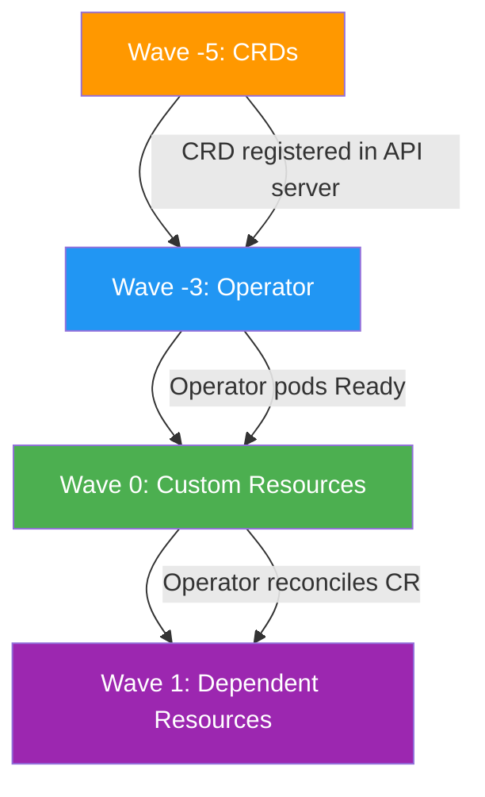

> 💡 **Quick Answer:** Put CRDs at sync wave `-5`, the operator at wave `-3`, and custom resources at wave `0`. Use `ServerSideApply=true` for CRDs and set `prune: false` to prevent accidental CRD deletion.

## The Problem

Operators and their CRDs create a chicken-and-egg problem in GitOps:

1. **CRDs must exist** before custom resources can be created
2. **Operator must be running** before it can reconcile custom resources
3. **ArgoCD applies everything at once** by default, causing:
   - `no matches for kind "Certificate" in version "cert-manager.io/v1"` errors
   - Resources stuck in `Unknown` health state
   - Sync failures that require manual intervention

## The Solution

### Step 1: Three-Wave CRD Strategy

```yaml
# Wave -5: CRDs (must exist before anything)
apiVersion: apiextensions.k8s.io/v1
kind: CustomResourceDefinition
metadata:
  name: certificates.cert-manager.io
  annotations:
    argocd.argoproj.io/sync-wave: "-5"
    argocd.argoproj.io/sync-options: Replace=true,ServerSideApply=true
# ... full CRD spec
---
# Wave -3: Operator Deployment
apiVersion: apps/v1
kind: Deployment
metadata:
  name: cert-manager
  namespace: cert-manager
  annotations:
    argocd.argoproj.io/sync-wave: "-3"
spec:
  replicas: 1
  selector:
    matchLabels:
      app: cert-manager
  template:
    metadata:
      labels:
        app: cert-manager
    spec:
      containers:
        - name: cert-manager
          image: quay.io/jetstack/cert-manager-controller:v1.16.0
---
# Wave 0: Custom Resources (operator must be ready)
apiVersion: cert-manager.io/v1
kind: ClusterIssuer
metadata:
  name: letsencrypt-prod
  annotations:
    argocd.argoproj.io/sync-wave: "0"
spec:
  acme:
    server: https://acme-v02.api.letsencrypt.org/directory
    email: admin@example.com
    privateKeySecretRef:
      name: letsencrypt-prod
    solvers:
      - http01:
          ingress:
            class: nginx
---
# Wave 1: Resources that depend on the issuer
apiVersion: cert-manager.io/v1
kind: Certificate
metadata:
  name: myapp-tls
  namespace: myapp
  annotations:
    argocd.argoproj.io/sync-wave: "1"
spec:
  secretName: myapp-tls
  issuerRef:
    name: letsencrypt-prod
    kind: ClusterIssuer
  dnsNames:
    - myapp.example.com
```

### Step 2: ArgoCD Application with CRD Sync Options

```yaml
apiVersion: argoproj.io/v1alpha1
kind: Application
metadata:
  name: cert-manager-full
  namespace: argocd
spec:
  project: default
  source:
    repoURL: https://github.com/myorg/gitops-repo.git
    targetRevision: main
    path: cert-manager
  destination:
    server: https://kubernetes.default.svc
  syncPolicy:
    automated:
      prune: true
      selfHeal: true
    syncOptions:
      - CreateNamespace=true
      - ServerSideApply=true   # Required for large CRDs
      - RespectIgnoreDifferences=true
  ignoreDifferences:
    - group: apiextensions.k8s.io
      kind: CustomResourceDefinition
      jsonPointers:
        - /status
```

### Sync Order Visualization



### Step 3: Multiple Operators Pattern

When deploying multiple operators with interdependencies:

```yaml
# Wave -5: ALL CRDs from all operators
# cert-manager CRDs
apiVersion: apiextensions.k8s.io/v1
kind: CustomResourceDefinition
metadata:
  name: certificates.cert-manager.io
  annotations:
    argocd.argoproj.io/sync-wave: "-5"
---
# Prometheus CRDs
apiVersion: apiextensions.k8s.io/v1
kind: CustomResourceDefinition
metadata:
  name: prometheuses.monitoring.coreos.com
  annotations:
    argocd.argoproj.io/sync-wave: "-5"
---
# Wave -3: ALL operators (can deploy in parallel)
apiVersion: apps/v1
kind: Deployment
metadata:
  name: cert-manager
  annotations:
    argocd.argoproj.io/sync-wave: "-3"
---
apiVersion: apps/v1
kind: Deployment
metadata:
  name: prometheus-operator
  annotations:
    argocd.argoproj.io/sync-wave: "-3"
---
# Wave -1: CRs that operators need to reconcile early
apiVersion: cert-manager.io/v1
kind: ClusterIssuer
metadata:
  name: letsencrypt-prod
  annotations:
    argocd.argoproj.io/sync-wave: "-1"
---
# Wave 0: CRs that depend on earlier CRs
apiVersion: monitoring.coreos.com/v1
kind: ServiceMonitor
metadata:
  name: cert-manager-metrics
  annotations:
    argocd.argoproj.io/sync-wave: "0"
```

### Step 4: PreSync Hook for CRD Readiness

Sometimes ArgoCD proceeds before the API server fully registers CRDs. Add a readiness check:

```yaml
apiVersion: batch/v1
kind: Job
metadata:
  name: wait-for-crds
  annotations:
    argocd.argoproj.io/hook: PreSync
    argocd.argoproj.io/hook-delete-policy: BeforeHookCreation
    argocd.argoproj.io/sync-wave: "-4"
spec:
  backoffLimit: 10
  template:
    spec:
      restartPolicy: Never
      serviceAccountName: argocd-crd-checker
      containers:
        - name: check
          image: bitnami/kubectl:1.31
          command:
            - /bin/sh
            - -c
            - |
              echo "Waiting for CRDs to be established..."
              kubectl wait --for=condition=Established \
                crd/certificates.cert-manager.io \
                crd/issuers.cert-manager.io \
                crd/clusterissuers.cert-manager.io \
                --timeout=120s
              echo "All CRDs established."
```

## Common Issues

### "no matches for kind" Error

The CRD isn't registered yet when ArgoCD tries to apply the CR. Increase the wave gap or add a PreSync readiness check.

### CRD Too Large for Annotations

CRDs with many versions or fields exceed the annotation size limit:

```yaml
syncOptions:
  - ServerSideApply=true  # Bypasses annotation limits
```

### Pruning Deletes CRDs

Never auto-prune CRDs — they contain schema definitions for all resources:

```yaml
# Per-resource annotation to skip pruning
metadata:
  annotations:
    argocd.argoproj.io/sync-options: Prune=false
```

## Best Practices

- **CRDs at wave `-5` or lower** — give maximum separation from consumers
- **Use `ServerSideApply`** for CRDs — avoids annotation size limits
- **Never prune CRDs** — set `Prune=false` on CRD resources
- **Separate CRDs from Helm charts** — use `installCRDs: false` and manage CRDs explicitly
- **Add readiness checks** when CRD registration is slow
- **All operators in the same wave** — they can deploy in parallel if CRDs are already present

## Key Takeaways

- CRD race conditions are the most common sync failure in operator-heavy GitOps
- Three-wave pattern: CRDs → Operators → Custom Resources eliminates race conditions
- Use `ServerSideApply` and `Prune=false` for CRD lifecycle management
- PreSync hooks can validate CRD readiness before operators and CRs are deployed
