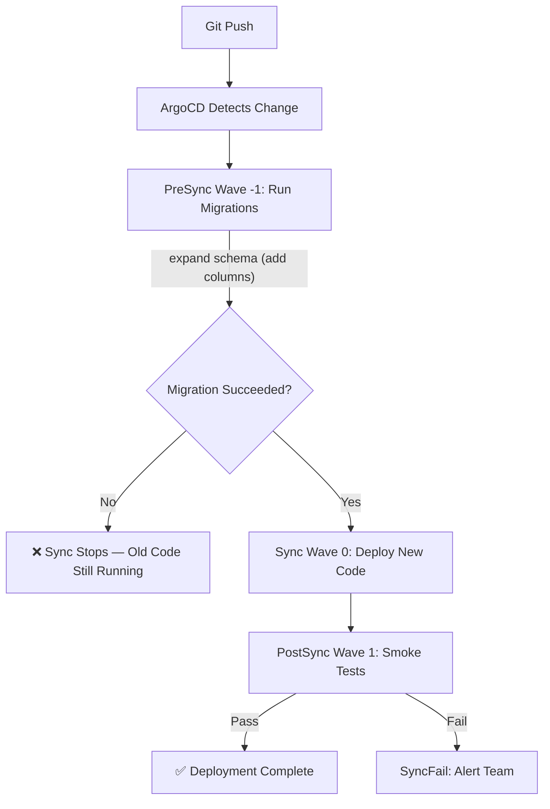

> 💡 **Quick Answer:** Run database migrations as a PreSync hook Job at sync wave `-1`, so they complete before ArgoCD deploys the new application code at wave `0`. Use `expand-and-contract` migration patterns for zero-downtime deployments.

## The Problem

Deploying application code that requires database schema changes is one of the most dangerous operations. Get the ordering wrong and you face:

- **New code, old schema** — app crashes because expected columns don't exist
- **Old code, new schema** — existing pods break when columns are renamed/removed
- **Partial migration** — migration runs halfway, leaving the database in an inconsistent state
- **No rollback** — destructive migrations (column drops) can't be undone

## The Solution

### Step 1: Safe Migration Architecture



### Step 2: PreSync Migration Job

```yaml
apiVersion: batch/v1
kind: Job
metadata:
  name: db-migrate
  namespace: myapp
  annotations:
    argocd.argoproj.io/hook: PreSync
    argocd.argoproj.io/hook-delete-policy: BeforeHookCreation
    argocd.argoproj.io/sync-wave: "-1"
spec:
  backoffLimit: 0  # No retries — fail fast
  activeDeadlineSeconds: 300  # 5 minute timeout
  template:
    metadata:
      labels:
        app: db-migrate
    spec:
      restartPolicy: Never
      initContainers:
        # Wait for database to be reachable
        - name: wait-for-db
          image: busybox:1.36
          command:
            - /bin/sh
            - -c
            - |
              until nc -z postgres.myapp.svc 5432; do
                echo "Waiting for database..."
                sleep 2
              done
      containers:
        - name: migrate
          image: myapp/api:v1.2.0  # Same image as the app
          command:
            - /bin/sh
            - -c
            - |
              echo "Running database migrations..."
              python manage.py migrate --noinput
              EXIT_CODE=$?
              if [ $EXIT_CODE -ne 0 ]; then
                echo "MIGRATION FAILED! Deployment will be blocked."
                exit 1
              fi
              echo "Migrations completed successfully."
          env:
            - name: DATABASE_URL
              valueFrom:
                secretKeyRef:
                  name: db-credentials
                  key: url
          resources:
            requests:
              memory: "256Mi"
              cpu: "100m"
            limits:
              memory: "512Mi"
              cpu: "500m"
```

### Step 3: Application Deployment (Wave 0)

```yaml
apiVersion: apps/v1
kind: Deployment
metadata:
  name: myapp-api
  namespace: myapp
  annotations:
    argocd.argoproj.io/sync-wave: "0"
spec:
  replicas: 3
  strategy:
    type: RollingUpdate
    rollingUpdate:
      maxSurge: 1
      maxUnavailable: 0  # Zero-downtime
  selector:
    matchLabels:
      app: myapp-api
  template:
    metadata:
      labels:
        app: myapp-api
    spec:
      containers:
        - name: api
          image: myapp/api:v1.2.0
          readinessProbe:
            httpGet:
              path: /health
              port: 8080
            initialDelaySeconds: 5
            periodSeconds: 10
          env:
            - name: DATABASE_URL
              valueFrom:
                secretKeyRef:
                  name: db-credentials
                  key: url
```

### Step 4: Zero-Downtime Migration Pattern

Use the **expand-and-contract** pattern across two deployments:

**Deploy 1 — Expand (add new columns, keep old ones):**

```sql
-- Migration: Add new column (backward compatible)
ALTER TABLE users ADD COLUMN email_verified BOOLEAN DEFAULT FALSE;
-- Old code ignores the new column, new code uses it
```

**Deploy 2 — Contract (remove old columns after all pods updated):**

```sql
-- Migration: Drop old column (only after all pods use new schema)
ALTER TABLE users DROP COLUMN is_email_confirmed;
```

```yaml
# Deploy 1: Expand migration + new code (reads both columns)
# PreSync hook runs migration, then new code deploys

# Deploy 2 (later): Contract migration + cleanup code
# PreSync hook drops old column, new code only uses new column
```

### Step 5: PostSync Validation

```yaml
apiVersion: batch/v1
kind: Job
metadata:
  name: post-deploy-check
  namespace: myapp
  annotations:
    argocd.argoproj.io/hook: PostSync
    argocd.argoproj.io/hook-delete-policy: HookSucceeded
    argocd.argoproj.io/sync-wave: "1"
spec:
  backoffLimit: 1
  template:
    spec:
      restartPolicy: Never
      containers:
        - name: check
          image: myapp/api:v1.2.0
          command:
            - /bin/sh
            - -c
            - |
              # Verify migration state
              python manage.py showmigrations --plan | grep -v "\[X\]" | head -5
              UNAPPLIED=$(python manage.py showmigrations --plan | grep -c "\[ \]")
              if [ "$UNAPPLIED" -gt 0 ]; then
                echo "WARNING: $UNAPPLIED unapplied migrations found!"
                exit 1
              fi
              echo "All migrations applied successfully."

              # Verify API health
              curl -f http://myapp-api.myapp.svc:8080/health || exit 1
              echo "Health check passed."
          env:
            - name: DATABASE_URL
              valueFrom:
                secretKeyRef:
                  name: db-credentials
                  key: url
```

## Common Issues

### Migration Timeout

Long-running migrations may exceed the Job deadline:

```yaml
spec:
  activeDeadlineSeconds: 900  # Increase for large tables
```

### Migration Image Mismatch

The migration Job image must match the new application version:

```yaml
# Both must use the SAME image tag
# PreSync Job:
image: myapp/api:v1.2.0
# Deployment:
image: myapp/api:v1.2.0
```

### Concurrent Migration Runs

Use advisory locks to prevent multiple migration Jobs from running simultaneously:

```sql
SELECT pg_advisory_lock(12345);
-- Run migrations
SELECT pg_advisory_unlock(12345);
```

## Best Practices

- **Never drop columns in the same deploy** — use expand-and-contract across two releases
- **Set `backoffLimit: 0`** — fail fast, don't retry broken migrations
- **Use `activeDeadlineSeconds`** — prevent migrations from running indefinitely
- **Use the same image** for migration Job and Deployment — ensures schema and code match
- **Add `wait-for-db` init container** — prevents migration from running before database is ready
- **Keep migrations idempotent** — they may run more than once (ArgoCD retries)
- **Test migrations in staging first** — catch issues before production

## Key Takeaways

- PreSync hooks guarantee migrations run before new code deploys
- If the migration fails, ArgoCD stops the sync — old code keeps running safely
- Use expand-and-contract for zero-downtime schema changes
- PostSync hooks validate the migration state after deployment
