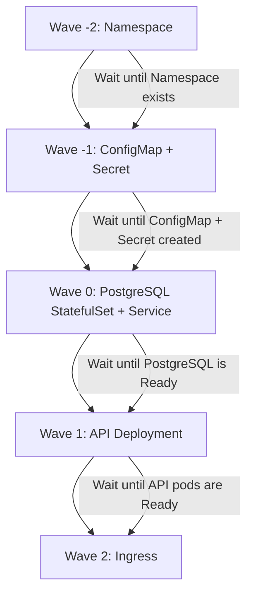

> 💡 **Quick Answer:** Add the `argocd.argoproj.io/sync-wave` annotation with a numeric value to each resource. Lower numbers sync first — wave `"-1"` deploys before wave `"0"`, which deploys before wave `"1"`.

## The Problem

Kubernetes doesn't guarantee the order in which resources are applied. When you `kubectl apply -f .`, everything goes at once. But real applications have dependencies:

- **Namespaces** must exist before deployments
- **CRDs** must exist before custom resources
- **ConfigMaps and Secrets** must exist before pods that reference them
- **Databases** must be running before application pods connect to them

Without ordering, you get race conditions, failed deployments, and flapping readiness.

## The Solution

### Step 1: Understand Sync Waves

Sync waves are numeric values (negative, zero, or positive) that control deployment order within a sync phase:

```
Wave -2 → Wave -1 → Wave 0 → Wave 1 → Wave 2 → ...
```

Resources in the same wave deploy simultaneously. ArgoCD waits for all resources in a wave to be healthy before proceeding to the next wave.

### Step 2: Annotate Resources with Sync Waves

```yaml
# Wave -2: Namespace (must exist first)
apiVersion: v1
kind: Namespace
metadata:
  name: myapp
  annotations:
    argocd.argoproj.io/sync-wave: "-2"
---
# Wave -1: ConfigMap and Secrets
apiVersion: v1
kind: ConfigMap
metadata:
  name: myapp-config
  namespace: myapp
  annotations:
    argocd.argoproj.io/sync-wave: "-1"
data:
  DATABASE_HOST: "postgres.myapp.svc.cluster.local"
  LOG_LEVEL: "info"
---
apiVersion: v1
kind: Secret
metadata:
  name: myapp-credentials
  namespace: myapp
  annotations:
    argocd.argoproj.io/sync-wave: "-1"
type: Opaque
stringData:
  DB_PASSWORD: "supersecret"
---
# Wave 0: Database (default wave)
apiVersion: apps/v1
kind: StatefulSet
metadata:
  name: postgres
  namespace: myapp
  annotations:
    argocd.argoproj.io/sync-wave: "0"
spec:
  serviceName: postgres
  replicas: 1
  selector:
    matchLabels:
      app: postgres
  template:
    metadata:
      labels:
        app: postgres
    spec:
      containers:
        - name: postgres
          image: postgres:16
          ports:
            - containerPort: 5432
          envFrom:
            - secretRef:
                name: myapp-credentials
---
apiVersion: v1
kind: Service
metadata:
  name: postgres
  namespace: myapp
  annotations:
    argocd.argoproj.io/sync-wave: "0"
spec:
  selector:
    app: postgres
  ports:
    - port: 5432
---
# Wave 1: Application (depends on database)
apiVersion: apps/v1
kind: Deployment
metadata:
  name: myapp-api
  namespace: myapp
  annotations:
    argocd.argoproj.io/sync-wave: "1"
spec:
  replicas: 3
  selector:
    matchLabels:
      app: myapp-api
  template:
    metadata:
      labels:
        app: myapp-api
    spec:
      containers:
        - name: api
          image: myapp/api:v1.2.0
          envFrom:
            - configMapRef:
                name: myapp-config
            - secretRef:
                name: myapp-credentials
---
# Wave 2: Ingress (after app is running)
apiVersion: networking.k8s.io/v1
kind: Ingress
metadata:
  name: myapp-ingress
  namespace: myapp
  annotations:
    argocd.argoproj.io/sync-wave: "2"
spec:
  rules:
    - host: myapp.example.com
      http:
        paths:
          - path: /
            pathType: Prefix
            backend:
              service:
                name: myapp-api
                port:
                  number: 8080
```

### Step 3: Visualize the Sync Order



### Step 4: Create the ArgoCD Application

```yaml
apiVersion: argoproj.io/v1alpha1
kind: Application
metadata:
  name: myapp
  namespace: argocd
spec:
  project: default
  source:
    repoURL: https://github.com/myorg/myapp-k8s.git
    targetRevision: main
    path: manifests
  destination:
    server: https://kubernetes.default.svc
    namespace: myapp
  syncPolicy:
    automated:
      prune: true
      selfHeal: true
    syncOptions:
      - CreateNamespace=true
    retry:
      limit: 5
      backoff:
        duration: 5s
        factor: 2
        maxDuration: 3m
```

## Common Issues

### Resources Stuck Waiting

If a wave never completes, ArgoCD won't proceed. Check resource health:

```bash
argocd app get myapp --show-operation
# Look for resources in "Progressing" or "Degraded" state
```

### Default Wave is 0

Resources without the annotation default to wave `0`. Only annotate resources that need explicit ordering.

### Waves Only Work Within a Sync Phase

Sync waves order resources within PreSync, Sync, or PostSync phases — not across them. Use hooks for cross-phase ordering.

## Best Practices

- **Use negative waves for infrastructure** — namespaces, CRDs, RBAC
- **Use wave 0 for core services** — databases, message queues, caches
- **Use positive waves for application workloads** — API servers, workers, frontends
- **Keep wave numbers small** — `-2` to `5` is typically enough; large gaps add no value
- **Don't over-annotate** — only wave resources that have real dependencies
- **Combine with health checks** — ArgoCD waits for health before proceeding to the next wave

## Key Takeaways

- Sync waves control deployment order within ArgoCD using numeric annotations
- Lower waves deploy first; ArgoCD waits for health before moving to the next wave
- Default wave is `0` — only annotate resources that need explicit ordering
- Combine with PreSync/PostSync hooks for database migrations and smoke tests
