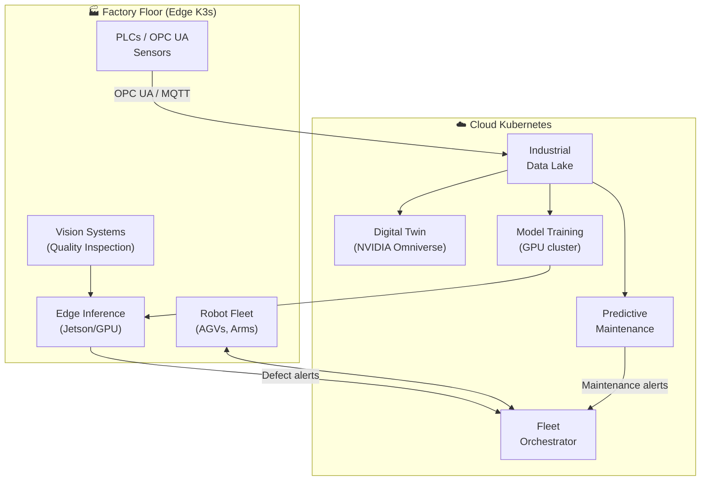

> 💡 **Quick Answer:** Autonomous industrial systems use AI + robotics to run factories and logistics with minimal human intervention. Kubernetes orchestrates the stack: edge nodes (K3s) on factory floor devices, cloud GPU clusters for training/simulation, MQTT/OPC UA for sensor data ingestion, and ML inference for predictive maintenance, quality inspection, and autonomous robot coordination.

## The Problem

Deloitte's 2026 report highlights autonomous industrial systems as a major trend — factories, warehouses, and supply chains becoming semi-autonomous through AI orchestration. This requires integrating OT (operational technology) sensors with IT infrastructure, running ML models on edge and cloud, coordinating robot fleets, and maintaining digital twins of physical processes. Kubernetes is the unifying platform.



## The Solution

### OPC UA to Kubernetes Bridge

```yaml
# OPC UA collector — reads industrial sensors into Kafka
apiVersion: apps/v1
kind: DaemonSet
metadata:
  name: opcua-collector
  namespace: industrial-edge
spec:
  selector:
    matchLabels:
      app: opcua-collector
  template:
    spec:
      hostNetwork: true             # Access factory network
      containers:
        - name: collector
          image: myorg/opcua-kafka-bridge:v2.0
          env:
            - name: OPCUA_ENDPOINTS
              value: "opc.tcp://plc-line-1:4840,opc.tcp://plc-line-2:4840"
            - name: KAFKA_BROKERS
              value: "kafka.industrial:9092"
            - name: COLLECTION_INTERVAL_MS
              value: "100"            # 100ms for real-time
            - name: TOPICS_PREFIX
              value: "factory.sensors"
          resources:
            requests:
              cpu: "500m"
              memory: "512Mi"
```

### Predictive Maintenance Pipeline

```yaml
# Stream processor: detect anomalies in sensor data
apiVersion: apps/v1
kind: Deployment
metadata:
  name: predictive-maintenance
  namespace: industrial-ai
spec:
  replicas: 3
  template:
    spec:
      containers:
        - name: anomaly-detector
          image: myorg/predictive-maintenance:v3.0
          env:
            - name: KAFKA_BROKERS
              value: "kafka.industrial:9092"
            - name: INPUT_TOPICS
              value: "factory.sensors.vibration,factory.sensors.temperature,factory.sensors.current"
            - name: MODEL_PATH
              value: "/models/bearing-failure-v2.onnx"
            - name: ALERT_WEBHOOK
              value: "http://alertmanager:9093/api/v2/alerts"
            - name: ANOMALY_THRESHOLD
              value: "0.85"
          resources:
            requests:
              cpu: "2"
              memory: "4Gi"
          volumeMounts:
            - name: models
              mountPath: /models
```

### Quality Inspection (Vision AI on Edge)

```yaml
apiVersion: apps/v1
kind: Deployment
metadata:
  name: quality-inspection
  namespace: industrial-edge
spec:
  template:
    spec:
      nodeSelector:
        location: production-line-1
      containers:
        - name: inspector
          image: myorg/quality-vision:v2.0
          env:
            - name: CAMERA_URL
              value: "rtsp://camera-line1:554/stream"
            - name: MODEL_PATH
              value: "/models/defect-detection-yolov8.engine"
            - name: INFERENCE_DEVICE
              value: "cuda"
            - name: DEFECT_THRESHOLD
              value: "0.7"
            - name: MQTT_BROKER
              value: "mqtt://mqtt-broker:1883"
            - name: ALERT_TOPIC
              value: "factory/line1/quality/alerts"
          resources:
            limits:
              nvidia.com/gpu: 1
          volumeMounts:
            - name: models
              mountPath: /models
```

### Robot Fleet Coordinator

```yaml
apiVersion: apps/v1
kind: Deployment
metadata:
  name: fleet-coordinator
  namespace: industrial-ai
spec:
  template:
    spec:
      containers:
        - name: coordinator
          image: myorg/fleet-coordinator:v2.0
          env:
            - name: MQTT_BROKER
              value: "mqtt://mqtt-broker:1883"
            - name: FLEET_SIZE
              value: "24"
            - name: WAREHOUSE_MAP
              value: "/config/warehouse-a.json"
            - name: OPTIMIZATION_ALGO
              value: "multi-agent-pathfinding"
            - name: COLLISION_AVOIDANCE
              value: "true"
          ports:
            - containerPort: 8080     # Fleet management API
            - containerPort: 9090     # Metrics
```

### Digital Twin Integration

```yaml
# NVIDIA Omniverse for factory digital twin
apiVersion: batch/v1
kind: Job
metadata:
  name: digital-twin-simulation
spec:
  template:
    spec:
      containers:
        - name: omniverse
          image: nvcr.io/nvidia/omniverse-kit:106.0
          env:
            - name: SCENE_PATH
              value: "/scenes/factory-floor-v3.usd"
            - name: SENSOR_FEED
              value: "kafka://kafka.industrial:9092/factory.sensors.*"
            - name: SIMULATION_MODE
              value: "live-mirror"     # Real-time digital twin
          resources:
            limits:
              nvidia.com/gpu: 2
          ports:
            - containerPort: 8211     # Streaming viewport
```

### Industrial Data Pipeline

```yaml
# Apache Kafka for high-throughput sensor data
apiVersion: apps/v1
kind: StatefulSet
metadata:
  name: kafka
  namespace: industrial
spec:
  replicas: 3
  template:
    spec:
      containers:
        - name: kafka
          image: confluentinc/cp-kafka:7.7.0
          env:
            - name: KAFKA_NUM_PARTITIONS
              value: "12"
            - name: KAFKA_DEFAULT_REPLICATION_FACTOR
              value: "3"
            - name: KAFKA_MESSAGE_MAX_BYTES
              value: "10485760"    # 10MB for image data
          resources:
            requests:
              cpu: "2"
              memory: "8Gi"
  volumeClaimTemplates:
    - metadata:
        name: data
      spec:
        resources:
          requests:
            storage: 500Gi
        storageClassName: fast-ssd
---
# Flink for stream processing
apiVersion: apps/v1
kind: Deployment
metadata:
  name: flink-jobmanager
spec:
  template:
    spec:
      containers:
        - name: flink
          image: apache/flink:1.19
          args: ["jobmanager"]
          env:
            - name: JOB_MANAGER_RPC_ADDRESS
              value: "flink-jobmanager"
```

### Monitoring Dashboard

```yaml
# Grafana dashboard for factory metrics
apiVersion: v1
kind: ConfigMap
metadata:
  name: factory-dashboard
  labels:
    grafana_dashboard: "1"
data:
  factory-overview.json: |
    {
      "title": "Factory Floor Overview",
      "panels": [
        {"title": "Robot Fleet Status", "type": "stat"},
        {"title": "Defect Rate (per hour)", "type": "timeseries"},
        {"title": "Equipment Health Score", "type": "gauge"},
        {"title": "Sensor Anomaly Alerts", "type": "alertlist"},
        {"title": "Production Throughput", "type": "timeseries"}
      ]
    }
```

## Common Issues

| Issue | Cause | Fix |
|-------|-------|-----|
| OPC UA connection drops | Factory network unstable | Add reconnection logic, buffer locally |
| Sensor data lag | Kafka consumer too slow | Increase partitions and consumer replicas |
| False positive anomalies | Model not trained on enough data | Retrain with more operational data, adjust threshold |
| Edge node resource exhaustion | Too many models on one Jetson | Prioritize models, use TensorRT optimization |
| Robot coordination deadlock | Path planning conflict | Implement priority-based conflict resolution |

## Best Practices

- **Edge-first for latency-critical** — quality inspection and safety must be <100ms
- **Cloud for training and simulation** — digital twins and model training need GPU clusters
- **Buffer at the edge** — handle network partitions between factory floor and cloud
- **Staged model deployment** — test in digital twin before deploying to production line
- **Separate OT and IT networks** — use gateway pods for OPC UA/MQTT bridging
- **Monitor everything** — MTBF, defect rates, robot utilization, sensor health

## Key Takeaways

- Autonomous industrial systems combine AI, robotics, and IoT on Kubernetes
- Edge K3s nodes run on factory floor; cloud K8s handles training and simulation
- OPC UA and MQTT bridge industrial sensors to Kubernetes workloads
- Predictive maintenance models run as streaming Kafka consumers
- Digital twins (Omniverse) mirror real-time factory state for simulation
- 2026 trend: factories becoming semi-autonomous through AI + robotics orchestration
