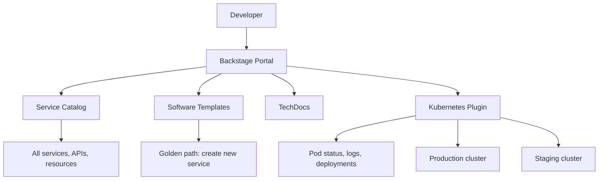

> 💡 **Quick Answer:** Deploy Spotify Backstage on Kubernetes as an internal developer portal. Covers Helm install, PostgreSQL backend, catalog entities, and TechDocs integration.

## The Problem

You want a single pane of glass for all your Kubernetes services, APIs, documentation, and CI/CD pipelines. Backstage provides this as an Internal Developer Portal (IDP).

## The Solution

### Step 1: Install Backstage with Helm

```bash
helm repo add backstage https://backstage.github.io/charts
helm repo update

cat << 'EOF' > backstage-values.yaml
backstage:
  image:
    registry: ghcr.io
    repository: backstage/backstage
    tag: latest
  extraEnvVars:
    - name: POSTGRES_HOST
      value: backstage-postgresql
    - name: POSTGRES_PORT
      value: "5432"
  appConfig:
    app:
      title: "My Platform"
      baseUrl: https://backstage.example.com
    backend:
      baseUrl: https://backstage.example.com
      database:
        client: pg
        connection:
          host: ${POSTGRES_HOST}
          port: ${POSTGRES_PORT}
          user: backstage
          password: ${POSTGRES_PASSWORD}
    catalog:
      rules:
        - allow: [Component, System, API, Resource, Location, Template]
      locations:
        - type: url
          target: https://github.com/myorg/backstage-catalog/blob/main/all.yaml
postgresql:
  enabled: true
  auth:
    username: backstage
    password: changeme
  primary:
    persistence:
      size: 10Gi
ingress:
  enabled: true
  className: nginx
  host: backstage.example.com
  tls:
    secretName: backstage-tls
EOF

helm install backstage backstage/backstage \
  -n backstage --create-namespace \
  -f backstage-values.yaml
```

### Step 2: Register Kubernetes Services

Create a catalog entity for each service:

```yaml
# catalog-info.yaml in your service repo
apiVersion: backstage.io/v1alpha1
kind: Component
metadata:
  name: payment-service
  description: Handles payment processing
  annotations:
    backstage.io/kubernetes-id: payment-service
    backstage.io/kubernetes-namespace: production
    backstage.io/techdocs-ref: dir:.
  tags:
    - python
    - grpc
spec:
  type: service
  lifecycle: production
  owner: team-payments
  system: checkout
  providesApis:
    - payment-api
  dependsOn:
    - resource:default/payments-db
```

### Step 3: Enable Kubernetes Plugin

```yaml
# In backstage app-config.yaml
kubernetes:
  serviceLocatorMethod:
    type: multiTenant
  clusterLocatorMethods:
    - type: config
      clusters:
        - url: https://kubernetes.default.svc
          name: production
          authProvider: serviceAccount
          serviceAccountToken: ${K8S_SA_TOKEN}
          skipTLSVerify: true
```

This shows pod status, deployments, and logs directly in Backstage for each registered service.

### Step 4: Software Templates (Golden Paths)

```yaml
apiVersion: scaffolder.backstage.io/v1beta3
kind: Template
metadata:
  name: kubernetes-service
  title: New Kubernetes Service
  description: Creates a new microservice with CI/CD, monitoring, and docs
spec:
  owner: platform-team
  type: service
  parameters:
    - title: Service Details
      properties:
        name:
          title: Service Name
          type: string
        language:
          title: Language
          type: string
          enum: [go, python, java, node]
        namespace:
          title: Kubernetes Namespace
          type: string
          default: default
  steps:
    - id: create-repo
      name: Create Repository
      action: publish:github
      input:
        repoUrl: github.com?owner=myorg&repo=${{ parameters.name }}
    - id: register
      name: Register in Catalog
      action: catalog:register
      input:
        repoContentsUrl: ${{ steps['create-repo'].output.repoContentsUrl }}
        catalogInfoPath: /catalog-info.yaml
```



## Best Practices

- **Start with observation** — measure before optimizing
- **Automate** — manual processes don't scale
- **Iterate** — implement changes gradually and measure impact
- **Document** — keep runbooks for your team

## Key Takeaways

- This is a critical capability for production Kubernetes clusters
- Start with the simplest approach and evolve as needed
- Monitor and measure the impact of every change
- Share knowledge across your team with internal documentation
