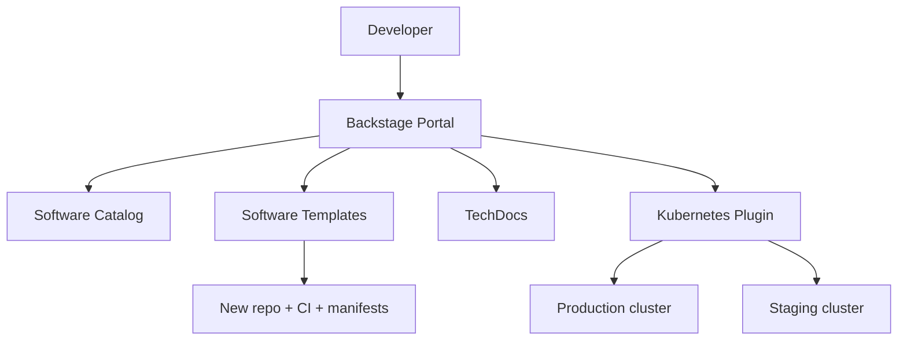

> 💡 **Quick Answer:** Backstage (CNCF, created by Spotify) is an internal developer portal: software catalog, software templates (golden paths), TechDocs and plugins such as Kubernetes. To run it on Kubernetes: build your own Backstage image (`npx @backstage/create-app@latest`, add plugins, `yarn build-image`), deploy it with the `backstage/backstage` Helm chart or a plain Deployment backed by PostgreSQL, register services with a `catalog-info.yaml` in each repo, and give Backstage a read-only ServiceAccount so the Kubernetes plugin can show pods per component.
>
> **Gotcha:** The Kubernetes plugin finds workloads by label — resources must carry `backstage.io/kubernetes-id: <component>` (or match `backstage.io/kubernetes-label-selector`), not just the annotation on the catalog entity.

## The Problem

As microservices grow nobody knows what exists or who owns it, API docs are scattered across wikis, and creating a new service needs tribal knowledge. Backstage gives developers a single pane of glass: catalog + ownership, docs-as-code, scaffolding, and live cluster status per service.

## The Solution

### Step 1: Build Your Backstage Image

The upstream demo image isn't meant for production — Backstage is a framework you compile with your plugins.

```bash
npx @backstage/create-app@latest     # name: my-backstage
cd my-backstage
yarn install
yarn tsc && yarn build:backend
yarn build-image --tag registry.example.com/backstage:1.0.0
docker push registry.example.com/backstage:1.0.0
```

```yaml
# app-config.production.yaml (baked into the image, env vars resolved at runtime)
app:
  title: My Platform Portal
  baseUrl: https://backstage.example.com
backend:
  baseUrl: https://backstage.example.com
  listen:
    port: 7007
  database:
    client: pg
    connection:
      host: ${POSTGRES_HOST}
      port: ${POSTGRES_PORT}
      user: ${POSTGRES_USER}
      password: ${POSTGRES_PASSWORD}
integrations:
  github:
    - host: github.com
      token: ${GITHUB_TOKEN}
catalog:
  rules:
    - allow: [Component, System, API, Resource, Location, Template, Group, User]
  locations:
    - type: url
      target: https://github.com/myorg/backstage-catalog/blob/main/all.yaml
```

### Step 2a: Deploy with Helm

```bash
helm repo add backstage https://backstage.github.io/charts
helm repo update

kubectl create namespace backstage
kubectl -n backstage create secret generic backstage-secrets \
  --from-literal=POSTGRES_PASSWORD='S3cure!' \
  --from-literal=GITHUB_TOKEN='ghp_xxx'

cat > backstage-values.yaml <<'EOF'
backstage:
  image:
    registry: registry.example.com
    repository: backstage
    tag: "1.0.0"
  extraEnvVarsSecrets:
    - backstage-secrets
  extraEnvVars:
    - name: POSTGRES_HOST
      value: backstage-postgresql
    - name: POSTGRES_PORT
      value: "5432"
    - name: POSTGRES_USER
      value: backstage
postgresql:
  enabled: true            # dev/test; use CloudNativePG or a managed DB in prod
  auth:
    username: backstage
    existingSecret: backstage-secrets
    secretKeys:
      userPasswordKey: POSTGRES_PASSWORD
      adminPasswordKey: POSTGRES_PASSWORD
  primary:
    persistence:
      size: 10Gi
ingress:
  enabled: true
  className: nginx
  host: backstage.example.com
  tls:
    enabled: true
    secretName: backstage-tls
serviceAccount:
  create: true
  name: backstage
EOF

helm install backstage backstage/backstage -n backstage -f backstage-values.yaml
kubectl -n backstage rollout status deploy/backstage
```

### Step 2b: Or a Plain Deployment

```yaml
apiVersion: apps/v1
kind: Deployment
metadata:
  name: backstage
  namespace: backstage
spec:
  replicas: 2
  selector:
    matchLabels:
      app: backstage
  template:
    metadata:
      labels:
        app: backstage
    spec:
      serviceAccountName: backstage
      containers:
        - name: backstage
          image: registry.example.com/backstage:1.0.0
          ports:
            - containerPort: 7007
          envFrom:
            - secretRef:
                name: backstage-secrets
          env:
            - name: POSTGRES_HOST
              value: backstage-postgresql
            - name: POSTGRES_PORT
              value: "5432"
            - name: POSTGRES_USER
              value: backstage
          readinessProbe:
            httpGet:
              path: /.backstage/health/v1/readiness
              port: 7007
          livenessProbe:
            httpGet:
              path: /.backstage/health/v1/liveness
              port: 7007
          resources:
            requests: { cpu: 500m, memory: 512Mi }
            limits: { memory: 2Gi }
---
apiVersion: v1
kind: Service
metadata:
  name: backstage
  namespace: backstage
spec:
  selector:
    app: backstage
  ports:
    - port: 80
      targetPort: 7007
```

On OpenShift, **Red Hat Developer Hub** is the supported Backstage distribution (operator or Helm) with dynamic plugins, so you don't rebuild the image to add a plugin.

### Step 3: Register Services (catalog-info.yaml)

```yaml
# catalog-info.yaml at the root of each service repo
apiVersion: backstage.io/v1alpha1
kind: Component
metadata:
  name: orders-service
  description: Order processing and fulfillment
  annotations:
    backstage.io/kubernetes-id: orders-service
    backstage.io/kubernetes-namespace: production
    backstage.io/techdocs-ref: dir:.
    github.com/project-slug: myorg/orders-service
    argocd/app-name: orders-service
  tags: [python, grpc]
  links:
    - url: https://grafana.example.com/d/orders
      title: Grafana Dashboard
spec:
  type: service
  lifecycle: production
  owner: team-commerce
  system: ecommerce
  providesApis: [orders-api]
  consumesApis: [payments-api]
  dependsOn: [resource:orders-database]
---
apiVersion: backstage.io/v1alpha1
kind: API
metadata:
  name: orders-api
spec:
  type: openapi
  lifecycle: production
  owner: team-commerce
  definition:
    $text: ./openapi.yaml
---
apiVersion: backstage.io/v1alpha1
kind: Resource
metadata:
  name: orders-database
spec:
  type: database
  owner: team-commerce
  system: ecommerce
```

Instead of listing every file, enable the GitHub discovery provider (`catalog.providers.github`) to pick up `catalog-info.yaml` from all repos in an org.

### Step 4: Kubernetes Plugin

```yaml
apiVersion: v1
kind: ServiceAccount
metadata:
  name: backstage
  namespace: backstage
---
apiVersion: rbac.authorization.k8s.io/v1
kind: ClusterRoleBinding
metadata:
  name: backstage-read-only
roleRef:
  apiGroup: rbac.authorization.k8s.io
  kind: ClusterRole
  name: view
subjects:
  - kind: ServiceAccount
    name: backstage
    namespace: backstage
```

```yaml
# app-config.yaml
kubernetes:
  serviceLocatorMethod:
    type: multiTenant
  clusterLocatorMethods:
    - type: config
      clusters:
        - name: production
          url: https://kubernetes.default.svc
          authProvider: serviceAccount
          # in-cluster: omit serviceAccountToken to use the pod's token;
          # remote clusters: a long-lived SA token from a Secret
          serviceAccountToken: ${K8S_PROD_SA_TOKEN}
          caData: ${K8S_PROD_CA_DATA}      # never skipTLSVerify in production
        - name: staging
          url: https://staging-api.example.com:6443
          authProvider: serviceAccount
          serviceAccountToken: ${K8S_STAGING_SA_TOKEN}
          caData: ${K8S_STAGING_CA_DATA}
```

Label the workloads so the plugin finds them:

```yaml
metadata:
  labels:
    backstage.io/kubernetes-id: orders-service
```

### Step 5: Software Templates (Golden Paths)

```yaml
apiVersion: scaffolder.backstage.io/v1beta3
kind: Template
metadata:
  name: python-service
  title: Python Microservice
  description: New Python service with CI/CD, K8s manifests and monitoring
spec:
  owner: platform-team
  type: service
  parameters:
    - title: Service Info
      required: [name, owner]
      properties:
        name:
          title: Service Name
          type: string
          pattern: '^[a-z0-9-]+$'
        owner:
          title: Owner Team
          type: string
          ui:field: OwnerPicker
        namespace:
          title: Kubernetes Namespace
          type: string
          default: default
  steps:
    - id: fetch
      name: Fetch Skeleton
      action: fetch:template
      input:
        url: ./skeleton
        values:
          name: ${{ parameters.name }}
          owner: ${{ parameters.owner }}
          namespace: ${{ parameters.namespace }}
    - id: publish
      name: Create GitHub Repo
      action: publish:github
      input:
        repoUrl: github.com?owner=myorg&repo=${{ parameters.name }}
        defaultBranch: main
    - id: register
      name: Register in Catalog
      action: catalog:register
      input:
        repoContentsUrl: ${{ steps.publish.output.repoContentsUrl }}
        catalogInfoPath: /catalog-info.yaml
  output:
    links:
      - title: Repository
        url: ${{ steps.publish.output.remoteUrl }}
      - title: Open in catalog
        icon: catalog
        entityRef: ${{ steps.register.output.entityRef }}
```


```mermaid
graph TD
    A[Developer] --> B[Backstage Portal]
    B --> C[Software Catalog]
    B --> D[Software Templates]
    B --> E[TechDocs]
    B --> F[Kubernetes Plugin]
    D --> H[New repo + CI + manifests]
    F --> J[Production cluster]
    F --> K[Staging cluster]
```

## Common Issues

**Catalog not discovering services** — the GitHub token lacks repo read access, the location URL is wrong, or the kind isn't in `catalog.rules`. Check *Catalog → Locations* and backend logs.

**Template fails at `publish:github`** — token (or GitHub App) needs repo create permission in the org.

**Kubernetes tab shows no pods** — workloads lack the `backstage.io/kubernetes-id` label, the ServiceAccount can't list in that namespace, or TLS to the cluster fails (`caData`).

**Backend crashloops on start** — database unreachable or `POSTGRES_*` env not set; Backstage needs `CREATEDB` rights (it creates one DB per plugin) unless you set `pluginDivisionMode: schema`.

## Best Practices

- **Build and version your own image**; pin tags, never `latest`
- **External PostgreSQL** (CloudNativePG or managed) for production
- **catalog-info.yaml in every repo** with GitHub discovery
- **Read-only RBAC** (`view`) for the Kubernetes plugin; one ServiceAccount per cluster
- **Start with the catalog**, then add templates, TechDocs and plugins incrementally

## Frequently Asked Questions

### How does the Backstage Kubernetes integration work?

The Kubernetes backend plugin queries each configured cluster's API with the credentials you provide and returns the Deployments, Pods, HPAs, Ingresses, etc. that match a component's `backstage.io/kubernetes-id` label (or a custom label selector). The frontend shows health, restarts, errors and logs on the component page.

### Can I use the Backstage Docker image directly?

Only for evaluation. Plugins are compiled into the app, so production deployments build a custom image from `@backstage/create-app` (or use a distribution with dynamic plugins such as Red Hat Developer Hub).

### Does Backstage need PostgreSQL?

For anything beyond local dev, yes. The default in-memory SQLite loses the catalog on every restart. Point `backend.database` at PostgreSQL.

### How do I deploy Backstage with GitOps?

Manage the Helm release (or manifests) and the catalog repository with Argo CD or Flux; catalog changes land as `catalog-info.yaml` commits, which Backstage refreshes on its own schedule.

## Key Takeaways

- Backstage is a framework: build your image with your plugins, then deploy it with Helm or a Deployment + PostgreSQL
- `catalog-info.yaml` registers ownership, APIs and dependencies per service
- The Kubernetes plugin needs read-only RBAC and `backstage.io/kubernetes-id` labels on workloads
- Software Templates turn golden paths into self-service
