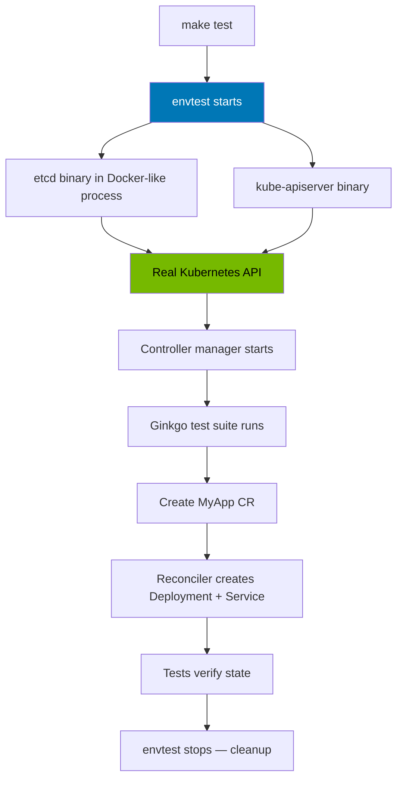
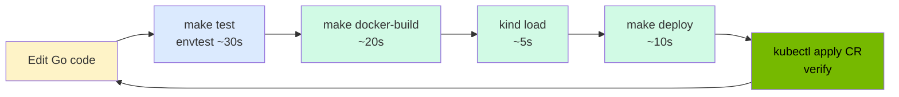

> 💡 **Quick Answer:** Scaffold with `operator-sdk init` + `operator-sdk create api`, write your reconciler logic, then test at 3 levels: (1) unit tests with `envtest` (fake API server in Docker), (2) integration tests with Kind (full cluster in Docker), (3) e2e tests with `make docker-build && kind load`. No cloud cluster needed — everything runs in Docker on your laptop.

## The Problem

You need to build a Kubernetes operator to manage a custom application lifecycle — but the feedback loop is painfully slow. Building, pushing to a registry, deploying to a cluster, checking logs, and repeating takes 10+ minutes per iteration. You need a fast, Docker-based development and testing workflow that runs entirely on your local machine.

## The Solution

### Project Setup

#### Prerequisites

```bash
# Install operator-sdk
export ARCH=$(case $(uname -m) in x86_64) echo amd64 ;; aarch64) echo arm64 ;; esac)
export OS=$(uname | awk '{print tolower($0)}')
curl -LO "https://github.com/operator-framework/operator-sdk/releases/download/v1.37.0/operator-sdk_${OS}_${ARCH}"
chmod +x "operator-sdk_${OS}_${ARCH}"
sudo mv "operator-sdk_${OS}_${ARCH}" /usr/local/bin/operator-sdk

# Install Kind (Kubernetes in Docker)
go install sigs.k8s.io/kind@v0.24.0

# Verify Docker
docker version
```

#### Scaffold the Operator

```bash
mkdir myapp-operator && cd myapp-operator

# Initialize the project
operator-sdk init \
  --domain example.com \
  --repo github.com/myorg/myapp-operator

# Create an API and controller
operator-sdk create api \
  --group apps \
  --version v1alpha1 \
  --kind MyApp \
  --resource --controller
```

This generates:

```
myapp-operator/
├── Dockerfile                    # Multi-stage operator image
├── Makefile                      # Build, test, deploy targets
├── api/v1alpha1/
│   ├── myapp_types.go           # CRD type definitions
│   └── zz_generated.deepcopy.go
├── config/
│   ├── crd/                     # Generated CRD manifests
│   ├── manager/                 # Operator Deployment
│   ├── rbac/                    # RBAC roles
│   └── samples/                 # Example CRs
├── internal/controller/
│   ├── myapp_controller.go      # Reconciliation logic
│   └── myapp_controller_test.go # Controller tests
└── cmd/main.go                  # Entrypoint
```

### Step 1: Define Your CRD Types

```go
// api/v1alpha1/myapp_types.go
package v1alpha1

import (
    metav1 "k8s.io/apimachinery/pkg/apis/meta/v1"
)

// MyAppSpec defines the desired state
type MyAppSpec struct {
    // Replicas is the number of app instances
    // +kubebuilder:validation:Minimum=1
    // +kubebuilder:validation:Maximum=10
    // +kubebuilder:default=1
    Replicas int32 `json:"replicas"`

    // Image is the container image to deploy
    // +kubebuilder:validation:Required
    Image string `json:"image"`

    // Port is the container port
    // +kubebuilder:default=8080
    Port int32 `json:"port,omitempty"`

    // Config holds application configuration
    // +optional
    Config map[string]string `json:"config,omitempty"`
}

// MyAppStatus defines the observed state
type MyAppStatus struct {
    // ReadyReplicas is the number of ready pods
    ReadyReplicas int32 `json:"readyReplicas,omitempty"`

    // Phase represents the current lifecycle phase
    // +kubebuilder:validation:Enum=Pending;Running;Failed;Updating
    Phase string `json:"phase,omitempty"`

    // Conditions represent the latest available observations
    Conditions []metav1.Condition `json:"conditions,omitempty"`
}

// +kubebuilder:object:root=true
// +kubebuilder:subresource:status
// +kubebuilder:printcolumn:name="Replicas",type="integer",JSONPath=".spec.replicas"
// +kubebuilder:printcolumn:name="Ready",type="integer",JSONPath=".status.readyReplicas"
// +kubebuilder:printcolumn:name="Phase",type="string",JSONPath=".status.phase"
// +kubebuilder:printcolumn:name="Age",type="date",JSONPath=".metadata.creationTimestamp"
type MyApp struct {
    metav1.TypeMeta   `json:",inline"`
    metav1.ObjectMeta `json:"metadata,omitempty"`

    Spec   MyAppSpec   `json:"spec,omitempty"`
    Status MyAppStatus `json:"status,omitempty"`
}

// +kubebuilder:object:root=true
type MyAppList struct {
    metav1.TypeMeta `json:",inline"`
    metav1.ListMeta `json:"metadata,omitempty"`
    Items           []MyApp `json:"items"`
}

func init() {
    SchemeBuilder.Register(&MyApp{}, &MyAppList{})
}
```

```bash
# Generate CRD manifests and deepcopy
make generate
make manifests
```

### Step 2: Write the Reconciler

```go
// internal/controller/myapp_controller.go
package controller

import (
    "context"
    "fmt"

    appsv1 "k8s.io/api/apps/v1"
    corev1 "k8s.io/api/core/v1"
    "k8s.io/apimachinery/pkg/api/errors"
    metav1 "k8s.io/apimachinery/pkg/apis/meta/v1"
    "k8s.io/apimachinery/pkg/runtime"
    "k8s.io/apimachinery/pkg/types"
    "k8s.io/apimachinery/pkg/util/intstr"
    ctrl "sigs.k8s.io/controller-runtime"
    "sigs.k8s.io/controller-runtime/pkg/client"
    "sigs.k8s.io/controller-runtime/pkg/controller/controllerutil"
    "sigs.k8s.io/controller-runtime/pkg/log"

    appsv1alpha1 "github.com/myorg/myapp-operator/api/v1alpha1"
)

type MyAppReconciler struct {
    client.Client
    Scheme *runtime.Scheme
}

// +kubebuilder:rbac:groups=apps.example.com,resources=myapps,verbs=get;list;watch;create;update;patch;delete
// +kubebuilder:rbac:groups=apps.example.com,resources=myapps/status,verbs=get;update;patch
// +kubebuilder:rbac:groups=apps.example.com,resources=myapps/finalizers,verbs=update
// +kubebuilder:rbac:groups=apps,resources=deployments,verbs=get;list;watch;create;update;patch;delete
// +kubebuilder:rbac:groups="",resources=services;configmaps,verbs=get;list;watch;create;update;patch;delete

func (r *MyAppReconciler) Reconcile(ctx context.Context, req ctrl.Request) (ctrl.Result, error) {
    logger := log.FromContext(ctx)

    // Fetch the MyApp instance
    myapp := &appsv1alpha1.MyApp{}
    if err := r.Get(ctx, req.NamespacedName, myapp); err != nil {
        if errors.IsNotFound(err) {
            logger.Info("MyApp resource not found — probably deleted")
            return ctrl.Result{}, nil
        }
        return ctrl.Result{}, err
    }

    // Update status phase
    myapp.Status.Phase = "Pending"

    // Reconcile ConfigMap (if config provided)
    if len(myapp.Spec.Config) > 0 {
        if err := r.reconcileConfigMap(ctx, myapp); err != nil {
            return ctrl.Result{}, err
        }
    }

    // Reconcile Deployment
    if err := r.reconcileDeployment(ctx, myapp); err != nil {
        myapp.Status.Phase = "Failed"
        _ = r.Status().Update(ctx, myapp)
        return ctrl.Result{}, err
    }

    // Reconcile Service
    if err := r.reconcileService(ctx, myapp); err != nil {
        return ctrl.Result{}, err
    }

    // Update status from Deployment
    deploy := &appsv1.Deployment{}
    if err := r.Get(ctx, types.NamespacedName{
        Name:      myapp.Name,
        Namespace: myapp.Namespace,
    }, deploy); err == nil {
        myapp.Status.ReadyReplicas = deploy.Status.ReadyReplicas
        if deploy.Status.ReadyReplicas == *deploy.Spec.Replicas {
            myapp.Status.Phase = "Running"
        } else {
            myapp.Status.Phase = "Updating"
        }
    }

    if err := r.Status().Update(ctx, myapp); err != nil {
        return ctrl.Result{}, err
    }

    logger.Info("Reconciliation complete",
        "phase", myapp.Status.Phase,
        "ready", myapp.Status.ReadyReplicas)

    return ctrl.Result{}, nil
}

func (r *MyAppReconciler) reconcileDeployment(ctx context.Context, myapp *appsv1alpha1.MyApp) error {
    deploy := &appsv1.Deployment{
        ObjectMeta: metav1.ObjectMeta{
            Name:      myapp.Name,
            Namespace: myapp.Namespace,
        },
    }

    result, err := controllerutil.CreateOrUpdate(ctx, r.Client, deploy, func() error {
        labels := map[string]string{
            "app.kubernetes.io/name":       myapp.Name,
            "app.kubernetes.io/managed-by": "myapp-operator",
            "app.kubernetes.io/instance":   myapp.Name,
        }

        deploy.Spec = appsv1.DeploymentSpec{
            Replicas: &myapp.Spec.Replicas,
            Selector: &metav1.LabelSelector{
                MatchLabels: labels,
            },
            Template: corev1.PodTemplateSpec{
                ObjectMeta: metav1.ObjectMeta{
                    Labels: labels,
                },
                Spec: corev1.PodSpec{
                    Containers: []corev1.Container{
                        {
                            Name:  "app",
                            Image: myapp.Spec.Image,
                            Ports: []corev1.ContainerPort{
                                {
                                    ContainerPort: myapp.Spec.Port,
                                    Protocol:      corev1.ProtocolTCP,
                                },
                            },
                            ReadinessProbe: &corev1.Probe{
                                ProbeHandler: corev1.ProbeHandler{
                                    TCPSocket: &corev1.TCPSocketAction{
                                        Port: intstr.FromInt32(myapp.Spec.Port),
                                    },
                                },
                                InitialDelaySeconds: 5,
                                PeriodSeconds:       10,
                            },
                        },
                    },
                },
            },
        }

        // Mount ConfigMap if it exists
        if len(myapp.Spec.Config) > 0 {
            deploy.Spec.Template.Spec.Volumes = []corev1.Volume{
                {
                    Name: "config",
                    VolumeSource: corev1.VolumeSource{
                        ConfigMap: &corev1.ConfigMapVolumeSource{
                            LocalObjectReference: corev1.LocalObjectReference{
                                Name: myapp.Name + "-config",
                            },
                        },
                    },
                },
            }
            deploy.Spec.Template.Spec.Containers[0].VolumeMounts = []corev1.VolumeMount{
                {
                    Name:      "config",
                    MountPath: "/etc/myapp",
                    ReadOnly:  true,
                },
            }
        }

        // Set owner reference for garbage collection
        return controllerutil.SetControllerReference(myapp, deploy, r.Scheme)
    })

    if err != nil {
        return fmt.Errorf("failed to reconcile Deployment: %w", err)
    }

    log.FromContext(ctx).Info("Deployment reconciled", "result", result)
    return nil
}

func (r *MyAppReconciler) reconcileService(ctx context.Context, myapp *appsv1alpha1.MyApp) error {
    svc := &corev1.Service{
        ObjectMeta: metav1.ObjectMeta{
            Name:      myapp.Name,
            Namespace: myapp.Namespace,
        },
    }

    _, err := controllerutil.CreateOrUpdate(ctx, r.Client, svc, func() error {
        svc.Spec = corev1.ServiceSpec{
            Selector: map[string]string{
                "app.kubernetes.io/name":     myapp.Name,
                "app.kubernetes.io/instance": myapp.Name,
            },
            Ports: []corev1.ServicePort{
                {
                    Port:       myapp.Spec.Port,
                    TargetPort: intstr.FromInt32(myapp.Spec.Port),
                    Protocol:   corev1.ProtocolTCP,
                },
            },
        }
        return controllerutil.SetControllerReference(myapp, svc, r.Scheme)
    })

    return err
}

func (r *MyAppReconciler) reconcileConfigMap(ctx context.Context, myapp *appsv1alpha1.MyApp) error {
    cm := &corev1.ConfigMap{
        ObjectMeta: metav1.ObjectMeta{
            Name:      myapp.Name + "-config",
            Namespace: myapp.Namespace,
        },
    }

    _, err := controllerutil.CreateOrUpdate(ctx, r.Client, cm, func() error {
        cm.Data = myapp.Spec.Config
        return controllerutil.SetControllerReference(myapp, cm, r.Scheme)
    })

    return err
}

func (r *MyAppReconciler) SetupWithManager(mgr ctrl.Manager) error {
    return ctrl.NewControllerManagedBy(mgr).
        For(&appsv1alpha1.MyApp{}).
        Owns(&appsv1.Deployment{}).
        Owns(&corev1.Service{}).
        Owns(&corev1.ConfigMap{}).
        Complete(r)
}
```

### Step 3: Test Level 1 — Unit Tests with envtest (Docker)

`envtest` runs a real API server and etcd **in Docker** — no Kind cluster needed. Lightning fast.

```go
// internal/controller/myapp_controller_test.go
package controller

import (
    "context"
    "time"

    . "github.com/onsi/ginkgo/v2"
    . "github.com/onsi/gomega"

    appsv1 "k8s.io/api/apps/v1"
    corev1 "k8s.io/api/core/v1"
    metav1 "k8s.io/apimachinery/pkg/apis/meta/v1"
    "k8s.io/apimachinery/pkg/types"

    appsv1alpha1 "github.com/myorg/myapp-operator/api/v1alpha1"
)

var _ = Describe("MyApp Controller", func() {
    const (
        timeout  = time.Second * 30
        interval = time.Millisecond * 250

        myappName      = "test-myapp"
        myappNamespace = "default"
        myappImage     = "nginx:1.27"
    )

    Context("When creating a MyApp resource", func() {
        It("Should create a Deployment with correct replicas", func() {
            ctx := context.Background()

            // Create a MyApp instance
            myapp := &appsv1alpha1.MyApp{
                ObjectMeta: metav1.ObjectMeta{
                    Name:      myappName,
                    Namespace: myappNamespace,
                },
                Spec: appsv1alpha1.MyAppSpec{
                    Replicas: 3,
                    Image:    myappImage,
                    Port:     8080,
                },
            }
            Expect(k8sClient.Create(ctx, myapp)).To(Succeed())

            // Verify Deployment is created
            deployKey := types.NamespacedName{Name: myappName, Namespace: myappNamespace}
            deploy := &appsv1.Deployment{}
            Eventually(func() error {
                return k8sClient.Get(ctx, deployKey, deploy)
            }, timeout, interval).Should(Succeed())

            Expect(*deploy.Spec.Replicas).To(Equal(int32(3)))
            Expect(deploy.Spec.Template.Spec.Containers[0].Image).To(Equal(myappImage))
        })

        It("Should create a Service", func() {
            ctx := context.Background()

            svcKey := types.NamespacedName{Name: myappName, Namespace: myappNamespace}
            svc := &corev1.Service{}
            Eventually(func() error {
                return k8sClient.Get(ctx, svcKey, svc)
            }, timeout, interval).Should(Succeed())

            Expect(svc.Spec.Ports[0].Port).To(Equal(int32(8080)))
        })

        It("Should create a ConfigMap when config is provided", func() {
            ctx := context.Background()

            // Update MyApp with config
            myapp := &appsv1alpha1.MyApp{}
            Expect(k8sClient.Get(ctx, types.NamespacedName{
                Name: myappName, Namespace: myappNamespace,
            }, myapp)).To(Succeed())

            myapp.Spec.Config = map[string]string{
                "database_url": "postgres://db:5432/myapp",
                "log_level":    "info",
            }
            Expect(k8sClient.Update(ctx, myapp)).To(Succeed())

            // Verify ConfigMap
            cmKey := types.NamespacedName{Name: myappName + "-config", Namespace: myappNamespace}
            cm := &corev1.ConfigMap{}
            Eventually(func() error {
                return k8sClient.Get(ctx, cmKey, cm)
            }, timeout, interval).Should(Succeed())

            Expect(cm.Data["database_url"]).To(Equal("postgres://db:5432/myapp"))
        })

        It("Should update Deployment when replicas change", func() {
            ctx := context.Background()

            // Update replicas
            myapp := &appsv1alpha1.MyApp{}
            Expect(k8sClient.Get(ctx, types.NamespacedName{
                Name: myappName, Namespace: myappNamespace,
            }, myapp)).To(Succeed())

            myapp.Spec.Replicas = 5
            Expect(k8sClient.Update(ctx, myapp)).To(Succeed())

            // Verify Deployment updated
            deploy := &appsv1.Deployment{}
            Eventually(func(g Gomega) {
                g.Expect(k8sClient.Get(ctx, types.NamespacedName{
                    Name: myappName, Namespace: myappNamespace,
                }, deploy)).To(Succeed())
                g.Expect(*deploy.Spec.Replicas).To(Equal(int32(5)))
            }, timeout, interval).Should(Succeed())
        })

        It("Should clean up resources when MyApp is deleted", func() {
            ctx := context.Background()

            // Delete MyApp
            myapp := &appsv1alpha1.MyApp{}
            Expect(k8sClient.Get(ctx, types.NamespacedName{
                Name: myappName, Namespace: myappNamespace,
            }, myapp)).To(Succeed())
            Expect(k8sClient.Delete(ctx, myapp)).To(Succeed())

            // Deployment should be garbage collected (owner reference)
            deploy := &appsv1.Deployment{}
            Eventually(func() bool {
                err := k8sClient.Get(ctx, types.NamespacedName{
                    Name: myappName, Namespace: myappNamespace,
                }, deploy)
                return err != nil // Should be NotFound
            }, timeout, interval).Should(BeTrue())
        })
    })
})
```

The test suite setup (`suite_test.go`) starts envtest automatically:

```go
// internal/controller/suite_test.go
package controller

import (
    "fmt"
    "path/filepath"
    "runtime"
    "testing"

    . "github.com/onsi/ginkgo/v2"
    . "github.com/onsi/gomega"

    "k8s.io/client-go/kubernetes/scheme"
    "k8s.io/client-go/rest"
    ctrl "sigs.k8s.io/controller-runtime"
    "sigs.k8s.io/controller-runtime/pkg/client"
    "sigs.k8s.io/controller-runtime/pkg/envtest"
    logf "sigs.k8s.io/controller-runtime/pkg/log"
    "sigs.k8s.io/controller-runtime/pkg/log/zap"

    appsv1alpha1 "github.com/myorg/myapp-operator/api/v1alpha1"
)

var (
    cfg       *rest.Config
    k8sClient client.Client
    testEnv   *envtest.Environment
)

func TestControllers(t *testing.T) {
    RegisterFailHandler(Fail)
    RunSpecs(t, "Controller Suite")
}

var _ = BeforeSuite(func() {
    logf.SetLogger(zap.New(zap.WriteTo(GinkgoWriter), zap.UseDevMode(true)))

    // Start envtest — downloads and runs API server + etcd binaries
    testEnv = &envtest.Environment{
        CRDDirectoryPaths:     []string{filepath.Join("..", "..", "config", "crd", "bases")},
        ErrorIfCRDPathMissing: true,
        BinaryAssetsDirectory: filepath.Join("..", "..", "bin", "k8s",
            fmt.Sprintf("1.31.0-%s-%s", runtime.GOOS, runtime.GOARCH)),
    }

    var err error
    cfg, err = testEnv.Start()
    Expect(err).NotTo(HaveOccurred())
    Expect(cfg).NotTo(BeNil())

    err = appsv1alpha1.AddToScheme(scheme.Scheme)
    Expect(err).NotTo(HaveOccurred())

    k8sClient, err = client.New(cfg, client.Options{Scheme: scheme.Scheme})
    Expect(err).NotTo(HaveOccurred())
    Expect(k8sClient).NotTo(BeNil())

    // Start the controller manager
    mgr, err := ctrl.NewManager(cfg, ctrl.Options{
        Scheme: scheme.Scheme,
    })
    Expect(err).NotTo(HaveOccurred())

    err = (&MyAppReconciler{
        Client: mgr.GetClient(),
        Scheme: mgr.GetScheme(),
    }).SetupWithManager(mgr)
    Expect(err).NotTo(HaveOccurred())

    go func() {
        defer GinkgoRecover()
        err = mgr.Start(ctrl.SetupSignalHandler())
        Expect(err).NotTo(HaveOccurred())
    }()
})

var _ = AfterSuite(func() {
    err := testEnv.Stop()
    Expect(err).NotTo(HaveOccurred())
})
```

**Run unit tests:**

```bash
# Downloads envtest binaries (API server + etcd) automatically
make test

# Or manually:
go test ./internal/controller/ -v -ginkgo.v
```



### Step 4: Test Level 2 — Integration Tests with Kind (Docker)

Kind runs a full Kubernetes cluster inside Docker containers.

```bash
# Create a Kind cluster
cat > kind-config.yaml << 'EOF'
kind: Cluster
apiVersion: kind.x-k8s.io/v1alpha4
nodes:
  - role: control-plane
  - role: worker
  - role: worker
EOF

kind create cluster --name operator-test --config kind-config.yaml

# Build the operator image
make docker-build IMG=myapp-operator:test

# Load into Kind (no registry push needed!)
kind load docker-image myapp-operator:test --name operator-test

# Install CRDs
make install

# Deploy the operator
make deploy IMG=myapp-operator:test
```

**Create a test CR:**

```yaml
# config/samples/apps_v1alpha1_myapp.yaml
apiVersion: apps.example.com/v1alpha1
kind: MyApp
metadata:
  name: sample-app
  namespace: default
spec:
  replicas: 3
  image: nginx:1.27
  port: 80
  config:
    index.html: |
      <h1>Hello from MyApp Operator!</h1>
```

```bash
# Apply the sample
kubectl apply -f config/samples/apps_v1alpha1_myapp.yaml

# Watch the operator work
kubectl get myapp sample-app -w
# NAME         REPLICAS   READY   PHASE     AGE
# sample-app   3          0       Pending   0s
# sample-app   3          1       Updating  5s
# sample-app   3          3       Running   15s

# Verify created resources
kubectl get deploy,svc,cm -l app.kubernetes.io/managed-by=myapp-operator
# NAME                         READY   UP-TO-DATE   AVAILABLE
# deployment.apps/sample-app   3/3     3            3
#
# NAME                 TYPE        CLUSTER-IP    PORT(S)
# service/sample-app   ClusterIP   10.96.1.123   80/TCP
#
# NAME                           DATA
# configmap/sample-app-config    1
```

### Step 5: Test Level 3 — Automated E2E Tests

```bash
# test/e2e/e2e_test.go — run against Kind cluster
```

```go
// test/e2e/e2e_test.go
package e2e

import (
    "os/exec"
    "testing"
    "time"

    . "github.com/onsi/ginkgo/v2"
    . "github.com/onsi/gomega"
)

func TestE2E(t *testing.T) {
    RegisterFailHandler(Fail)
    RunSpecs(t, "E2E Suite")
}

var _ = Describe("MyApp Operator E2E", Ordered, func() {
    BeforeAll(func() {
        // Build and load image into Kind
        cmd := exec.Command("make", "docker-build", "IMG=myapp-operator:e2e")
        out, err := cmd.CombinedOutput()
        Expect(err).NotTo(HaveOccurred(), string(out))

        cmd = exec.Command("kind", "load", "docker-image", "myapp-operator:e2e", "--name", "operator-test")
        out, err = cmd.CombinedOutput()
        Expect(err).NotTo(HaveOccurred(), string(out))

        // Deploy operator
        cmd = exec.Command("make", "deploy", "IMG=myapp-operator:e2e")
        out, err = cmd.CombinedOutput()
        Expect(err).NotTo(HaveOccurred(), string(out))

        // Wait for operator to be ready
        Eventually(func() error {
            cmd := exec.Command("kubectl", "rollout", "status",
                "deploy/myapp-operator-controller-manager",
                "-n", "myapp-operator-system",
                "--timeout=60s")
            _, err := cmd.CombinedOutput()
            return err
        }, 90*time.Second, 5*time.Second).Should(Succeed())
    })

    It("Should create a complete application from MyApp CR", func() {
        // Apply sample CR
        cmd := exec.Command("kubectl", "apply", "-f", "config/samples/apps_v1alpha1_myapp.yaml")
        out, err := cmd.CombinedOutput()
        Expect(err).NotTo(HaveOccurred(), string(out))

        // Wait for Deployment to be ready
        Eventually(func() error {
            cmd := exec.Command("kubectl", "rollout", "status", "deploy/sample-app", "--timeout=60s")
            _, err := cmd.CombinedOutput()
            return err
        }, 120*time.Second, 5*time.Second).Should(Succeed())

        // Verify MyApp status
        cmd = exec.Command("kubectl", "get", "myapp", "sample-app",
            "-o", "jsonpath={.status.phase}")
        out, err = cmd.CombinedOutput()
        Expect(err).NotTo(HaveOccurred())
        Expect(string(out)).To(Equal("Running"))
    })

    It("Should scale when replicas change", func() {
        cmd := exec.Command("kubectl", "patch", "myapp", "sample-app",
            "--type", "merge", "-p", `{"spec":{"replicas":5}}`)
        out, err := cmd.CombinedOutput()
        Expect(err).NotTo(HaveOccurred(), string(out))

        Eventually(func() string {
            cmd := exec.Command("kubectl", "get", "deploy", "sample-app",
                "-o", "jsonpath={.spec.replicas}")
            out, _ := cmd.CombinedOutput()
            return string(out)
        }, 30*time.Second, 2*time.Second).Should(Equal("5"))
    })

    It("Should clean up resources on deletion", func() {
        cmd := exec.Command("kubectl", "delete", "myapp", "sample-app")
        out, err := cmd.CombinedOutput()
        Expect(err).NotTo(HaveOccurred(), string(out))

        Eventually(func() error {
            cmd := exec.Command("kubectl", "get", "deploy", "sample-app")
            _, err := cmd.CombinedOutput()
            return err // Should fail with NotFound
        }, 30*time.Second, 2*time.Second).Should(HaveOccurred())
    })

    AfterAll(func() {
        exec.Command("make", "undeploy").Run()
    })
})
```

**Run E2E tests:**

```bash
# Ensure Kind cluster is running
kind get clusters | grep operator-test

# Run E2E
go test ./test/e2e/ -v -ginkgo.v -timeout 10m
```

### The Complete Docker-Based Development Loop

```bash
#!/bin/bash
# dev-loop.sh — Fast iteration cycle (< 2 minutes total)

set -e

echo "=== 1. Unit Tests (envtest — ~30s) ==="
make test
echo "✅ Unit tests passed"

echo ""
echo "=== 2. Build Docker Image (~20s) ==="
make docker-build IMG=myapp-operator:dev
echo "✅ Image built"

echo ""
echo "=== 3. Load Into Kind (~5s) ==="
kind load docker-image myapp-operator:dev --name operator-test
echo "✅ Image loaded"

echo ""
echo "=== 4. Deploy to Kind (~10s) ==="
make deploy IMG=myapp-operator:dev
kubectl rollout status deploy/myapp-operator-controller-manager \
  -n myapp-operator-system --timeout=60s
echo "✅ Operator deployed"

echo ""
echo "=== 5. Apply Test CR ==="
kubectl apply -f config/samples/apps_v1alpha1_myapp.yaml
sleep 5
kubectl get myapp sample-app
echo "✅ CR applied"

echo ""
echo "=== 6. Check Logs ==="
kubectl logs -n myapp-operator-system deploy/myapp-operator-controller-manager \
  -c manager --since=30s | tail -20
```



**Total loop time: ~65 seconds** (vs 10+ minutes with a remote registry and cloud cluster)

### Makefile Targets Reference

```makefile
# Already generated by operator-sdk, key targets:
make generate       # Generate deepcopy methods
make manifests      # Generate CRD/RBAC/webhook manifests
make test           # Run envtest unit tests
make docker-build   # Build operator Docker image
make install        # Install CRDs into cluster
make deploy         # Deploy operator to cluster
make undeploy       # Remove operator from cluster
make bundle         # Generate OLM bundle
```

### Dockerfile (Multi-Stage)

The scaffolded `Dockerfile` is already optimized:

```dockerfile
# Build stage
FROM golang:1.22 AS builder
ARG TARGETOS
ARG TARGETARCH

WORKDIR /workspace
COPY go.mod go.sum ./
RUN go mod download

COPY cmd/main.go cmd/main.go
COPY api/ api/
COPY internal/ internal/

RUN CGO_ENABLED=0 GOOS=${TARGETOS:-linux} GOARCH=${TARGETARCH} \
    go build -a -o manager cmd/main.go

# Runtime stage — distroless for security
FROM gcr.io/distroless/static:nonroot
WORKDIR /
COPY --from=builder /workspace/manager .
USER 65532:65532

ENTRYPOINT ["/manager"]
```

## Common Issues

### envtest Binary Download Fails

```bash
# Manually download envtest assets
make envtest
ENVTEST=$(which setup-envtest)
$ENVTEST use 1.31.0 --bin-dir ./bin/k8s
```

### Kind Cluster Runs Out of Disk

```bash
# Docker is eating disk — clean up
docker system prune -a
kind delete cluster --name operator-test
kind create cluster --name operator-test
```

### Controller Logs Not Showing Reconciliation

```bash
# Check the manager container (not the kube-rbac-proxy sidecar)
kubectl logs -n myapp-operator-system deploy/myapp-operator-controller-manager -c manager -f

# Increase verbosity
# In cmd/main.go, set: ctrl.SetLogger(zap.New(zap.UseDevMode(true)))
```

### CRD Changes Not Reflected

```bash
# Regenerate and reinstall
make generate manifests install
# If in Kind, also redeploy:
make docker-build IMG=myapp-operator:dev
kind load docker-image myapp-operator:dev --name operator-test
make deploy IMG=myapp-operator:dev
```

## Best Practices

- **Run `make test` on every save** — envtest is fast enough for TDD (~30s)
- **Use Kind for integration tests** — real cluster behavior without cloud costs
- **`kind load docker-image`** — skips registry entirely, seconds instead of minutes
- **Set owner references** — automatic garbage collection when CR is deleted
- **Use `controllerutil.CreateOrUpdate`** — idempotent reconciliation
- **Test all CRUD operations** — create, update (replicas, image, config), delete
- **Use distroless base image** — minimal attack surface for production
- **Generate RBAC from markers** — `// +kubebuilder:rbac:` comments auto-generate ClusterRole

## Key Takeaways

- **3 test levels**: envtest (unit, ~30s), Kind (integration, ~2min), e2e (full lifecycle, ~5min)
- **Everything runs in Docker** — no cloud cluster needed for development
- **`kind load docker-image`** eliminates registry push — fastest image delivery
- **envtest = real API server + etcd** — not mocks, actual Kubernetes behavior
- **Total dev loop: ~65 seconds** from code change to verified deployment
- **Operator SDK scaffolding** gives you Dockerfile, Makefile, test suite, RBAC — just add business logic
