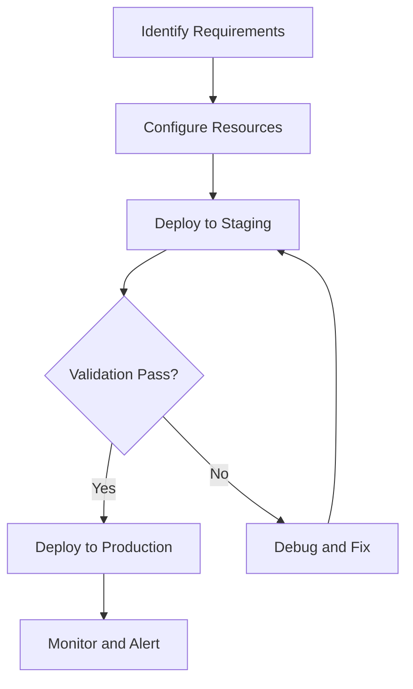

> 💡 **Quick Answer:** Configure cert-manager with Cloudflare DNS01 challenge for wildcard TLS certificates on Kubernetes. API token secret, ClusterIssuer, and auto-renewal.

## The Problem

Configure cert-manager with Cloudflare DNS01 challenge for wildcard TLS certificates on Kubernetes. Without proper configuration, teams encounter unexpected behavior, security gaps, or performance issues in production Kubernetes clusters.

## The Solution

### Prerequisites

```bash
# Verify cluster access
kubectl cluster-info
kubectl get nodes -o wide
```

### Configuration

```yaml
# cert-manager Cloudflare DNS01 K8s — production configuration
apiVersion: v1
kind: ConfigMap
metadata:
  name: cert-manager-cloudflare-dns01-k8s-config
  namespace: production
  labels:
    app.kubernetes.io/managed-by: kubectl
data:
  config.yaml: |
    enabled: true
    logLevel: info
```

### Deployment

```bash
# Apply configuration
kubectl apply -f config.yaml

# Verify resources
kubectl get all -n production

# Check logs
kubectl logs -n production -l component=controller --tail=50
```

### Verification

```bash
# Confirm deployment
kubectl get pods -n production -o wide
kubectl describe pod -n production <pod-name>
```



## Common Issues

**Configuration not applying**

Verify the namespace exists and RBAC allows the operation. Check events with `kubectl get events -n production --sort-by=.metadata.creationTimestamp`.

**Unexpected behavior after changes**

Review all related resources. Use `kubectl diff -f config.yaml` before applying to preview changes.

## Best Practices

- Test all changes in staging before production deployment
- Version all configuration in Git for audit trail and rollback
- Monitor key metrics after deployment with Prometheus alerts
- Document operational procedures and decisions in PR descriptions
- Automate validation with CI/CD pipeline checks

## Key Takeaways

- cert-manager Cloudflare DNS01 K8s is essential for production Kubernetes operations
- Start with safe defaults and tune based on monitoring data
- Always test in non-production environments first
- Combine with observability for full visibility into cluster behavior
- Automate repetitive operations with GitOps and CI/CD pipelines
