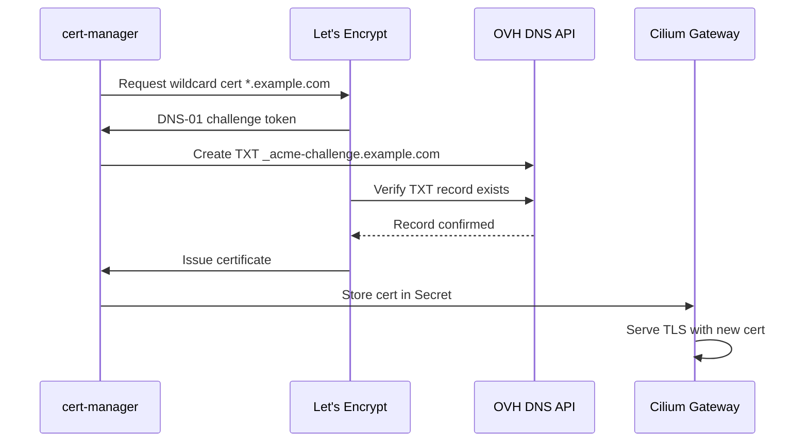

> 💡 **Quick Answer:** cert-manager with OVH DNS-01 solver automates wildcard TLS certificates (`*.example.com`) from Let's Encrypt. DNS-01 challenges work without exposing port 80, perfect for private clusters.

## The Problem

You need TLS certificates for multiple subdomains (gitea.example.com, hubble.example.com, octopus.example.com) but:
- HTTP-01 challenges require port 80 open to the internet for each domain
- Manual certificate management doesn't scale
- Wildcard certificates require DNS-01 challenges
- OVH's API authentication is non-trivial (application key + consumer key + secret)

## The Solution

Deploy cert-manager with the OVH DNS-01 webhook to automatically issue and renew wildcard certificates.

### Architecture



### Step 1: Install cert-manager

```bash
helm repo add jetstack https://charts.jetstack.io
helm repo update

helm install cert-manager jetstack/cert-manager \
  --namespace cert-manager \
  --create-namespace \
  --version v1.16.3 \
  --set crds.enabled=true \
  --set dns01RecursiveNameserversOnly=true \
  --set dns01RecursiveNameservers="1.1.1.1:53,8.8.8.8:53"
```

### Step 2: Create OVH API Credentials

```bash
# Generate OVH API credentials at:
# https://eu.api.ovh.com/createToken/

# Required permissions:
# GET    /domain/zone/*
# POST   /domain/zone/*
# DELETE /domain/zone/*
# PUT    /domain/zone/*

# Store credentials in a Secret
kubectl create secret generic ovh-credentials \
  --namespace cert-manager \
  --from-literal=applicationKey=YOUR_APP_KEY \
  --from-literal=applicationSecret=YOUR_APP_SECRET \
  --from-literal=consumerKey=YOUR_CONSUMER_KEY
```

### Step 3: Install OVH Webhook

```bash
# cert-manager-webhook-ovh
helm repo add cert-manager-webhook-ovh https://aureq.github.io/cert-manager-webhook-ovh
helm repo update

helm install cert-manager-webhook-ovh cert-manager-webhook-ovh/cert-manager-webhook-ovh \
  --namespace cert-manager \
  --set groupName=acme.example.com
```

### Step 4: Create ClusterIssuer

```yaml
# clusterissuer-letsencrypt.yaml
apiVersion: cert-manager.io/v1
kind: ClusterIssuer
metadata:
  name: letsencrypt-prod
spec:
  acme:
    server: https://acme-v02.api.letsencrypt.org/directory
    email: admin@example.com
    privateKeySecretRef:
      name: letsencrypt-prod-account
    solvers:
      - dns01:
          webhook:
            groupName: acme.example.com
            solverName: ovh
            config:
              endpoint: ovh-eu
              applicationKeyRef:
                name: ovh-credentials
                key: applicationKey
              applicationSecretRef:
                name: ovh-credentials
                key: applicationSecret
              consumerKeyRef:
                name: ovh-credentials
                key: consumerKey
```

### Step 5: Request Wildcard Certificate

```yaml
# wildcard-cert.yaml
apiVersion: cert-manager.io/v1
kind: Certificate
metadata:
  name: wildcard-tls
  namespace: cert-manager
spec:
  secretName: wildcard-tls
  issuerRef:
    name: letsencrypt-prod
    kind: ClusterIssuer
  dnsNames:
    - "example.com"
    - "*.example.com"
  # Optional: copy secret to other namespaces
  secretTemplate:
    annotations:
      reflector.v1.k8s.emberstack.com/reflection-allowed: "true"
      reflector.v1.k8s.emberstack.com/reflection-auto-enabled: "true"
```

### Step 6: Verify Certificate Issuance

```bash
# Watch certificate status
kubectl get certificate -n cert-manager -w
# NAME           READY   SECRET         AGE
# wildcard-tls   True    wildcard-tls   2m

# Check certificate details
kubectl describe certificate wildcard-tls -n cert-manager

# Verify the challenge completed
kubectl get challenges -A
# (should be empty if successful)

# Check the actual cert
kubectl get secret wildcard-tls -n cert-manager -o jsonpath='{.data.tls\.crt}' | \
  base64 -d | openssl x509 -noout -text | grep -A1 "Subject Alternative"
# DNS:example.com, DNS:*.example.com
```

## Common Issues

| Issue | Cause | Fix |
|-------|-------|-----|
| Challenge stuck Pending | OVH API rate limit | Wait 60s, check webhook logs |
| 403 from OVH API | Wrong consumer key permissions | Regenerate with correct ACLs |
| DNS propagation timeout | Slow OVH DNS | Set `dns01RecursiveNameservers` to 1.1.1.1 |
| Certificate not renewing | ClusterIssuer misconfigured | `kubectl describe clusterissuer` |
| Secret not in target namespace | No reflector/trust-manager | Install kubernetes-reflector |

## Best Practices

1. **Start with staging issuer** — Let's Encrypt has strict rate limits (5 certs/week/domain)
2. **Use `dns01RecursiveNameservers`** — bypass local DNS caching issues
3. **Install kubernetes-reflector** — copy wildcard secret to all namespaces automatically
4. **Set certificate renewal before 30 days** — default is fine (cert-manager renews at 2/3 lifetime)
5. **Monitor with Prometheus** — `certmanager_certificate_expiration_timestamp_seconds`

## Key Takeaways

- DNS-01 is the only way to get wildcard certificates from Let's Encrypt
- OVH webhook handles the DNS TXT record lifecycle automatically
- One wildcard certificate covers all subdomains — simpler than per-service certs
- cert-manager handles renewal transparently — zero manual intervention after setup
- Use kubernetes-reflector to distribute the secret across namespaces
