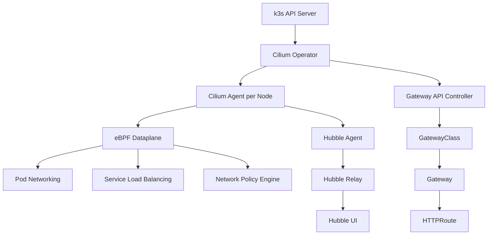

> 💡 **Quick Answer:** Cilium replaces kube-proxy with eBPF for faster networking, natively implements Gateway API (no separate ingress controller needed), and includes Hubble for real-time network flow observability — all in one CNI.

## The Problem

Default k3s networking (Flannel + kube-proxy + Traefik) works but lacks:
- eBPF-based packet processing (iptables is slow at scale)
- Native Gateway API support (Traefik needs CRD conversion)
- Built-in network observability (no visibility into pod-to-pod flows)
- Network policies beyond basic L3/L4

## The Solution

Install Cilium as the sole CNI with kube-proxy replacement, Gateway API controller, and Hubble UI.

### Architecture



### Step 1: Install Gateway API CRDs

```bash
# Gateway API CRDs must exist before Cilium installation
kubectl apply -f https://raw.githubusercontent.com/kubernetes-sigs/gateway-api/v1.2.1/config/crd/standard/gateway.networking.k8s.io_gatewayclasses.yaml
kubectl apply -f https://raw.githubusercontent.com/kubernetes-sigs/gateway-api/v1.2.1/config/crd/standard/gateway.networking.k8s.io_gateways.yaml
kubectl apply -f https://raw.githubusercontent.com/kubernetes-sigs/gateway-api/v1.2.1/config/crd/standard/gateway.networking.k8s.io_httproutes.yaml
kubectl apply -f https://raw.githubusercontent.com/kubernetes-sigs/gateway-api/v1.2.1/config/crd/standard/gateway.networking.k8s.io_referencegrants.yaml
kubectl apply -f https://raw.githubusercontent.com/kubernetes-sigs/gateway-api/v1.2.1/config/crd/experimental/gateway.networking.k8s.io_tlsroutes.yaml
```

### Step 2: Install Cilium via Helm

```bash
helm repo add cilium https://helm.cilium.io/
helm repo update

helm install cilium cilium/cilium --version 1.16.5 \
  --namespace kube-system \
  --set operator.replicas=1 \
  --set kubeProxyReplacement=true \
  --set k8sServiceHost=127.0.0.1 \
  --set k8sServicePort=6443 \
  --set gatewayAPI.enabled=true \
  --set hubble.enabled=true \
  --set hubble.relay.enabled=true \
  --set hubble.ui.enabled=true \
  --set hubble.metrics.enableOpenMetrics=true \
  --set hubble.metrics.enabled="{dns,drop,tcp,flow,port-distribution,icmp,httpV2:exemplars=true;labelsContext=source_ip\,source_namespace\,source_workload\,destination_ip\,destination_namespace\,destination_workload\,traffic_direction}" \
  --set ipam.mode=kubernetes \
  --set bpf.masquerade=true \
  --set loadBalancer.mode=dsr \
  --set routingMode=native \
  --set autoDirectNodeRoutes=true \
  --set ipv4NativeRoutingCIDR=10.42.0.0/16
```

### Step 3: Verify Installation

```bash
# Check Cilium status
cilium status --wait

# Verify kube-proxy replacement
cilium status | grep KubeProxyReplacement
# KubeProxyReplacement:   True

# Check node is Ready
kubectl get nodes
# NAME           STATUS   ROLES                  AGE   VERSION
# k3s-prod-01   Ready    control-plane,master   5m    v1.31.4+k3s1

# Verify GatewayClass
kubectl get gatewayclass
# NAME     CONTROLLER                     ACCEPTED   AGE
# cilium   io.cilium/gateway-controller   True       1m
```

### Step 4: Create the Gateway

```yaml
# gateway.yaml
apiVersion: gateway.networking.k8s.io/v1
kind: Gateway
metadata:
  name: cilium-gateway
  namespace: kube-system
  annotations:
    # Hetzner Cloud — use node external IP
    io.cilium/lb-ipam-ips: "AUTO"
spec:
  gatewayClassName: cilium
  listeners:
    - name: http
      protocol: HTTP
      port: 80
      allowedRoutes:
        namespaces:
          from: All
    - name: https
      protocol: HTTPS
      port: 443
      tls:
        mode: Terminate
        certificateRefs:
          - name: wildcard-tls
            namespace: cert-manager
      allowedRoutes:
        namespaces:
          from: All
```

### Step 5: Access Hubble UI

```bash
# Port-forward Hubble UI
kubectl port-forward -n kube-system svc/hubble-ui 12000:80

# Or expose via HTTPRoute
cat <<EOF | kubectl apply -f -
apiVersion: gateway.networking.k8s.io/v1
kind: HTTPRoute
metadata:
  name: hubble-ui
  namespace: kube-system
spec:
  parentRefs:
    - name: cilium-gateway
      namespace: kube-system
  hostnames:
    - "hubble.example.com"
  rules:
    - matches:
        - path:
            type: PathPrefix
            value: /
      backendRefs:
        - name: hubble-ui
          port: 80
EOF
```

### Step 6: Verify eBPF Programs

```bash
# List loaded BPF programs
sudo bpftool prog list | grep cilium | head -20

# Check Cilium eBPF map utilization
cilium bpf ct list global | wc -l

# Monitor real-time flows
hubble observe --follow --type trace
```

## Common Issues

| Issue | Cause | Fix |
|-------|-------|-----|
| Pods stuck in ContainerCreating | Cilium agent not ready | `cilium status --wait` then restart pods |
| GatewayClass not Accepted | CRDs missing | Install Gateway API CRDs first |
| No external connectivity | BPF masquerade issue | Set `bpf.masquerade=true` |
| Hubble shows no flows | Relay not connected | Check `hubble-relay` pod logs |
| DSR mode not working | Single-node only | Switch to `snat` for single-node |

## Best Practices

1. **Always install Gateway API CRDs before Cilium** — Cilium checks at startup
2. **Use `kubeProxyReplacement=true`** — don't run both kube-proxy and Cilium eBPF
3. **Enable Hubble metrics for Prometheus** — free network observability
4. **Set `routingMode=native`** for single-node — avoids unnecessary VXLAN encapsulation
5. **Pin Cilium version** — eBPF programs are version-specific, don't auto-upgrade

## Key Takeaways

- Cilium provides CNI + kube-proxy replacement + ingress controller + observability in one component
- Gateway API is the future of Kubernetes ingress — Cilium implements it natively
- Hubble gives you Wireshark-level visibility without packet captures
- eBPF eliminates iptables overhead — critical for high-throughput workloads
- Single Helm install replaces Flannel + kube-proxy + Traefik + NetworkPolicy controller
