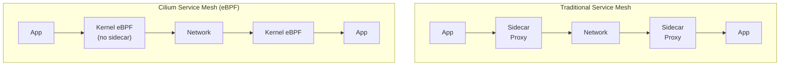

> 💡 **Quick Answer:** Cilium service mesh uses eBPF in the Linux kernel instead of sidecar proxies. This gives you mTLS, L7 traffic management, and observability with lower latency and resource usage than Istio or Linkerd. Install with \`cilium install --set kubeProxyReplacement=true\`, then enable mesh features with Cilium Network Policies and Hubble.

## The Problem

Traditional service meshes (Istio, Linkerd) inject sidecar proxy containers into every pod. This adds latency (extra network hop), memory overhead (~50-100MB per sidecar), and operational complexity. Cilium provides the same features (mTLS, traffic management, observability) using eBPF programs in the kernel — no sidecars needed.



## The Solution

### Install Cilium with Service Mesh

```bash
# Install Cilium CLI
CILIUM_CLI_VERSION=$(curl -s https://raw.githubusercontent.com/cilium/cilium-cli/main/stable.txt)
curl -L --fail --remote-name-all \
  https://github.com/cilium/cilium-cli/releases/download/${CILIUM_CLI_VERSION}/cilium-linux-amd64.tar.gz
tar xzvf cilium-linux-amd64.tar.gz
sudo mv cilium /usr/local/bin/

# Install Cilium with service mesh features
cilium install \
  --set kubeProxyReplacement=true \
  --set l7Proxy=true \
  --set encryption.enabled=true \
  --set encryption.type=wireguard

# Enable Hubble (observability)
cilium hubble enable --ui

# Verify
cilium status
# /¯¯\
# /¯¯\__/¯¯\    Cilium:          OK
# \__/¯¯\__/    Operator:        OK
# /¯¯\__/¯¯\    Hubble Relay:    OK
# \__/¯¯\__/    ClusterMesh:     disabled
```

### Or with Helm

```bash
helm repo add cilium https://helm.cilium.io/
helm install cilium cilium/cilium \
  --namespace kube-system \
  --set kubeProxyReplacement=true \
  --set l7Proxy=true \
  --set encryption.enabled=true \
  --set encryption.type=wireguard \
  --set hubble.enabled=true \
  --set hubble.relay.enabled=true \
  --set hubble.ui.enabled=true \
  --set gatewayAPI.enabled=true
```

### Transparent mTLS (WireGuard)

All pod-to-pod traffic is encrypted automatically — no config per workload:

```bash
# Verify encryption
cilium encrypt status
# Encryption: WireGuard
# Keys in use: 1

# Check encrypted traffic
kubectl exec -n kube-system cilium-xxx -- cilium-dbg encrypt status
# Wireguard:
#   Interface: cilium_wg0
#   Public key: <key>
#   Number of peers: 3
#   Transfer RX: 15.2 MiB
#   Transfer TX: 18.7 MiB
```

### L7 Network Policies

Cilium extends Kubernetes NetworkPolicy with L7 HTTP-aware rules:

```yaml
apiVersion: cilium.io/v2
kind: CiliumNetworkPolicy
metadata:
  name: api-l7-policy
spec:
  endpointSelector:
    matchLabels:
      app: backend-api
  ingress:
    - fromEndpoints:
        - matchLabels:
            app: frontend
      toPorts:
        - ports:
            - port: "8080"
              protocol: TCP
          rules:
            http:
              - method: GET
                path: "/api/v1/.*"
              - method: POST
                path: "/api/v1/orders"
                headers:
                  - 'Content-Type: application/json'
  egress:
    - toEndpoints:
        - matchLabels:
            app: postgres
      toPorts:
        - ports:
            - port: "5432"
```

### Gateway API with Cilium

```yaml
# GatewayClass (auto-created by Cilium)
apiVersion: gateway.networking.k8s.io/v1
kind: Gateway
metadata:
  name: cilium-gw
spec:
  gatewayClassName: cilium
  listeners:
    - name: http
      port: 80
      protocol: HTTP
---
apiVersion: gateway.networking.k8s.io/v1
kind: HTTPRoute
metadata:
  name: app-routes
spec:
  parentRefs:
    - name: cilium-gw
  rules:
    - matches:
        - path:
            type: PathPrefix
            value: /api
      backendRefs:
        - name: backend-api
          port: 8080
    - matches:
        - path:
            type: PathPrefix
            value: /
      backendRefs:
        - name: frontend
          port: 3000
```

### Hubble Observability

```bash
# Port-forward Hubble UI
cilium hubble port-forward &
hubble observe --namespace default

# View service map
hubble observe --namespace default --type l7

# Export flows
hubble observe -o json > flows.json

# Access Hubble UI
kubectl port-forward -n kube-system svc/hubble-ui 12000:80
# Open http://localhost:12000
```

### Traffic Management

```yaml
# Canary deployment with traffic splitting
apiVersion: gateway.networking.k8s.io/v1
kind: HTTPRoute
metadata:
  name: canary-split
spec:
  parentRefs:
    - name: cilium-gw
  rules:
    - backendRefs:
        - name: app-stable
          port: 8080
          weight: 90           # 90% to stable
        - name: app-canary
          port: 8080
          weight: 10           # 10% to canary
```

### Comparison: Cilium vs Istio vs Linkerd

| Feature | Cilium | Istio | Linkerd |
|---------|:------:|:-----:|:-------:|
| Sidecar | ❌ eBPF | ✅ Envoy | ✅ linkerd-proxy |
| mTLS | WireGuard | SPIFFE/x509 | mTLS on-by-default |
| L7 Policy | ✅ | ✅ | ❌ (L4 only) |
| Memory/pod | 0 MB | ~50-100 MB | ~20-30 MB |
| Latency | Kernel-level | +1-2ms | +0.5-1ms |
| Gateway API | ✅ | ✅ | ✅ |
| CNI included | ✅ (replaces kube-proxy) | ❌ (needs CNI) | ❌ (needs CNI) |

## Common Issues

| Issue | Cause | Fix |
|-------|-------|-----|
| Pods can't communicate | CiliumNetworkPolicy too strict | Check \`cilium monitor\` for dropped packets |
| L7 policy not enforced | Missing \`l7Proxy=true\` | Enable in Helm values |
| Hubble showing no flows | Hubble relay not running | \`cilium hubble enable\` |
| High CPU on nodes | eBPF programs on high-traffic node | Check \`cilium-dbg bpf policy\` for complex rules |
| WireGuard not encrypting | Kernel module not loaded | \`modprobe wireguard\` or upgrade kernel to 5.6+ |

## Best Practices

- **Use \`kubeProxyReplacement=true\`** — Cilium replaces kube-proxy for better performance
- **Enable WireGuard encryption** — transparent mTLS with zero config per workload
- **Start with L3/L4 policies** — add L7 rules only where needed (they have overhead)
- **Deploy Hubble in production** — essential for troubleshooting network issues
- **Use Gateway API** — Cilium's native ingress implementation
- **Monitor with \`cilium status\` and \`cilium-dbg\`** — built-in diagnostics

## Key Takeaways

- Cilium uses eBPF for service mesh features — no sidecar proxies needed
- WireGuard encryption provides mTLS with zero per-workload configuration
- L7 CiliumNetworkPolicy enables HTTP method/path-based access control
- Replaces kube-proxy, CNI, and service mesh in a single component
- Hubble provides service map and flow visibility out of the box
- Lower latency and memory than sidecar-based meshes (Istio, Linkerd)
