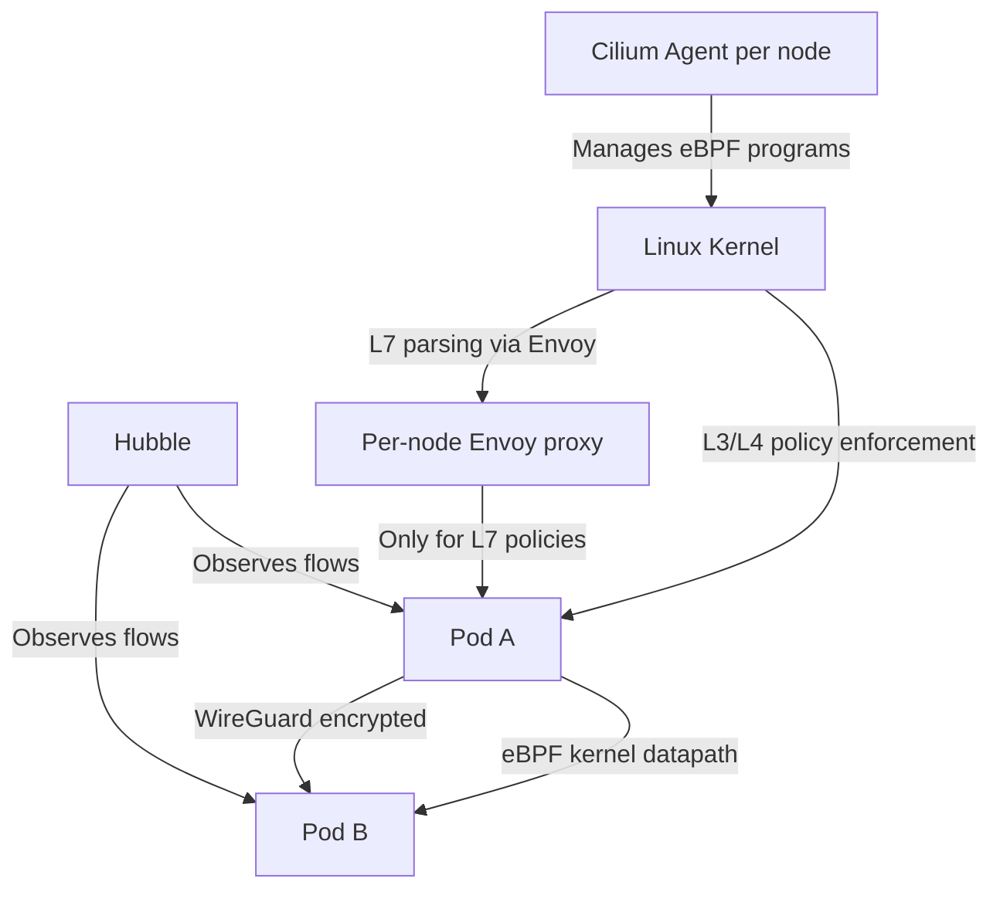

> 💡 **Quick Answer:** Deploy Cilium as a sidecarless service mesh on Kubernetes. eBPF-based mTLS, L7 traffic management, and observability without Envoy sidecar overhead.

## The Problem

Traditional service meshes inject Envoy sidecars into every pod, adding latency, memory overhead, and operational complexity. Cilium provides service mesh capabilities directly in the Linux kernel using eBPF — no sidecars needed.

## The Solution

### Step 1: Install Cilium with Service Mesh

```bash
helm repo add cilium https://helm.cilium.io
helm repo update

helm install cilium cilium/cilium \
  --namespace kube-system \
  --set kubeProxyReplacement=true \
  --set ingressController.enabled=true \
  --set ingressController.loadbalancerMode=shared \
  --set encryption.enabled=true \
  --set encryption.type=wireguard \
  --set hubble.enabled=true \
  --set hubble.relay.enabled=true \
  --set hubble.ui.enabled=true \
  --set l7Proxy=true
```

### Step 2: Enable mTLS (WireGuard)

```yaml
# Transparent encryption between all pods — no sidecar needed
apiVersion: cilium.io/v2
kind: CiliumNetworkPolicy
metadata:
  name: enforce-encryption
spec:
  endpointSelector: {}
  egress:
    - toEndpoints:
        - {}
      authentication:
        mode: required
```

Verify encryption is active:

```bash
# Check WireGuard status on nodes
cilium status | grep Encryption
# Encryption: Wireguard [NodeEncryption: Disabled, cilium_wg0 (Pubkey: xxx)]

# Verify encrypted traffic between pods
hubble observe --type drop --type trace:to-endpoint | grep encrypted
```

### Step 3: L7 Traffic Management

```yaml
# Route traffic based on HTTP headers — no sidecar proxy needed
apiVersion: cilium.io/v2
kind: CiliumEnvoyConfig
metadata:
  name: canary-routing
spec:
  services:
    - name: my-service
      namespace: default
  backendServices:
    - name: my-service-v1
      namespace: default
    - name: my-service-v2
      namespace: default
  resources:
    - "@type": type.googleapis.com/envoy.config.listener.v3.Listener
      filterChains:
        - filters:
            - name: envoy.filters.network.http_connection_manager
              typedConfig:
                "@type": type.googleapis.com/envoy.extensions.filters.network.http_connection_manager.v3.HttpConnectionManager
                routeConfig:
                  virtualHosts:
                    - name: default
                      routes:
                        - match:
                            prefix: /
                            headers:
                              - name: x-canary
                                exactMatch: "true"
                          route:
                            cluster: default/my-service-v2
                        - match:
                            prefix: /
                          route:
                            cluster: default/my-service-v1
```

### Step 4: Observability with Hubble

```bash
# Install Hubble CLI
curl -L --remote-name-all https://github.com/cilium/hubble/releases/latest/download/hubble-linux-amd64.tar.gz
tar xzvf hubble-linux-amd64.tar.gz
sudo mv hubble /usr/local/bin/

# Port-forward Hubble Relay
cilium hubble port-forward &

# Observe all traffic
hubble observe --namespace default

# HTTP-level observability (L7)
hubble observe --protocol http --namespace default
# Shows: source → destination, HTTP method, path, status code, latency

# Service dependency map
hubble observe --namespace default -o json | hubble map
```



### Sidecar vs Sidecarless Comparison

| Feature | Istio (Sidecar) | Cilium (eBPF) |
|---------|-----------------|---------------|
| Proxy | Envoy per pod | eBPF in kernel + per-node Envoy |
| Memory overhead | ~50-100MB per pod | ~0 per pod |
| Latency added | ~1-3ms per hop | ~0.1ms per hop |
| mTLS | Envoy-based | WireGuard kernel-level |
| L7 policies | Full Envoy features | Subset via per-node Envoy |
| Observability | Kiali + Jaeger | Hubble UI + CLI |
| Install complexity | High (injection, sidecars) | Medium (CNI replacement) |

## Best Practices

- **Start with observation** — measure before optimizing
- **Automate** — manual processes don't scale
- **Iterate** — implement changes gradually and measure impact
- **Document** — keep runbooks for your team

## Key Takeaways

- This is a critical capability for production Kubernetes clusters
- Start with the simplest approach and evolve as needed
- Monitor and measure the impact of every change
- Share knowledge across your team with internal documentation
