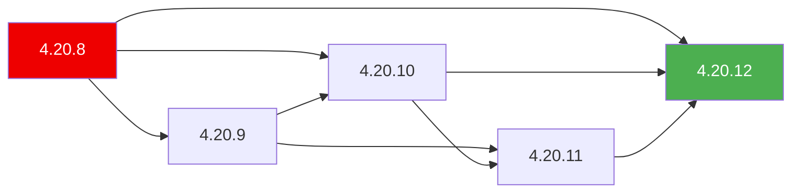

> 💡 **Quick Answer:** The Cincinnati graph is a directed acyclic graph (DAG) that maps every safe OpenShift upgrade path. CVO queries it to determine which versions are available from your current version. Query it directly: `curl 'https://api.openshift.com/api/upgrades_info/v1/graph?channel=stable-4.20&arch=amd64'`. Understanding the graph helps debug "no updates available" and plan multi-hop upgrades across EUS boundaries.

## The Problem

OpenShift upgrade paths are not linear — you can't always go from any version to any other. The graph encodes:

- Which versions exist in each channel
- Which direct upgrade paths are tested and safe
- Which paths are blocked (known regressions)
- Which paths have conditions (warnings, prerequisites)
- EUS-to-EUS upgrade boundaries

Without understanding the graph, you can't plan upgrades, debug missing paths, or know why a version doesn't appear.

## The Solution

### Query the Graph Directly

```bash
# Public Cincinnati endpoint
GRAPH_URL="https://api.openshift.com/api/upgrades_info/v1/graph"

# List all versions in stable-4.20
curl -s "${GRAPH_URL}?channel=stable-4.20&arch=amd64" | \
  jq -r '.nodes[].version' | sort -V

# Find upgrade paths FROM a specific version
curl -s "${GRAPH_URL}?channel=stable-4.20&arch=amd64" | \
  jq --arg ver "4.20.8" '
    .nodes as $nodes |
    ($nodes | to_entries | map(select(.value.version == $ver)) | .[0].key) as $idx |
    .edges | map(select(.[0] == $idx)) | map($nodes[.[1]].version)
  '
# ["4.20.9", "4.20.10", "4.20.12"]

# Check if a specific upgrade path exists
curl -s "${GRAPH_URL}?channel=stable-4.20&arch=amd64" | \
  jq --arg from "4.20.8" --arg to "4.20.12" '
    .nodes as $n |
    ($n | to_entries | map(select(.value.version == $from)) | .[0].key) as $f |
    ($n | to_entries | map(select(.value.version == $to)) | .[0].key) as $t |
    .edges | map(select(.[0] == $f and .[1] == $t)) | length > 0
  '
# true = direct path exists
```

### Graph Structure

```json
{
  "nodes": [
    {
      "version": "4.20.8",
      "payload": "quay.io/openshift-release-dev/ocp-release@sha256:abc...",
      "metadata": {
        "url": "https://access.redhat.com/errata/RHBA-2026:1234",
        "io.openshift.upgrades.graph.release.channels": "stable-4.20,fast-4.20"
      }
    },
    {
      "version": "4.20.12",
      "payload": "quay.io/openshift-release-dev/ocp-release@sha256:def..."
    }
  ],
  "edges": [
    [0, 1],    // 4.20.8 → 4.20.12 is a safe upgrade
    [0, 2],    // 4.20.8 → 4.20.10
    [2, 1]     // 4.20.10 → 4.20.12
  ],
  "conditionalEdges": [...]
}
```



### Channels

| Channel | Purpose | Risk |
|---------|---------|------|
| `candidate-4.20` | First available, minimal testing | High |
| `fast-4.20` | Passed CI, no widespread issues | Medium |
| `stable-4.20` | Proven in production, full soak | Low |
| `eus-4.20` | Extended Update Support (even minors) | Lowest |

```bash
# Compare what's available across channels
for ch in candidate fast stable eus; do
  echo "=== ${ch}-4.20 ==="
  curl -s "${GRAPH_URL}?channel=${ch}-4.20&arch=amd64" | \
    jq -r '.nodes[].version' | sort -V | tail -3
done
```

### Blocked Edges

Red Hat blocks upgrade paths when a regression is discovered:

```bash
# Check for blocked edges (versions removed from graph)
# A version present in fast but missing from stable = blocked in stable

# Or query conditionalEdges
curl -s "${GRAPH_URL}?channel=stable-4.20&arch=amd64" | \
  jq '.conditionalEdges // empty'
```

### Conditional Updates

```bash
# CVO shows conditional updates as risks
oc adm upgrade
# Updates with known issues:
#   VERSION    KNOWN ISSUES
#   4.20.11    Potential data loss on NFS volumes (BZ#2098765)
#              Recommended: verify NFS client version before upgrading

# Force conditional update (after verifying risk doesn't apply)
oc adm upgrade --to=4.20.11 --allow-not-recommended
```

### Debug "No Updates Available"

```bash
# Step 1: Check current version and channel
oc get clusterversion version -o jsonpath='{.spec.channel}'
oc get clusterversion version -o jsonpath='{.status.desired.version}'

# Step 2: Check upstream URL
oc get clusterversion version -o jsonpath='{.spec.upstream}'
# Empty = using default api.openshift.com
# Custom URL = OSUS

# Step 3: Query graph for your channel+version
CHANNEL=$(oc get clusterversion -o jsonpath='{.spec.channel}')
CURRENT=$(oc get clusterversion -o jsonpath='{.status.desired.version}')

curl -s "${GRAPH_URL}?channel=${CHANNEL}&arch=amd64" | \
  jq --arg ver "$CURRENT" '
    .nodes | map(select(.version == $ver)) | length
  '
# 0 = your version is not in this channel!

# Step 4: Check if channel exists
curl -s "${GRAPH_URL}?channel=${CHANNEL}&arch=amd64" | \
  jq '.nodes | length'
# 0 = channel doesn't exist or is empty

# Step 5: Switch channel if needed
oc adm upgrade channel stable-4.20
```

### EUS-to-EUS Upgrade Planning

```bash
# EUS versions: 4.14, 4.16, 4.18, 4.20 (even minors)
# EUS-to-EUS skips intermediate minor versions

# Check EUS upgrade path from 4.18 → 4.20
curl -s "${GRAPH_URL}?channel=eus-4.20&arch=amd64" | \
  jq -r '.nodes[].version' | grep "4.18\|4.20" | sort -V

# EUS upgrade requires:
# 1. Upgrade to latest 4.18.z
# 2. Switch channel to eus-4.20
# 3. Upgrade to 4.20.z (skipping 4.19 entirely)
oc adm upgrade channel eus-4.20
oc adm upgrade  # Should show 4.20.x targets
```

## Common Issues

**Version in `fast` but not `stable`**

Normal — versions soak in `fast` for ~2 weeks before promotion to `stable`. Wait or switch to `fast` channel if you need it sooner.

**CVO shows version but "Upgradeable=False"**

A cluster operator is reporting not ready for upgrade. Check: `oc get co | grep -v "True.*False.*False"`.

**OSUS graph is empty (disconnected)**

Graph-data image is stale or missing. Re-mirror with `graph: true` and update OSUS `spec.graphDataImage`.

## Best Practices

- **Use `stable` channel for production** — most tested, fewest regressions
- **Query graph before planning upgrades** — verify the path exists
- **Don't skip EUS boundaries** — plan multi-hop upgrades through required intermediate versions
- **Check conditional edges** — "no known issues" is better than "I didn't check"
- **Update graph-data frequently in air-gap** — stale graphs miss blocked edges

## Key Takeaways

- The Cincinnati graph is a DAG mapping all safe OpenShift upgrade paths
- CVO queries the graph to determine available upgrades from current version
- Channels (`candidate` → `fast` → `stable` → `eus`) represent increasing stability
- Blocked edges remove unsafe paths; conditional edges add warnings
- "No updates available" usually means wrong channel, version not in graph, or stale OSUS graph-data
- Query the graph directly with `curl` to debug upgrade planning issues
