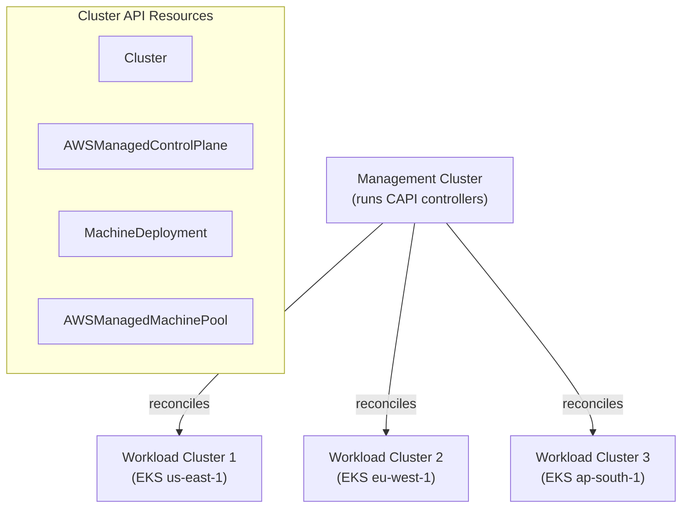

> 💡 **Quick Answer:** Cluster API (CAPI) lets you manage Kubernetes clusters as Kubernetes resources. Install `clusterctl` on a management cluster, configure the AWS provider (CAPA), then `kubectl apply` a `Cluster` + `AWSManagedControlPlane` manifest to provision EKS clusters. Scale node groups by editing `MachineDeployment` replicas. Delete clusters with `kubectl delete cluster`.

## The Problem

Managing multiple EKS clusters through the AWS console or Terraform becomes unwieldy at scale. Each cluster needs its own Terraform state, IAM roles, and upgrade pipeline. Cluster API treats clusters as Kubernetes-native resources — you manage them with `kubectl`, GitOps (ArgoCD/Flux), and standard K8s tooling.



## The Solution

### Install Cluster API

```bash
# Install clusterctl CLI
curl -L https://github.com/kubernetes-sigs/cluster-api/releases/latest/download/clusterctl-linux-amd64 -o clusterctl
chmod +x clusterctl && sudo mv clusterctl /usr/local/bin/

# Initialize CAPI with AWS provider on management cluster
export AWS_REGION=us-east-1
export AWS_ACCESS_KEY_ID=<your-key>
export AWS_SECRET_ACCESS_KEY=<your-secret>

# Create IAM resources for CAPA
clusterawsadm bootstrap iam create-cloudformation-stack

# Initialize providers
clusterctl init --infrastructure aws

# Verify controllers are running
kubectl get pods -n capa-system
kubectl get pods -n capi-system
```

### Provision an EKS Cluster

```yaml
# eks-cluster.yaml
apiVersion: cluster.x-k8s.io/v1beta1
kind: Cluster
metadata:
  name: production-east
  namespace: default
spec:
  clusterNetwork:
    pods:
      cidrBlocks: ["192.168.0.0/16"]
    services:
      cidrBlocks: ["10.128.0.0/12"]
  controlPlaneRef:
    apiVersion: controlplane.cluster.x-k8s.io/v1beta2
    kind: AWSManagedControlPlane
    name: production-east-control-plane
  infrastructureRef:
    apiVersion: infrastructure.cluster.x-k8s.io/v1beta2
    kind: AWSManagedCluster
    name: production-east
---
apiVersion: controlplane.cluster.x-k8s.io/v1beta2
kind: AWSManagedControlPlane
metadata:
  name: production-east-control-plane
spec:
  region: us-east-1
  version: v1.31.0
  eksClusterName: production-east
  endpointAccess:
    public: true
    private: true
  logging:
    apiServer: true
    audit: true
    authenticator: true
    controllerManager: true
    scheduler: true
---
apiVersion: infrastructure.cluster.x-k8s.io/v1beta2
kind: AWSManagedCluster
metadata:
  name: production-east
---
apiVersion: cluster.x-k8s.io/v1beta1
kind: MachinePool
metadata:
  name: production-east-pool-0
spec:
  clusterName: production-east
  replicas: 3
  template:
    spec:
      clusterName: production-east
      bootstrap:
        dataSecretName: ""
      infrastructureRef:
        apiVersion: infrastructure.cluster.x-k8s.io/v1beta2
        kind: AWSManagedMachinePool
        name: production-east-pool-0
---
apiVersion: infrastructure.cluster.x-k8s.io/v1beta2
kind: AWSManagedMachinePool
metadata:
  name: production-east-pool-0
spec:
  scaling:
    minSize: 3
    maxSize: 10
  instanceType: m5.xlarge
  diskSize: 100
```

```bash
# Apply and watch provisioning
kubectl apply -f eks-cluster.yaml
kubectl get cluster -w

# Get kubeconfig for workload cluster
clusterctl get kubeconfig production-east > production-east.kubeconfig
kubectl --kubeconfig=production-east.kubeconfig get nodes
```

### Cluster Lifecycle Operations

```bash
# Scale node pool
kubectl patch machinepool production-east-pool-0 \
  --type=merge -p '{"spec":{"replicas":5}}'

# Upgrade Kubernetes version
kubectl patch awsmanagedcontrolplane production-east-control-plane \
  --type=merge -p '{"spec":{"version":"v1.32.0"}}'

# Add GPU node pool
cat << EOF | kubectl apply -f -
apiVersion: infrastructure.cluster.x-k8s.io/v1beta2
kind: AWSManagedMachinePool
metadata:
  name: production-east-gpu
spec:
  scaling:
    minSize: 0
    maxSize: 4
  instanceType: g5.2xlarge
  diskSize: 200
  labels:
    nvidia.com/gpu.present: "true"
  taints:
    - key: nvidia.com/gpu
      value: "true"
      effect: NoSchedule
EOF

# Delete a workload cluster
kubectl delete cluster production-east
# CAPI deletes all AWS resources (EKS, node groups, VPC, etc.)
```

### GitOps with Cluster API

```yaml
# ArgoCD Application for fleet management
apiVersion: argoproj.io/v1alpha1
kind: Application
metadata:
  name: fleet-clusters
  namespace: argocd
spec:
  project: default
  source:
    repoURL: https://github.com/example/fleet-config
    path: clusters/
    targetRevision: main
  destination:
    server: https://kubernetes.default.svc
    namespace: default
  syncPolicy:
    automated:
      prune: false                   # Never auto-delete clusters
      selfHeal: true
```

## Common Issues

| Issue | Cause | Fix |
|-------|-------|-----|
| `clusterctl init` fails | Missing AWS credentials | Run `clusterawsadm bootstrap iam` first |
| Cluster stuck in Provisioning | IAM role trust policy wrong | Check CAPA controller logs |
| Node pool not scaling | Scaling limits too low | Increase `maxSize` in MachinePool |
| Upgrade fails | Add-ons incompatible | Verify CoreDNS/kube-proxy versions |
| Delete hangs | Finalizers blocking | Check for stuck LoadBalancers in workload cluster |

## Best Practices

- **Use a dedicated management cluster** — don't run CAPI on a workload cluster
- **Pin Kubernetes versions** — explicit versions prevent surprise upgrades
- **GitOps for cluster definitions** — store manifests in Git, deploy with ArgoCD
- **Set `prune: false` in ArgoCD** — prevent accidental cluster deletion
- **Label node pools by purpose** — GPU, spot, on-demand, system
- **Enable all EKS logging** — audit logs are essential for compliance

## Key Takeaways

- Cluster API manages clusters as Kubernetes resources with `kubectl`
- CAPA provider provisions EKS clusters, node groups, and VPC networking
- Scale, upgrade, and delete clusters with standard Kubernetes operations
- Combine with GitOps for declarative multi-cluster fleet management
- Management cluster pattern keeps control plane separate from workloads
