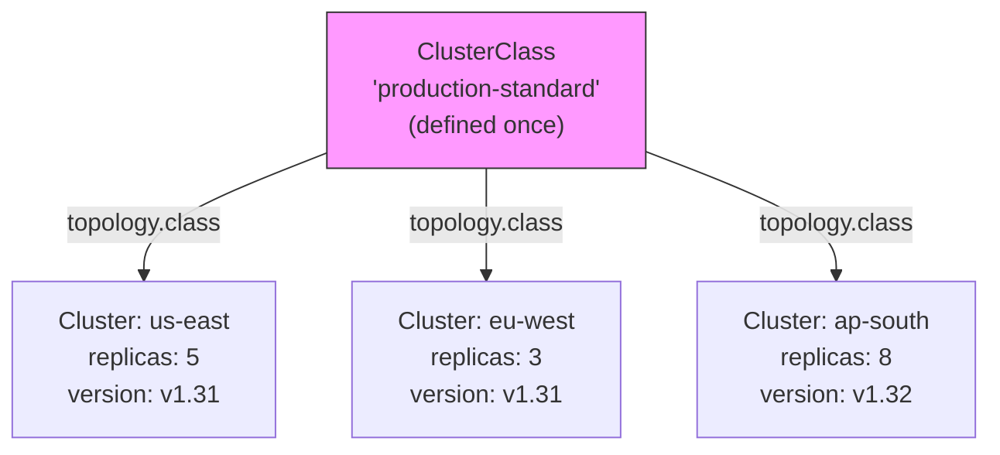

> 💡 **Quick Answer:** ClusterClass is a CAPI template that defines reusable cluster blueprints. Instead of writing full Cluster manifests, define a `ClusterClass` with control plane, worker, and infrastructure templates, then create clusters by referencing the class with `spec.topology.class: my-class`. Variables and patches let you customize instances (region, size, version) without duplicating manifests.

## The Problem

Without ClusterClass, every cluster needs its own set of 5-10 manifests (Cluster, InfrastructureCluster, ControlPlane, MachineDeployment, MachineTemplate...). At 50 clusters, that's 500+ YAML files with copy-paste drift. ClusterClass defines the blueprint once; each cluster is a ~20 line manifest that says "use this class with these overrides."



## The Solution

### Define a ClusterClass

```yaml
apiVersion: cluster.x-k8s.io/v1beta1
kind: ClusterClass
metadata:
  name: production-standard
spec:
  controlPlane:
    ref:
      apiVersion: controlplane.cluster.x-k8s.io/v1beta1
      kind: KubeadmControlPlaneTemplate
      name: production-control-plane
    machineInfrastructure:
      ref:
        apiVersion: infrastructure.cluster.x-k8s.io/v1beta1
        kind: VSphereMachineTemplate
        name: control-plane-template

  infrastructure:
    ref:
      apiVersion: infrastructure.cluster.x-k8s.io/v1beta1
      kind: VSphereClusterTemplate
      name: production-vsphere

  workers:
    machineDeployments:
      - class: default-worker
        template:
          bootstrap:
            ref:
              apiVersion: bootstrap.cluster.x-k8s.io/v1beta1
              kind: KubeadmConfigTemplate
              name: worker-bootstrap
          infrastructure:
            ref:
              apiVersion: infrastructure.cluster.x-k8s.io/v1beta1
              kind: VSphereMachineTemplate
              name: worker-template

      - class: gpu-worker
        template:
          bootstrap:
            ref:
              apiVersion: bootstrap.cluster.x-k8s.io/v1beta1
              kind: KubeadmConfigTemplate
              name: worker-bootstrap
          infrastructure:
            ref:
              apiVersion: infrastructure.cluster.x-k8s.io/v1beta1
              kind: VSphereMachineTemplate
              name: gpu-worker-template

  # Variables allow per-cluster customization
  variables:
    - name: controlPlaneReplicas
      required: true
      schema:
        openAPIV3Schema:
          type: integer
          default: 3
          enum: [1, 3, 5]

    - name: workerMemoryMiB
      required: false
      schema:
        openAPIV3Schema:
          type: integer
          default: 16384

    - name: enableGPU
      required: false
      schema:
        openAPIV3Schema:
          type: boolean
          default: false

  # Patches apply variable values to templates
  patches:
    - name: controlPlaneReplicas
      definitions:
        - selector:
            apiVersion: controlplane.cluster.x-k8s.io/v1beta1
            kind: KubeadmControlPlaneTemplate
          jsonPatches:
            - op: replace
              path: /spec/template/spec/replicas
              valueFrom:
                variable: controlPlaneReplicas

    - name: workerMemory
      definitions:
        - selector:
            apiVersion: infrastructure.cluster.x-k8s.io/v1beta1
            kind: VSphereMachineTemplate
            matchResources:
              machineDeploymentClass:
                names: ["default-worker"]
          jsonPatches:
            - op: replace
              path: /spec/template/spec/memoryMiB
              valueFrom:
                variable: workerMemoryMiB
```

### Create Clusters from ClusterClass

```yaml
# Simple — uses all defaults
apiVersion: cluster.x-k8s.io/v1beta1
kind: Cluster
metadata:
  name: dev-cluster
spec:
  topology:
    class: production-standard
    version: v1.31.0
    controlPlane:
      replicas: 1                    # Override: single CP for dev
    workers:
      machineDeployments:
        - class: default-worker
          name: md-0
          replicas: 2
---
# Production — customized
apiVersion: cluster.x-k8s.io/v1beta1
kind: Cluster
metadata:
  name: prod-us-east
spec:
  topology:
    class: production-standard
    version: v1.31.0
    controlPlane:
      replicas: 3
    workers:
      machineDeployments:
        - class: default-worker
          name: md-0
          replicas: 10
        - class: gpu-worker
          name: gpu-pool
          replicas: 4
    variables:
      - name: workerMemoryMiB
        value: 32768
      - name: enableGPU
        value: true
```

### Fleet-Wide Upgrades

```bash
# Upgrade all clusters using a ClusterClass:
# 1. Update the ClusterClass templates with new K8s version
# 2. All clusters referencing it get rolled automatically

# Or upgrade individual clusters:
kubectl patch cluster prod-us-east \
  --type=merge -p '{"spec":{"topology":{"version":"v1.32.0"}}}'

# Watch rollout across fleet
kubectl get clusters -A -w
```

### Validate ClusterClass

```bash
# Dry-run to verify ClusterClass + variables produce valid manifests
clusterctl alpha topology plan \
  --cluster prod-us-east \
  --namespace default \
  -o /tmp/topology-plan

ls /tmp/topology-plan/
# created/ modified/ deleted/ — shows what CAPI would do
```

## Common Issues

| Issue | Cause | Fix |
|-------|-------|-----|
| `topology.class not found` | ClusterClass not created | Apply ClusterClass before Cluster |
| Variable validation fails | Value outside schema bounds | Check `enum`/`minimum`/`maximum` in schema |
| Patch not applying | Wrong selector or path | Use `clusterctl alpha topology plan` to debug |
| Fleet upgrade not rolling | Clusters pinned to version | Remove explicit version pin from Cluster spec |
| Template immutable error | Changed template in-place | Create new template version, update ClusterClass ref |

## Best Practices

- **One ClusterClass per environment tier** — dev, staging, production
- **Use variables for differences** — region, size, GPU; not separate classes
- **Version your templates** — `control-plane-v2`, not in-place edits
- **Validate with `topology plan`** — before applying to production
- **GitOps for ClusterClass** — changes flow through PR review
- **Start simple** — 2-3 variables, add more as patterns emerge

## Key Takeaways

- ClusterClass eliminates manifest duplication across multi-cluster fleets
- Define the blueprint once; create clusters with 20 lines of YAML
- Variables and patches customize instances without copy-paste
- Fleet-wide upgrades by updating the ClusterClass template
- Essential for platform engineering teams managing 10+ clusters
- Combine with ArgoCD/Flux for fully declarative cluster lifecycle
