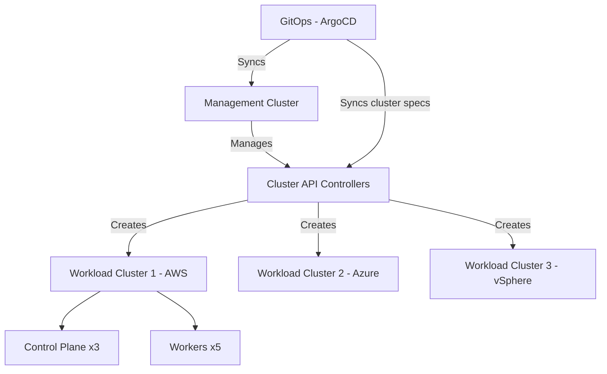

> 💡 **Quick Answer:** Manage Kubernetes cluster lifecycle with Cluster API. Declarative cluster creation, upgrades, scaling, and multi-cloud infrastructure provisioning as code.

## The Problem

Cluster API (CAPI) lets you manage Kubernetes clusters the same way you manage workloads — with declarative YAML. Create, upgrade, and delete clusters across AWS, Azure, GCP, vSphere, and bare metal using Kubernetes resources.

## The Solution

### Step 1: Install Cluster API (Management Cluster)

```bash
# Install clusterctl CLI
curl -L https://github.com/kubernetes-sigs/cluster-api/releases/latest/download/clusterctl-linux-amd64 -o clusterctl
chmod +x clusterctl
sudo mv clusterctl /usr/local/bin/

# Initialize CAPI with your infrastructure provider
# For AWS:
export AWS_B64ENCODED_CREDENTIALS=$(clusterawsadm bootstrap credentials encode-as-profile)
clusterctl init --infrastructure aws

# For vSphere:
clusterctl init --infrastructure vsphere

# For Azure:
clusterctl init --infrastructure azure

# For bare metal (Tinkerbell):
clusterctl init --infrastructure tinkerbell
```

### Step 2: Create a Workload Cluster

```yaml
apiVersion: cluster.x-k8s.io/v1beta1
kind: Cluster
metadata:
  name: production-cluster
  namespace: default
spec:
  clusterNetwork:
    pods:
      cidrBlocks: ["192.168.0.0/16"]
    services:
      cidrBlocks: ["10.96.0.0/12"]
  controlPlaneRef:
    apiVersion: controlplane.cluster.x-k8s.io/v1beta1
    kind: KubeadmControlPlane
    name: production-control-plane
  infrastructureRef:
    apiVersion: infrastructure.cluster.x-k8s.io/v1beta2
    kind: AWSCluster
    name: production-cluster
---
apiVersion: infrastructure.cluster.x-k8s.io/v1beta2
kind: AWSCluster
metadata:
  name: production-cluster
spec:
  region: eu-west-1
  sshKeyName: my-key
---
apiVersion: controlplane.cluster.x-k8s.io/v1beta1
kind: KubeadmControlPlane
metadata:
  name: production-control-plane
spec:
  replicas: 3
  version: v1.29.0
  machineTemplate:
    infrastructureRef:
      apiVersion: infrastructure.cluster.x-k8s.io/v1beta2
      kind: AWSMachineTemplate
      name: control-plane-template
---
apiVersion: cluster.x-k8s.io/v1beta1
kind: MachineDeployment
metadata:
  name: production-workers
spec:
  clusterName: production-cluster
  replicas: 5
  selector:
    matchLabels: {}
  template:
    spec:
      clusterName: production-cluster
      version: v1.29.0
      bootstrap:
        configRef:
          apiVersion: bootstrap.cluster.x-k8s.io/v1beta1
          kind: KubeadmConfigTemplate
          name: worker-config
      infrastructureRef:
        apiVersion: infrastructure.cluster.x-k8s.io/v1beta2
        kind: AWSMachineTemplate
        name: worker-template
```

```bash
# Apply and watch cluster creation
kubectl apply -f production-cluster.yaml
clusterctl describe cluster production-cluster

# Get kubeconfig for the new cluster
clusterctl get kubeconfig production-cluster > production.kubeconfig
kubectl --kubeconfig=production.kubeconfig get nodes
```

### Step 3: Upgrade a Cluster

```bash
# Upgrade is declarative — just change the version
kubectl patch kubeadmcontrolplane production-control-plane \
  --type merge -p '{"spec":{"version":"v1.30.0"}}'

# Control plane nodes upgrade one at a time (rolling)
# Then upgrade workers
kubectl patch machinedeployment production-workers \
  --type merge -p '{"spec":{"template":{"spec":{"version":"v1.30.0"}}}}'

# Monitor the upgrade
clusterctl describe cluster production-cluster
```



## Best Practices

- **Start with observation** — measure before optimizing
- **Automate** — manual processes don't scale
- **Iterate** — implement changes gradually and measure impact
- **Document** — keep runbooks for your team

## Key Takeaways

- This is a critical capability for production Kubernetes clusters
- Start with the simplest approach and evolve as needed
- Monitor and measure the impact of every change
- Share knowledge across your team with internal documentation
